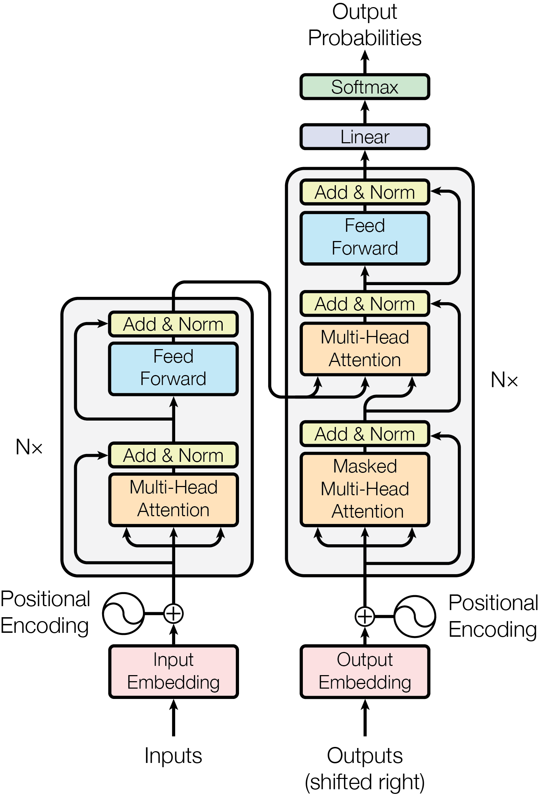
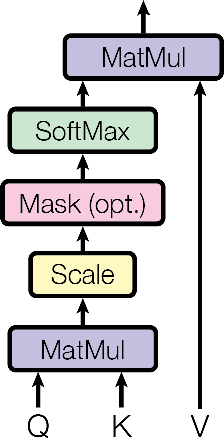
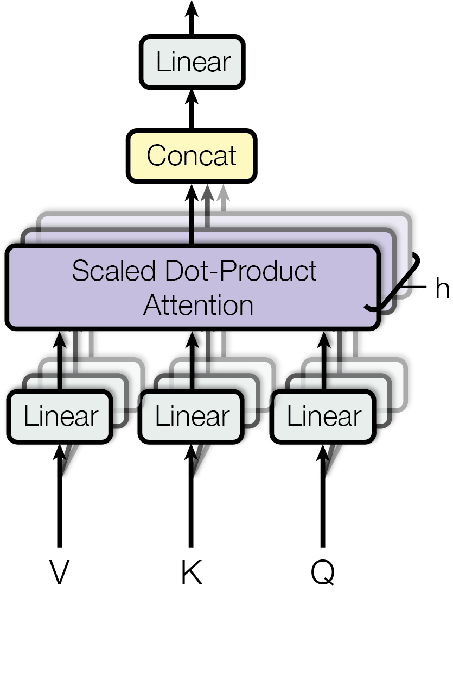

# Attention is all you need 논문 리뷰[미완성]]

쿼리키벨류 설명 및 파이썬 코드 필요

Paper : [Attention Is All You Need](https://arxiv.org/pdf/1706.03762)	[Transformer 설명 참조 영상](https://www.youtube.com/watch?v=6s69XY025MU)

## abstract

논문의 요지는 다음과 같다. 기존의 Sequence 변환 모델들은 Encoder 와 Decoder를 사용하는 복잡한 Recurrent 또는 CNN 을 기반으로 했다. 가장 성능이 높은 모델 또한 Attention 기법으로 Encoder 와 Decoder 를 연결했다. 논문에서는 **Attention 메커니즘에만 기반한 Transformer 구조**를 제안한다.

*WMT  2014 English-to-German* translation task 에서는 28.4 BLEU(기존의 최고 성능보다 2 BLEU 성능 향상), *WMT 2014 English-to-French* translation task 에서는 41.8 BLEU 를 달성했다. 이 두 실험은 Transformer 구조가 성능면에서 더 뛰어남을 보여준다. 병렬화에 최적화되고 학습에 사용되는 시간은 훨씬 적다.

***

## Introduction

**Recurrent 모델들은 일반적으로 입력과 출력 Sequence 위치에 따라 계산을 수행**한다. 본질적으로 이런 순차적인 계산 특성은 **병렬화를 배제**하는데 이는 Sequence 의 길이가 길어질수록 치명적이다. &rarr; sequential computation 의 제약이 있다. 반면 **Attention** 기법은 입력과 출력 Sequence 의 **거리에 상관없이 종속성을 모델링**할 수 있다. 새롭게 제안하는 **Transformer** 구조는 순환 신경망을 배제하고 오로지 **Attention 만 사용하기에 입력과 출력의 global 의존성을 도출할 수 있다.**

**Self-attention** 은 Sequence 의 representation 을 계산하기 위해 단일 Sequencce 의 서로 다른 위치를 연관시키는 기법이다. **End-to-end memory** 는 **Recurrent attention** 기법을 기반으로 한다.


***

## Model Architecture

### Encoder and Decoder stacks

<p style="font-size:125%">Encoder</p>

N = 6 인 동일한 layer 의 stack 으로 구성된다. 각각의 layer 는 첫 번째로 **multi-head self-attention** 을, 두 번째로 **positionwise fully connected feed-foward network** 로 구성된다. residual connection 을 각 layer 의 적용시키고, layer normalization 을 한다. 각각의 Layer 는 **LayerNorm(x + Sublayer(x))** 을 출력한다. d_model = 512

<p style="font-size:125%">Decoder</p>

N = 6 인 동일한 layer 의 stack 으로 구성된다. 인코더의 출력으로부터 **multi-head attention** 을 수행하기 위해 2 개의 추가적인 sub-layer 를 가진다. 각각의 Layer 는 **LayerNorm(x + Sublayer(x))** 을 출력한다. 

position 이 뒤따르는 position 에 영향을 주는 것을 막기 위해 **masking** 을 사용한다. 이는 출력 임베딩이 하나의 position 으로 offset 된다는 사실이 position i 에 대한 예측은 보다 작은 position 의 알려진 출력에만 의존할 수 있다는 것을 보장한다.



```python
class Transformer(nn.Module):
	def __init__(self, encoder, decoder):
    super(Transformer, self).__init__()
    self.encoder = encoder
    self.decoder = decoder
    
  def encode(self, x):
		out = self.encoder(x)
    return out
  
  def decode(self, z, c):
    out = self.decode(z, c)
    return out
  
  def forward(self, x, z):
    c = self.encode(x)
    y =. elf.decode(z, c)
    return y
```

```python
class Encoder(nn.Module):
  def __init__(self, encoder_block, n_layer):
    super(Encoder, self).__init__()
    self.layers = []
    for i in range(n_layer):
      self.layers.append(copy.deepcopy(encoder_block))
      
  def forward(self, x):
    out = x
    for layer in self.layers:
      out = layer(out)
   	return out
```

```python
class EncoderBlock(nn.Module):
  def __init__(self, self_attention, position_ff):
    super(EncoderBlock, self).__init()
    self.self_attention = self_attention
    self.postion_ff = position_ff
    
  def forward(self, x):
    out = x
    out = self.self_attention(out)
    out = self.position_ff(out)
    return out
```

```python
class Decoder(nn.Module):
  def __init__(self, decoder_block, n_layer):
    super(Decoder, self).__init__()
    self.n_layer = n_layer
    self.layers = nn.ModuleList([copy.deepcopy(decoder_block) for _ in range(self.n_layer)])
    
  def forward(self, tgt, encoder_out, tgt_mask, src_tgt_mask):
    out = tgt
    for layer in self.layers:
      out = layer(out, encoder_out, tgt_mask, src_tgt_mask)
    return out
```

```python
class DecoderBlock(nn.Module):
  def __iinit__(self, self_attention, cross_attention, position_ff):
    super(DecoderBlock, self).__init__()
    self.self_attention = self_attention
    self.cross_attention = cross_attention
    self.position_ff = position_ff
    self.residuals = [ResidualConnectionLayer() for _ in range(3)]
    
   def forward(self, tgt, encoder_out, tgt_mask, src_tgt_mask):
     out = tgt
     out = self.residuals[0](out, lambda out: self.self_attention(query=out, key=out, value=out, mask=tgt_mask))
     out = self.residuals[1](out, lambda out: self.cross_attention(query=out, key=encoder_out, value=encoder_out, mask=src_tgt_mask))
     out = self.residuals[2](out, self.position_ff)
     return out
```


---

### 3. 2. Attention

Attention 함수는 입력 단어들을 변환한 벡터 **Q(query)**, **K(key)**, **V(value)** 로 출력 값을 나타낸다.

 <p style="font-size:125%">Scaled Dot-Product Attention</p>

입력 Q, K 는 d_k, V 는 d_v 의 차원을 가지고 $Attention(Q, K, V) = softmax({QK^t\over\sqrt{d_K}})V$ 을 만족한다. 기존의 Dot-Product(multiplicative) Attention에 Scaling factor(${1\over\sqrt{d_K}}$) 가 추가된 알고리즘이고, 이를 Scaled Dot-Product Attention 이라고 부른다. 

Dot-Product Attention 은 $QK^T$ 의 값이 커질 경우 Softmax 함수의 출력 확률이 0 또는 1에 근접해서 나온다. 이렇게 되면 **Gradient Vanishing(기울기 소실)** 문제가 발생한다. 이 문제는 차원($d_k$) 이 커질수록 $QK^T$ 의 원소가 많아져 내적 값이 커지므로 더 극명하게 나타난다. 이를 해결하기 위해 Scaling factor 를 사용한다.



---

<p style="font-size:125%">Multi-Head Attention</p>

| 핵심 개념                                  | 설명                                         |
| ------------------------------------------ | -------------------------------------------- |
| **여러 개의 Attention Head 사용**          | 각각 다른 관점에서 정보를 학습               |
| **각 Head는 독립적인 Q, K, V를 생성**      | 서로 다른 가중치를 사용해 다양한 의미를 학습 |
| **출력을 Concatenate 후 추가 가중치 적용** | 최종 출력을 생성하여 다양한 정보를 통합      |
| **Transformer에서 필수적인 요소**          | NLP와 컴퓨터 비전에서 중요한 역할 수행       |

Attention 을 한 번만 사용하는 것보다 서로 다른 독립적인 형태의 Attention head 들을 병렬적으로 사용하여 Q, K, V 를 서로 다르게 학습하고 모든 head 의 출력을 합치는 것이 더 풍부한 표현학습이 가능하다.


$$
\text{MultiHead}(Q, K, V) = \text{Concat}(\text{head}_1, \text{head}_2, …, \text{head}_h) W^O
$$

$$
\text{head}_i = \text{Attention}(QW_i^Q, KW_i^K, VW_i^V)
$$


$W_i^Q$, $W_i^K$, $W_i^V$ 는 각 Head에 적용되는 학습 가능한 가중치 행렬, $W_i^O$ 는 여러 head의 출력을 결합한 후 적용하는 최종 가중치 행렬이다. **각 Attention head 마다 다른 가중치 행렬**을 적용하여 Query, Key, Value 벡터를 생성하게 된다.

하나의 head 만 사용하면 특정 패턴이나 관계만 학습할 가능성이 있는데, 여러 개의 head 를 사용하여 **각 head 가 서로 다른 정보를 학습**하여 더 풍부한 의미 표현이 가능하다. 또한 여러 head 가 서로 다른 특징을 학습하므로, 모델이 특정 패턴에 **과적합**되는 걸 방지할 수 있다. 

결국 Transformer 에서 Multi-Head attention 은 Encoder 에서는 **입력 문장의 각 단어가 다른 단어와의 관계를 학습(Self-Attention)**한다. Decoder 에서는 encoder 에서 얻은 정보를 활용해 **새로운 단어를 생성(Cross-Attention)**하고, 이미 **생성된 단어와의 관계를 학습(Masked Self-Attention)**한다.



---

<p style="font-size:125%">Attention Mechanism</p>

Transformer 에서 attention 은 **세가지** 방법으로 쓰인다.

|      **Attention 유형**       | **위치** |               **설명**               |
| :---------------------------: | :------: | :----------------------------------: |
|      **Self-Attention**       | Encoder  |    입력 문장 내 단어 간 관계 학습    |
|   **Masked Self-Attention**   | Decoder  | 미래 단어를 보지 않도록 Masking 적용 |
| **Encoder-Decoder Attention** | Decoder  | Encoder의 정보를 활용하여 단어 생성  |

Encoder 에서 쓰이는 **Self-Attention** 은 입력 시퀀스의 각 단어(Token)가 **문장 내 다른 단어들과의 관계를 학습**하도록 한다. 기존 RNN / LSTM 과 다르게, **이전 단어뿐만 아니라 전체 문맥을 고려**할 수 있도록 설계되었다. **Multi-Head Self-Attention 을 사용하여 전체 문장의 연관성을 학습**하고, 출력 결과를 다음 Encoder Layer 로 전달한다.

Decoder 에서 쓰이는 **Masked Self-Attention** 은 **Decoder 가 아직 생성되지 않은 미래 단어를 참조하지 못하도록 제한**한다. 번역이나 텍스트 생성에서 올바른 순서로 단어를 예측하도록 보장한다. 기존 Self-Attention 과 비슷하게 작동하지만, 미래 단어(오른쪽 방향의 정보)를 볼 수 없도록 Masking 을 적용한다. 여기서 **Masking 이란 미래 단어에 대한 Attention Score 를 $-\infty$ 로 설정하여 Softmax 값이 0 이 되도록 하는 기법**이다. 이렇게 하면 모델이 현재까지 생성된 단어들만 보고 다음 단어를 예측하게 된다.

Decoder 에서 쓰이는 **Encoder-Decoder Attention**(Cross Attention) 은 **Decoder 가 Encoder 의 출력을 참고하여 문장을 생성**하도록 돕는다. **Encoder의 출력(=Key, Value)과 Decoder의 Query를 사용하여 Attention 수행**하기에 입력 문장과 출력 문장의 관계를 학습한다. 번역 모델의 경우, 원문(입력 문장)과 번역문(출력 문장)의 연관성을 학습한다. Decoder 가 입력 문장의 중요한 부분을 집중해서 볼 수 있도록 가중치를 학습하여 출력 문장을 생성한다.

---

<p style="font-size:125%">Position-wise Feed-Forward Networks</p>

| **FFN 기능**                       | **설명**                                                     |
| ---------------------------------- | ------------------------------------------------------------ |
| **각 단어 표현을 독립적으로 변환** | Self-Attention이 전체 문맥을 고려했다면, FFN은 단어 개별적으로 변환 |
| **비선형 변환 추가**               | 선형 변환만으로는 학습이 제한적이므로, 활성화 함수(ReLU/GELU) 사용 |
| **고차원 확장 후 축소**            | 더 풍부한 표현 학습을 위해 중간 단계에서 차원을 증가         |

각 layer 에서 Attention 연산 후, $\text{FFN}(x) = \max(0, xW_1 + b_1) W_2 + b_2$ 을 적용하였다. $W_1$ 과 $W_2$ 는 학습 가능한 가중치 행렬이고, $b_1$, $b_2$ 는 bias 이다. ReLU 대신 GELU 를 사용할 수도 있고, 실제 구현에서는 GELU 가 성능이 더 좋았다.

FFN 의 역할

- self-attention 후 비선형 변환을 수행하여 복잡한 표현 학습한다.
- 각 위치의 단어 임베딩을 독립적으로 변환한다.
- 신경망의 비선형성을 증가시켜 모델이 더 복잡한 패턴을 학습할 수 있도록 한다.

FFN 의 특징

- 각 토큰에 독립적으로 적용된다(Position-wise 적용)
- 고차원 변환 후 다시 저차원으로 압축한다(보통 W_1이 확장된 차원 (d_ff = 2048 등) 을 만들고, W_2가 다시 원래 차원으로 축소)


**1각 단어(토큰)에 독립적으로 적용됨 (Position-wise 적용)**

​	•	FFN은 **각 단어의 표현을 비선형 변환하는 역할**

​	•	문장 전체에 대한 연산이 아니라 **각 단어별로 개별 적용**

2. **고차원 변환 후 다시 저차원으로 압축**

​	•	보통 W_1이 **확장된 차원 (d_ff = 2048 등)** 을 만들고, W_2가 다시 원래 차원으로 축소

​	•	즉, **“고차원에서 복잡한 패턴을 학습 후 다시 저차원으로 투영”**

---

<p style="font-size:125%">Embeddings and Softmax</p>

| **구성 요소**       | **역할**                                                     |
| ------------------- | ------------------------------------------------------------ |
| **Input Embedding** | 단어를 고정된 차원의 벡터로 변환 (d_model 차원)              |
| **Output Softmax**  | 단어 예측을 위해 확률 분포 생성                              |
| **Weight Sharing**  | Input Embedding과 Output Projection 가중치 공유 가능 (메모리 절약) |

**임베딩이란 텍스트를 수치형 벡터로 변환**하여 모델이 학습할 수 있도록 하는 방법이다. Transformer 는 단어를 직접 처리할 수 없기 때문에 **고정된 크기의 벡터**로 변환한다. 일반적으로 Word Embedding 을 사용하여, $X = \text{Embedding}(W)$, 이와 같은 결과를 얻는다. $W$ 는 단어 인덱스이다.

모델이 최종적으로 확률 분포를 생성하여 **다음 단어를 예측**하도록 Softmax 사용한다. $P(y) = \text{Softmax}(X W^T)$ 와 같이 **Output Embedding Layer의 가중치 행렬을 사용하여 Logits을 계산 후 Softmax 적용**한다. $X$ 는 Decoder 의 최종 출력 벡터, $W$ 는 Embedding Layer 에서 사용된 것 과 같은 가중치 행렬이다.

----

<p style="font-size:125%">Positional Encoding</p>

| **특징**                                | **설명**                                                     |
| --------------------------------------- | ------------------------------------------------------------ |
| **Transformer는 순서를 직접 알지 못함** | RNN과 달리, 시퀀스 정보를 활용하기 위해 Positional Encoding 필요 |
| **삼각 함수 기반 위치 정보 추가**       | \sin, \cos 함수를 사용해 주기적인 패턴을 적용                |
| **학습 불필요 & 길이 무관**             | 사전 정의된 함수이므로 추가 학습 없이 사용 가능              |

Transformer는 RNN / LSTM 처럼 **순차적인 구조가 없기 때문에, 단어의 순서를 알 수 없다.** 이를 해결하기 위해, **입력 벡터에 “위치 정보”를 추가하는 Positional Encoding 사용**한다. 논문에서는 **삼각함수(Sinusoidal Functions)를 이용한 Positional Encoding**을 제안했다.
$$
PE_{(pos, 2i)} = \sin \left(\frac{pos}{10000^{2i/d_{\text{model}}}} \right), \space
PE_{(pos, 2i+1)} = \cos \left(\frac{pos}{10000^{2i/d_{\text{model}}}} \right)
$$
pos 는 단어의 위치(0, 1, 2, ...) 이고, i 는 차원 인덱스(0, 1, 2, ... , $d_{model}\over2$) 이다. **위치 정보를 일정한 패턴으로 벡터에 추가하여, 순서 정보를 학습 할 수 있게 만든다.** 또한 쉽게 사용할 수 있는 함수라는 장점이 있다.

```python
import torch, math
from torch import nn

class PositionalEncoding(nn.Module):
    def __init__(self, d_model, max_len, dropout=0.1):
        super().__init__()
        self.dropout = nn.Dropout(p=dropout)

        position = torch.arange(max_len).unsqueeze(1)
        div_term = torch.exp(torch.arange(0, d_model, 2) * (-math.log(10000.0) / d_model)) # (1/10000(2i/d_model))

        pe = torch.zeros(max_len, 1, d_model)
        pe[:, 0, 0::2] = torch.sin(position * div_term) # 짝수 인덱스
        pe[:, 0, 1::2] = torch.cos(position * div_term) # 홀수 인덱스
        self.register_buffer("pe", pe) # 모델이 매개변수를 갱신하지 않도록 설정

    def forward(self, x):
        x = x + self.pe[: x.size(0)] # 입력 길이에 맞춰 필요한 위치 인코딩만 선택하여 더함.
        return self.dropout(x)
```

---

## Why Self-Attention

|         Layer Type         |  Complexity per Layer  | Sequential Operations | Maximum Path Length |
| :------------------------: | :--------------------: | :-------------------: | :-----------------: |
|       Self-Attention       |    $O(n^2\cdot d)$     |        $O(1)$         |       $O(1)$        |
|         Recurrent          |    $O(n\cdot d^2)$     |        $O(n)$         |       $O(n)$        |
|       Convolutional        | $O(k\cdot n\cdot d^2)$ |        $O(1)$         |    $O(log_k(n))$    |
| Self-Attention(restricted) |  $O(k\cdot n\cdot d)$  |        $O(1)$         |   $O({n\over r})$   |

**Complexity per Layer** 은 각 레이어가 한 번 실행될 때 필요한 연산량을 나타내는 지표이다. **Self-Attention** 은 $O(n2⋅d)$ 의 연산량을 가진다. 여기서 $n^2$ 은 **모든 단어가 모든 단어와 관계를 계산**하는 것을 나타낸다. 일반적인 RNN 보다 연산량이 많지만, **병렬 연산이 가능**하다는 특징이 있다. **RNN(LSTM, GRU)** 은 $O(n\cdot d^2)$ 의 연산량을 가진다. RNN 은 입력을 **순차적으로 처리**하기 때문에, **시퀀스 길이(n)에 비례**하는 연산량을 가지지만, 차원(d)이 커질수록 연산량이 크게 증가한다. **CNN** 은 $O(k\cdot n\cdot d^2)$ 의 연산량을 가진다.CNN 은 **고정된 크기의 필터(k)를 사용해 문맥을 학습**하지만, **커널 크기(k)에 비례하는 연산량 증가**가 발생한다. Self-Attention의 연산량은 $O(n^2 \cdot d)$ 로 RNN보다 다소 높지만, **병렬 연산이 가능해서 빠르게 계산**할 수 있다.

**Sequential Operations** 은 모델이 병렬화가 얼마나 가능한지를 나타내는 지표이다. **Self-Attention** 은 모든 단어가 동시에 연산되므로, 병렬 처리에 최적화 됐다. **RNN** 은 순차 연산만 가능하기에 길이가 길어질수록 계산 시간이 선형적으로 증가한다. **CNN** 은 필터 크기(k)에 따라 병렬화가 가능하지만 문장의 길이가 길어질수록 여러 계층을 거쳐야하기에 여전히 순차적인 연산이 필요하다. 

**Maximum Path Length** 는 멀리 떨어진 단어들 간의 정보를 전달하는 데 필요한 최소 연산 횟수를 나타내는 지표이다. **Self-Attention** 은 모든 단어가 다른 모든 단어와 직접 연결되어 있기에, 한 번의 연산으로 문장의 모든 단어가 서로 영향을 주고받을 수 있다. **RNN** 은 한 단어씩 관계를 계산하기 때문에 문장의 맨 앞 단어가 맨 뒤 단어에 영향을 주려면 n 번의 연산이 필요하다. 즉, **Long-Term Dependency(장기 의존성)** 가 발생한다. **CNN** 은 필터 크기에 따라 다르다.

이처럼 Self-Attention 은 **병렬 연산**이 가능하고, **효율적으로 문맥을 학습**할 수 있다.

---

## Reslut


