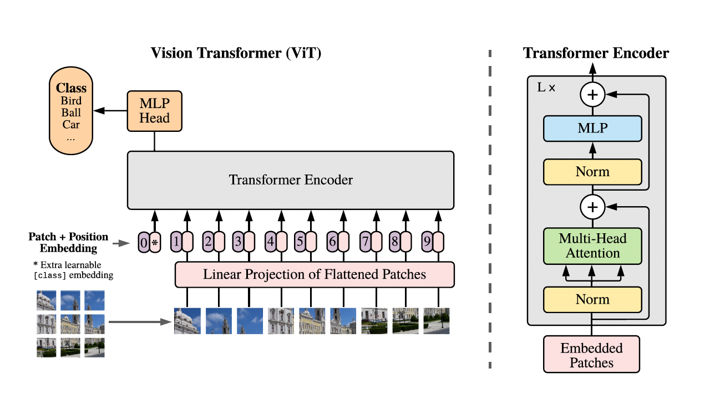
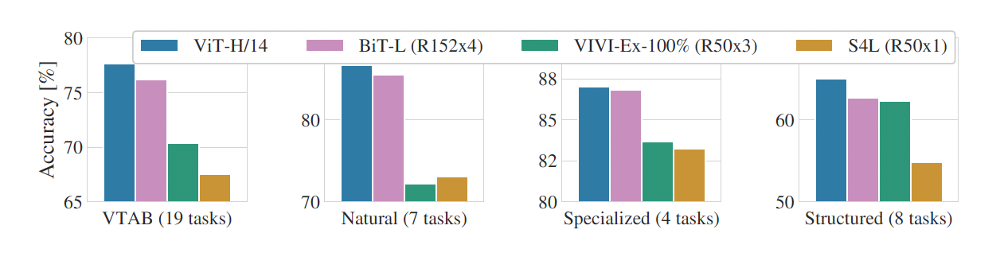
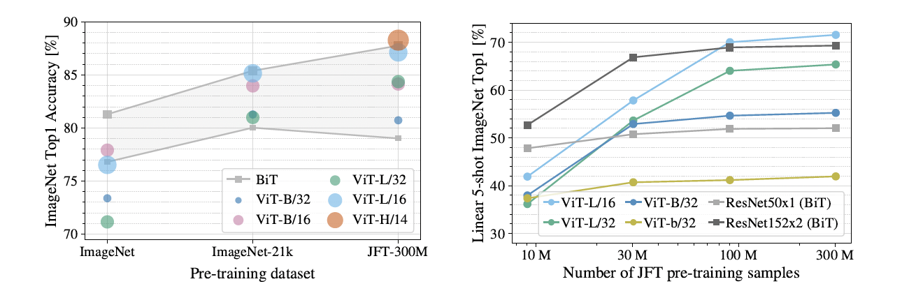
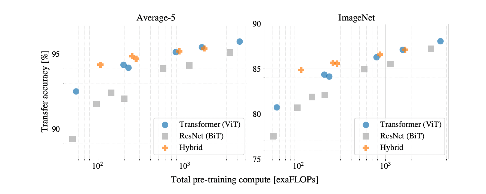
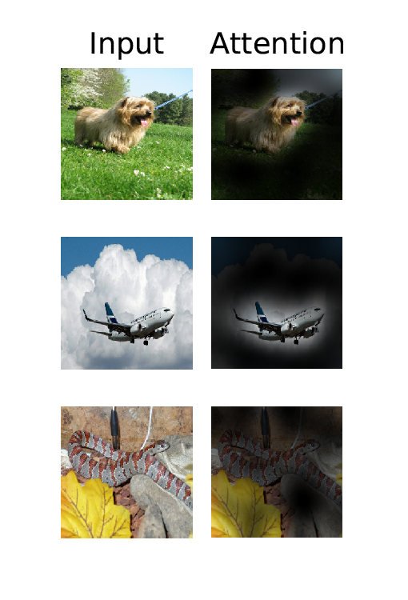
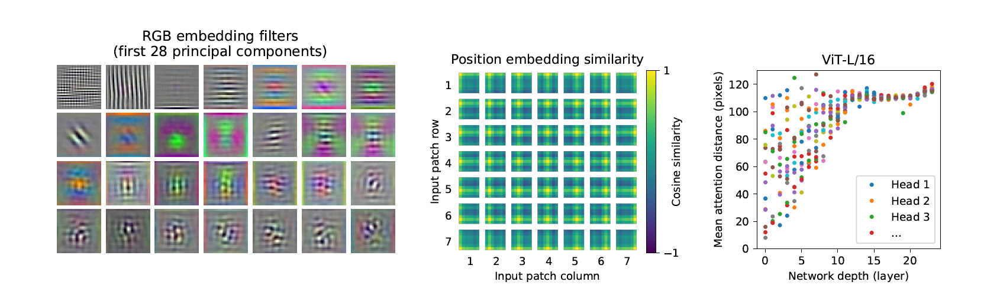
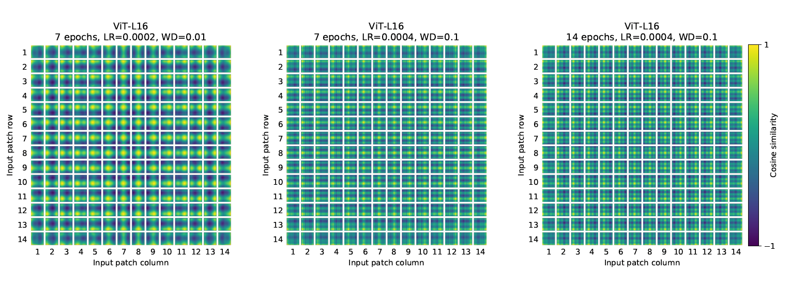

Paper : [An Image is worth 16x16 Words: Transformers for Image Recognition at Scale.](https://arxiv.org/pdf/2010.11929)

이번 정리에는 논문 참고를 목적으로 원문 번역을 추가적으로 작성했지만, 번역에 다소 오역이 있을 수도 있습니다.

## Abstract

NLP task에서 Transformer는 상당한 성과를 이루고 있지만, Computer Vision task에서는 attention이 CNN과 결합시키거나 부분적으로 대체하는 방향으로만 발전해왔다. 논문에서는 CNN에 의존 없이도 Transformer만으로 image classification task에서 좋은 결과를 얻을 수 있음을 보여주고자 한다. Vision Transformer(ViT)는 적은 computing resources만으로도 합성곱(convolution)을 사용한 SOTA모델들과 비교하면 훌륭한 성능을 낼 수 있다고 한다.

## 1. Introduction

흔히들 아는 NLP분야에서 자주 쓰이는 Transformer는 self-attention 기반의 구조이다. 대규모 말뭉치로 사전 학습을 하고 fine tuning하는 형태로 사용되고 있다. transformer의 계산 효율성과 확장성 덕분에, 100B 파라미터 이상의 크기를 가진 모델 또한 학습할 수 있게 됐다.

하지만 CV에서는 convolutional 구조가 여전히 지배적이다. CNN계열의 구조들을 self-attention과 결합하거나 일부분을 대체하는 형태의 연구들이 진행됐었다. 후자의 모델들은 이론적으로는 효율적이지만, 특수한 attention 패턴들을 사용하기 때문에 최신 하드웨어 가속기에서 효과적으로 확장되지 못했다. 그렇기에 대규모 이미지 인식에서는 기본 ResNet 구조의 모델들이 여전히 SOTA에 있다.

필자들은 가능한 최소한의 수정만으로 Transformer를 이미지에 직접 적용해 실험을 했다. 이를 위해 이미지를 패치들로 나누고 각 패치를 선형임베딩한 시퀀스들을 Transformer의 입력으로 주었다. 이미지 패치들은 NLP에서의 토큰과 같은 방식으로 처리된다. 이미지 분류 모델을 지도학습 방식으로 학습시켰다.

이러한 모델들은 강력한 정규화(regularization)를 사용하지 않고, ImageNet과 같은 중간 규모의 데이터셋으로 학습시켰을 때, 비슷한 크기의 ResNet모델들 보다 몇 퍼센트 포인트 낮은 비교적 보통의 정확도를 보여줬다. 이는 다소 실망스러운 결과처럼 보이지만, Transformer는 translation equivariance와 locality와 같은 CNN에 내제된 inductive biases를 가지고 있지 않다. 그러므로 충분하지 않은 양의 데이터를 가지고 학습했을 때, 일반화(generalize)를 제대로 하지 못한다. 그렇지만 대규모의 데이터셋(14M-300M)에서 모델을 훈련시켰을 때는 상황이 달라진다. 대규모의 학습은 inductive bias를 능가하는 것을 발견했다. Vit는 충분한 규모로 사전 학습되었을 때, 적은 데이터의 과제에 전이 학습됐을 때도 뛰어난 성능을 보여준다. 공개된 ImageNet-21K 데이터셋이나 JPT-300M 데이터셋으로 사전 학습 됐을 때, ViT는 여러 이미지 인식 벤치마크에서 SOTA에 근접하거나 이를 능가한다. 특히 최고 성능 모델은 ImageNet에서 88.85%, ImageNet-Real에서 90.72%, CIFAR-100에서 94.55%의 정확도를 달성했다.

## 2. Related Work

NLP에서 SOTA의 방식인 Transformer는 기계 번역을 위해서 제안되었다. Transformer 기반의 언어 모델들은 방대한 말뭉치로 사전 학습하고 특정 작업에에 맞게 fine tuning된다. BERT는 노이즈 제거 자기 지도 학습(denoising self-supervised)을, GPT 계열은 언어 모델링을 사전 학습 작업으로 사용한다.

자연스로운 방식으로 self-attention을 이미지에 적용하면 각 픽셀이 모든 다른 픽셀에 영향을 끼치게 되므로, 픽셀 수에 대한 이차적인 연산 비용이 발생하게 되어 현실적인 입력 크기에서는 확장성이 떨어진다. 이에 Transformer를 이미지 처리에 적용하기 위해, 다양한 접근법이 과거에 시도되었다. *Parmar* 의 *"Image transformer."* 에서는 self-attention을 전체가 아닌 각 query 픽셀 주변의 지역적인 이웃에만 적용했다. 이러한 지역 기반의 multi-head dot-product self-attention 블록은 합성곱 연산을 완전히 대체할 수 있다. 또 다른 접근 방식인 Sparse Transformer는 global self-attention에 확장 가능한 근사치를 적용하여 이미지를 처리할 수 있게 했다. Attention을 확장하는 또 다른 방법은 다양한 크기의 블록 단위로 적용하거나, 극단적인 경우 개별 축에만 적용하는 것이다. 이와 같은 특수한 구조의 attention들은 컴퓨터 비전 작업에서 유망한 성능을 보여주지만, 하드웨어 가속기에서 효율적으로 구현하기 위해 복잡한 작업이 요구된다.

필자들의 연구와 가장 관련이 있는 것은 *Cordonnier* 의 *"On the relationship between self-attention and convolutional layers."*에 등장하는 모델로, 입력 이미지에서 2x2 크기의 패치를 추출한 후 그 위에 완전한 self-attention을 적용한다.이 모델은 Vision Transformer와 매우 유사하지만, ViT는 대규모 사전 학습을 통해 일반적인 Transformer도 최신 CNN들과 경쟁학거나 그보다 나은 성능을 낼 수 있음을 증명했다. 게다가 *Cordonnier* 는 2x2 픽셀이라는 작은 크기의 패치를 사용했기 때문에 해당 모델은 해상도가 낮은 이미지에만 적용할 수 있지만, ViT는 중간 해상도의 이미지도 처리할 수 있다.

합성곱 신경망과 다양한 형태의 self-attention을 결합하려는 시도도 활발히 이루어지고 있다. 예를 들어 이미지 분류를 위해 feature map을 증강한다(*Attention augmented convolutional networks.*). 객체 탐지(*Relation networks for object detection.*), 비디오 처리(*Non-local neural networks.*), 이미지 분류(*Visual transformers: Token-based image representation and processing for computer vision.*), 비지도 객체 탐지(*Object-centric learning with slot attention.*), 텍스트-비전 통합(*UNITER: UNiversal Image-TExt Representation Learning.*) 작업 등에서 CNN의 출력을 self-attention으로 추가 처리하는 방식도 있다.

최근의 또 다른 관련 모델은 Image GPT로, 이미지 해상도와 색상 공간을 축소한 뒤, 이미지 픽셀에 Transformer를 적용한다. 이 모델은 생성 모델로서 비지도 방식으로 학습되며, 학습된 표현은 분류 성능을 위해 선형 방식으로 fine tuning하거나 탐색(probing)할 수 있다. 이 방식으로 ImageNet에서 최대 72%의 정확도를 달성하였다.

필자들의 연구는 기존의 ImageNet 데이터셋보다 더 큰 규모에서 이미지 인식을 탐구하는 논문들이 증가하는 흐름에 기여한다. 추가적인 데이터 소스를 활용하는 것은 표준 벤치마크에서 SOTA 성능을 달성할 수 있게 한다. 또한, CNN의 데이터셋 크기에 따라 작동하는지에 대한 연구와 CNN이 대규모 데이터셋(ImageNet-21k, JFT-300M)에서 전이 학습되는 방식을 경험적으로 탐색한 연구들도 있다. 필자들 역시 이 두 데이터셋에 초점을 맞추지만, 기존 연구들이 사용한 ResNet 기반 모델 대신 Transformer를 학습시킨다는 점에서 차별된다.

## 3. Method

**Figure 1: Model Overview.** We split an image into fixed-size patches, linearly embed each of them, add position embeddings, and feed the resulting sequence of vectors to a standard Transformer encoder. In order to perform classification, we use the standard approach of adding an extra learnable "classification token" to the sequence. The illustration of the Transformer encoder was inspired by Vaswani et al. (2017).

모델 설계에 있어 필자들은 원래의 트랜스포머 구조를 가능한 한 그대로 따랐다. 이러한 의도적으로 단순한 구성의 장점은, 확장 가능한 NLP Transformer 구조와 그 효율적인 구현을 거의 그대로 사용할 수 있다는 점이다.

### 3. 1. Vision Transformer(ViT)

모델의 개요는 Figure. 1에 나타나 있다. Transformer는 1차원 토큰 임베딩 시퀀스를 입력으로 받는다. 2차원 이미지를 처리하기 위해서는 이미지 $\mathbf{x} \in\mathbb{R^{H\times W\times C}}$ 를 2차원 패치 $\mathbf{x}_p \in \mathbb{R}^{N \times (P^2\cdot C)}$ 들을 평탄화(flatten)한 시퀀스로 변형한다. 여기서 $(H, W)$ 는 이미지의 해상도, $C$ 는 채널, $(P, P)$ 는 각각의 패치들의 해상도 $N = HW/P^2$ 은 Transformer의 실질적인 입력 시퀀스 길이로도 사용되는 패치 개수이다. Transformer는 모든 계층에서 고정된 잠재(latent) 벡터 크기 D를 사용하므로, 패치를 평탄화한 후 학습 가능한 선형 투영(Eq.1)을 통해 D 차원으로 매핑한다. 필자들은 이 투영의 출력을 패치 임베딩(patch embeddings)이라 부른다.

BERT의 [class] 토큰가 유사하게, 필자들은 학습 가능한 임베딩($\mathbf{z}^0_0 = x_{class}$)을 임베딩된 패치 시퀀스 앞에 추가하는데, Transformer 인코더의 출력에서 ($\mathbf{z}^0_L$) 임베딩의 상태는 이미지 표현 $\mathbf{y}$ 로 계산된다(Eq.4). 사전 학습과 fine tuning 단계 모두에서 분류기는 $\mathbf{z}^0_L$에 연결된다.이 분류기는 사전 학습에서는 하나의 은닉층을 가진 MLP로, fine tuning 에서는 단일 선형 계층으로 구현된다.

위치 정보를 유지하기 위해 패치 임베딩에 위치 임베딩을 더한다. 필자들은 일반적인 학습 가능한 1차원 위치 임베딩을 사용하는데, 이는 더 발전된 2D 기반 위치 임베딩을 사용했을 때 의미 있는 성능 향상이 관찰되지 않았기 때문이다. 이렇게 구성된 임베딩 벡터 시퀀스는 인코더의 입력으로 사용된다.

Transfomer 인코더는 multihead self-attention(Eq.2)과 MLP 블록(Eq.3)이 교차로 쌓인 계층들로 구성되어 있다. 각 블록 앞에서는 LayerNorm (Eq.4)이 적용되며, 각 블록 뒤에서 residual connection이 추가된다. MLP는 비선형의 GELU와 함께 2개의 층으로 구성된다.
$$
\mathbf{z}_0 = [\mathbf{x}_{class};\ \mathbf{x}^1_p\mathbf{E};\ \mathbf{x}^2_p\mathbf{E}; \cdot\cdot\cdot\ ;\mathbf{x}^N_p\mathbf{E}]\ +\ \mathbf{E}_{pos},\ \mathbf{E}\in\mathbb{R}^{(P^2\cdot C)\times D},\ \mathbf{E}_{pos}\in\mathbb{R}^{(N+1)\times D}
$$

$$
\mathbf{z'}_l=\mathbf{MSA}(\mathbf{LN}(\mathbf{z_{l-1}})), l\ =\ 1\ \cdots\ L
$$

$$
\mathbf{z}_l=\mathbf{MSA}(\mathbf{LN}(\mathbf{z'}_l))+\mathbf{z'}_l, l\ =\ 1\ \cdots\ L
$$

$$
\mathbf{y}=\mathbf{LN}(\mathbf{z}^0_L)
$$

#### Inductive bias.

Vision Transformer는 CNN보다 이미지에 특화된 귀납적 편향(inductive bias)이 훨씬 적다는 점을 주목할 수 있다. CNN에서는 지역성, 2차원 이웃 구조, 평행 이동 등가성(translation equivariance)이 모델 전반에 걸쳐 각 계층에 기본적으로 내장되어 있다. 반면 ViT에서는 MLP 계층만이 지역적이고 평행 이동에 대한 등가성을 가지며, self-attention 계층은 전역적으로 작동한다. 2차원 이웃 구조는 매우 제한적으로 사용된다. 구체적으로는 모델 시작 단계에서 이미지를 패치로 자를 때와, fine tuning 시 다양한 해상도의 이미지에 맞게 위치 임베딩을 조정할 때 사용된다. 그 외의 경우, 초기 위치 임베딩에는 패치들의 2D 위치 정보가 포함되어 있지 않으며, 패치들 간의 모든 공간적 관계는 처음부터 학습을 통해 습득해야 한다.

#### Hybrid Architecture.

원본 이미지를 쓰는 것이 아닌, 입력 시퀀스를 CNN의 특징 맵으로부터 구성할 수 있다. 이 하이브리드 모델에서는 CNN의 특징 맵에서 추출한 패치에 패치 임베딩 투영 $\mathbf{E}$ (Eq.1)를 적용한다. 특수한 경우로, 패치의 공간 크기를 1 x 1로 설정하면 입력 시퀀스는 단순히 특징 맵의 공간 차원을 평탄화한 뒤, Transformer 차원으로 투영하여 얻어진다. 분류 작업에서는 입력 임베딩과 위치 임베딩은 앞서 설명한 방식대로 합쳐진다.

### 3. 2. Fine-Tuning and Higher Resolution

일반적으로 우리는 ViT를 대규모 데이터셋에서 사전 학습한 후, 다운스트림 작업에 fine tuning한다. 이를 위해, 사전 학습된 결과 예측 층을 제거하고, 0으로 초기화 된 $\mathbf{D\times K}$ 피드포워드 계층을 새로 연결하는데, 여기서 $\mathbf{K}$ 는 다운스트림 작업에서의 클래스 개수이다. Fine tuning 시에는 사전 학습 때보다 더 높은 해상도로 학습하는 것이 종종 성능에 도움이 된다. 더 높은 해상도의 이미지를 입력할 때, 필자들은 패치 크기는 그대로 유지하기 때문에 결과적으로 입력 시퀀스 길이가 더 길어진다. Vision Transformer는 메모리 제한 내에서 임의의 시퀀스 길이를 처리할 수 있지만, 이 경우 사전 학습된 위치 임베딩이 더 이상 의미를 갖지 않을 수 있다. 따라서, 원본 이미지 내 위치에 따라 2D 보간(interpolation)을 통해 사전 학습된 위치 임베딩을 조정한다. 주의할 점은, 해상도 조정과 패치 추출이 Vision Transformer에 이미지의 2D 구조에 대한 귀납적 편향이 수동으로 주입되는 유일한 지점이라는 것이다.

## 4. Experiment

필자들은 ResNet, ViT, 그리고 하이브리드 모델의 표현 학습 능력을 평가한다. 각 모델이 요구하는 데이터 양을 이해하기 위해, 다양한 크기의 데이터셋에서 사전 학습을 진행하고 여러 벤치마크 과제에서 성능을 평가한다. 모델을 사전 학습하는 연산 비용을 고려했을 때, ViT는 매우 뛰어난 효율을 보이며, 대부분의 인식 벤치마크에서 sota을 더 낮은 사전 학습 비용으로 달성한다. 마지막으로, 필자들은 자기 지도 학습을 활용한 소규모 실험을 수행하고, 자기 지도 방식으로 학습된 ViT가 미래에 가능성이 크다는 것을 보여준다.

### 4. 1. Setup

#### Datasets.

모델의 확장 가능성을 탐구하기 위해, 필자들은 ILSVRC-2012 ImageNet 데이터셋(1,000개 클래스, 130만 개 이미지 보유), 그 상위 데이터셋인 ImageNet-21k(21,000개 클래스, 1,400만 개 이미지 보유), 그리고 JFT(18,000개 클래스, 3억 300만 개의 고해상도 이미지)를 사용한다. 다운스트림 작업의 테스트셋과의 중복을 방지하기 위해, 사전 학습 데이터셋은 Kolesnikov의 방식에 따라 중복 제거(de-duplication)를 수행한다. 이들 데이터셋으로 학습된 모델은 여러 벤치마크 작업에 전이 학습된다. 이들 데이터셋들의 사전 처리(pre-processing) 또한 Kolesnikov의 방식을 따른다.

필자들은 또한 19개의 과제로 구성된 VTAB(Vision Transfer Ability Benchmark) 분류 평가 세트에 대한 평가를 수행한다. VTAB는 다양한 과제에 대한 저데이터 전이 학습 능력을 평가하며, 각 과제당 1,000개의 학습 예제를 사용한다. 과제는 세 가지 그룹(Natural: CIFAR와 같은 일상 이미지, Specialized: 의료 영상 및 위성 이미지 등 특수 도메인, Structured: 물체 위치 추정 등 기하학적 이해가 요구되는 작업)으로 나뉜다. 이러한 구성은 모델의 전반적인 일반화 및 전이 능력을 폭넓게 평가하기 위함이다.

**Table 1: Details of Vision Transformer model variants.**

|     Model     | Layers | Hidden size D | MLP size | Heads | Params |
| :-----------: | :----: | :-----------: | :------: | :---: | :----: |
| **ViT-Base**  |   12   |      768      |   3072   |  12   |  86M   |
| **ViT-Large** |   24   |     1024      |   4095   |  16   |  307M  |
| **ViT-Huge**  |   32   |     1280      |   5120   |  16   |  632M  |

#### Model Variants.

필자들은 ViT 구성을 BERT에서 사용된 설정을 기반으로 하며, 이는 Table 1에 요약되어 있다. "Base"와 "Large" 모델은 BERT에서 직접 가져왔고, 여기에 더 큰 규모의 "Huge"모델을 추가했다. 이후 설명에서는 모델 크기와 입력 패치 크기를 간결한 표기법으로 나타낸다. 예를 들어, ViT-L/16은 "Large" 모델에 16x16 크기의 입력 패치를 사용하는 구성을 의미한다. 참고로, Transformer의 시퀀스 길이는 패치 크기의 제곱에 반비례하므로, 패치 크기가 작을수록 연산 비용이 더 많이 든다.

CNN으로는 ResNet을 사용하지만, Batch Normalization을 Group Normalization으로 교체하고, 표준화된 합성곱(standardized convolutions)을 적용한다. 이러한 수정은 전이 학습 성능을 향상시키며, 이 수정된 모델을 "ResNet(BiT)"이라고 표기한다. 하이브리드 모델의 경우, 중간 단계의 특징 맵을 ViT에 입력으로 제공하며, 이때 패치 크기는 "1 픽셀"로 설정한다. 시퀀스 길이의 변화를 실험하기 위해 두 가지 방법을 사용한다. (I) 일반적인 ResNet50의 stage 4 출력을 사용하거나, (II) stage 4를 제거하고, 동일한 수의 계층을 stage 3에 추가하여 전체 계층 수는 유지한 채, 확장된 stage 3의 출력을 사용하는 방식이다. (II)는 약 4배 더 긴 시퀀스 길이를 생성하게 되며, 그만큼 더 많은 계산 비용을 요구하는 ViT 모델이 된다.

**Table 2: Comparison with state of the art on popular image classification benchmarks.** We report mean and standard deviation of the accuracies, averaged over three fine-tuning runs. Vision Transformer models pre-trained on the JFT-300M dataset outperform ResNet-based baselines on all datasets, while taking substantially less computational resources to pre-train. ViT pre-trained on the smaller public ImageNet-21k dataset performs well too. *Slightly improved result reported in Touvron et al. (2020).

|                        | Ours-JFT (ViT-H/14) | Ours-JFT (Vit-L/16) | Ours-I21k (ViT-L/16) | BiT-L (ResNet152x4) | Noisy Student (EfficientNet-L2) |
| :--------------------- | :----------------------: | :----------------------: | :-----------------------: | :----------------------: | :----------------------------------: |
| **ImageNet**           |    **88.55**$\pm$0.04    |      87.76$\pm$0.03      |      85.30$\pm$0.02       |      87.54$\pm$0.02      |              88.4/88.5*              |
| **ImageNet ReaL**      |    **90.72**$\pm$0.05    |      90.54$\pm$0.03      |      88.62$\pm$0.05       |          90.54           |                90.55                 |
| **CIFAR-10**           |    **99.50**$\pm$0.06    |      99.42$\pm$0.03      |      99.15$\pm$0.03       |      99.37$\pm$0.06      |                  -                   |
| **CIFAR-100**          |    **94.55**$\pm$0.04    |      93.90$\pm$0.05      |      93.25$\pm$0.05       |      93.51$\pm$0.08      |                  -                   |
| **Oxford-IIIT Pets**   |    **97.56**$\pm$0.03    |      97.32$\pm$0.11      |      94.67$\pm$0.15       |      99.62$\pm$0.23      |                  -                   |
| **Oxford Flowers-102** |      99.68$\pm$0.02      |    **99.74**$\pm$0.00    |      99.61$\pm$0.02       |      99.63$\pm$0.03      |                  -                   |
| **VTAB(19 tasks)**     |    **77.63**$\pm$0.23    |      76.28$\pm$0.46      |      72.72$\pm$0.21       |      76.29$\pm$1.70      |                  -                   |
| **TPUv3-core-days**    |         **2.5k**         |        **0.68k**         |         **0.23k**         |         **9.9k**         |              **12.3k**               |

#### Training & Fine-tuning.

필자들은 ResNet을 포함한 모든 모델을 Adam 최적화로 학습하며, 하이퍼파라미터는 $\beta_1=0.9,\ \beta_2=0.999$, 배치 크기느 4096으로 설정하고, 가중치 감소(weight decay) 값은 0.1로 높게 설정했다. 이러한 설정이 모든 모델의 전이 학습 성능 향상에 효과적임을 발견했다(Appendix D.1에서는 일반적인 관행과 달리, 필자들의 설정에서는 Adam이 ResNet에 대해 SGD보다 약간 더 나은 성능을 보임을 보여준다).  Fine tuning시에는 SGD with momentum을 사용하며, 모든 모델에 대해 배치 크기 512를 사용한다(자세한 내용은 Appendix B. 1. 1 참조). Table 2의 ImageNet 결과에서, 필자들은 더 높은 해상도로 fine tuning을 수행했으며, ViT-L/16은 해상도 512에서, ViT-H/14는 해상도 518에서 fine tuning 하였다. 또한, Polyak & Juditsky 평균화(모델 파라미터의 지수 이동 평균)를 계수 0.9999로 설정하였다.

#### Metrics.

필자들은 다운스트림 데이터셋에서의 결과를 few-shot 또는 fine tuning 정확도를 통해 보고한다. Fine tuning 정확도는 각 모델을 해당 데이터셋에 맞춰 fine tuning 한 후의 성능을 측정한 것이다. Few-shot 정확도는 학습 이미지의 일부에 대해 (동결된) 표현을 $\{-1,\ 1\}^K$ 형태의 타깃 벡터로 매핑하는 regularized least-squares regression 문제를 풀어 얻는다. 이 방식은 해를 폐형식(closed form)으로 정확하게 구할 수 있다는 장점이 있다. 필자들은 주로 fine tuning 성능에 초점을 맞추지만, fine tuning 비용이 너무 클 경우 빠르게 성능을 평가하기 위해 선형 few-shot 정확도를 사용하는 경우도 있다.

**Figure 2: Breakdown of VTAB performance in *Natural*, *Specialized*, and *Structured* task groups.**

### 4. 2. Comparison to State of the art

필자들은 먼저 가장 큰 모델인 ViT-H/14와 ViT-L/16을 기존 문헌에 등장하는 최첨단 CNN 모델들과 비교한다. 첫 번째 비교 대상은 Big Transfer(BiT)로, 이는 대형 ResNet을 활용한 지도 전이 학습(supervised transfer learning) 방식이다. 두 번째는 Noisy Student로, ImageNet과 라벨이 제거된 JFT-300M에서 반지도 학습(semi-supervised learning)을 사용하여 학습된 대형 EfficientNet 모델이다. 현재 ImageNet에서는 Noisy Student가, 그리고 본 논문에서 다룬 다른 데이터셋에서는 BiT-L이 최고 성능을 기록하고 있다. 모든 모델은 TPUv3 하드웨어에서 학습되었으며, 필자들은 모델을 사전 학습하는데 걸린 TPUv3-core-day 수를 함께 보고한다. 이는 사용된 TPUv3 코어 수(칩당 2코어)에 학습 일수를 곱한 값이다.

Table 2는 실험 결과를 보여준다. 더 작은 ViT-L/16 모델은 JFT-300M 데이터셋에서 사전 학습되었으며, 동일한 데이터셋에서 사전 학습된 BiT-L을 모든 과제에서 능가하면서도, 학습에 필요한 계산 자원이 훨씬 적다. 더 큰 모델인 ViT-H/14는 성능을 한층 더 향상시켰으며, 특히 ImageNet, CIFAR-100, 그리고 VTAB와 같은 더 어려운 데이터셋에서 두드러진 향상을 보였다. 흥미롭게도, 이 모델은 이전 최고 성능 모델보다 사전 학습에 필요한 계산량이 훨씬 적었다. 다만 사전 학습 효율성은 구조 선택뿐만 아니라, 학습 스케줄, 옵티마이저, 가중치 감소 등 다양한 하이퍼파라미터에도 영향을 받을 수 있다는 점을 주의해야 한다. 필자들은 section 4. 4에서 다양한 구조에 대한 성능과 계산 자원의 관계를 통제된 조건에서 분석한 연구 결과를 제공한다. 마지막으로, 공개된 ImageNet-21k 데이터셋에서 사전 학습된 ViT-L/16 모델 역시 대부분의 데이터셋에서 좋은 성능을 보였으며, 사전 학습에 필요한 자원도 적었다. 예를 들어 8코어 TPUv3를 사용하는 표준 클라우드 환경에서도 약 30일 만에 학습이 가능하다.

Figure 2는 VTAB 과제를 각 그룹별로 분해하여, 이전의 SOTA 방법들과 비교한 결과를 보여준다. 비교 대상은 BiT, VIVI(ImageNet과 YouTube에서 공동 학습된 ResNet), 그리고 S4L(ImageNet에서 지도 + 반지도 학습을 결합한 방법)이다. ViT-H/14는 *Natural* 과 *Sturctured* 과제에서 BiT-R152x4 및 다른 방법들보다 우수한 성능을 보인다. 반면, *Specialized* 과제에서는 상위 두 모델 간의 성능 차이가 크지 않다.

### 4. 3. Pre-training Data Requirements

Vision Transformer는 대규모 JFT-300M 데이터셋에서 사전 학습될 때 우수한 성능을 보인다. 하지만 ResNet보다 시각적 귀납 편향이 적은 ViT의 경우, 데이터셋의 크기가 얼마나 중요한가?라는 질문에 답하기 위해 두 가지 실험을 수행했다.

**Figure 3 : Transfer to ImageNet.** While large ViT models perform worse than BiT ResNets shaded area) when pre-trained on small datasets, they shine when pre-trained on larger datasets. Similarly, larger ViT variants overtake smaller ones as the dataset grows.

**Figure 4 : Linear few-shot evaluation on ImageNet versus pre-training size.** ResNets perform better with smaller pre-training datasets but plateau sooner than ViT, which performs better with larger pre-training. ViT-b is ViT-B with all hidden dimensions halved.

첫 번째로, 필자들은 ViT 모델들을 점점 더 큰 데이터셋에서 사전 학습시킨다: ImageNet, ImageNet-21k, 그리고 JFT-300M. 작은 데이터셋에서의 성능을 높이기 위해, 세가지 기본 정규화 파라미터 - 가중치 감소, 드롭아웃, 그리고 라벨 스무딩(label smoothing) - 을 최적화 한다. Figure 3은 사전 학습 후 ImageNet으로 파인튜닝한 결과를 보여주며, 다른 데이터셋에 대한 결과는 Table 5에 제시되어 있다. 가장 작은 데이터셋인 ImageNet에서 사전 학습했을 때, ViT-Large 모델은 ViT-Base 모델보다 오히려 성능이 낮았다. 이는 중간 수준의 정규화를 적용했음에도 나타난 결과이다. 반면, ImageNet-21k에서 사전 학습한 경우, 두 모델의 성능은 유사하게 나타났고, JFT-300M에서 학습했을 때에만 더 큰 모델의 이점을 명확히 확인할 수 있었다. 또한 Figure 3에는 다양한 크기의 BiT 모델들이 만들어내는 성능 범위도 함께 표시되어 있다. 작은 데이터셋인 ImageNet에서는 BiT CNN들이 ViT보다 우수한 성능을 보이지만, 데이터셋이 커질수록 ViT가 BiT를 앞지르기 시작한다.

두 번째 실험에서는, JFT-300M 전체 데이터셋뿐 아니라 9M, 30M, 90M 크기의 무작위 하위 샘플들을 사용하여 모델들을 학습시킨다. 작은 데이터셋에서는 추가적인 정규화를 적용하지 않으며, 모든 설정에서 동일한 하이퍼파라미터를 사용한다. 이렇게 함으로써 정규화 효과가 아닌 모델 자체의 고유 특성을 평가할 수 있게 된다. 다만, 조기 종료(early stopping)를 사용하며, 학습 중 도달한 최고 검증 정확도를 보고한다. 계산 자원을 절약하기 위해, 전체 파인튜닝 정확도 대신 선형 few-shot 정확도를 사용한다. 결과는 Figure 4에 제시되어 있다. 그림에서 확인할 수 있듯, ViT는 ResNet에 비해 작은 데이터셋에서는 더 쉽게 과적합되며, 비슷한 계산 비용을 사용하는 모델 간 비교에서도 이 경향은 뚜렷하다. 예를 들어, ViT-B/32는 ResNet50보다 약간 더 빠르지만, 9M 데이터셋에서는 훨씬 낮은 성능을 보인다. 그러나 90M 이상의 데이터셋에서는 ViT가 더 나은 성능을 나타낸다. 이는 ResNet152x2와 ViT-L/16의 비교에서도 동일하게 나타난다. 이 결과는 다음과 같은 직관을 다시 한 번 확인시켜 준다. 작은 데이터셋에서는 합성곱 기반의 귀납 편향이 유리하며, 큰 데이터셋에서는 모델이 데이터를 통해 필요한 패턴을 직접 학습할 수 있기 때문에, 이러한 편향 없이도 좋은 성능을 낼 수 있다.

전반적으로 ImageNet에서의 few-shot 결과(Figure 4)와 VTAB에서의 저데이터 전이 성능(Table 2)은 매우 적은 데이터로도 효과적인 전이 학습이 가능하다는 점에서 유망한 결과로 보인다. Vision Transformer의 few-shot 특성에 대해 더 깊은 분석은 앞으로의 흥미로운 연구 방향이 될 것이다.

**Figure 5 : Performance versus pre-training compute for different architectures: Vision Transformers, ResNets, and hybrids.** Vision Transformers generally outperform ResNets with the same computational budget. Hybrids improve upon pure Transformers for smaller model sizes, but the gap vanishes for larger models.

### 4. 4. Scaling Study

필자들은 JFT-300M 데이터셋에서의 전이 성능을 기준으로 다양한 모델들의 스케일링 특성을 통제된 조건에서 비교 분석한다. 이 설정에서는 데이터 크기가 모델 성능의 병목이 되지 않기 때문에, 각 모델의 사전 학습 비용 대비 성능을 평가할 수 있다. 모델 구성은 다음과 같다.

-   7개의 ResNet 모델:
    -   R50x1, R50x2, R101x1, R152x2 → 각각 7 에폭 동안 사전 학습
    -   R152x2, R200x3 → 각각 14 에폭 동안 사전 학습
-   5개의 하이브리드 모델 (ResNet + ViT):
    -   R50 + ViT-B/32, B/16, L/32, L/16 → 각각 7 에폭 동안 사전 학습
    -   R50 + ViT-L/16 → 14 에폭 동안 사전 학습

여기서 주의할 점은, 하이브리드 모델 이름의 마지막 숫자(L/16 등)는 일반적인 ViT의 패치 크기를 의미하는 것이 아니라, ResNet 백본에서의 전체 다운샘플링 비율을 나타낸다는 것이다.

Figure 5는 전이 성능과 총 사전 학습 계산량 간의 관계를 보여준다 (계산량에 대한 자세한 내용은 Appendix D.5 참조). 모델별 세부 결과는 Appendix Table 6에 제공된다. 이 결과에서 몇 가지 주요한 패턴을 관찰할 수 있다: 첫 번째로, Vision Transformer는 ResNet보다 성능/계산량(trade-off) 측면에서 우위에 있다. ViT는 동일한 성능을 달성하는 데 ResNet보다 약 2~4배 적은 계산 자원을 사용한다 (5개 데이터셋 평균 기준). 두 번째로, 하이브리드 모델(ViT + ResNet)은 계산 자원이 적을 때는 ViT보다 약간 더 나은 성능을 보이지만, 모델 규모가 커질수록 이 차이는 사라진다. 이는 다소 의외의 결과로, 일반적으로는 합성곱 기반의 지역 특성 추출이 ViT에 어떤 규모에서든 보완 효과를 줄 것으로 예상되기 때문이다. 세 번째는, Vision Transformer는 실험한 범위 내에서 성능이 포화되지 않는 경향을 보인다. 이는 향후 더 큰 규모로 확장할 가능성을 제시하며, 추가 연구의 동기를 제공한다.

**Figure 6 : Representative examples of attention from the output token to the input space.** See Appendix D.7 for details.

### 4. 5. Inspecting Vision Transformer

Vision Transformer가 이미지 데이터를 어떻게 처리하는지를 이해하기 위한 첫걸음으로, 필자들은 그 내부 표현(internal representations)을 분석한다. ViT의 첫 번째 계층은 평탄화된 이미지 패치를 저차원 공간으로 선형 투영한다(Eq. 1). Figure 7 (왼쪽)은 학습된 임베딩 필터들의 주성분(top principal components)을 보여준다. 이 주성분들은 각 패치 내부의 세밀한 구조를 저차원으로 표현하는 데 적절한 기저 함수(basis functions)처럼 보이며, 설득력 있는 특징 표현을 형성하는 것을 확인할 수 있다.

투영이 이루어진 후, 학습된 위치 임베딤이 각 패치 표현에 추가된다. Figure 7 (중앙)은 모델이 이미지 내에서의 거리 정보를 위치 임베딩의 유사도에 반영하도록 학습되었음을 보여준다. 즉, 서로 가까운 패치일수록 유사한 위치 임베딩을 갖는 경향이 있다. 또한, 행-열(row-column) 구조도 나타나며, 같은 행이나 열에 위치한 패치들끼리는 유사한 임베딩을 가진다. 그리고 격자(grid) 크기가 커질수록, 위치 임베딩에서 사인파(sinusoidal) 구조가 나타나는 경우도 있다 (자세한 내용은 Appendix D 참조). 이러한 결과는, 위치 임베딩이 2D 이미지의 위상(toppology)을 스스로 학습할 수 있음을 보여주며, 따라서 수작업으로 설계된 2D-aware 임베딩 방식들이 성능 향상을 가져오지 못한 이유를 설명해준다 (Appendix D. 4 참조).

Self-Attention은 Vison Transformer가 가장 낮은 계층에서도 이미지 전반에 걸쳐 정보를 통합할 수 있게 해준다. 필자들은 모델이 이 능력을 실제로 어느 정도 활용하는지를 조사하였다. 구체적으로, 필자들은 attention 가중치를 기반으로, 이미지 공간에서 정보가 통합되는 평균 거리인 "attention distance"를 계산하였다 (Figure 8, 오른쪽). 이 개념은 CNN에서의 수용 영역(receptive field) 크기와 유사하다. 분석 결과, 일부 attention 헤드는 가장 낮은 계층에서도 이미지 대부분에 주의를 기울이며, ViT가 전역 정보를 통합하는 능력을 실제로 활용하고 있음을 보여준다. 반면, 다른 Attention 헤드들은 초기 계층에서 일관되게 작은 attention 거리를 유지하며 국소적인(attention-localized) 특성을 보인다. 이러한 높은 지역성은 ResNet이 Transformer 앞단에 적용된 하이브리드 모델에서는 덜 뚜렷하게 나타나며 (Figure 7, 오른쪽), 이는 이러한 attention이 CNN의 초기 합성곱 계층과 유사한 기능을 수행할 수 있음을 시시한다. 또한, 네트워크의 깊이가 깊어질수록 attention 거리도 증가하는 경향이 나타났다. 전반적으로, ViT는 이미지 분류에 있어 의미적으로 중요한 영역에 주의를 집중하는 것으로 나타났다 (Figure 6).

**Figure 7: Left: Filters of the initial linear embedding of RGB values of ViT-L/32. Center: Similarity of position embeddings of ViT-L/32. Tiles show the cosine similarity between the position embedding of the patch with the indicated row and column and th position embeddings of all other patches. Right: Size of attended area by head and network depth. Each dot shows the mean attention distance across images for one of 16 heads at one layer.** See Appendix D.7 for details. 

### 4. 6. Self-Supervision

Transformer는 자연어 처리 과제에서 인상적인 성능을 보여주고 있다. 그러나 이 성공의 많은 부분은 우수한 확장성뿐 아니라, 대규모 자기 지도 사전 학습(self-supervised pre-training)에서 비롯된다. 필자들은 또한 BERT의 마스킹 언어 모델링(masked language modeling) 과제를 모방하여, 마스킹된 이미지 패치 예측(masked patch prediction)을 통한 자기 지도 학습 방식에 대해 예비 탐색을 수행하였다. 이러한 자기 지도 사전 학습을 통해, 소형 ViT-B/16 모델이 ImageNet에서 79.9%의 정확도를 달성하였다. 이는 처음부터 학습할 때보다 약 2% 향상된 성능이지만, 지도 사전 학습에 비해서는 아직 4% 낮은 성능이다. 자세한 내용은 Appendix B. 1. 2에 수록되어 있다. 대조 학습(contrasive pre-training) 기반 사전 학습에 대한 탐색은 향후 연구 과제로 남겨두었다.

## 5. Conclusion

필자들은 Transformer를 이미지 인식에 직접 적용하는 방식을 탐구하였다. 기존 컴퓨터 비전에서 self-attention을 사용하는 연구들과 달리, 필자들은 초기 패치 추출 단계를 제외하고는 이미지에 특화된 귀납적 편향을 아키텍처에 도입하지 않았다. 그 대신, 이미지를 패치 시퀀스로 해석하고, 이를 NLP에서 사용되는 표준 Transformer 인코더로 처리한다. 이러한 단순하지만 확장 가능한 전략은 대규모 데이터셋에 대한 사전 학습과 결합했을 때 놀라울 정도로 뛰어난 성능을 보여준다. 그 결과, Vision Transformer는 많은 이미지 분류 데이터셋에서 최처단 성능을 달성하거나 이를 능가하며, 사전 학습 비용도 상대적으로 낮다는 장점이 있다.

이러한 초기 결과들은 발전가능성을 보여주지만, 여전히 많은 과제가 남아 있다. 첫 번째 과제는 ViT를 detection과 segmentation과 같은 다른 컴퓨터 비전 작업에 적용하는 것이다. 필자들의 결과는 Carion's paper 등의 연구와 함께, 이러한 접근 방식의 잠재력을 보여준다. 두 번째 과제는 자기 지도 사전 학습 방법에 대한 지속적인 탐색이다. 초기 실험에서는 자기 지도 사전 학습이 성능을 향상시킬 수 있음을 보여준다. 마지막으로, ViT의 더 큰 규모로의 확장 역시 성능 향상으로 이어질 가능성이 높다.

## Appendix

### D. Additional Analyses

#### D. 4 Positional Embedding

필자들은 위치 임베딩을 활용해 공간 정보를 인코딩하는 다양한 방법에 대해 영향 분석 실험(ablatations)을 수행하였다. 다음과 같은 경우들을 실험하였다:

1.   위치 정보를 제공하지 않는 경우: 입력을 패치들의 집합으로 간주한다.

2.   1차원 위치 임베딩 : 입력을 래스터 순서로 나열된 패치 시퀀스로 간주한다.

3.   2차원 위치 임베딩: 입력을 2차원 그리드 형태의 패치로 간주한다. 이 경우 두 축에 대해 각각 별도의 다른 위치 임베딩을 학습한다: X축 임베딩, Y축 임베딩, 그리고 각 임베딩 크기는 D/2로 설정된다. 각 입력 패치의 좌표 위치에 따라, X와 Y 임베딩을 이어붙여 해당 패치의 최종 위치 임베딩을 생성한다.

4.   상대적 위치 임베딩(Relative Positional Embeddings): 절대적인 위치 정보 대신, 패치 간의 상대적 거리를 사용해 공간 정보를 인코딩한다. 이를 위해 1차원 상대적 어텐션을 적용하며, 모든 패치 쌍의 상대적 거리를 정의한다. 구체적으로는, 어텐션 메커니즘에서 한 패치를 query, 다른 패치를 key/value로 봤을 때, 각 쌍($p_q-p_k$)의 위치 차이를 구하고, 이 오프셋 값마다 고유한 임베딩을 할당한다. 그다음, 다음과 같은 방식으로 추가 적인 어텐션을 수행한다. 쿼리는 기존 내용 기반 쿼리를 그대로 사용하고, 키는 상대 위치 임베딩으로 대체한다. 이 상대적 어텐션의 로직은 편향 항으로 간주되어, 메인 어텐션의 로직에 더해진 후 소프트 맥스가 적용된다.

**Figure 10: Position embeddings of models trained with different hyperparameters.**

공간 정보를 인코딩하는 다양한 방법 외에도, 필자들은 이러한 정보를 모델 내부에 통합하는 다양한 방식들도 실험해 보았다. 1차원 및 2차원 위치 임베딩에 대해, 다음의 세 가지 경우를 시도했다: (1) 기본 설정으로 위치 임베딩을 모델의 초기 투영층(stem) 바로 뒤, 트랜스포머 인코더에 입력되기 직전에 한 번만 추가했다; (2) 각 트랜스포머 계층의 시작 부분마다, 새롭게 학습된 위치 임베딩을 입력에 더해줬다; (3) 각 계층의 시작마다 동일하게 학습된 위치 임베딩을 입력에 추가했다.

**Table 8: Results of the ablations study on positional embeddings with ViT-B/16 model evaluated on ImageNet 5-shot linear.**

|     Pos. Emb.     | Default/Stem | Every Layer | Every Layer-Shared |
| :---------------: | :----------: | :---------: | :----------------: |
|  **No Pos.Emb.**  |   0.61832    |     N/A     |        N/A         |
| **1-D Pos.Emb.**  |   0.64206    |   0.63964   |      0.64292       |
| **2-D Pos.Emb.**  |   0.64001    |   0.64046   |      0.64022       |
| **Rel. Pos.Emb.** |   0.64032    |     N/A     |        N/A         |

Table 8은 ViT-B/16 모델을 사용해 위치 임베딩에 대한 영향 분석 실험 결과를 요약한 것이다. 결과를 보면, 위치 임베딩을 사용하지 않은 모델은 성능이 크게 떨어지는 반면, 위치 임베딩을 사용하는 다양한 방식들 간에는 거의 차이가 없거나 매우 미미한 성능 차이만 존재한다. 필자들은 그 이유를 다음과 같이 추정한다: ViT의 트랜스포머 인코더는 픽셀 단위가 아니라 패치 단위 입력을 처리하기 때문에, 공간 정보를 어떻게 인코딩하느냐에 따른 차이가 덜 중요하게 작용한다는 것이다. 좀 더 구체적으로 말하면, 패치 단위 입력의 경우 공간 해상도가 훨씬 낮아진다. 따라서 이 낮은 해상도에서의 공간 관계를 학습하는 것은 어떤 위치 인코딩 방식에서도 거의 동일하게 쉬운 문제가 된다. 그럼에도 불구하고, 네트워크가 학습한 위치 임베딩 유사성의 패턴은 학습 하이퍼파라미터에 따라 달라지는 경향을 보인다 (Figure 10 참조).
