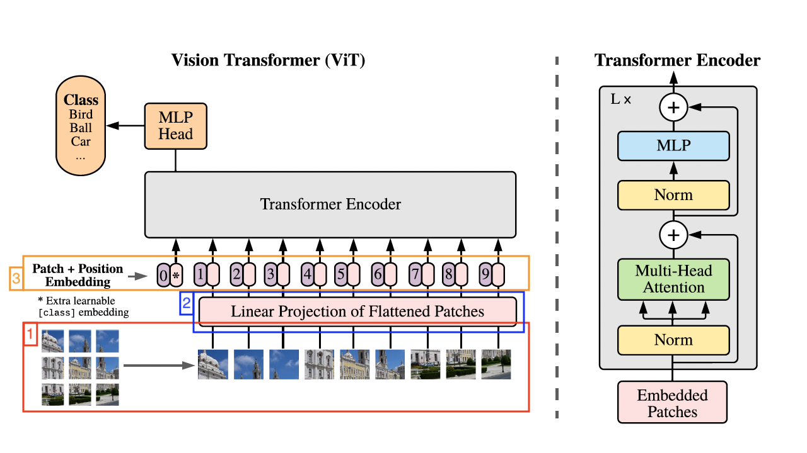
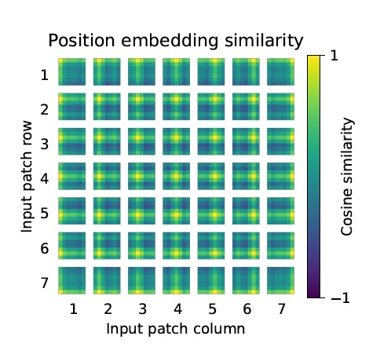
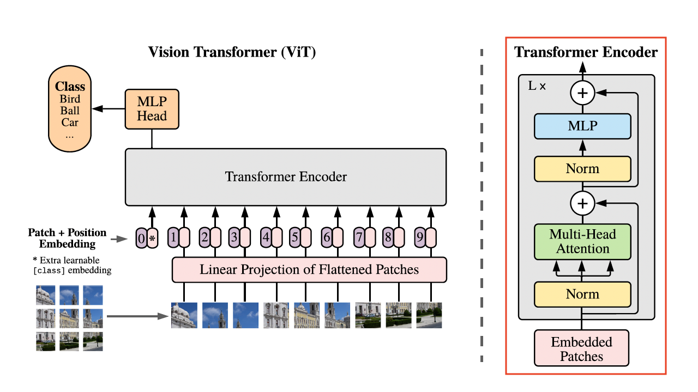
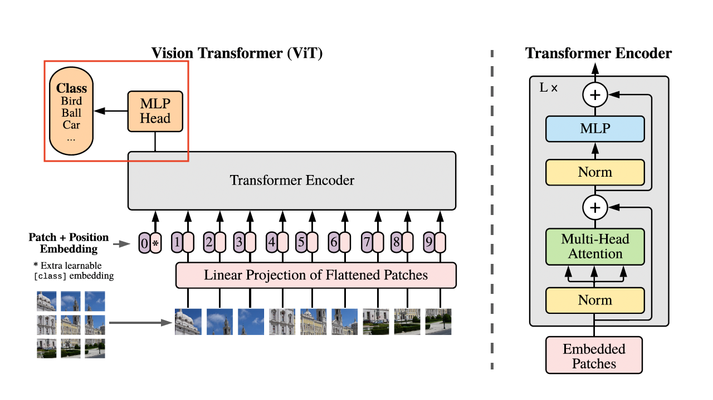
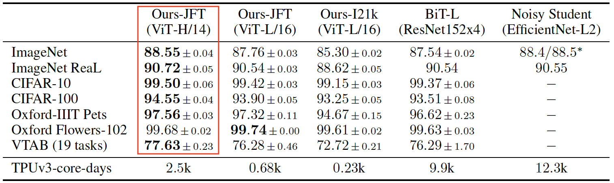
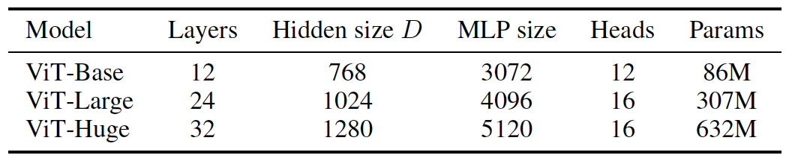
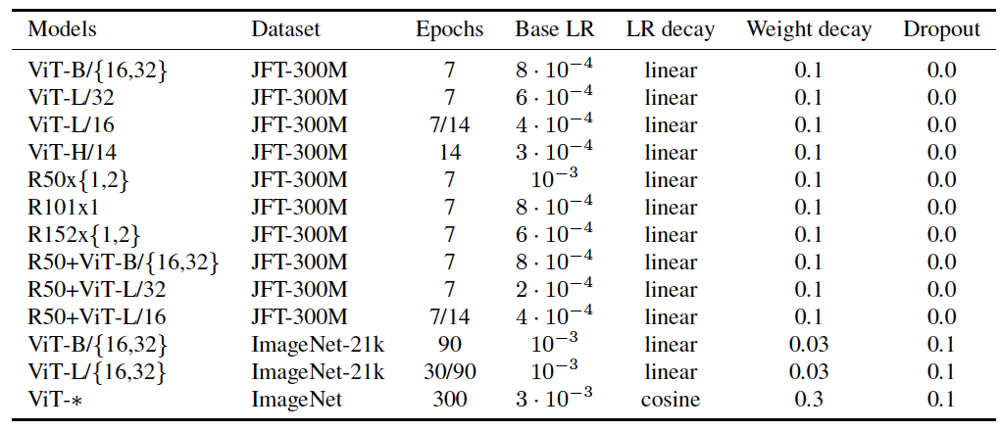

Paper : [An Image is worth 16x16 Words: Transformers for Image Recognition at Scale.](https://arxiv.org/pdf/2010.11929)

[원문 번역][https://hanjun0126.github.io/2025-05-20-ViT원문번역.html]

## 요약

**ViT(Vision Transformer)**는 2020년 구글의 "An Image is Worth 16x16 Words: Transformers for Image Recognition at Scale"논문을 통해 소개된 이미지 인식을 위한 딥러닝 모델이다. ViT는 CNN 모델의 합성곱 계층 방법을 사용하지 않고, 트랜스포머 모델에서 사용되는 셀프 어텐션(self-attention)을 적용하여 이미지 분류 과제를 수행한다. 합성곱 모델은 이미지를 분류하기 위해 지역 특징을 추출했다면 ViT는 셀프 어텐션을 사용해 전체 이미지를 한 번에 처리하는 방식으로 구현됐다. 결과적으로 ViT가 이미지 분류 과제에서 잘 작동함을 보여줬고, 많은 양의 데이터에서 사전 학습 후, 다른 크기의 이미지 데이터셋으로 전이 학습했을 때 기존의 CNN모델 기반 SOTA 결과들에 비해 적은 계산량으로 좋은 결과를 보여줬다.

 

## 구조

### 입력 전처리

ViT는 Transformer처럼 이미지를 패치 단위로 나누어 1차원 토큰 임베딩 시퀀스를 입력으로 받는다. 2차원 이미지 $\mathbf{x}\in\mathbb{R}^{H\times W\times C}$를 2차원 패치 $\mathbf{x}_p \in \mathbb{R}^{N \times (P^2\cdot C)}$ 로 변형하여 인코더에 입력으로 들어가기까지의 과정을 보자.

<p align="center"></p>

1.   $\mathbf{x}\in\mathbb{R}^{H\times W\times C}$&rarr;$\mathbf{x}_p \in \mathbb{R}^{N \times (P^2\cdot C)}$ : 2차원 이미지 $\mathbf{x}$가 $N$개의 패치 $\mathbf{x_p}$로 나누어진다. 

     ▸ 패치 크기가 클수록 $N$은 작아지기에 토큰 수가 줄어든다.

2.   각각의 패치들은 1차원 벡터로 펼쳐지면서 선형 투영된다.

     ▸ $\mathbf{x}_p^i\mathbf{E}\in\mathbb{R}^D$ : $\mathbf{x}_p^i\in\mathbb{R}^{P^2\cdot C}$ $\times$ $\mathbf{E}\in\mathbb{R}^{(P^2\cdot C)\times D}$  $+\ \alpha$(bias)

3.   BERT의 클래스 토큰과 유사하게, 임베딩 결과에 클래스를 예측하는 클래스 토큰이 앞에 연결된다. 결과적으로 트랜스포머 인코더에는 $\mathbb{R}^{B\times (N+1)\times D}$ 크기의 입력이 들어간다. 그리고 **위치 정보를 유지하기 위해 패치 임베딩에 학습 가능한 위치 임베딩을 더해준다.**

     ▸
     $$
     \mathbf{z}_0=[\mathbf{x}_{class};\mathbf{x}^1_p\mathbf{E};\mathbf{x}^2_p\mathbf{E};\cdots\;\mathbf{x}^N_p\mathbf{E}]+\mathbf{E}_{pos},\mathbf{E}\in\mathbb{R}^{(P^2\cdot C)\times D},\ \mathbf{E}_{pos}\in\mathbb{R}^{(N+1)\times D}
     $$
     
     
     ▸ 학습 가능한 위치 임베딩을 사용했을 때, 위치 임베딩을 사용하지 않았을 때에 비해 성능이 향상되었다. 또한 위치 임베딩에 방법에 따른 성능 향상은 확인할 수 없었다.

<p align="center"></p>

위치 임베딩이 각 패치의 위치에 따라 이미지에서 어떤 부분과 유사한 지를 위의 그림에서 확인할 수 있다. 패치의 위치가 [1, 1] 일 때 이미지에서 가장 왼쪽 윗부분이 유사도가 높음을 알 수 있다. 이러한 위치 임베딩으로 위치 값을 보존한다.


>   We use standard learnable 1D position embeddings, since we have not observed significant performance gains from using more advanced 2D-aware position embeddings.

#### Code

**PatchEmbedding**

```python
class PatchEmbedding(nn.Module):
    def __init__(self, img_size, patch_size, in_channels, embed_dim):
        super().__init__()
        self.num_patches = (img_size//patch_size) ** 2
        self.patch_size = patch_size
        self.proj = nn.Conv2d(in_channels, embed_dim, kernel_size=patch_size, stride=patch_size)
    
    def forward(self, x):			# B:batch_size, D:embed_dim, P:patch_size, N:num_patches
        x = self.proj(x)			# 2D Img(B, C, H, W)→2D patch grid(B, D, P, P)
        x = x.flatten(2)			# (B, D, P, P)→(B, D, N)
        x = x.transpose(1, 2)		# (B, D, N)→(B, N, D)
        return x					# Get x:[B, N, D]
```

배치 크기는 무시하고 단순히 한 개의 2차원 이미지를 입력으로 보았을 때를 예로 들자. 이미지가 (3, 224, 224)의 크기를 가질때, (3, 16, 16)크기의 패치로 나눈다면, 우리는 14x14 크기의 패치 그리드를 얻을 수 있다. 각 그리드의 패치들이 1차원 벡터로 펼쳐지게 되면, 패치 그리드는 196(14x14)개의 768(3x16x16) 차원의 텐서로 이루어진 임베딩 행렬로 도출된다.  

추가적으로 아래와 같이 클래스 토큰과 위치 임베딩을 구현할 수 있다.

```python
x = self.patch_embed(x)
B, N, D = x.shape
cls_tokens = self.cls_token.expand(B, -1, -1)		# cls[1, 1, D]→[B, 1, D]
x = torch.cat((cls_tokens, x), dim=1)				# x[B, N, D]→[B, N+1, D]
x = x + self.pos_embed[:, :N+1, :]					# patch[B, N+1, D] + position[1, N+1, D] embedding → [B, N+1, D]
x = self.dropout(x)
```

클래스 토큰이 추가되면서 최종적으로 (196+1)x768 크기의 텐서를 얻는다. 클래스 토큰과 위치 임베딩은 학습 가능한 매개변수가 되어야 하므로 이후에 `torch.nn.Parameter`로 선언해준다.

### 인코더

<p align="center"></p>

위에서 입력 이미지를 전처리하여 최종적으로 $\mathbf{z}_0$을 얻었다. 이 임베딩 구조가 인코더에서는 MSA(Multi-Head Self Attention), MLP, Norm 계층을 거치게 된다.

1.   $$
     \mathbf{z'}_l=\mathbf{MSA}(\mathbf{LN}(\mathbf{z_{l-1}})),\ l=1\cdots L
     $$

2.   $$
     \mathbf{z}_l=\mathbf{MLP}(\mathbf{LN}(\mathbf{z'}_l))+\mathbf{z'}_l,\ l=\ 1\cdots L
     $$

     

​	▸ LayerNormalization을 사용한다. 이는 **토큰의 개별적으로 작동**할 수 있기 때문이다. 또한 **활성화 함수로 GELU를 사용**한다.

위 과정을 밑의 그림과 같이 정리하였다.(이미지 변경 필요)

<p align="center"></p>

기존 Transformer와 다르게 ViT는 학습이 어렵기 때문에, 정규화로 먼저 데이터를 안정화시키고, Attention 하는게 좋다. 그렇기에 Attention과 MLP 계층 전에 Layer Normalization 계층을 먼저 거치게 된다. 또한 정규화를 거치기 전 데이터와 거친 후의 데이터를 합침으로써 차이를 극대화하여 특징을 잘 잡을 수 있다고 한다.

<p align="center"></p>

### MLP Head

인코더 계층에서 나오면, 클래스 토큰 값을 MLP 계층에 입력한다. 사전 학습시에는 MLP 차원의 크기에 맞게 hidden layer에서 연결된 후에 클래스를 분류한다면, 파인튜닝 과정에서는 바로 분류 과정으로 넘어가게 된다.

1.   Pre-train: large dataset

2.   Fine Tuning: (smaller) downstream tasks

     1.   사전 학습 때 사용되던 MLP Head(분류기)를 제거하고, **0으로 초기화된 $D\times K$ 크기의 피드포워드 계층을 연결해준다.** $K$는 다운스트림 과제의 클래스 개수이다.

     2.   파인튜닝에서 사전 학습 때보다 높은 해상도의 이미지를 사용하면 효과가 좋다는 논문이 있다. ViT는 제한된 메모리 내에서는 임의적 시퀀스 길이를 처리할 수 있기에, **동일한 패치 크기에서 높은 해상도 이미지를 사용하여 길이가 더 긴 시퀀스를 입력으로 받는다.**

     3.   시퀀스의 길이가 달라졌다면, **사전 학습된 위치 임베딩은 더이상 의미를 갖지 않는다.** 따라서 원본 이미진 내 위치에 따라 **2D 보간을 통해 사전 학습된 위치 임베딩을 조정한다.**

이러한 해상도 조정과 패치 추출이 ViT에서 이미지의 2D 구조에 대한 귀납적 편향이 수동으로 사용되는 유일한 부분이다.

<p align="center"></p>

#### Code

**Transformer Encoder**

```python
class TransformerEncoder(nn.Module):
    def __init__(self, dim, heads, mlp_dim, dropout=0.1):
        super().__init__()
        self.norm1 = nn.LayerNorm(dim)
        self.attn = nn.MultiheadAttention(dim, heads, dropout=dropout, batch_first=True)
        self.norm2 = nn.LayerNorm(dim)
        self.mlp = nn.Sequential(
            nn.Linear(dim, mlp_dim),
            nn.GELU(),
            nn.Dropout(dropout),
            nn.Linear(mlp_dim, dim),
            nn.Dropout(dropout)
        )

    def forward(self, x):
        x = x + self.attn(self.norm1(x), self.norm1(x), self.norm1(x))[0]
        x = x + self.mlp(self.norm2(x))
        return x
```

**Model**

```python
class VisionTransformer(nn.Module):
    def __init__(self, img_size=224, patch_size=16, in_channels=3, num_classes=1000,
               embed_dim=768, depth=12, heads=12, mlp_dim=3072, dropout=0.1):
        super().__init__()
        self.patch_embed = PatchEmbedding(img_size, patch_size, in_channels, embed_dim)
        num_patches = self.patch_embed.num_patches
        
        self.cls_token = nn.Parameter(torch.zeros(1, 1, embed_dim))     
        self.pos_embed = nn.Parameter(torch.randn(1, num_patches + 1, embed_dim))
        self.dropout = nn.Dropout(dropout)

        self.transformer = nn.Sequential(
            *[TransformerEncoder(embed_dim, heads, mlp_dim, dropout) for _ in range(depth)]
        )

        self.norm = nn.LayerNorm(embed_dim)
        self.head = nn.Linear(embed_dim, num_classes)

    def forward(self, x):
        x = self.patch_embed(x)
        B, N, D = x.shape

        cls_tokens = self.cls_token.expand(B, -1, -1)
        x = torch.cat((cls_tokens, x), dim=1)
        x = x + self.pos_embed[:, :N+1, :]
        x = self.dropout(x)

        x = self.transformer(x)
        x = self.norm(x)
        return self.head(x[:, 0])
```

### Inductive bias

Vision Transformer는 CNN에 비해 이미지에 특화된 inductive bias가 부족하다.

1.   locality

     ▸ 이미지 내에서 정보는 특정 지역에 담겨져 있음을 내포한다. 이미지에 대한 정보는 모든 픽셀을 통해서 얻는 것이 아닌, 특정 부분만으로도 얻을 수 있다. 이를 지역적인 특징을 갖고 있다고 한다. CNN은 다양한 크기의 필터를 사용해서 지역 정보를 얻는다.

2.   translation equivariance

     ▸ 이동 등가성이라 표현하는데, 이는 어떤 객체를 검출할 때, 해당 객체의 위치가 달려져도 출력 결과는 동일하다는 가정이다. 

CNN의 convolution 연산은 한 픽셀에 인접한 여러 픽셀에 대한 정보를 활용하기에 locality 특성을 활용하고, 하나의 필터가 Sliding window 방식으로 이미지를 거치기에 이미지에 있는 객체의 위치가 달라져도 필터의 이동으로 객체를 찾을 수 있다. 반면, Vision Transformer는 Self-attention 계층이 전역 정보를 다룰 때, MLP 계층에서만 이러한 inductive bias를 다룬다.

이러한 Inductive bias의 영향으로 중간 크기의 데이터 셋에서 학습한 ViT는 CNN 계열에 비해 더 낮은 성능을 보였다고 한다. 하지만 대규모 데이터셋에서 학습했을 때는, 이러한 영향이 미비했다고 한다. 이는 ViT가 대규모 데이터셋에서 사전 학습되고 다른 과제로 전이 학습 되었을 때 좋은 성능을 보여줬기 때문이다.

 <figure>
    <p align="center">
    <figcaption>Table 2: Comparison with state of the art on popular image classification benchmarks.</figcaption></p>
</figure>
## 실험

실험을 통해서 ResNet, ViT, 그리고 하이브리드 모델의 성능을 평가하였다. 

<figure>
    <p align="center">
    <figcaption>Table 1: Details of Vision Transformer model variants.</figcaption></p>
</figure>

1.   ViT 모델의 설정은 Table 1을 확인하면 된다.

     ▸ 모델 표기법: ViT-L(Large)/16(16x16 패치 사용)

2.    CNN의 기초 모델은 ResNet을 사용하였다.

      ▸ Batch Normlization 대신 Group Normalization을 사용하고, 표준화된 합성곱을 적용한 ResNet(BiT) 모델

3.    하이브리드 모델

      ▸ ViT에 ResNet의 stage 4 feature map을 입력으로 넣어주고 patch size = 1로 설정


<figure>
    <figcaption>Table 3: Hyperparameter for training.</figcaption>
    <p align="center"></p>
</figure>

학습에 사용된 하이퍼파라미터는 Table 3에서 확인할 수 있다.

-   optimizer: Adam for Pre-training and SGD for fine-tuning
-   batch size: 4096
-   linear warmups + Learning Rate Decay (Cosine or Linear)


<figure>
    <p align="center">
    <figcaption>Table 2: Comparison with state of the art on popular image classification benchmarks.</figcaption></p>
</figure>


