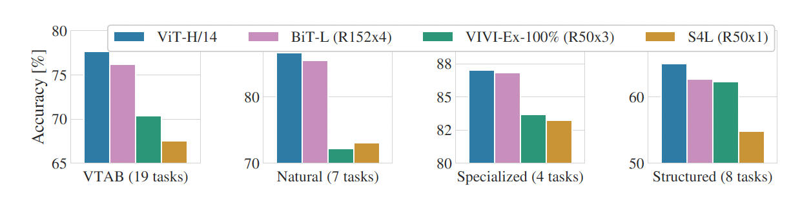
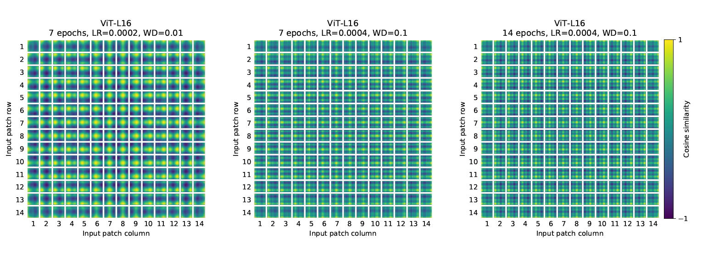

Paper : [An Image is worth 16x16 Words: Transformers for Image Recognition at Scale.](https://arxiv.org/pdf/2010.11929)

## 요약

**ViT(Vision Transformer)**는 2020년 구글의 "**An Image is Worth 16x16 Words: Transformers for Image Recognition at Scale**"논문을 통해 소개된 이미지 인식을 위한 딥러닝 모델이다. ViT는 **CNN 모델의 합성곱 계층 방법을 사용하지 않고, 트랜스포머 모델에서 사용되는 셀프 어텐션(self-attention)을 적용하여 이미지 분류 과제를 수행**한다. 합성곱 모델은 이미지를 분류하기 위해 지역 특징을 추출했다면 ViT는 셀프 어텐션을 사용해 전체 이미지를 한 번에 처리하는 방식으로 구현됐다. 결과적으로 ViT가 이미지 분류 과제에서 잘 작동함을 보여줬고, 많은 양의 데이터에서 사전 학습 후, 다른 크기의 이미지 데이터셋으로 전이 학습했을 때 기존의 CNN모델 기반 SOTA 결과들에 비해 적은 계산량으로 좋은 결과를 보여줬다.

 

## 구조

### 입력 전처리

ViT는 Transformer처럼 이미지를 패치 단위로 나누어 1차원 토큰 임베딩 시퀀스를 입력으로 받는다. 2차원 이미지 $\mathbf{x}\in\mathbb{R}^{H\times W\times C}$를 2차원 패치 $\mathbf{x}_p \in \mathbb{R}^{N \times (P^2\cdot C)}$ 로 변형하여 인코더에 입력으로 들어가기까지의 과정을 보자.


1.   $\mathbf{x}\in\mathbb{R}^{H\times W\times C}$&rarr;$\mathbf{x}_p \in \mathbb{R}^{N \times (P^2\cdot C)}$ : 2차원 이미지 $\mathbf{x}$가 $N$개의 패치 $\mathbf{x_p}$로 나누어진다. 

     ▸ 패치 크기가 클수록 $N$은 작아지기에 토큰 수가 줄어든다.

2.   각각의 패치들은 1차원 벡터로 펼쳐지면서 선형 투영된다.

     ▸ $\mathbf{x}_p^i\mathbf{E}\in\mathbb{R}^D$ : $\mathbf{x}_p^i\in\mathbb{R}^{P^2\cdot C}$ $\times$ $\mathbf{E}\in\mathbb{R}^{(P^2\cdot C)\times D}$  $+\ \alpha$(bias)

3.   BERT의 클래스 토큰과 유사하게, 임베딩 결과에 클래스를 예측하는 클래스 토큰이 앞에 연결된다. 결과적으로 트랜스포머 인코더에는 $\mathbb{R}^{B\times (N+1)\times D}$ 크기의 입력이 들어간다. 그리고 **위치 정보를 유지하기 위해 패치 임베딩에 학습 가능한 위치 임베딩을 더해준다.**

     ▸
     $$
     \mathbf{z}_0=[\mathbf{x}_{class};\mathbf{x}^1_p\mathbf{E};\mathbf{x}^2_p\mathbf{E};\cdots\;\mathbf{x}^N_p\mathbf{E}]+\mathbf{E}_{pos},\mathbf{E}\in\mathbb{R}^{(P^2\cdot C)\times D},\ \mathbf{E}_{pos}\in\mathbb{R}^{(N+1)\times D}
     $$
     
     
     ▸ 학습 가능한 위치 임베딩을 사용했을 때, 위치 임베딩을 사용하지 않았을 때에 비해 성능이 향상되었다. 또한 위치 임베딩에 방법에 따른 성능 향상은 확인할 수 없었다.


위치 임베딩이 각 패치의 위치에 따라 이미지에서 어떤 부분과 유사한 지를 위의 그림에서 확인할 수 있다. 패치의 위치가 [1, 1] 일 때 이미지에서 가장 왼쪽 윗부분이 유사도가 높음을 알 수 있다. 이러한 위치 임베딩으로 위치 값을 보존한다.

>   We use standard learnable 1D position embeddings, since we have not observed significant performance gains from using more advanced 2D-aware position embeddings.

#### Code

**PatchEmbedding**

```python
class PatchEmbedding(nn.Module):
    def __init__(self, img_size, patch_size, in_channels, embed_dim):
        super().__init__()
        self.num_patches = (img_size//patch_size) ** 2
        self.patch_size = patch_size
        self.proj = nn.Conv2d(in_channels, embed_dim, kernel_size=patch_size, stride=patch_size)
    
    def forward(self, x):			# B:batch_size, D:embed_dim, P:patch_size, N:num_patches
        x = self.proj(x)			# 2D Img(B, C, H, W)→2D patch grid(B, D, P, P)
        x = x.flatten(2)			# (B, D, P, P)→(B, D, N)
        x = x.transpose(1, 2)		# (B, D, N)→(B, N, D)
        return x					# Get x:[B, N, D]
```

배치 크기는 무시하고 단순히 한 개의 2차원 이미지를 입력으로 보았을 때를 예로 들자. 이미지가 (3, 224, 224)의 크기를 가질때, (3, 16, 16)크기의 패치로 나눈다면, 우리는 14x14 크기의 패치 그리드를 얻을 수 있다. 각 그리드의 패치들이 1차원 벡터로 펼쳐지게 되면, 패치 그리드는 196(14x14)개의 768(3x16x16) 차원의 텐서로 이루어진 임베딩 행렬로 도출된다.  

추가적으로 아래와 같이 클래스 토큰과 위치 임베딩을 구현할 수 있다.

```python
x = self.patch_embed(x)
B, N, D = x.shape
cls_tokens = self.cls_token.expand(B, -1, -1)		# cls[1, 1, D]→[B, 1, D]
x = torch.cat((cls_tokens, x), dim=1)				# x[B, N, D]→[B, N+1, D]
x = x + self.pos_embed[:, :N+1, :]					# patch[B, N+1, D] + position[1, N+1, D] embedding → [B, N+1, D]
x = self.dropout(x)
```

클래스 토큰이 추가되면서 최종적으로 (196+1)x768 크기의 텐서를 얻는다. 클래스 토큰과 위치 임베딩은 학습 가능한 매개변수가 되어야 하므로 이후에 `torch.nn.Parameter`로 선언해준다.

### 인코더


위에서 입력 이미지를 전처리하여 최종적으로 $\mathbf{z}_0$을 얻었다. 이 임베딩 구조가 인코더에서는 MSA(Multi-Head Self Attention), MLP, Norm 계층을 거치게 된다.

1.   $$
     \mathbf{z'}_l=\mathbf{MSA}(\mathbf{LN}(\mathbf{z_{l-1}})),\ l=1\cdots L
     $$

2.   $$
     \mathbf{z}_l=\mathbf{MLP}(\mathbf{LN}(\mathbf{z'}_l))+\mathbf{z'}_l,\ l=\ 1\cdots L
     $$

     ▸ LayerNormalization을 사용한다. 이는 **토큰의 개별적으로 작동**할 수 있기 때문이다. 또한 **활성화 함수로 GELU를 사용**한다.

위 과정을 밑의 그림과 같이 정리하였다.(이미지 변경 필요)


기존 Transformer와 다르게 ViT는 학습이 어렵기 때문에, 정규화로 먼저 데이터를 안정화시키고, Attention 하는게 좋다. 그렇기에 Attention과 MLP 계층 전에 Layer Normalization 계층을 먼저 거치게 된다. 또한 정규화를 거치기 전 데이터와 거친 후의 데이터를 합침으로써 차이를 극대화하여 특징을 잘 잡을 수 있다고 한다.


### MLP Head


인코더 계층에서 나오면, 클래스 토큰 값($\mathbf{y}=\mathbf{LN}(\mathbf{z}^0_L)$)을 MLP 계층에 입력한다. 사전 학습시에는 MLP 차원의 크기에 맞게 hidden layer에서 연결된 후에 클래스를 분류한다면, 파인튜닝 과정에서는 바로 분류 과정으로 넘어가게 된다.

1.   Pre-train: large dataset

2.   Fine Tuning: (smaller) downstream tasks

     1.   사전 학습 때 사용되던 MLP Head(분류기)를 제거하고, **0으로 초기화된 $D\times K$ 크기의 피드포워드 계층을 연결해준다.** $K$는 다운스트림 과제의 클래스 개수이다.

     2.   파인튜닝에서 사전 학습 때보다 높은 해상도의 이미지를 사용하면 효과가 좋다는 논문이 있다. ViT는 제한된 메모리 내에서는 임의적 시퀀스 길이를 처리할 수 있기에, **동일한 패치 크기에서 높은 해상도 이미지를 사용하여 길이가 더 긴 시퀀스를 입력으로 받는다.**

     3.   시퀀스의 길이가 달라졌다면, **사전 학습된 위치 임베딩은 더이상 의미를 갖지 않는다.** 따라서 원본 이미진 내 위치에 따라 **2D 보간을 통해 사전 학습된 위치 임베딩을 조정한다.**

이러한 해상도 조정과 패치 추출이 ViT에서 이미지의 2D 구조에 대한 귀납적 편향이 수동으로 사용되는 유일한 부분이다.


#### Code

**Transformer Encoder**

```python
class TransformerEncoder(nn.Module):
    def __init__(self, dim, heads, mlp_dim, dropout=0.1):
        super().__init__()
        self.norm1 = nn.LayerNorm(dim)
        self.attn = nn.MultiheadAttention(dim, heads, dropout=dropout, batch_first=True)
        self.norm2 = nn.LayerNorm(dim)
        self.mlp = nn.Sequential(
            nn.Linear(dim, mlp_dim),
            nn.GELU(),
            nn.Dropout(dropout),
            nn.Linear(mlp_dim, dim),
            nn.Dropout(dropout)
        )

    def forward(self, x):
        x = x + self.attn(self.norm1(x), self.norm1(x), self.norm1(x))[0]
        x = x + self.mlp(self.norm2(x))
        return x
```

**Model**

```python
class VisionTransformer(nn.Module):
    def __init__(self, img_size=224, patch_size=16, in_channels=3, num_classes=1000,
               embed_dim=768, depth=12, heads=12, mlp_dim=3072, dropout=0.1):
        super().__init__()
        self.patch_embed = PatchEmbedding(img_size, patch_size, in_channels, embed_dim)
        num_patches = self.patch_embed.num_patches
        
        self.cls_token = nn.Parameter(torch.zeros(1, 1, embed_dim))     
        self.pos_embed = nn.Parameter(torch.randn(1, num_patches + 1, embed_dim))
        self.dropout = nn.Dropout(dropout)

        self.transformer = nn.Sequential(
            *[TransformerEncoder(embed_dim, heads, mlp_dim, dropout) for _ in range(depth)]
        )

        self.norm = nn.LayerNorm(embed_dim)
        self.head = nn.Linear(embed_dim, num_classes)

    def forward(self, x):
        x = self.patch_embed(x)
        B, N, D = x.shape

        cls_tokens = self.cls_token.expand(B, -1, -1)
        x = torch.cat((cls_tokens, x), dim=1)
        x = x + self.pos_embed[:, :N+1, :]
        x = self.dropout(x)

        x = self.transformer(x)
        x = self.norm(x)
        return self.head(x[:, 0])
```

### Inductive bias

Vision Transformer는 CNN에 비해 이미지에 특화된 inductive bias가 부족하다.

1.   locality

     ▸ 이미지 내에서 정보는 특정 지역에 담겨져 있음을 내포한다. 이미지에 대한 정보는 모든 픽셀을 통해서 얻는 것이 아닌, 특정 부분만으로도 얻을 수 있다. 이를 지역적인 특징을 갖고 있다고 한다. CNN은 다양한 크기의 필터를 사용해서 지역 정보를 얻는다.

2.   translation equivariance

     ▸ 이동 등가성이라 표현하는데, 이는 어떤 객체를 검출할 때, 해당 객체의 위치가 달려져도 출력 결과는 동일하다는 가정이다. 

CNN의 convolution 연산은 한 픽셀에 인접한 여러 픽셀에 대한 정보를 활용하기에 locality 특성을 활용하고, 하나의 필터가 Sliding window 방식으로 이미지를 거치기에 이미지에 있는 객체의 위치가 달라져도 필터의 이동으로 객체를 찾을 수 있다. 반면, Vision Transformer는 Self-attention 계층이 전역 정보를 다룰 때, MLP 계층에서만 이러한 inductive bias를 다룬다.

이러한 Inductive bias의 영향으로 중간 크기의 데이터 셋에서 학습한 ViT는 CNN 계열에 비해 더 낮은 성능을 보였다고 한다. 하지만 대규모 데이터셋에서 학습했을 때는, 이러한 영향이 미비했다고 한다. 이는 ViT가 대규모 데이터셋에서 사전 학습되고 다른 과제로 전이 학습 되었을 때 좋은 성능을 보여줬기 때문이다.


## 실험

### 평가 모델

필자들은 실험을 통해서 ResNet, ViT, 그리고 하이브리드 모델의 성능을 평가하였다. 


1.   ViT 모델의 설정은 Table 1을 확인하면 된다.

     ▸ 모델 표기법: ViT-L(Large)/16(16x16 패치 사용)

2.    CNN의 기초 모델은 ResNet을 사용하였다.

      ▸ Batch Normlization 대신 Group Normalization을 사용하고, 표준화된 합성곱을 적용한 ResNet(BiT) 모델

3.    하이브리드 모델

      ▸ ViT에 ResNet의 stage 4 feature map을 입력으로 넣어주고 patch size = 1로 설정


### 데이터셋


**사전 학습**에서는 아래의 데이터셋을 사용하였다.

▸ ILSVRC-2012 ImageNet Dataset with 1k classes and 1.3M images

▸ superset ImageNet-21k with 21k classes and 14M images

▸ JFT with 18k classes and 303M high-resolution images

**Downstream** 과제에는 아래의 데이터셋을 사용하였다.

▸ ImageNet(validation sets), ImageNet with cleaned-up Real Labels, CIfar-10/100, Oxford-IIIT Pets, Oxford Flowers-102

19개의 과제로 구성된 **VTAB**(Vision Transfer Ability Benchmark) 분류 평가 세트에 대한 평가도 수행하였다.

▸ *Natural* : CIFAR와 같은 일상 이미지, *Specialized* : 의료 영상 및 위성 이미지 등 특수 도메인, *Structured* : 물체 위치 추정 등 기하학적 이해가 요구되는 작업

>   Vision Transformer models pre-trained on the JFT-300M dataset outperform ResNet-based baselines on all datasets, while taking substantially less computational resources to pre-train.


### 하이퍼파라미터

 $\beta_1=0.9,\ \beta_2=0.999$ 를 사용한 Adam으로 ResNet을 포함한 모든 모델을 훈련하였다.


▸ optimizer: Adam for Pre-training and SGD for fine-tuning(appendix d4)

▸ batch size: 4096, high weight decay: 0.1

▸ linear warmups + Learning Rate Decay (Cosine or Linear)

#### SOTA 결과 비교

ViT-H/14, ViT-L/16, 그리고 sota CNN 기법의 모델들을 비교하였다. 모든 모델은 TPUv3 환경에서 학습되었고, 모델을 사전 학습하는데 걸린 TPUv3-core-days 수를 확인할 수 있다. 이는 사용된 TPUv3 코어 수(칩당 2코어)에 학습 일수를 곱한 값이다.


BiT-L 모델이 어떤 데이터에서 사전 학습했는지와 관계없이 JFT 데이터셋으로 학습한 ViT-L/16 모델이 모든 과제에서 성능을 넘는다. 더 큰 모델인 ViT-H/14 모델은 이보다 더 높은 성능을 가졌다. 추가적으로 학습에 사용된 계산량이 기존 sota보다 적게 들었다. ImageNet-21k에서 사전 학습한 ViT-L/16 모델 또한 모든 과제에서 좋은 결과를 보여준다.



각 과제에 대한 VTAB 성능 분석은 위와 같은데, 마찬가지로 ViT-H/14 모델이 다른 모델과 비교했을 때 높은 정확도를 보여주고 있다.

필자들은 학습에 사용된 모델만이 사전 학습의 효율성을 결정 짓는 것이 아니라 파라미터(training schedule, optimizer, weight decay) 또한 관계가 있다는 점에 주목한다.(section4.4)

#### 데이터셋에 따른 사전 학습


왼쪽 그래프(Figure 3)는 ImageNet, ImageNet-21k, JFT-300M에서 사전 학습 후 ImageNet 데이터 셋에 대한 전이 학습 결과이다. 다른 데이터셋으로 파인 튜닝한 결과는 Table 5에서 확인할 수 있다. 오른쪽 그래프(Figure 4)는 JFT-300M 데이터셋에서 여러 크기의 서브셋(9M, 30M, 90M)으로 사전 학습했을 때 few-shot 결과이다.

1.    파인 튜닝에서 성능을 증가시키기 위해 정규화 파라미터(weight decay, dropout, label smoothing)들을 최적화 시켰다. 
2.   ImageNet으로도 사전 학습한 이유는 파인 튜닝 시 **해상도를 올려주면 성능이 증가**하기 때문이다.

**Figure 3 결과**는 다음과 같다.

1.   ImageNet처럼 작은 데이터셋에서 사전 학습할 때(moderate regularization), ViT-Large 모델은 Base 모델보다 낮은 성능을 보였다.
2.   ImageNet-21k에서 사전 학습 결과 유사한 성능을 보였다.
3.   JFT-300M에서 사전 학습했을 때, 모델 크기가 컸을 때의 이점을 확인할 수 있다.
4.   BiT ResNet 모델(음영 처리된 부분)들은 작은 데이터셋에서 ViT를 능가했지만, 데이터 셋이 클수록 ViT가 BiT를 능가했다.

**Figure 4 결과**는 다음과 같다.

1.   동일한 하이퍼파라미터로 정규화를 수행하여, 오로지 모델 자체의 고유 특성을 파악했다. 또한 early-stopping을 사용하여, 학습 과정에서 최고의 검증 정확도를 보여준다. 계산량을 줄이기 위해, few-shot 정확도를 측정했다.
1.   9M 크기에서는 ViT-B가 ResNet50보다 낮은 성능을, 90M 이상의 크기에서는 높은 성능을 보여준다. 이는 ViT-L와 ResNet152x2의 비교가 같다.
1.   작은 데이터셋에서는 합성곱 연산이 주는 inductive bias가 효과를 보여준다. 하지만, **큰 데이터셋에서는 충분한 데이터 양으로부터 의미있는 구조를 학습하는게 더 효과적이다.**


#### 스케일링 연구

서로 다른 모델들을 JFT-300M에서 사전 학습한 전이 학습 결과를 비교한다. 여기서는 계산량 대비 성능을 지표로 보고 있다. 학습에 대한 세부 조건들은 아래 Table 6를 참고하면 된다.


>   The model set includes: 7 ResNets, R50x1, R50x2 R101x1, R152x1, R152x2, pre-trained for 7 epochs, plus R152x2 and R200x3 pre-trained for 14 epochs; 6 Vision Transformers, ViT-B/32, B/16, L/32, L/16, pre-trained for 7 epochs, plus L/16 and H/14 pre-trained for 14 epochs; and 5 hybrids, R50+ViT-B/32, B/16, L/32, L/16 pretrained for 7 epochs, plus R50+ViT-L/16 pre-trained for 14 epochs (for hybrids, the number at the end of the model name stands not for the patch size, but for the total dowsampling ratio in the ResNet backbone).


1.   ViT가 ResNet 모델에 비해 성능/연산량 측면에서 우위에 있다.
     1.   Red : ViT가 같은 연산량 대비 ResNet에 비해 높은 성능을 가진다.
     2.   Blue : ViT가 같은 성능 대비 ResNet에 비해 낮은 연산량으로 학습을 수행할 수 있다.
2.   하이브리드 모델이 ViT에 비해 낮은 연산량에서는 우위에 있지만, 반대로 연산량이 많아질수록 차이가 없어진다. 트랜스포머 단독으로도 좋은 성능을 얻을 수 있다.
     1.   Orange : R50x1+ViT-B/32가 ViT-L/32보다 낮은 연산량(각각 106, 196)에서는 성능면에서 근소한 우위를 차지하고 있지만, 높은 연산량(각각 1668, 1567)에서는 성능이 같다.
3.   실험한 조건에서는 ViT의 성능은 포화하지 않았다.

아래 그림 Figure 12는 배치 크기에 따른 모델들의 실제 하드웨어에 영향을 미치는 결과를 나타낸 그림이다.


왼쪽 그림은 다양한 입력 크기에 대해 한 개의 코어가 초당 처리할 수 있는 이미지 수를 보여준다. 각 점은 다양한 배치 크기에 대해 측정된 최대 성능을 나타낸다. 오른쪽 그림은 동일한 모델 집합에서 각 모델이 한 코어에 적재할 수 있는 최대 배치 크기를 나타낸다. 이 값이 클수로 대규모 데이터셋에 대한 확장성이 좋아진다.

1.   ViT의 이미지 증가에 따른 이론적인 복잡도 증가는 가장 큰 모델과 가장 높은 해상도에서 겨우 시작되는 수준이다.
2.   대형 ViT 모델들이 ResNet 모델들보다 메모리 효율성 측면에서 명확한 우위를 가지고 있다.                                             

#### ViT 검증

ViT가 이미지 데이터를 어떻게 처리하는지는 Figure 7에서 참고할 수 있다.


ViT-L/32 모델의 이미지 패치를 저차원 공간으로 선형 투영한 계층에 RGB 임베딩 필터를 적용한 모습이다. 이 때 D개의 패치들에서 중요한 28개의 패치들만을 보여준다. 이미지 인식에 필요한 edge, color 등의 low-level 특징들을 잘 포착하고 있음을 파악할 수 있다.


모델이 이미지 내에서의 거리 정보를 위치 임베딩의 유사도에 반영하도록 학습되었음을 보여준다. 서로 가까운 패치일수록 유사한 위치 임베딩을 갖는 경향이 있다. 또한, 행-열(row-column) 구조도 나타나며, 같은 행이나 열에 위치한 패치들끼리는 유사한 임베딩을 가진다. 이러한 결과는, 위치 임베딩이 2D 이미지 좌표를 스스로 학습할 수 있음을 보여주며, 이차원 인식 임베딩 방식들로 성능 향상을 하기는 어려운 것을 보여준다. 사용한 위치 임베딩의 종류에 따른 실험 결과를 아래 표에서 확인할 수 있다. 각각 위치 임베딩을 사용하지 않았을 때, 1, 2차원 위치 임베딩, 상대적 위치 임베딩 기법이다. 또한 고정된 1, 2차원 위치 임베딩 초기 계층, 계속해서 학습하는 임베딩을 모든 계층에서, 그리고 학습된 임베딩을 모든 계층에서 적용하였다.


1.   위치 임베딩을 사용하느냐에 따른 차이는 확실하게 나타난다.

2.   ViT의 입력 단위가 픽셀이 아닌 패치이므로 공간 정보를 어떻게 인코딩하는지에 따른 차이가 덜 중요하게 나타난다.

     ▸ 패치 단위의 입력은 공간 해상도가 훨씬 낮기에, 낮은 해상도에서의 공간 관계를 학습하는 것은 어떤 인코딩 방식에서도 동일하게 쉽다.

3.   네트워크가 학습한 위치 임베딩 유사성의 패턴은 학습 하이퍼파라미터에 따라 달라진다.



Self-attention은 초기 계층에서도 이미지 전반에 걸쳐 정보를 통합할 수 있게 해준다. CNN의 수용 영역 크기에 따른 결과와 마찬가지로, attention의 영향 분석을 위해 attention 가중치를 기반으로 각 query 픽셀이 다른 픽셀들에 얼마나 집중하는지를 확인할 수 있는 평균 **attention 거리**를 측정하였다. ViT-L/16 모델에서 네트워크 깊이에 따른 attention 거리를 각 헤드별로 측정하였다. 각 점들은 하나의 계층에 존재하는 16개의 헤드들의 attention 거리 평균을 나타낸다.


1.   일부 attention 헤드들은 초기 계층에서도 **이미지 대부분에 주의를 기울이며, 전역 정보를 통합한다.** 

2.   다른 attention 헤드들도 초기 계층에서 **작은 attention 거리를 유지하며 지역적인 특징을 보여준다.** 

3.   네트워크의 깊이가 깊어질수록 attention 거리는 모든 헤드에서 증가한다. 모든 헤드들이 전체적으로 서로 영향을 주고 받는다.

     >   In the second half of the network, most heads attend widely across tokens.

반면 R50x1+ViT-L/16 하이브리드 모델에서는 높은 지역성이 덜 뚜렷하게 나타난다. 이는 이러한 attention이 CNN의 초기 합성곱 계층과 유사한 기능을 할 수 있음을 보여준다.


>   Globally, we find that the model attends to image regions that are semantically relevant for classification.

#### 자기 지도 학습

BERT에서 사용되는 masked language modeling 과제를 따라, *masked patch prediction* 을 적용해보았다. ViT-B/16 모델의 패치 임베딩에서 50%를 손상된 입력으로 주었다. 이 입력을 각각 80%의 학습 가능한 [mask] 임베딩, 10%의 랜덤 패치 임베딩, 나머지 10%는 그대로 둠으로써 사용하였다. JFT 데이터셋을 100만 배치 크기 4096, 스텝(14에폭 정도)동안 학습하였다. 결과적으로 79.9%의 정확도를 얻었고, 이는 처음부터 학습시킨 결과보다 2% 높은 결과이지만, 지도 학습으로 사전 학습 후 파인 튜닝한 결과보다는 4% 정도 낮은 정확도이다.

이러한 마스킹된 패치 예측 방식은 ImageNet 분류 성능 향상을 이끌어내는 데 있어서 막대한 사전 학습 단계 수나 JFT와 같은 대규모 데이터셋이 반드시 필요한 것이 아니라고 한다. 사전 학습 단계가 10만 스텝을 넘은 이후에는 다운스트림 성능 효과가 점점 줄어들었으며, ImageNet 데이터셋만으로 사전 학습해도 유사한 성능 향상을 얻을 수 있다.

## 결론

>   Vision Transformer matches or exceeds the state of the art on many image classification datasets, whilst being relatively cheap to pre-train.

논문은 트랜스포머를 이미지 인식 분야에 직접적으로 적용하여 성공적인 결과를 보여주었다. 패치 추출을 제외하고는 이미지에 특화된 inductive bias를 모델 구조에 적용되지 않았음에도 기존의 CNN 기반 sota 모델들보다 적은 계산량으로 우월한 성능을 보여주었다.
