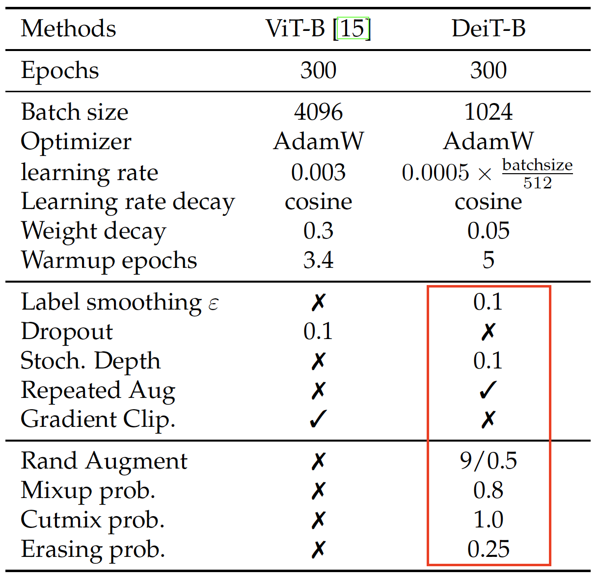

Paper: [Training data-efficient image transformers&distillation through attention](https://arxiv.org/pdf/2012.12877)

>   These high performing vision transformers are pre-trained with hundreds of millions of images using a large infrastructure, thereby limiting their adoption.
>
>   we introduce a teacher-student strategy to transformers.

## 요약

DeIT는 "Training data-efficient image transformers&distillation through attention"논문을 통해 발표된 모델이다. 기존의 ViT의 한계점은 명확했다.

1.   “do not generalize well when trained on insufficient amounts of data” 
2.   광범위한 컴퓨팅 자원 필요

이 논문에서는 ViT의 한계를 극복한 Data-efficient image Transformers(DeiT)를 선보인다. 

>   In this paper, we train a vision transformer on a signle 8-GPU node in two to three days that is competitive with convnets having a similar number of parameters and efficiency.

**Figure 1. ImageNet1k로 학습한 모델들의 이미지 처리량과 성능 결과를 확인할 수 있는 그림이다**

1.   처리량(throughput)은 *V100 GPU* 을 사용했을 때 초당 이미지 처리량이다.
2.   DeiT의 처리량은 ViT-B와 동일하지만, 데이터가 풍부하지 않은 상황에서 더 잘 훈련되었다.
3.   *⚗* : 해당 기호는 transformer-specific distillation으로 학습한 모델을 의미한다. 

>   We address another question: how to distill these models?
>
>   We introduce a token-based strategy, specific to transformers and denoted by DeiT**⚗**, and show that it advantageously replaces the usual distillation.

#### 

논문이 기여한 점은 다음과 같다.

1.   **DeiT는 추가적인 데이터 없이도 ImageNet에서 sota 모델들과 비교했을 때 경쟁력 있다.** DeiT-S와 DeiT-Ti는 ResNet-50과 ResNet-18을 대신해서 사용할 수 있다.
2.   **새로운 distillation token에 기반한 distillation 절차를 소개한다.** Distillation token은 class token과 동일한 역할이지만, teacher 모델이 예측한 레이블을 모방하는 데 목적을 둔다. 두 토큰(Class token과 ditillation token)은 트랜스포머 내부에서 어텐션을 통해 상호작용한다. 이러한 트랜스포머에 특화된 distillation 방식은 일반적인 방식에 비해 더 우수한 성능을 보여준다.
3.   저자들의 distillation 전략은 트랜스포머가 또다른 트랜스포머보다 convnet에서 파인튜닝 하였을 때 더 좋은 성능을 보여준다.
4.   ImageNet에서 사전 학습한 DeiT는 다운스트림 과제에 전이 학습했을 때 경쟁력 있다. 

## Related work

이미지 분류 문제는 컴퓨터 비전 분야에 핵심이다. 2012년에 발표된 AlexNet부터 시작해서 convnet은 표준 방식이었고, vanilla 트랜스포머의 등장으로 컴퓨터 비전 분야에서 convnet과 트랜스포머를 결합하려는 다양한 시도들이 진행됐다. 그럼에도 ViT 등장 전까지 convnet이 여전히 필요했고, ViT가 convnet 없이도 sota와 견줄만한 성능을 보일 수 있던 이유는 JFT-300M과 같은 대규모 데이터셋으로 사전 학습을 했기 때문이다. 하지만 논문의 DeiT 는 이러한 대규모 데이터셋 없이 ImageNet1K만으로도 강력한 성능을 보여준다.

konwledge distillation은 *student* 모델이 강력한 *teacher* 모델에서 나오는 "soft" label을 활용하는 방식이다. Soft label 이란 teacher의 softmax 함수의 결과 벡터이다. 이러한 방식이 student모델의 성능을 향상시키는데, teacher모델을 작은 모델로 압축시키는 느낌. 라벨 스무딩이랑 유사한 느낌

교사 모델의 지도(supervision)는 **데이터 증강(data augmentation)**의 영향을 반영한다. 하지만 증강 과정은 때때로 **실제 레이블과 이미지 간의 불일치(misalignment)**를 초래할 수 있다.

예를 들어, “고양이(cat)“라는 레이블이 붙은 이미지가 **넓은 풍경 안에 구석에 있는 작은 고양이**를 포함하고 있다고 하자. 데이터 증강으로 인해 **이미지 크롭 영역에서 고양이가 잘려 나가면**, 그 이미지의 의미는 **암묵적으로 다른 클래스로 바뀌는 셈**이다.

**지식 증류(Knowledge Distillation, KD)**는 이러한 상황에서도, 교사 모델이 **하드하게 내재한 inductive bias**를 **소프트한 방식으로 학생 모델에 전달**할 수 있다. 예를 들어, **합성곱(convolution)**에 내재된 inductive bias를, **트랜스포머 학생 모델에 유도**하고 싶을 때, **합성곱 기반 교사 모델**을 사용할 수 있다.

본 논문에서는 **ConvNet 또는 트랜스포머 교사 모델**로부터 **트랜스포머 학생 모델**로 **지식을 증류하는 방법**을 탐구하고, **트랜스포머에 특화된 새로운 증류 절차(distillation procedure)**를 제안하며, 그 방식이 기존보다 **우수한 성능을 보임을 실험적으로 입증**한다.

## Knowledge Distillation

>   we assume we have access to a strong image classifer as a teachre model. It could be a convnet, or a mixture of classifiers.

**Knowledge Distillation(KD)**은 **"Distilling the Knowledge in a Neural Netowork"** 논문에서 등장한 개념이다.  KD의 목적은 큰 네트워크(Teacher)의 지식을 작은 네트워크(Student)에게 전달하는 것이다. 이러한 개념이 등장한 데는 딥러닝에서 성능이 좋은 것만이 좋은 모델이 되는 방향이 아니기 때문이다. 좋은 모델은 성능 뿐만 아니라 computing 자원도 고려해야 하기에 사용 목적에 맞게 설계되어야 한다.

>   let us consider image with a "cat" label that represents a large landscape and a small cat in a corner. If the cat is no longer on the crop of the data augmentation it implictly changes the label of the image.

Teacher 모델의 지도는 데이터 증강의 영향을 반영햔다. 하지만 증강 과정은 때때로 실제 라벨과 이미지 간의 불일치를 초래할 수 있다. 라벨이 고양이인 이미지에서 고양이보다 배경의 비중이 높을 때, crop을 했을 때 고양이가 잘려나간다면 그 이미지의 라벨은 더 이상 고양이가 아니게 된다.

### Distillation

**Soft distillation**은 teacher와 student의 softmax 값 간의 Kullback-Leibler divergence를 최소화한다. 아래 수식에서 $Z_s$와 $Z_t$는 각각 student와 teacher의 logit이고, $\lambda$는  $KL$과 $\mathcal{L}_{CE}$들의 균형을 위한 계수, $\psi$는 softmax 함수이다.
$$
\mathcal{L}_{\mathbf{global}}=(1-\lambda)\mathcal{L}_\mathbf{CE}(\psi(Z_s),y)+\lambda\tau^2KL(\psi(Z_s/\tau),\psi(Z_t/\tau))
$$

**Hard-label distillation**은 아래와 같다.

$$
\mathcal{L}_{\mathbf{global}}^{\mathbf{hardDistill}}={1\over2}\mathcal{L}_{\mathbf{CE}}(\psi(Z_s),y)+{1\over2}\mathcal{L}_\mathbf{CE}(\psi(Z_t),y_t)
$$

### Distillation Token

논문에서는 distillation 토큰을 initial embedding에 추가하였다. 해당 토큰을 추가한 임베딩(distillation embedding)은 일반적인 distillation 처럼 teacher 모델의 출력을 통해 학습할 수 있게 하며, class 토큰의 보완적인 역할을 수행한다.

**Figure 2. Distillation procedure with distillation token**

1.   Distillation 토큰은 self-attention 계층에서 class와 patch 토큰들과 상호작용한다.
2.   Distillation 토큰은 Class 토큰과 같은 역할이지만, teacher로부터 예측된 (hard) label이다.
3.   Class 토큰과 마찬가지로 distillation 토큰도 역전파 과정에서 학습된다.

학습된 class 토큰과 distillation 토큰은 서로 다른 벡터로 수렴하는 것이 관찰되었다. 두 토큰 간의 평균 코사인 유사도는 0.06으로 매우 낮았지만, 트랜스포머의 각 계층에서 두 임베딩이 반복적으로 계산되며, 계층이 깊어질수록 이 두 벡트는 점점 유사해져 마지막 계층에서는 0.93의 높은 유사도를 보였다. 이는 **두 토큰이 비슷하지만 정확히 동일하지 않은 목표를 생성하는 데 목적이 있으므로** 예상 가능한 현상이다.

>This is expected since as they aim at producing targets that are similar but not identical.

이러한 ditillation 토큰이 모델에 어느 정도 기여하는가를 확인하기 위해 동일한 타깃 label이 연결된 추가 class 토큰을 단순히 추가하는 방식과 비교 실험이 진행됐다. teacher의 pseudo-label을 사용하지 않고, 두 개의 class 토큰을 갖는 트랜스포머는 학습이 진행됨에 따라 거의 동일한 벡터로 수렴했으며, 최종 출력 임베딩 역시 거의 동일한 값을 갖었다. 

이러한 추가 class 토큰은 분류 성능 향상에 아무런 기여를 하지 못했지만, distillation 토큰을 사용함에 있어 vanilla distillation 방식과 비교했을 때와도 뚜렷한 성능 향상을 얻을 수 있다.

## Experiment

>We first discuss our distillation strategy. Then we comparatively analyze the efficiency and accuracy of convnets and vision transformers.

### Transformer Model

실험에 사용된 모델들의 주요 구성은 Table 1을 참고하면 된다.

**Table 1. Variants of DeiT architecture.**

1.   DeiT-B는 ViT-B와 같은 구조이다.
2.   Deit-S와 Deit-Ti는 head dimension은 갖게 하되 수는 다르게 하여 만들어진 작은 모델들이다.

### Distillation

>The distilled model outperforms its teacher in terms of the trade-off between accuracy and throughput

Distilled 모델이 teacher 모델의 성능을 넘어섰다. 또한 저자들의 모델은 JFT-300M에서 사전 학습한 ViT-B 모델이 84.15%인 반면에 ImageNet1k에서의 top1 acc가 85.2%로 더 높은 성능을 보였다. 

#### Convnet teacher.

>We have observed that using a convnet teacher gives better performance than using a transformer.

**Table 2. ImageNet performance.**

1.   Deit-B *⚗* &uarr;384 는 더 높은 해상도에서 파인 튜닝했을 때를 보여주는 표기이다.

**DeiT는 teacher 모델을 convnet으로 했을 때가 트랜스포머로 했을 때보다 성능이 좋다.** Convnet이 더 좋은 모델인 이유에는 distillation을 통해서  inductive bias가 어느 정도 전달되기 때문이다. 이에 대한 설명은 **"Transferring inductive biases through knowledge distillation."** 논문을 참고할 필요가 있다. 저자들의 실험은 **teacher 모델로 RegNetY-16GF를 고정으로 사용**하였다. 

#### Comparision of distillation methods.

>   The distillation token has an undeniable advantage for the initial training.

**Table 3. Distillation experiments on Imagenet with DeiT** - 300epochs

1.   Hard distillation 방법이 soft distillation 방법보다 더 좋은 성능을 보인다. 이는 class 토큰만을 사용했을 때도 그렇다.
2.   분류기에 class 토큰과 distillation 토큰이 있을 때가, 개별적으로 쓰였을 때보다 더 좋은 성능을 보인다. 이는 저자들의 distillation 전략이 성능 향상에 도움이 되는 것을 보여준다.
3.   Distillation 토큰이 class 토큰보다 약간 더 좋은 성능을 주는데, 이는 convnet 모델의 예측과 더 상관관계를 맺는다. 

#### Agreement with the teacher&inductive bias?

>As discussed above, the architecture of the teacher has an important impact. Does it inherit existing inductive bias that would be facilitate the training? While we believe it difficult to formally answer this question.

**Table 4. Disagreement analysis**

>   We can compare how our distilled models and classification heads are correlated to these teachers.

저자들은 서로 다른 분류기 쌍 간에 서로 다르게 분류된 샘플의 비율을 측정했다. 이는 다양한 분류 모델이 얼마나 다른 결정을 내리는지 측정하는 것으로, 각 모델의 의사 결정 차이를 분석하는 데 사용된다. 

1.   DeiT⚗ 모델들(0.112)은 처음부터 학습된 트랜스포머 모델(0.133)보다 convnet 모델과 더 높은 상관관계를 보인다. 즉, **distillation을 통해 트랜스포머가 합성곱 기반 모델의 inductive bias를 효과적으로 흡수했다**는 증거로 볼 수 있다. 
2.   Distillation 임베딩은 convnet모델과 더 유사성을 보이고, 반대로 class 임베딩은 distillation 없이 학습된 DeiT 모델과 더 유사성을 보인다. 두 임베딩을 모두 사용한 모델은 이들의 중간값을 가졌다.

#### Number of epochs.

>   Increasing the number of epochs significantly improves the performance of training with distillation.

1.   300 에폭에서 DeiT-B⚗가 Deit-B보다 높은 정확도를 보였다.
2.   **훈련이 지속될 수록 성능이 포화되는 것을 볼 수 있지만, distillation 모델들은 더 많은 학습이 가능했다.**

### Efficiency vs accuracy

**Figure 1. ImageNet1k로 학습한 모델들의 이미지 처리량과 성능 결과를 확인할 수 있는 그림이다**

ImageNet1k로만 학습하였을 때, DeiT 모델들은 여전히 EifficentNet 모델들보다 부족한 면을 보였다. 하지만 ViT와의 차이를 생각하면, 트랜스포머를 사용하여 Convnet과의 격차를 많이 좁히는 결과를 보여준다. 그리고 Distillation을 적용한 DeiT⚗ 모델들이 결국에는 EfficientNet을 능가하였다. 이전에 ViT논문에서 384x384 해상도로 JFT-300M을 사용해서 사전 학습한 ViT-B모델의 성능이 84.15%를 달성했었다. 그런데 저자들의 DeiT-B⚗ 모델은 85.2%의 성능을 빠른 학습으로 달성했다.

**Table 5. Throughput on and accuracy**

1.   DeiT-B⚗와 DeiT-B⚗&uarr;384 모델이 정확도와 이미지 처리량간의 상충관계에서 sota 모델들을 능가했다. Throughput은 16GB V100GPU에서 초당 이미지 처리량을 측정한 값이다.
2.   &star; : RegNet 모델들이 저자들의 방식과 유사하게 최적화되었고, 이는 성능을 끌어올렸다. 이 모델들이 ditillation 의 teacher 모델로 다뤄졌다.

### Transfer learning

>   Although Deit perform very well on ImageNet it is important to evaluate them on other datasets with transfer learning in order to measure the power of generalization of DeiT.

DeiT의 일반화 성능을 확인하기 위해서 여러 데이터셋에 대한 전이학습이 필요하다.

#### Comparison vs training from scratch.

DeiT 모델을, CIFAR-10과 같이 작은 데이터셋에 대해 처음(scratch)부터 학습 시켰을 때와 사전 학습 했을 때의 성능을 비교했다. 이를 위해 이전과 같은 data-augmentation 조건을 만들어주기 위해서 아래와 같이 설정했다.

1.   더 많은 epoch로 훈련을 했다.
2.   CIFAR-10 이미지를 32x32 &rarr; 224x224 해상도로 조정했다.

Cifar-10에서 학습한 결과는 아래와 같다.

**Table 6. Dataset**

실험에 사용된 데이터셋은 위와 같다.

**Table 7. Transfer learning**

Deit-B⚗ 모델의 사전 학습 성능은 99.1%로 처음 부터 학습했을 때의 결과 98.5%보다 높은 정확도를 보인다. 이는 이미지의 다양성이 전이 학습을 통해서 얻어지는 것이기 때문이다. 그럼에도 cifar-10만으로도 트랜스포머를 학습할 수 있었다.

## Training details & ablation

>Transformes are sensitive to the setting of optimization hyper-parameters.

저자들은 실험에 사용한 모델의 hyper-parameters와 다양한 data-agumentation, regularization에 대한 ablation study를 진행했다.

### Initialization and hyper-parameters.

**Table 9. Hyper-parameters**

트랜스포머는 hyper-parameter초기화에 아주 민감하다. 이전 ViT의 값으로는 수렴이 안되는 경우가 있어서 저자들만의 방식으로 설정했다. 다른 하이퍼 파라미터를 적용하지 않은 모든 실험에서는 Table 9의 값을 사용했다. 추가적으로 usual(soft) distillation 에서 $\tau$ 는 3.0 $\lambda$ 는 0.1을 사용했다.

**Table 8. Ablation study**

### Data Augmentation.

convolution과 비교했을때 트랜스포머는 많은 데이터를 필요로 한다. 그래서, **DeiT는 확장성있는 데이터 증강에 많은 의존을 한다.** 데이터 증강에는 Rand_Augment, AutoAugment, Random Erasing 등이 있다. 저자들이 ablation 이후 강력한 데이터 증강이 트랜스포머에 필요하다는 것을 확인했다.

1.    Rand_Augment을 AutoAugment 대신 사용하였다.
2.   대부분의 데이터 증강 기법들은 유용했다.
3.   Dropout 을 제외시켰다.

### Regularization & Optimizers.

cross-validate를 할때 서로 다른 3개의 learning rate($5.10^{-4},3.10^{-4},5.10^{-5}$)와 서로 다른 3개의 weight decay(0.03, 0.04, 0.05)값을 사용해, 모델에 적합한 값을 찾았다고 한다.

1.   Learning rate을 배치 크기에 따라 조정하였다.

     $\mathbf{lr}_\mathbf{scaled}={\mathbf{lr}\over512}\times{batchsize}$ : 배치 크기의 기본 값으로 256 대신 512를 사용하였다.

2.    AdamW의 learning rate를 ViT 논문과 같게 사용하였을 때 최고의 결과를 얻었다. 하지만 보다 작은 weight decay 값을 사용하였다. 이는 weight decay 가 저자들의 설정에서 수렴을 방해하였기 때문이다.
3.   stochastic depth도 사용했다. 이는 트랜스포머의 수렴을 용이하게 한다.
4.   Mixup, Cutmix와 같은 정규화 기법이 모델의 성능을 높힌다. 또한 사용한 repeated data agumentation은 성능 향상에 영향이 컸다.

### Fine-tunning at different resolution.

**Table 10. Performance of DeiT trained at size 224x224 for varying finetuning sizes**

DeiT는 FixEfficientNet과 같은 schedule, regularization, optimization을 파인튜닝에서 사용한다. 추가적으로 데이터 증강이 있다. 위치 임베딩에 대한 위치 보간을 한다. 이에 대한 내용은 추후에 다루도록 하겠다.

ViT 논문과 유사하게 DeiT 모델들을 224x224 해상도에서 학습 후 다양한 해상도에서 파인 튜닝하였다. 높은 해상도로 파인 튜닝 시 성능이 더 좋아짐을 확인 할 수 있었다.

## Conclusion

>   In this paper, we have introduced DeiT, which are image transformers that do not require very large amount of data to be trained, thanks to improved training and in particular a novel distillation procedure.

저자들은 distillation 토큰을 제외한 어떠한 새로운 전략도 내세우지 않고, 오로지 기존의 방법론들로만 DeiT에 적용시켰다. 실험 결과들이 보여주듯, 기존의 ViT의 한계점을 해결하여 convnet과 트랜스포머를 동등한 관계로 발전시켰다.

1.   DeiT는 추가적인 데이터 없이도 ImageNet에서 sota 모델들과 비교했을 때 경쟁력 있다.
2.   새로운 distillation token에 기반한 distillation 방법을 소개하였다.
