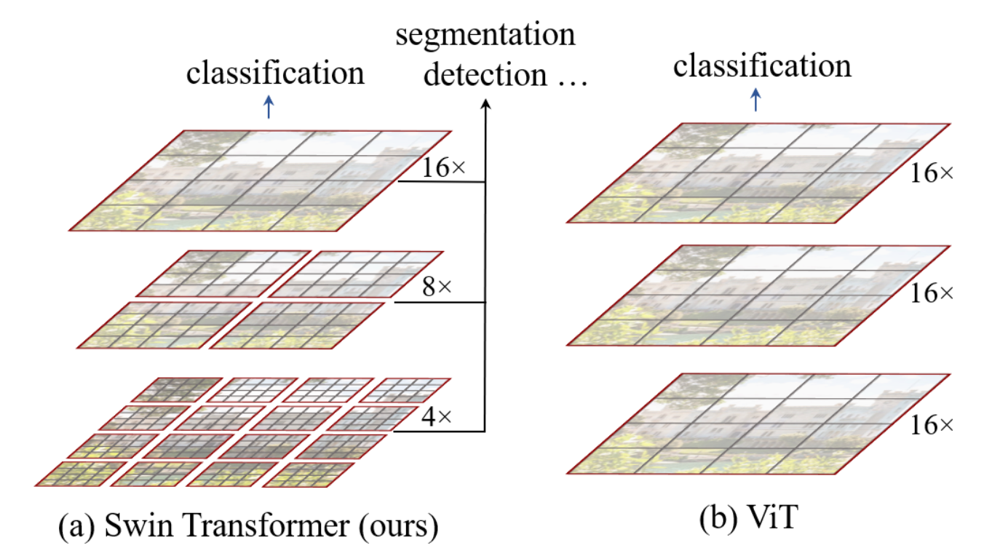
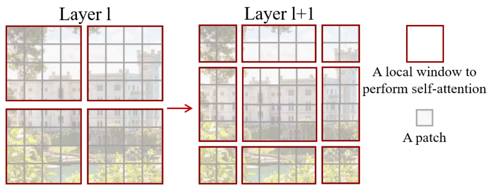
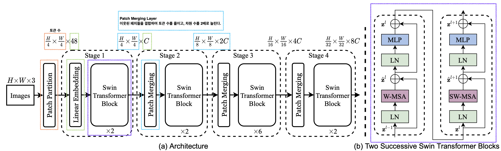
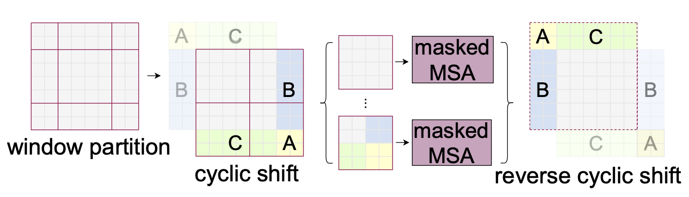

**Paper**: [Swin Transformer: Hierarchical Vision Transformer using Shifted Windows](https://arxiv.org/pdf/2103.14030)

**Author: Ze Liu, Yutong Lin, Yue Cao, Han Hu, Yixuan Wei, Zheng Zhang, Stephen Lin, Baining Guo, Microsoft Research Asia**

[**Code**](https://github.com/microsoft/Swin-Transformer)

>   This paper presents a new vision Transformer, called Swin Transformer, that capably serves as a general-purpose backbone for computer vision.

## 요약

>To address these differences, we propose a hierarchical Transformer whose representation is computed with Shifted windows.

자연어 처리 분야에서 제안된 트랜스포머를 컴퓨터 비전에 적용시키는 것은 문장에 비해 이미지가 갖고 있는 높은 해상도와 같은 두 도메인의 차이로 인해 어려운 과제이다. 이러한 차이를 극복하기 위해 필자들은 Shifted Window를 사용한 hierarchical Transformer(계층적 트랜스포머)를 제안한다.

1.   이미지들은 다양한 크기를 갖고 있다. 기존 ViT의 토큰은 고정된 크기이다. 이는 이미지 처리 분야에 적합하지 않다. 
2.   이미지의 해상도는 문장에 비해 데이터의 크기가 상당히 크다. 이미지 크기에 따라 이차방정식의 형태로 계산이 이루어 지기에 트랜스포머가 이를 다루기 힘들다.

이러한 문제를 해결하기 위해서 저자들은 트랜스포머를 범용적으로 사용할 수 있는 Swin Transformer 구조를 제안한다. **Figure 1.**에서 볼 수 있듯이 모델은 계층적 특징 맵으로 설계되었고, 이미지 크기에 따른 선형 계산 복잡도를 가졌다. 작은 크기의 패치들을 계층이 깊어질수록 이웃 패치들과 결합하여 출력을 만든다. 이러한 계층적인 구조는 Swin Transformer가 FPN 또는 U-Net처럼 세밀한 예측에 계층적인 특징맵의 이점을 손쉽게 사용할 수 있다. 선형 계산 복잡도는 겹치지 않는 지역적인 셀프 어텐션으로부터 계산되는데, 각 윈도우의 패치 수는 고정되어 있기에 이미지 크기에 비례한다. 이러한 이점은 Swin Transformer가 기존 ViT보다 여러 비전 과제에서 범용적인 모델에 적합하다는 것을 보여준다. 

**Figure 1.** (a) 제안된 Swin Transformer는 이미지 패치들을 결합하는 계층적 특징맵을 설계한다. (b) 기존 ViT는 단일 해상도에서 특징맵을 설계한다.



>   *Shifted window* approach has much lower latency than the *sliding window* method, yet is similar in modeling power.

Swin Transformer에는 연속된 셀프 어텐션 계층에서 윈도우가 이동하는 "shift" 개념이 있다. 이를 Swin Transformer 블록에서 볼 수 있다. 블록에는 2개의 연속적인 셀프 어텐션 계층이 있고, 선행 계층은 기존 ViT계층과 유사하지만, 뒤따르는 계층은 **Figure 2.**처럼 윈도우의 이동이 있다. 이러한 방법들은 모든 query 패치들이 같은 key를 공유하기에 하드웨어의 메모리 접근에 용이한 장점이 있다. 모델의 성능 향상을 **Table 4.**에서 확인할 수 있다. 이전의 sliding window 기반의 self-attention을 사용하는 것은 key와 query 의 크기가 다르기 때문에 하드웨어에서 낮은 지연시간을 가지는 데 어려움이 있었다. 반면에 shift를 사용하는 방식은 비슷한 성능임에도 메모리에 빠른 접근이 가능하다.

**Figure 2.** Swin Transformer 블록에서 사용되는 "shift" 개념이 적용된 윈도우.



이러한 저자들의 Swin Transformer는 분류, 탐지, 세분화 작업에서 ViT/DeiT와 ResNe(X)t 모델들을 비슷한 지연시간을 가지고 성능 면에서 상당히 앞선 결과를 달성하였다.

## Method

### Overall Architecture

Swin Transformer Tiny version 을 기준으로 모델을 코드와 함께 설명하겠다.

**Figure 3. **Tiny version. (a) 전체 구조, (b) 두 개의 연속된 Swin Transformer blocks.



**Swin Transformer Code**

```python
class SwinTransformer(nn.Module):
    r""" Swin Transformer
        A PyTorch impl of : `Swin Transformer: Hierarchical Vision Transformer using Shifted Windows`  -
          https://arxiv.org/pdf/2103.14030

    Args:
        img_size (int | tuple(int)): Input image size. Default 224
        patch_size (int | tuple(int)): Patch size. Default: 4
        in_chans (int): Number of input image channels. Default: 3
        num_classes (int): Number of classes for classification head. Default: 1000
        embed_dim (int): Patch embedding dimension. Default: 96
        depths (tuple(int)): Depth of each Swin Transformer layer.
        num_heads (tuple(int)): Number of attention heads in different layers.
        window_size (int): Window size. Default: 7
        mlp_ratio (float): Ratio of mlp hidden dim to embedding dim. Default: 4
        qkv_bias (bool): If True, add a learnable bias to query, key, value. Default: True
        qk_scale (float): Override default qk scale of head_dim ** -0.5 if set. Default: None
        drop_rate (float): Dropout rate. Default: 0
        attn_drop_rate (float): Attention dropout rate. Default: 0
        drop_path_rate (float): Stochastic depth rate. Default: 0.1
        norm_layer (nn.Module): Normalization layer. Default: nn.LayerNorm.
        ape (bool): If True, add absolute position embedding to the patch embedding. Default: False
        patch_norm (bool): If True, add normalization after patch embedding. Default: True
        use_checkpoint (bool): Whether to use checkpointing to save memory. Default: False
        fused_window_process (bool, optional): If True, use one kernel to fused window shift & window partition for acceleration, similar for the reversed part. Default: False
    """

    def __init__(self, img_size=224, patch_size=4, in_chans=3, num_classes=1000,
                 embed_dim=96, depths=[2, 2, 6, 2], num_heads=[3, 6, 12, 24],
                 window_size=7, mlp_ratio=4., qkv_bias=True, qk_scale=None,
                 drop_rate=0., attn_drop_rate=0., drop_path_rate=0.1,
                 norm_layer=nn.LayerNorm, ape=False, patch_norm=True,
                 use_checkpoint=False, fused_window_process=False, **kwargs):
        super().__init__()

        self.num_classes = num_classes # 1000
        self.num_layers = len(depths) # 4
        self.embed_dim = embed_dim # 96
        self.ape = ape # False
        self.patch_norm = patch_norm # True
        self.num_features = int(embed_dim * 2 ** (self.num_layers - 1)) # 768
        self.mlp_ratio = mlp_ratio # 4.

        # split image into non-overlapping patches
        self.patch_embed = PatchEmbed(
            img_size=img_size, patch_size=patch_size, in_chans=in_chans, embed_dim=embed_dim,
            norm_layer=norm_layer if self.patch_norm else None)
        num_patches = self.patch_embed.num_patches
        patches_resolution = self.patch_embed.patches_resolution
        self.patches_resolution = patches_resolution

        # absolute position embedding
        if self.ape:
            self.absolute_pos_embed = nn.Parameter(torch.zeros(1, num_patches, embed_dim))
            trunc_normal_(self.absolute_pos_embed, std=.02)

        self.pos_drop = nn.Dropout(p=drop_rate)

        # stochastic depth
        dpr = [x.item() for x in torch.linspace(0, drop_path_rate, sum(depths))]  # stochastic depth decay rule

        # build layers
        self.layers = nn.ModuleList()
        for i_layer in range(self.num_layers):
            layer = BasicLayer(dim=int(embed_dim * 2 ** i_layer),
                               input_resolution=(patches_resolution[0] // (2 ** i_layer),
                                                 patches_resolution[1] // (2 ** i_layer)),
                               depth=depths[i_layer],
                               num_heads=num_heads[i_layer],
                               window_size=window_size,
                               mlp_ratio=self.mlp_ratio,
                               qkv_bias=qkv_bias, qk_scale=qk_scale,
                               drop=drop_rate, attn_drop=attn_drop_rate,
                               drop_path=dpr[sum(depths[:i_layer]):sum(depths[:i_layer + 1])],
                               norm_layer=norm_layer,
                               downsample=PatchMerging if (i_layer < self.num_layers - 1) else None,
                               use_checkpoint=use_checkpoint,
                               fused_window_process=fused_window_process)
            self.layers.append(layer)

        self.norm = norm_layer(self.num_features)
        self.avgpool = nn.AdaptiveAvgPool1d(1)
        self.head = nn.Linear(self.num_features, num_classes) if num_classes > 0 else nn.Identity()

        self.apply(self._init_weights)

    def _init_weights(self, m):
        if isinstance(m, nn.Linear):
            trunc_normal_(m.weight, std=.02)
            if isinstance(m, nn.Linear) and m.bias is not None:
                nn.init.constant_(m.bias, 0)
        elif isinstance(m, nn.LayerNorm):
            nn.init.constant_(m.bias, 0)
            nn.init.constant_(m.weight, 1.0)

    @torch.jit.ignore
    def no_weight_decay(self):
        return {'absolute_pos_embed'}

    @torch.jit.ignore
    def no_weight_decay_keywords(self):
        return {'relative_position_bias_table'}

    def forward_features(self, x):
        x = self.patch_embed(x) # [1, 3136, 96]
        if self.ape:
            x = x + self.absolute_pos_embed
        x = self.pos_drop(x)

        for layer in self.layers:
            x = layer(x)

        x = self.norm(x)  # B L C
        x = self.avgpool(x.transpose(1, 2))  # B C 1
        x = torch.flatten(x, 1)
        return x

    def forward(self, x):
        x = self.forward_features(x)
        x = self.head(x) # 768->1000
        return x

    def flops(self):
        flops = 0
        flops += self.patch_embed.flops()
        for i, layer in enumerate(self.layers):
            flops += layer.flops()
        flops += self.num_features * self.patches_resolution[0] * self.patches_resolution[1] // (2 ** self.num_layers)
        flops += self.num_features * self.num_classes
        return flops
```

### **Patch Partition**.

입력으로 들어오는 RGB 이미지(224x224)는 4x4 크기의 패치들로 분리된다. 이때 입력 데이터의 배치 크기는 1이라고 가정한다. 이미지는 56x56=3,136개 패치로 분리된다. 임베딩 차원은 96으로 설정되었다.

```python
self.proj = nn.Conv2d(in_chans, embed_dim, kernel_size=patch_size, stride=patch_size)
x = self.proj(x).flatten(2).transpose(1, 2)
```

위 코드는 패치 임베딩에 핵심 부분이다. 전체적인 과정은 [B,C,H,W]의 입력 데이터가 들어오면 이를 기존의 RGB 채널을 임베딩 채널로 투영함과 동시에 픽셀 단위에 데이터를 패치 단위로 묶어준다. 즉, 데이터는 [B,embed_dim,Ph,Pw]의 데이터가 된다. 최종적으로는 입력 데이터[배치 크기, 채널 수, 세로, 가로]가 [배치 크기, 패치 개수, 임베딩 채널 수]로 변환됐다.


**Code**

```python
class PatchEmbed(nn.Module):
    r""" Image to Patch Embedding

    Args:
        img_size (int): Image size.  Default: 224.
        patch_size (int): Patch token size. Default: 4.
        in_chans (int): Number of input image channels. Default: 3.
        embed_dim (int): Number of linear projection output channels. Default: 96.
        norm_layer (nn.Module, optional): Normalization layer. Default: None
    """

    def __init__(self, img_size=224, patch_size=4, in_chans=3, embed_dim=96, norm_layer=None):
        super().__init__()
        img_size = to_2tuple(img_size) # 224->tuple(224, 224)
        patch_size = to_2tuple(patch_size) # 4->tuple(4, 4)
        patches_resolution = [img_size[0] // patch_size[0], img_size[1] // patch_size[1]] # 패치 해상도는 [56, 56]
        self.img_size = img_size
        self.patch_size = patch_size
        self.patches_resolution = patches_resolution
        self.num_patches = patches_resolution[0] * patches_resolution[1] # 56x56=3136

        self.in_chans = in_chans # RGB=3
        self.embed_dim = embed_dim # 96

        self.proj = nn.Conv2d(in_chans, embed_dim, kernel_size=patch_size, stride=patch_size)
        if norm_layer is not None:
            self.norm = norm_layer(embed_dim)
        else:
            self.norm = None

    def forward(self, x):
        B, C, H, W = x.shape
        # FIXME look at relaxing size constraints
        assert H == self.img_size[0] and W == self.img_size[1], \
            f"Input image size ({H}*{W}) doesn't match model ({self.img_size[0]}*{self.img_size[1]})."
        x = self.proj(x).flatten(2).transpose(1, 2)  # x=[B,C,H,W]->proj=[B,embed_dim,Ph,Pw]->flatten=[B,embed_dim,Ph*Pw]->transpose=[B,Ph*Pw,embed_dim]
        if self.norm is not None:
            x = self.norm(x)
        return x # [B,Ph*Pw,embed_dim] e.g. [1, 3136, 96]
```

### **Linear Embedding**

각 패치의 차원은 4x4x3=48이 된다. 다만, 이는 선형 임베딩 과정을 통해 96으로 늘어난다.

### **PatchMerging**

네트워크의 계층이 깊어질수록 패치 수는 줄어들고, 차원 수는 2배로 늘어난다. 이는 PatchMerging 계층에서 2x2 크기의 영역에서 인접한 패치들끼리 concat 시키므로, 기존의 이미지에서 추출한 패치 56개가 28개로 줄어들기 때문이다. 대신, 패치 4개가 하나의 패치로 concat 되었으므로, 하나의 패치에서 갖고 있던 차원 수는 4배로 늘어난다. 선형 변환을 통해서 4배로 늘어난 차원을 최종적으로 2배로 줄였다.

BasicLayer를 선언하는 코드에서 `downsample=PatchMerging if (i_layer < self.num_layers - 1) else None`를 확인할 수 있는데, 이는 Stage 2, 3, 4 에서 이전 Stage가 끝나게 되면 시행된다. Stage 1 이후의 PatchMerging 결과 기존의 56x56 크기의 패치들은 28x28 크기의 패치들로 병합된다. 또한 임베딩 차원은 96에서 192로 늘어난다. 다만 인접한 패치들을 결합하면 차원이 4배로 증가하는데, 이를 절반으로 줄여주는 선형 변환 과정을 한번 거치게 된다.


결과적으로 입력 데이터[B,L,C]는 [B,L//4,2C]의 형태로 변환되어 출력된다.

**Code**

```python
class PatchMerging(nn.Module):
    r""" Patch Merging Layer.

    Args:
        input_resolution (tuple[int]): Resolution of input feature.
        dim (int): Number of input channels.
        norm_layer (nn.Module, optional): Normalization layer.  Default: nn.LayerNorm
    """

    def __init__(self, input_resolution, dim, norm_layer=nn.LayerNorm):
        super().__init__()
        self.input_resolution = input_resolution
        self.dim = dim
        self.reduction = nn.Linear(4 * dim, 2 * dim, bias=False)
        self.norm = norm_layer(4 * dim)

    def forward(self, x):
        """
        x: B, H*W, C
        """
        H, W = self.input_resolution
        B, L, C = x.shape
        assert L == H * W, "input feature has wrong size"
        assert H % 2 == 0 and W % 2 == 0, f"x size ({H}*{W}) are not even."

        x = x.view(B, H, W, C) # [1, 3136, 96] -> [1, 56, 56, 96]

        x0 = x[:, 0::2, 0::2, :]  # B H/2 W/2 C = [1, 28, 28, 96]
        x1 = x[:, 1::2, 0::2, :]  # B H/2 W/2 C = [1, 28, 28, 96]
        x2 = x[:, 0::2, 1::2, :]  # B H/2 W/2 C = [1, 28, 28, 96]
        x3 = x[:, 1::2, 1::2, :]  # B H/2 W/2 C = [1, 28, 28, 96]
        x = torch.cat([x0, x1, x2, x3], -1)  # B H/2 W/2 4*C = [1, 28, 28, 384]
        x = x.view(B, -1, 4 * C)  # B H/2*W/2 4*C = [1, 784, 384]

        x = self.norm(x)
        x = self.reduction(x) # [1, 784, 384] -> [1, 784, 192]

        return x
```

### Swin Transformer block

ViT의 MSA기반 모듈을 shift 윈도우 기반의 모듈로 대체하여 Swin Transformer 블록이 설계되었다. 블록의 구성은 윈도우 기반의 MSA 모듈과 2개의 GELU를 이용한 MLP 계층이 있다. LayerNorm 계층이 각각의 모듈과 계층 앞에 적용되었고, residual connection이 연결되어 있다.

**Code**

```python
class SwinTransformerBlock(nn.Module):
    r""" Swin Transformer Block.

    Args:
        dim (int): Number of input channels.
        input_resolution (tuple[int]): Input resulotion.
        num_heads (int): Number of attention heads.
        window_size (int): Window size.
        shift_size (int): Shift size for SW-MSA.
        mlp_ratio (float): Ratio of mlp hidden dim to embedding dim.
        qkv_bias (bool, optional): If True, add a learnable bias to query, key, value. Default: True
        qk_scale (float | None, optional): Override default qk scale of head_dim ** -0.5 if set.
        drop (float, optional): Dropout rate. Default: 0.0
        attn_drop (float, optional): Attention dropout rate. Default: 0.0
        drop_path (float, optional): Stochastic depth rate. Default: 0.0
        act_layer (nn.Module, optional): Activation layer. Default: nn.GELU
        norm_layer (nn.Module, optional): Normalization layer.  Default: nn.LayerNorm
        fused_window_process (bool, optional): If True, use one kernel to fused window shift & window partition for acceleration, similar for the reversed part. Default: False
    """

    def __init__(self, dim, input_resolution, num_heads, window_size=7, shift_size=0,
                 mlp_ratio=4., qkv_bias=True, qk_scale=None, drop=0., attn_drop=0., drop_path=0.,
                 act_layer=nn.GELU, norm_layer=nn.LayerNorm,
                 fused_window_process=False):
        super().__init__()
        self.dim = dim
        self.input_resolution = input_resolution
        self.num_heads = num_heads
        self.window_size = window_size # 7
        self.shift_size = shift_size # 0
        self.mlp_ratio = mlp_ratio
        if min(self.input_resolution) <= self.window_size:
            # if window size is larger than input resolution, we don't partition windows
            self.shift_size = 0
            self.window_size = min(self.input_resolution)
        assert 0 <= self.shift_size < self.window_size, "shift_size must in 0-window_size"

        self.norm1 = norm_layer(dim)
        self.attn = WindowAttention(
            dim, window_size=to_2tuple(self.window_size), num_heads=num_heads,
            qkv_bias=qkv_bias, qk_scale=qk_scale, attn_drop=attn_drop, proj_drop=drop)

        self.drop_path = DropPath(drop_path) if drop_path > 0. else nn.Identity()
        self.norm2 = norm_layer(dim)
        mlp_hidden_dim = int(dim * mlp_ratio)
        self.mlp = Mlp(in_features=dim, hidden_features=mlp_hidden_dim, act_layer=act_layer, drop=drop)

        if self.shift_size > 0:
            # calculate attention mask for SW-MSA
            H, W = self.input_resolution
            img_mask = torch.zeros((1, H, W, 1))  # 1 H W 1 -> [1,56,56,1]
            h_slices = (slice(0, -self.window_size),
                        slice(-self.window_size, -self.shift_size),
                        slice(-self.shift_size, None)) # (slice(0,-7),slice(-7,-3),slice(-3,None))
            w_slices = (slice(0, -self.window_size),
                        slice(-self.window_size, -self.shift_size),
                        slice(-self.shift_size, None)) # (slice(0,-7),slice(-7,-3),slice(-3,None))
            cnt = 0
            for h in h_slices:
                for w in w_slices:
                    img_mask[:, h, w, :] = cnt
                    cnt += 1

            mask_windows = window_partition(img_mask, self.window_size)  # nW, window_size, window_size, 1 [64,7,7,1]
            mask_windows = mask_windows.view(-1, self.window_size * self.window_size) # [64,49]
            attn_mask = mask_windows.unsqueeze(1) - mask_windows.unsqueeze(2) # [64,1,49]-[64,49,1]=[64,49,49]
            attn_mask = attn_mask.masked_fill(attn_mask != 0, float(-100.0)).masked_fill(attn_mask == 0, float(0.0)) #[64,49,49]
        else:
            attn_mask = None

        self.register_buffer("attn_mask", attn_mask)
        self.fused_window_process = fused_window_process

    def forward(self, x):
        H, W = self.input_resolution # [56, 56]
        B, L, C = x.shape # [1, 3136, 96]
        assert L == H * W, "input feature has wrong size"

        shortcut = x
        x = self.norm1(x)
        x = x.view(B, H, W, C) # [1, 56, 56, 96]

        # cyclic shift
        if self.shift_size > 0: # shift_size=3
            if not self.fused_window_process:
                shifted_x = torch.roll(x, shifts=(-self.shift_size, -self.shift_size), dims=(1, 2))
                # partition windows
                x_windows = window_partition(shifted_x, self.window_size)  # nW*B, window_size, window_size, C [64, 7, 7, 96]
            else:
                x_windows = WindowProcess.apply(x, B, H, W, C, -self.shift_size, self.window_size)
        else:
            shifted_x = x
            # partition windows
            x_windows = window_partition(shifted_x, self.window_size)  # nW*B, window_size, window_size, C [64, 7, 7, 96]

        x_windows = x_windows.view(-1, self.window_size * self.window_size, C)  # nW*B, window_size*window_size, C [64, 49, 96]

        # W-MSA/SW-MSA
        attn_windows = self.attn(x_windows, mask=self.attn_mask)  # nW*B, window_size*window_size, C [64,49,96]

        # merge windows
        attn_windows = attn_windows.view(-1, self.window_size, self.window_size, C) # [64, 7, 7, 96]

        # reverse cyclic shift
        if self.shift_size > 0:
            if not self.fused_window_process:
                shifted_x = window_reverse(attn_windows, self.window_size, H, W)  # B H' W' C
                x = torch.roll(shifted_x, shifts=(self.shift_size, self.shift_size), dims=(1, 2))
            else:
                x = WindowProcessReverse.apply(attn_windows, B, H, W, C, self.shift_size, self.window_size)
        else:
            shifted_x = window_reverse(attn_windows, self.window_size, H, W)  # B H' W' C [1, 56, 56, 96]
            x = shifted_x 
        x = x.view(B, H * W, C) # [1, 3136, 96]
        x = shortcut + self.drop_path(x) # residual

        # FFN
        x = x + self.drop_path(self.mlp(self.norm2(x)))

        return x
```

#### W-MSA

기존 트랜스포머와 ViT는 global seft-attention을 사용하여 모든 토큰끼리의 관계를 계산했다. 이는 토큰 수에 비례한 제곱연산을 하게 하여 많은 비전 과제에 적합하지 않았다. 저자들의 윈도우 기반의 MSA는 MxM개의 패치들로 이루어진 겹치지 않는 윈도우에서 계산이 이뤄진다. 이 두 방식의 계산 복잡도는 hxw의 패치들로 이루어진 이미지가 있을 때, 아래 두 식과 같다.
$$
\Omega(\mathbf{MSA})=4hwC^2+2(hw)^2C
$$

$$
\Omega(\mathbf{W-MSA)})=4hwC^2+2M^2hwC
$$

기존 MSA 방식은 큰 해상도에서는 패치 크기에 따른 제곱의 연산을 해야하기에 계산에 적합하지 않지만, 윈도우 기반의 연산은 M이 상수이므로 계산에 유리하다. M은 기본적으로 7을 가진다. 이로 인해 윈도우 기반의 MSA는 기존 방식에 비해 확장성이 있다.

**Code**

```python
def window_partition(x, window_size):
    """
    Args:
        x: (B, H, W, C)
        window_size (int): window size

    Returns:
        windows: (num_windows*B, window_size, window_size, C)
    """
    B, H, W, C = x.shape # [1, 56, 56, 96]
    x = x.view(B, H // window_size, window_size, W // window_size, window_size, C) # [1, 8, 7, 8, 7, 96]
    windows = x.permute(0, 1, 3, 2, 4, 5).contiguous().view(-1, window_size, window_size, C) # [1, 8, 8, 7, 7, 96]->[64,7,7,96]
    return windows # [64, 7, 7, 96]
```

#### SW-MSA

W-MSA는 윈도우 간의 연관성이 부족하다. 이는 모델의 성능을 제한시킨다. 따라서 계산에 효율적인 W-MSA를 사용하면서 윈도우 간의 연결을 짓기 위해 윈도우의 "shift"가 적용되었다. **Figure 2.**에서 볼 수 있듯이 연속된 블록 계층에서 뒤따르는 계층은 이전 계층의 윈도우가 이동한 모습을 보인다. 

선행 Layer l이 W-MSA를 사용한 트랜스포머 블록이라면 다음 블록 Layer l+1은 SW-MSA를 사용한다. 이때 SW-MSA의 윈도우 이동은 왼쪽 위 방향으로 $[{m\over2},{m\over2}]$ 만큼 이동한다. 이때 m은 윈도우의 크기이다. 기본적으로 윈도우 크기는 7x7을 사용하므로 윈도우 간 이동은 [-3,-3]만큼 이동하게 된다. 이때 이동하면서 기존의 영역에서 잘리는 부분은 **Figure 2.**와 같이 추가적으로 붙게 된다.

```python
shifted_x = torch.roll(x, shifts=(-self.shift_size, -self.shift_size), dims=(1, 2))
```

따라서 연속된 Swin Transformer 블록에 들어가는 입력은 아래의 수식에서 순차적으로 계산된다.

$$
\mathbf{\hat{z}}^l=\mathbf{W-MSA(LN(z^{l-1}))+z^{l-1}}
$$

$$
\mathbf{{z^l}}=\mathbf{MLP(LN(\hat{z}^l))+\hat{z}^l}
$$

$$
\mathbf{\hat{z}}^{l+1}=\mathbf{SW-MSA(LN(z^{l}))+z^{l}}
$$

$$
\mathbf{{z^{l+1}}=MLP(LN(\hat{z}^{l+1}))+\hat{z}^{l+1}}
$$

**Code**

```python
if self.shift_size > 0: # shift_size=3
    if not self.fused_window_process:
        shifted_x = torch.roll(x, shifts=(-self.shift_size, -self.shift_size), dims=(1, 2))
        # partition windows
        x_windows = window_partition(shifted_x, self.window_size)  # nW*B, window_size, window_size, C [64, 7, 7, 96]
    else:
        x_windows = WindowProcess.apply(x, B, H, W, C, -self.shift_size, self.window_size)
else:
    shifted_x = x
    # partition windows
    x_windows = window_partition(shifted_x, self.window_size)  # nW*B, window_size, window_size, C [64, 7, 7, 96]
#------------------------------------------------------------
x = x + self.drop_path(self.mlp(self.norm2(x)))
```

이러한 "shift" 기반의 윈도우 분할은 이전 계층에서 겹치지 않던 이웃한 윈도우들간의 연결을 해준다.

**Window Attention Code**

```python
class WindowAttention(nn.Module):
    r""" Window based multi-head self attention (W-MSA) module with relative position bias.
    It supports both of shifted and non-shifted window.

    Args:
        dim (int): Number of input channels.
        window_size (tuple[int]): The height and width of the window.
        num_heads (int): Number of attention heads.
        qkv_bias (bool, optional):  If True, add a learnable bias to query, key, value. Default: True
        qk_scale (float | None, optional): Override default qk scale of head_dim ** -0.5 if set
        attn_drop (float, optional): Dropout ratio of attention weight. Default: 0.0
        proj_drop (float, optional): Dropout ratio of output. Default: 0.0
    """

    def __init__(self, dim, window_size, num_heads, qkv_bias=True, qk_scale=None, attn_drop=0., proj_drop=0.):

        super().__init__()
        self.dim = dim
        self.window_size = window_size  # Wh, Ww
        self.num_heads = num_heads
        head_dim = dim // num_heads # 32
        self.scale = qk_scale or head_dim ** -0.5

        # define a parameter table of relative position bias
        self.relative_position_bias_table = nn.Parameter(
            torch.zeros((2 * window_size[0] - 1) * (2 * window_size[1] - 1), num_heads))  # 2*Wh-1 * 2*Ww-1, nH

        # get pair-wise relative position index for each token inside the window
        coords_h = torch.arange(self.window_size[0])
        coords_w = torch.arange(self.window_size[1])
        coords = torch.stack(torch.meshgrid([coords_h, coords_w]))  # 2, Wh, Ww
        coords_flatten = torch.flatten(coords, 1)  # 2, Wh*Ww
        relative_coords = coords_flatten[:, :, None] - coords_flatten[:, None, :]  # 2, Wh*Ww, Wh*Ww
        relative_coords = relative_coords.permute(1, 2, 0).contiguous()  # Wh*Ww, Wh*Ww, 2
        relative_coords[:, :, 0] += self.window_size[0] - 1  # shift to start from 0
        relative_coords[:, :, 1] += self.window_size[1] - 1
        relative_coords[:, :, 0] *= 2 * self.window_size[1] - 1
        relative_position_index = relative_coords.sum(-1)  # Wh*Ww, Wh*Ww
        self.register_buffer("relative_position_index", relative_position_index)

        self.qkv = nn.Linear(dim, dim * 3, bias=qkv_bias)
        self.attn_drop = nn.Dropout(attn_drop)
        self.proj = nn.Linear(dim, dim)
        self.proj_drop = nn.Dropout(proj_drop)

        trunc_normal_(self.relative_position_bias_table, std=.02)
        self.softmax = nn.Softmax(dim=-1)

    def forward(self, x, mask=None):
        """
        Args:
            x: input features with shape of (num_windows*B, N, C)
            mask: (0/-inf) mask with shape of (num_windows, Wh*Ww, Wh*Ww) or None
        """
        B_, N, C = x.shape # 64, 49, 96
        qkv = self.qkv(x).reshape(B_, N, 3, self.num_heads, C // self.num_heads).permute(2, 0, 3, 1, 4) # [64, 49, 96]->[64,49,288]->[64,49,3,3,32]->[3,64,3,49,32]
        q, k, v = qkv[0], qkv[1], qkv[2]  # make torchscript happy (cannot use tensor as tuple) [64, 3, 49, 32]

        q = q * self.scale
        attn = (q @ k.transpose(-2, -1)) # [64,3,49,32]@[64,3,32,49]->[64, 3, 49, 49]

        relative_position_bias = self.relative_position_bias_table[self.relative_position_index.view(-1)].view(
            self.window_size[0] * self.window_size[1], self.window_size[0] * self.window_size[1], -1)  # Wh*Ww,Wh*Ww,nH
        relative_position_bias = relative_position_bias.permute(2, 0, 1).contiguous()  # nH, Wh*Ww, Wh*Ww
        attn = attn + relative_position_bias.unsqueeze(0) # 위치 임베딩 추가

        if mask is not None:
            nW = mask.shape[0] # 64
            attn = attn.view(B_ // nW, nW, self.num_heads, N, N) + mask.unsqueeze(1).unsqueeze(0) # [1,64,3,49,49]+[1,64,1,49,49]
            attn = attn.view(-1, self.num_heads, N, N) # [64,3,49,49]
            attn = self.softmax(attn)
        else:
            attn = self.softmax(attn) # softmax

        attn = self.attn_drop(attn) # dropout

        x = (attn @ v).transpose(1, 2).reshape(B_, N, C) #[64,3,49,32]->[64,49,3,32]->[64,49,96]
        x = self.proj(x) # [64,49,96]
        x = self.proj_drop(x)
        return x #[64,49,96]
```

### Efficient batch computation for shifted configuration

Shift 기반 윈도우 분할은 기존보다 많은 윈도우를 다루게 된다. 기존에 ${h\over m}\times{w\over m}$개의 윈도우는 $({h\over m}+1)\times({w\over m}+1)$개의 윈도우로 증가한다. 이중에 몇몇 윈도우는 $m\times m$보다 작은 크기를 가진다. 결국에는 기존의 2x2개의 윈도우가 3x3개의 윈도우로 늘어남에 따라 연산이 2.25배 늘어난다고 한다.


이에 **Figure 4.**와 같이 좌상단에 잘린 부분들을 우하단으로 이동시켜 윈도우 수를 그대로 가져가도록 했다. 이는 "cyclic shift"라고 불렀다. 이 상태에서는 각 윈도우에 독립적으로 수행된 self-attention이 다른 윈도우에도 적용될 수 있다. 위 그림에서 같은 색으로 칠해진 부분은 기존 2 * 2 windows에서 self-attention이 수행된 것이므로, 중복 attention 연산을 제한하기 위해 masked self-attention을 진행합니다.  

위와 같이 mask multihead self-attention을 진행하면 중복 연산은 제한하고, naive shifted window 방식과 같이 기존 2 * 2 windows에서 3 * 3 windows로 늘린 만큼의 계산량을 요구하는 것이 아닌, 기존과 같은 2 * 2 windows만큼의 계산량에 연산을 진행함에 따라 더 효과적인 방법입니다. 최종적으로 cyclic shift에서 연산 진행 후, 원래대로 reverse cyclic shift로 돌려놓습니다

**Figure 4.** Shifted window partitioning.



다만 하나의 윈도우 안의 다른 윈도우에서 왔던 토큰들이 섞여 있기에 각각의 윈도우에 대하여 masking을 해줘야 한다.


### Relative position bias


##### Window Reverse

```python
def window_reverse(windows, window_size, H, W):
    """
    Args:
        windows: (num_windows*B, window_size, window_size, C) [64, 7, 7, 96]
        window_size (int): Window size 7
        H (int): Height of image 56
        W (int): Width of image 56

    Returns:
        x: (B, H, W, C) [64, 7, 7, 96] -> [1, 56, 56, ]
    """
    B = int(windows.shape[0] / (H * W / window_size / window_size)) # 1
    x = windows.view(B, H // window_size, W // window_size, window_size, window_size, -1) # [1, 8, 8, 7, 7, 96]
    x = x.permute(0, 1, 3, 2, 4, 5).contiguous().view(B, H, W, -1) # [1, 56, 56, 96]
    return x
```


#### BasicLayer

```python
class BasicLayer(nn.Module):
    """ A basic Swin Transformer layer for one stage.

    Args:
        dim (int): Number of input channels.
        input_resolution (tuple[int]): Input resolution.
        depth (int): Number of blocks.
        num_heads (int): Number of attention heads.
        window_size (int): Local window size.
        mlp_ratio (float): Ratio of mlp hidden dim to embedding dim.
        qkv_bias (bool, optional): If True, add a learnable bias to query, key, value. Default: True
        qk_scale (float | None, optional): Override default qk scale of head_dim ** -0.5 if set.
        drop (float, optional): Dropout rate. Default: 0.0
        attn_drop (float, optional): Attention dropout rate. Default: 0.0
        drop_path (float | tuple[float], optional): Stochastic depth rate. Default: 0.0
        norm_layer (nn.Module, optional): Normalization layer. Default: nn.LayerNorm
        downsample (nn.Module | None, optional): Downsample layer at the end of the layer. Default: None
        use_checkpoint (bool): Whether to use checkpointing to save memory. Default: False.
        fused_window_process (bool, optional): If True, use one kernel to fused window shift & window partition for acceleration, similar for the reversed part. Default: False
    """

    def __init__(self, dim, input_resolution, depth, num_heads, window_size,
                 mlp_ratio=4., qkv_bias=True, qk_scale=None, drop=0., attn_drop=0.,
                 drop_path=0., norm_layer=nn.LayerNorm, downsample=None, use_checkpoint=False,
                 fused_window_process=False):

        super().__init__()
        self.dim = dim
        self.input_resolution = input_resolution
        self.depth = depth
        self.use_checkpoint = use_checkpoint # False

        # build blocks
        self.blocks = nn.ModuleList([
            SwinTransformerBlock(dim=dim, input_resolution=input_resolution,
                                 num_heads=num_heads, window_size=window_size,
                                 shift_size=0 if (i % 2 == 0) else window_size // 2,
                                 mlp_ratio=mlp_ratio,
                                 qkv_bias=qkv_bias, qk_scale=qk_scale,
                                 drop=drop, attn_drop=attn_drop,
                                 drop_path=drop_path[i] if isinstance(drop_path, list) else drop_path,
                                 norm_layer=norm_layer,
                                 fused_window_process=fused_window_process)
            for i in range(depth)])

        # patch merging layer
        if downsample is not None:
            self.downsample = downsample(input_resolution, dim=dim, norm_layer=norm_layer)
        else:
            self.downsample = None

    def forward(self, x):
        for blk in self.blocks:
            if self.use_checkpoint:
                x = checkpoint.checkpoint(blk, x)
            else:
                x = blk(x)
        if self.downsample is not None:
            x = self.downsample(x)
        return x

    def extra_repr(self) -> str:
        return f"dim={self.dim}, input_resolution={self.input_resolution}, depth={self.depth}"

```

