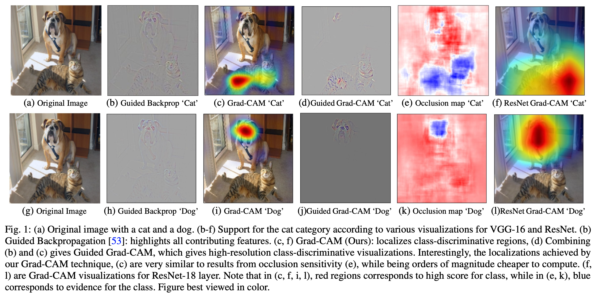
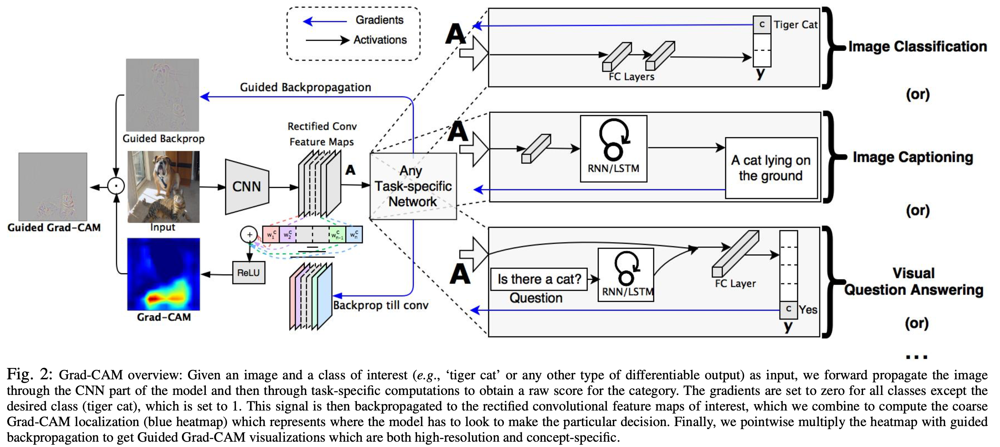

Paper : [Grad-CAM: Visual Explanations from Deep Networks via Gradient-based Localization](https://arxiv.org/abs/1610.02391)

Grad-CAM : [Code](https://github.com/ramprs/grad-cam), [Video](youtu.be/COjUB9Izk6E)

## 요약

>   We propose a technique for producing 'visual explanations' for decisions from a large class of Convolutional Neural Network (CNN)-based models, making them more transparent and explainable.

Grad-CAM(Gradient-weighted Class Activation Mapping)은 CNN 모델이 이미지의 어느 부분을 근거로 특정 예측을 했는지, 그래디언트(Gradient)를 가중치로 활용하여 시각적으로 보여주는 기법이다. 최종 합성곱 계층(final convolutional layer)으로 흘러 들어가는 특정 정답의 그래디언트를 사용하여, 정답을 예측하는 데 있어 이미지의 중요한 영역을 강조하는 대략적인 위치 맵(coarse localization map)을 생성한다. 이전 접근법들과 달리, Grad-CAM은 매우 다양한 CNN 모델들에 적용 가능하다. 완전 연결 계층을 가진 CNN, 이미지 캡셔닝, 멀티 모달 그리고 강화학습을 별도의 구조 변경이나 재학습 없이 수행 가능하다. 

저자들은 Grad-CAM을 기존의 세밀한 시각화 기법과 결합하여 고해상도의 클래스 판별적 시각화 자료인 Guided Grad-CAM을 만들고, 이를 ResNet 기반 구조를 포함한 이미지 분류, 이미지 캡셔닝, 그리고 시각적 질의응답 모델에 적용하였다. 이미지 분류 모델의 맥락에서, 저자들의 시각화는 (a) 모델의 실패 원인에 대한 통찰력을 제공하고, (b) ILSVRC-15 약지도 학습 위치 찾기 과제에서 이전 방법들을 능가하며, (c)  적대적 공격에 강건하고, (d) 기반 모델에 더 충실하며, (e) 데이터셋 편향을 식별하여 모델 일반화를 돕는다.

>   For image captioning and VQA, our visualizations show that even non-attention based models learn to localize discriminative regions of input image.

이미지 캠셔닝과 VQA에 대해서, 이러한 저자들의 시각화가 어텐션 기반이 아닌 모델조차도 입력 이미지의 판별적인 영역을 특정하는 법을 학습한다는 것을 보여준다.

저자들은 Grad-CAM을 통해 중요한 뉴런을 식별하는 방법을 고안하고 이를 뉴런 이름과 결합하여 모델 결정에 대한 텍스트 설명을 제공한다. 또한, Grad-CAM의 설명이 사용자들이 딥 네트워크 예측에 대한 적절한 신뢰를 구축하는 데 도움이 되는지 측정하기 위해 인간 연구를 설계하고 수행했으며, 두 네트워크가 동일한 예측을 하더라도 숙련되지 않은 사용자가 '더 강력한' 딥 네트워크를 '더 약한' 네트워크로부터 성공적으로 식별하는 데 Grad-CAM이 도움이 됨을 보여준다.

## **도입**

CNN은 강력한 성능을 보여주지만, 여러 계층이 복잡하게 얽혀 있어 내부적으로 어떻게 작동해서 결과를 내놓는지 사람이 직관적으로 이해하기가 매우 어려운 블랙박스(Black Box) 문제를 갖고 있다. 블랙박스 문제는 AI를 연구하기 위해서는 해결해야 하는 과제이다. 모델의 계층이 어떤 해석을 내놓는 지 파악함으로써 모델을 합리적으로 설계할 수 있기 때문이다. 이러한 해석과 관련해서는 기존의 CAM(Class Activation Map) 기법이 있다. CAM은 모델의 해석을 얻기 위해 구조를 단순하게 변경해야 했고, 이로 인한 성능 저하가 있었다. 저자들의 Grad-CAM은 이러한 trade-off 관계에 얽매이지 않고, 모델 구조를 그대로 사용하여 최고 성능을 내면서도 모델의 해석을 가능하게 했다.

>   What makes a. ood visual explanation?
>
>   (a) class-discriminative(i.e. localize the category in the image) and (b) high resolution(i.e. capture fine-grained detail).

#### **모델의 해석은 어떻게 되어야 할까?**

저자들은 좋은 해석이 다음 두 가지를 모두 만족해야 한다고 말한다.

1.   클래스 판별적(Class-Discriminative)
2.   고해상도(High-Resolution)

고양이와 개 클래스에 대한 여러 시각화 결과이다. Guided Backpropagation 이나 Deconvolution 과 같은 픽셀-공간 그래디언트 시각화는 고해상도이며 이미지의 세밀한 디테일을 강조하지만, 클래스를 판별하지는 못하는 것을 보여준다. 반대로 Grad-CAM의 경우 클래스를 판별하는 것을 볼 수 있다.

Grad-CAM은 이미지에서 중요한 부분을 잘 찾아내지만, 해상도가 낮아 세부적인 내용을 보여주지 못한다고 한다. 반대로 Guided Backpropagation 의 경우 디테일을 잘 찾아내지만, 클래스와 무관한 모든 디테일을 보여주는 문제가 있다. 이 두 방법을 합쳐 고양이라는 클래스를 구별하면서 고양이의 줄무늬를 찾아내는 해석까지 가능하게 하는 Guided Grad-CAM을 제안한다.

**즉, 잘 해석된 모델이란 이미지에서 클래스를 잘 판별할 수 있어야 하며, 특징들의 세밀한 영역을 잡아낼 수 있어야 한다.**

## CAM의 근본적인 한계

CAM은 모델의 예측 근거를 시각화할 수 있지만, 제약 조건이 있다. "합성곱 계층 &rarr; Global Average Pooling &rarr; Softmax" 순서로 구성된 모델에서만 사용 가능하다. 이는 모델의 성능 저하를 일으키는데, 최근 CNN 계열은 합성곱 계층 뒤에 여러 개의 fc layer를 사용하여 더 복잡한 특징을 학습한다. CAM을 사용하게 되면 이 부분을 GAP 구조로 바꿔야 하는데, 이는 모델의 성능 저하를 유발할 수 있다. 또한 이미지 분류를 제외한 다른 과제, 이미지 캡셔닝 혹은 VQA에서는 단순 분류(Softmax 사용)가 아닌 LSTM/RNN과 같은 다른 구조를 사용하므로, 구조적으로 사용하기 어려운 점이 있다.

>   CAM is a special case of Grad-CAM.

Grad-CAM은 이러한 CAM의 문제를 그래디언트를 사용하여 해결한다. 모델의 구조가 어떻든 모델은 학습을 하면서 역전파 과정을 거친다. 이런 역전파 과정에서 나오는 그래디언트 신호를 모델의 신호를 해석하는 데 사용할 것이기에 CAM처럼 제한된 모델 구조에서만 사용하는 것이 아닌 다양한 상황에서 사용할 수 있다. 모델의 구조를 바꾸지 않고 특징맵에서 해석을 가능하게 한다.

이외에도 다른 방법들이 있다. 입력 이미지에 변형을 주어 이를 분류하는 방식으로 지역화에 접근한다. [*Visualizing and understanding convolutional networks*](https://arxiv.org/abs/1311.2901) 에서는 입력의 일부 영역을 가리는(Occlusion) 방식으로 변형울 주고, 가려진 이미지를 분류한다. 고양이 이미지에서 고양이 얼굴을 가렸을 때 정답 확률이 크게 떨어진다면 이미지에서 마스킹 된 부분이 모델의 예측에 기여하는 데 중요하다고 유추하는 방식이다. [*Learning and transferring mid-level image representations using convolutional neural networks.*](https://openaccess.thecvf.com/content_cvpr_2014/papers/Oquab_Learning_and_Transferring_2014_CVPR_paper.pdf) 에서는 특정 픽셀을 포함하는 여러 영역(Patch)을 분류한 다음, 이 영역별 점수들을 평균 내어 해낭 픽셀의 클래스별 점수를 제공한다. 이미지를 여러 개의 패치로 나누어 각 패치를 개별적으로 분류하고, 점수들을 종합하는 방식이다. 

>   Unlike these, our approach achieves localization in one shot; it only requires a single forward and a partial ackward pass per image and thus is typically an order of magnitude more efficient.

이러한 방법들과 달리 저자들이 제안하는 방법은 한 번의 처리로 지역화를 달성하기에, 이미지당 한 번의 순전파와 부분적인 역전파만을 필요로 하므로, 일반적으로 수 십 배 더 효율적이다.

## Grad-CAM

CNN 모델은 계층이 깊어질수록 더 복잡하고 추상적인 특징을 학습한다. 초기 계층에서는 이미지의 단순한 특징을 감지한다면, fc layer 에서는 이미지의 모든 특징을 종합하여 분류를 수행하게 된다. 중간의 합성곱 계층에서는 이미지의 특징 뿐 아니라 공간 정보를 학습하게 된다.

Grad-CAM은 이러한 CNN의 마지막 합성곱 계층으로 들어가는 그래디언트 정보를 사용하여, 관심 있는 특정 결정에 대한 각 뉴런의 중요도 값을 할당하게 된다. 이를 통해 신경망의 어떤 계층에 있는 특징맵에 대한 해석을 가능하게 한다. 논문에서는 마지막 합성곱 계층, 즉 출력 계층의 결정만을 설명하는 데 집중한다.

Grad-CAM에서 우리가 얻고자 하는 히트맵 $L_{\mathbf{Grad-CAM}}^c\in\mathbb{R}^{u\times v}$ 은 모든 클래스 $c$ 에 대해서 너비가 $u$ 높이가 $v$ 인 2차원 행렬로 이루어져 있다. 이를 얻기 위해 다음을 따른다.

1.   모델이 예측한 클래스별 점수를 나타내는 $y^c$ 의 합성곱 계층의 각 특징 맵($A^k$)의 그래디언트를 계산한다. $y^c$ 는 소프트맥스 함수를 거치기 전의 원시 점수이고, $A^k$ 는 합성곱 계층의 k 번쨰 특징 맵 또는 채널의 활성화 값들을 의미한다. k번째 특징 맵의 값들이 조금 변할 때, 클래스 c의 점수가 얼마나 변하는 지를 나타내는 민감도이다.

2.   계산한 값 ${\partial y^c\over\partial A^k}$ 은 global-agverage-pooling 계층으로 들어가 뉴런의 가중치 중요도 $\alpha_k^c$ 를 구하게 된다. "1." 에서 계산한 그래디언트 맵에 있는 모든 픽셀 값들의 평균을 구해서 만든다. 이 과정을 전역 평균 풀링(Global Average Pooling)이라고 부른다. 이 가중치 중요도가 클수록, k번쨰 특징 맵이 c 클래스를 예측하는 데 중요한 역할을 했다는 의미이다.
     $$
     \alpha_k^c=\overbrace{1\over Z\sum_i\sum_j}^{\mathbf{global\ average\ pooling}}\underbrace{\partial y^c\over\partial A^k_{ij}}_\mathbf{gradients\ via\ backprop}
     $$

3.   $\alpha_k^c$ 는 특징 맵 A로부터 하위 신경망에 대한 부분적인 선형 근사를 나타내며, 특정 클래스 c 에 대한 특징 맵 k 의 중요도를 나타낸다. 순방향 활성화 맵의 가중합을 수행하고, 그 뒤에 ReLU를 적용하여 최종적으로 히트맵을 얻는다. ReLU를 적용하는 이유는 특징 맵에서 클래스 판별에 긍정적인 영향을 미치는 특징에만 관심이 있기 때문이다. $y^c$ 점수를 높이기 위해 영향력이 높아져야 하는 픽셀들만을 히트맵 상에서 보기 위함이다. 음수 값들을 갖는 픽셀들은 이미지의 다른 클래스에 속할 가능성이 높고, ReLU가 없으면 히트 맵은 정답 클래스 외의 다른 것들까지 강조하게 되어 지역화 성능이 더 나빠진다.
     $$
     L_\mathbf{Grad-CAM}^c=ReLU\underbrace{\Bigg(\sum_k \alpha_k^c A^k\Bigg)}_\mathbf{linear\ combination}
     $$

>   In general, $y^c$ need not be the class score produced by an image classification CNN. It could be any differentiable activation including words from a caption or answer to a question.

### Grad-CAM generalizes CAM

CAM은 특정 구조를 가진 모델에서만 작동한다. 특징 맵을 추출하고, 전역 평균 풀링을 거쳐 각 특징 맵의 모든 픽셀 값들의 평균을 구하여, 각 맵을 하나의 대표값으로 압축한다.이 대표값들에 클래스별 가중치를 곱한 뒤 모두 더하여, 최종 클래스 점수를 계산한다.
$$
Y^c=\sum_k\underbrace{w_k^c}_\mathbf{class\ feature\ weights}\overbrace{{1\over Z}\sum_i\sum_j}^{\mathbf{global\ average\ pooling}}\underbrace{A^k_{ij}}_\mathbf{feature\ map}
$$
$Y^c$ 는 클래스 c 에 대한 최종 점수, $w_k^c$ 는 k 번째 특징 맵과 클래스 c를 연결하는 가중치, 그리고 $A_{ij}^k$ 는 k번째 특징 맵의 (i, j) 위치에 있는 픽셀(활성화) 값이다. 따라서 위 수식은 "(1번 특징맵 평균 &times; 1번 가중치) &plus; (2번 특징맵 평균 &times; 2번 가중치) &plus; ... &plus; (k번 특징맵 평균 &times; k번 가중치) = 최종 클래스 점수"가 되는 선형 결합을 나타낸 것이다.

그렇다면 위 수식을 바탕으로 역전파 과정을 알아보자.

Global average pooling layer 의 출력을 $F^k$ 라 하고,
$$
F^k={1\over Z}\sum_i\sum_jA_{ij^k}
$$
CAM이 최종 점수를 아래와 같이 계산할 때,
$$
Y^c=\sum_k w_k^c \cdot F^k
$$
클래스 c 의 최점 점수를 특징맵 $F^k$ 에 대해서 미분을 하면 아래와 같다.
$$
{\partial Y^c\over\partial F^k}={{\partial Y^c\over\partial A_{ij}^k}\over{\partial F^k\over\partial A_{ij}^k}}
$$
수식 (4)를 $A_{ij}^k$ 에 대해서 미분하면, ${\partial F^k\over\partial A_{ij}^k}={1\over Z}$ 이므로, 수식 (6)은 아래와 같다.
$$
{\partial Y^c\over\partial F^k}={\partial Y^c\over\partial A_{ij}^k}\cdot Z
$$
수식 (5)에서 ${\partial F^k\over\partial A_{ij}^k}=w_k^c$ 이므로,
$$
w_k^c=Z\cdot{\partial Y^c\over\partial A_{ij}^k}
$$
수식 (8)을 모든 픽셀 (i, j)에 대해서 합하면,
$$
\sum_i\sum_j w_k^c=\sum_i\sum_jZ\cdot{\partial Y^c\over\partial A_{ij}^k}
$$
$Z$ 와 $w_k^c$ 는 픽셀에 의존하지 않으므로, 아래와 같다.
$$
Zw_k^c=Z\sum_i\sum_j{\partial Y^c\over\partial A_{ij}^k}
$$
$Z$ 는 특징 맵의 픽셀 수 이므로(또는 $Z=\sum_i\sum_j1$),
$$
w_k^c=\sum_i\sum_j{\partial Y^c\over\partial A_{ij}^k}
$$
최종적으로 수식 (11)이 나오게 된다.

시각화 과정에서 정규화되어 사라지는 비례 상수를 제외하면, $w_k^C$ 에 대한 표횬식은 Grad-CAM에서 사용되는 $\alpha_k^c$ 와 동일하다. 이는 Grad-CAM이 CAM의 일반화임을 보여준다. 이러한 일반화는 이미지 캡셔닝이나 VQA와 같이 훨씬 더 복잡한 상호작용을 통해 합성곱 계층을 계단식으로 연결하는 CNN 기반 모델로부터 시각적 해석을 가능하게 한다.
