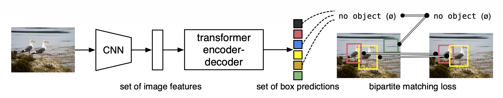
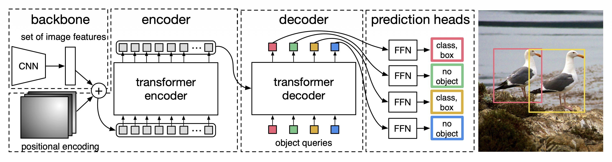
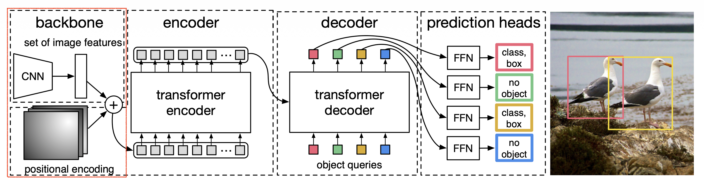
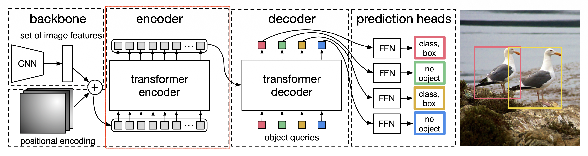

Paper : [End-to-End Object Detection with Transformers](https://arxiv.org/abs/2005.12872)

Code : [Code](https://github.com/facebookresearch/detr)

**들어가기에 앞서**

DETR(DEtection Transformer)은 "Object Detection을 하나의 집합 예측 문제로 풀어보자!" 라는 새로운 아이디어에서 출발한 모델이다. 기존의 복잡한 파이프라인을 버리고, Transformer 구조를 이용해 이미지에서 객체들을 한 번에 찾아내는 End-to-End 방식을 사용한다.

**DETR이 기존 방식과 다른 점은**

기존의 Faster-R-CNN이나 YOLO 같은 모델들은 보통 여러 단계를 거친다.

1.   이미지에서 객체가 있을 만한 수많은 후보 영역(Anchor/Region Proposal)을 제안한다.
2.   각 후보 영역에 대해 클래스를 분류하고 박스 위치를 조정한다.
3.   겹치는 수많은 박스들 중에서 가장 좋은 박스만 남기는 후처리 과정(NMS, Non-Maximum Suppression)을 수행한다.

하지만 DETR은 이런 복잡한 중간 과정, 특히 Anchor나 NMS 같은 수작업 요소를 모두 없앴다. 대신 이미지와 객체 쿼리를 트랜스포머에 넣어주면, 최종 객체 예측값 집합이 바로 나온다.

**DETR의 핵심 구조**

1.   CNN Backbone(특징 추출기)

     이미지를 입력받아 주요 특징을 추출한다. 보통 ResNet과 같은 검증된 CNN 모델을 사용한다. 트랜스포머가 이미지의 어떤 부분에 집중해야 할지 알려주는 중요한 정보를 제공하는 단계이다.

2.   Transformer(인코더-디코더)

     NLP 분야에서 뛰어난 성능을 보인 Transformer 구조를 사용한다.

     인코더 : CNN에서 추출한 이미지 특징들 간의 전역적인 관계를 학습한다. 이미지 전체를 보고 어떤 객체들이 서로 연관되어 있는지 파악하는 역할을 한다.

     디코더 : 인코더가 처리한 정보와 오브젝트 쿼리 라는 것을 입력으로 받는다. 이 오브젝트 쿼리는 이미지에서 찾아야 할 객체 슬롯 정도로 생각할 수 있다.보통 100개의 쿼리를 사용하는데, 이는 이 이미지에서 최대 100개의 객체를 찾아봐 라고 요청하는 것과 같다. 디코더는 각 쿼리를 이미지 정보와 연관 지어 최종 예측값을 만들어낸다.

3.   FFN(Feed Forward Network, 예측 헤드)

     Transformer 디코더에서 나온 출력값을 받아 최종 예측을 수행한다.

     각 쿼리마다 클래스와 바운딩 박스의 좌표를 예측한다. 100개의 쿼리가 들어갔다면, 100개의 (클래스, 바운딩 박스) 쌍이 나온다.

**DETR의 가장 독튼한 점 : 이분 매칭**

DETR은 100개와 같이 고정된 수의 예측을 출력한다. 하지만 실제 이미지에는 객체가 3개만 있을 수도 있다. 그럼 모델의 예측값 100개와 실제 정답 3개를 어떻게 비교하고 학습시켜야 할까?

여기서 이분 매칭(Bipartite Matching)과 헝가리안 알고리즘(Hungarian Algorithm)이 사용된다.

1.   모델이 예측한 100개의 결과와 실제 정답 객체들 사이에 가장 비용이 적게 드는 일대일 매칭을 찾는다. 즉, 가장 비슷한 예측-정답 쌍을 짝지어준다.
2.   매칭된 쌍에 대해서만 손실을 계산하여 모델을 학습시킨다.
3.   매칭되지 않은 나머지 예측값들은 객체 없음 클래스로 분류되도록 학습한다.

이 방식을 통해 모델 스스로 중복된 예측을 피하고, 각 객체에 대해 단 하나으 ㅣ유니크한 예측을 하도록 유도할 수 있다. 이것이 바로 NMS가 필요 없는 이유이다.

## 요약

>   We present a new method that views object detection as a direct set prediction problem.

저자들은 객체 탐지를 직접적인 집합 예측 문제로 바라보는 DETR(DEtection TRansformer)을 제시한다. 이는 탐지 파이프라인을 간소화하여, Non-Maximum Suppression(NMS)이나 앵커 생성처럼 사전 지식을 명시적으로 인코딩하는 여러 "hand-designed component"들의 필요성을 효과적으로 제거한다. 

DETR의 핵심 요소는 이분 매칭을 통해 고유한 예측을 강제하는 집합 기반의 전역 손실과 트랜스포머 인코더 디코더 구조이다. 학습된 고정된 개수의 작은 객체 쿼리가 주어지면, DETR은 객체들 간의 관계와 이미지의 전역적인 맥락을 추론하여 최종 예측값 집합을 병렬적으로 직접 출력한다.

DETR은 까다로운 COCO 객체 탐지 데이터셋에서 매우 최적화된 기존 모델인 Faster R-CNN과 대등한 정확도 및 실행 시간 성능을 보여준다. 더 나아가, DETR은 판옵틱 분할을 생성하도록 통합된 방식으로 쉽게 일반화 될 수 있으며, 경쟁적인 기존 모델들보다 훨씬 뛰어난 성능을 보임을 증명했다.


**객체 탐지를 직접적인 예측 문제로 본다**

기존 방식 : "이미지 안에 수많은 후보 박스를 그리고, 각 박스가 객체인지 아닌지, 어떤 객체인지 맞혀보자." 이 방식은 수많은 후보 박스를 만들고, 나중에 겹치는 박스를 제거하는 등 여러 단계를 거친다.

DETR 방식 : "이미지를 보고, 이미지 안에 있는 객체들의 집합을 한 번에 예측하자." 예를 들어 이미지에 [(고양이, 박스1), (개, 박스2)] 라는 집합이 있다면, 모델이 이 집합 자체를 최종 결과물로 내놓게 만드는 것이다. 중간 과정 없이 바로 최종 결과를 예측하기 때문에 직접적이라고 표현한다.

**NMS나 앵커 생성 같은 수작업 요소 제거**

DETR은 파이프라인을 획기적으로 단순화하여, 모델이 처음부터 중복 없이, 필요한 만큼의 객체를 알아서 찾도록 설계되었다.

-   Anchor Generation : 기존 모델들은 이미지 위에 미리 정의된 다양한 크기와 비율의 박스(앵커)를 수 만 개씩 깔아놓고, 이 박스들을 기준으로 객체를 찾는다. 이 앵커를 어떻게 설계하느냐가 성능에 영향을 미치는 "hand-designed component"이다.
-   NMS(Non-Maximum Suppression) : 기존 모델들은 하나의 객체에 대해 여러 개의 박스를 예측하는 경우가 많다. NMS는 이 겹치는 박스들 중에서 가장 점수가 높은 하나만 남기고 나머지를 지우는 후처리 과정이다. 이또한 파라미터 조정이 필요한 "hand-designed component"이다.

**이분 매칭(Bipartite Matching)을 통한 집합 기반 전역 손실**

"어떻게 NMS 없이 중복 예측을 피하게 만들었는가?"에 대한 해답이다.

-   모델은 항상 고정된 개수(예: 100개)의 예측을 출력한다. 하지만 실제 정답 객체는 3개일 수도, 10개일 수도 있다.
-   이분 매칭 : 모델이 예측한 100개의 결과와 실제 정답 객체들을 일대일로 짝지어 준다. 헝가리안 알고리즘을 사용해 가장 비슷한 예측과 정답을 찾아 매칭시킨다.
-   집합 기반 손실(Set-based Loss) : 매칭된 쌍에 대해서만 "클래스와 박스 위치를 더 정확하게 예측해!"라고 학습시키고, 매칭되지 못한 나머지 예측들은 "너희는 객체 없음(no object)이야"라고 학습 시킨다. 이 과정을 통해 각 예측은 고유한 객체를 담당하도록 강제된다.

**트랜스포머 인코더-디코더 구조와 객체 쿼리**

-   트랜스포머 : 이미지 전체 픽셀들 간의 관계를 파악하는 데 매우 효과적이다. "A라는 픽셀이 사람의 일부라면, 그 옆 B 픽셀도 사람의 일부일 가능성이 높다"와 같은 전역적인 맥락을 이해한다.
-   객체 쿼리 : "이미지에서 객체를 찾아와!"라고 던지는 질문지 같은 것이다. 이 쿼리들이 트랜스포머 디코더에서 이미지 정보와 상호작용하며 각각 특정 객체의 클래스와 위치 정보를 학습하게 된다. 즉, 1번 쿼리는 '사람'을, 2번 쿼리는 '자동차'를 찾는 식으로 역할을 분담하게 된다.

**파노틱 분할(Panoptic Segmentation)으로 쉽게 일반화**

>   DETR can be easily generalized to produce panoptic segmentation in a unified manner.

DETR의 구조는 매우 유연하고 확장성이 좋다.

-   객체 탐지 : 이미지에서 객체의 위치를 바운딩 박스로 찾는 과제
-   파노틱 분할 : 이미지의 모든 픽셀을 특정 클래스로 분류하면서, 동시에 객체별로 인스턴스를 구분하는 작업이다.
-   DETR은 구조에 간단한 "마스크 헤드"만 추가하면, 복잡한 수정 없이도 이 판옵틱 파노틱 분학 과제를 매우 높은 성능으로 수행할 수 있다. 


## 도입

>   To simplify these pipelines, we propose a direct set prediction approach to bypass the surrogate tasks.

기존의 객체 탐지 모델들은 앵커나 NMS 같은 복잡하고 손이 많이 가는 중간 당계에 너무 의존하고 있다. 저자들은 이런 것들을 모두 없애고, 기계 번역처럼 입력에서 출력이 한 번에 나오는 단순하고 직접적인 End-to-End 방식을 제안하여 이 문제를 해결하고자 한다.

>   Our DEtection Transformer predicts all objects at once, and is trained end-to-end with a set loss function which performs bipartite matching between predicted and ground-truth objects. DETR simplifies the detection pipeline by dropping multiple hand-designed components that encode prior knowledge, like spatial anchors or non-maximal suppression. Unlike most existing detection methods, DETR dosen't require any customized layers, and thus can be reproduced easily in any framework that contains standard CNN and transformer classes.


**병렬 디코딩 vs. 자기회귀적 디코딩**

자기회귀적(Autoregressive) 디코딩 : 주로 RNN을 사용했던 예전 방식이다. 마치 사람이 문장을 말하듯이, 하나의 결과를 예측하고, 그 결과를 다시 입력으로 삼아 다음 결과를 예측하는 순차적인 방식이다. 

비자기회귀적 병렬(Non-autoregressive Parallel) 디코딩 : DETR이 사용하는 방식이다. 모든 객체를 한 번에, 동시에, 독립적으로 예측한다. 100개의 객체 쿼리가 서로 상의하지 않고 각자 동시에 예측값을 내놓는다. 이는 트랜스포머 구조 덕분에 가능하며, 훨씬 빠른 예측 속도를 가진다.

이러한 병렬 처리가 가능한 이유는 바로 이분 매칭 손실 함수 덕분이다. 예측 결과의 순서가 뒤죽박죽 나와도(permutation invariant), 손실 함수가 알아서 정답과 짝을 지어주기 때문에 순서에 상관없이 학습이 가능하다. 

**Faster R-CNN과의 성능 비교**

큰 객체에 강함 : DETR은 트랜스포머를 통해 이미지 전체의 넓은 영역을 한 번에 보기 때문에(Non-local computations), 여러 부분으로 구성된 큰 객체를 인식하는 데 강점을 보인다.

작은 객체에 약함 : 이미지의 미세한 지역적 특징을 포착하는 데는 상대적으로 약해서 작은 객체 탐지 성능이 떨어진다.

Faster R-CNN도 초기에는 작은 객체 탐지에 어려움이 있었지만, FPN(Feature Pyramid Network)이라는 기술을 도입해 다양한 크기의 특징 맵을 활용함으로써 이 문제를 해결했다. DETR도 비슷한 방식의 개선을 통해 작은 객체 탐지 성능을 높일 수 있을 것이다.


## Related work

### Set prediction

**왜 일반적인 분류 방식은 안되는가?**

-   One-vs-Rest : 이미지를 보고 고양이가 있는지 없는지, '개'가 있는지 없는지를 각각 독립적으로 맞추는 방식이다.
-   문제점 : 이 방식은 이미지 안에 '고양이1', '고양이2'가 있을 때, 이 둘을 구분하지 못한다. 또한 예측된 박스들이 거의 동일한 위치를 가리키는 중복 문제도 해결할 수 없다. 즉, 객체들 간의 관계를 고려하지 못한다.

**중복을 어떻게 피할 것인가?**

기존 방식 : NMS라는 후처리 단계를 두어, 일단 중복을 포함해 많이 예측한 다음 겹치는 것들을 지운다.

집합 예측 방식 : 후처리 없이, 모델 스스로 중복을 피해야 한다. 이를 위해서는 모델이 예측하는 모든 결과물들을 동시에 고려하여 서로의 관계를 파악하는 전역적인 추론 능력이 필요하다. "내가 여기서 고양이를 예측했으니, 바로 옆에서 똑같은 고양이를 또 예측하면 안 되겠구나"라고 스스로 판단해야 하는 것이다.

**어떻게 순서에 상관없이 학습시킬까?(Permutation Invariance)**

문제 상황 : 모델이 [(고양이, 박스1), (개, 박스2)] 순서로 예측하든, [(개, 박스2), (고양이, 박스1)] 순서로 예측하든, 두 결과는 같은 정답이다. 따라서 손실 값도 동일해야 한다.

해결책 : 헝가리안 알고리즘을 이용한 이분 매칭

-   예측 결과의 순서와 상관없이, 가장 비슷한 (정답, 예측) 쌍을 찾아 일대일로 매칭시켜 준다.
-   그런 다음 매칭된 쌍들끼리만 손실을 계산한다.
-   이렇게 하면 모델의 예측 순서가 어떻든 상관없이 일관된 학습이 가능해진다. 이것이 바로 DETR의 Bipartite Matching Loss 의 원리이다.

**그래서 DETR은 뭘 선택했는가?**

과거의 선택 (RNN) : 이전의 연구들은 순서대로 하나씩 예측하는 자기 회귀 방식을 주로 사용했다.

트랜스포머 : DETR은 여기서 벗어나, 모든 예측을 한 번에 병렬적으로 수행하는 트랜스포머를 채택했따. 이는 헝가리안 알고리즘 기반의 손실 함수와 결합하여, 빠르고 효율적이면서도 집합 예측의 제약 조건들을 모두 만족시키는 혁신적인 구조를 만들어냈다.


**트랜스포머와 셀프 어텐션의 강력함**

RNN의 한계 : RNN(순환 신경망)은 신퀀스 데이터를 순서대로 하나씩 처리한다. 이때 문장이 길어지면 문장 앞에 있는 단언에 대한 정보가 뒤에 가서 희미해질 수 있다. 이를 장기 의존성 문제(long-term dependenct problem)라고 한다.

트랜스포머의 해결책(전역적 연산 & 완벽한 기억력) : 트랜스포머의 셀프 어텐션은 문장의 모든 단어가 다른 모든 단어와 직접적인 연결을 맺고 얼마나 중요한지를 한 번에 계산한다. 그래서 RNN처럼 정보가 희석되지 않고, 마치 완벽한 기억력을 가진 것처럼 작동한다. 이미지에 적용하면, 이미지으 ㅣ모든 픽셀이 다른 모든 픽셀과 직접 상호작용하며 전체적인 맥락을 파악할 수 있게 된다.

**디코딩 방식의 변화 : 하나씩 vs. 한 번에**

초기 트랜스포머(자기회귀 방식) : 초기에는 트랜스포머도 RNN처럼 결과를 순서대로 하나씩 예측했다. 문장을 번역할 때 첫 번째 단어를 예측하고, 그 단어를 참고해서 두 번째 단어를 예측하는 식이었다.

문제점 : 이 방식은 예측하려는 결과가 길어질수록 시간이 오래 걸리고(비용이 출력 길이에 비례), 데이터를 묶어서 한 번에 처리하는 배치 작업이 어려워 비효율적이었다.

해결책(병렬 디코딩) : 이러한 비효율을 해결하기 위해, 예측하려는 시퀀스 전체를 한 번에 동시에 생성하는 병렬 디코딩 방식이 개발되었다.

**DETR이 트랜스포머와 병렬 디코딩을 선택한 이유**

집합 예측(Set Prediction)을 하려면 이미지 전체를 보는 전역적인 능력이 필수적인데, 트랜스포머가 이걸 가장 잘한다. 그리고 병렬 디코딩을 사용하면 트랜스포머의 강력한 능력을 유지하면서도 모든 객체를 빠르고 효율적으로 한 번에 예측할 수 있으니, 이 조합이 최적이다.


**기존 탐지 모델들의 근본적인 문제점**

>   these systems heavily depends on the esact way these initial guesses are set.

초기 추측에 대한 의존성 : 앵커든, proposal box든, 그리드 셀이든, 결국 사람이 미리 정해놓은 '기준점'을 바탕으로 예측을 수행한다. 이 기준점을 어떻게 설계하느냐에 따라 모델 전체 성능이 좌우 되는 수작업 방식의 한계가 명확하다.

>   

DETR의 해결책 : DETR은 이런 기준점 자체를 없애고, 이미지 전체를 한 번에 보고 절대적인 좌표로 객체를 바로 예측한다.


**집합 손실 기반의 역사**

과거의 집합 예측 모델 : 과거에도 이분 매칭(bipartite matching)을 쓴 모델들이 있었지만, 모델 구조의 한계로 예측 간의 관계를 제대로 파악하지 못했다. 그래서 결국 성능을 높이려면 NMS(후처리)가 필요했다.

Faster R-CNN, YOLO : 이 모델들은 아예 처음부터 정답 박스 하나에 여러 개의 앵커(예측)를 할당하는 고유하지 않은 할당(non-unique assignment) 방식을 쓰기 때문에, NMS가 필수적이다.


**후처리를 없애려는 시도들(학습 가능한 NMS 등)**

관계 네트워크(Relation Networks) : 예측된 박스들 사이의 관계를 학습해서 "이 박스와 저 박스는 같은 객체를 가리키니 하나를 지워야 해"를 모델이 스스로 판단하게 만들려는 시도였다. NMS가 필요 없었다.

한계 : 하지만 이 모델들도 여전히 박스의 좌표 같은 수작 특징을 추가 정보로 사용해야 했다.

>   while we look for solutions that reduce the prior knowledge encoded in the model.

DETR의 차별점 : DETR은 이런 부가 정보 없이, 오직 이미지 픽셀 정보만으로 트랜스포머를 통해 관계를 학습한다. 즉, '사전 지식'을 최소화하려는 철학이 더 강하다.


**DETR과 가장 비슷했던 연구들(RNN)**

공통점 : 인코더-디코더 구조, 이분 매칭 손실 사용

차이점 : 순서를 하나씩 예측하는 RNN 기반의 자기회귀 모델은 모든 객체를 한번에 병렬적으로 예측하는 트랜스포머 기반의 병렬 디코딩을 사용하는 DETR과의 가장 큰 기술적 차이다.


## DETR

>   Two ingredients are essential for direct set predictions in detection

탐지에서 직접적인 집합 예측을 위해서는 두 가지 요소가 필수적이다.

1.   예측된 박스와 실제 정답 박스 간의 고유한 매칭을 강제하는 집합 예측 손실(set prediction loss)
2.   한 번의 처리(a single pass)로 객체 집합을 예측하고 그들의 관계를 모델링하는 구조

### Object detection set prediction loss



**DETR은 어떻게 학습을 할까?**

모델은 항상 고정된 개수 N(=100)개만큼 예측을 한다. 하지만 실제 이미지에는 객체가 3개만 있을 수 있다. 여기서 N은 항상 객체 수보다 많으므로, 지금 같은 상황에서는 N은 3보다 크다. 그럼 N개의 예측과 3개의 정답을 비교하여 문제를 해결해야 하는데, 이 때 사용되는 방법이 이분 매칭이다. 
$$
\hat{\sigma}=\mathbf{arg \min_{\sigma\in\mathfrak{S}_N}}\sum_i^N\mathcal{L}_{\mathbf{match}}(y_i,\hat y_{\sigma(i)}),
$$
위 수식은 총 비용을 최소로 만드는 최적의 매칭 방법($\hat\sigma$)를 찾는 방법이다. $y$ 는 정답 집합이고, N에 맞춰 $\varnothing$ (no object) 이라는 패딩이 추가된다. 위 예시에서는 97개의 패딩이 생성된다. $\hat y$ 는 예측 집합이다. $\mathcal L_\mathbf{match}$ 은 매칭 비용으로 잘 예측한 집합이면 비용이 낮고, 아닐 경우 반대이다. $\sigma$ 는 하나의 매칭 방법으로 100개의 예측 집합을 정답 집합과 짝짓는 방법이다. $\sum$ 은 예측과 정답을 서로 짝지었을때 모든 집합의 비용을 합산하는 계산이다. 즉 이러한 총 비용을 가장 낮게하는 최적의 매칭을 찾는 방법을 이분 매칭이라고 한다.
$$
\mathcal{L}_\mathbf{match}(y_i,\hat y_{\sigma(i)})=-1_{\{c_i\neq\varnothing\}}\hat p_{\sigma(i)}(c_i)+1_{\{c_i\neq\varnothing\}}\mathcal L_\mathbf{box}(b_i,\hat b_{\sigma (i)})
$$
$y_i=(c_i,b_i)$, $c_i$ 는 정답 클래스, $b_i\in[0,1]^4$ 는 실제 정답 박스의 중심 좌표와 높이, 너비를 이미지 크기에 대해 정규화한 벡터이다. 인덱스 $\sigma_i$ 를 갖는 예측에 대해, 클래스 $c_i$ 에 대한 확률을 $\hat p_{\sigma(i)}$, 예측된 박스를 $\hat b_{\sigma(i)}$ 로 정의한다. 수식 2는 이를 바탕으로 매칭 비용 $\mathcal{L}_{\mathbf{match}}(y_i,\hat y_{\sigma(i)})$ 을 정의한 것이다.

1.   클래스 비용: $-\hat p_{\sigma_i}(c_i)$

     $\hat p_{\sigma_i}(c_i)$는 예측 $\sigma_{i}$가 정답 클래스 $c_i$일 것이라고 예측한 확률로 0에서 1 사이 값을 가진다. 확률이 높을수록 예측을 잘 한 것이므로 매칭 비용은 낮아져야 한다. 따라서 앞에 음의 부호를 붙여 확률이 높을 수록 작은 값이 되게 한다.

2.   바운딩 박스 비용: $\mathcal{L}_\mathbf{box}(b_i,\hat{b}_{\sigma_{i}})$

     $\mathcal{L}_\mathbf{box}$ 는 예측된 박스와 정답 박스 사이의 오차이다. 오차가 클수록 매칭 비용은 높은 값을 가진다. 

3.   Indicator Function: $1_{\{c_i\neq\varnothing\}}$

     정답이 no object 이 아닐 때만 비용을 계산하는 스위치이다. 배경에 대해서는 박스 비용을 계산하지 않는다.

결론적으로, 위 수식은 헝가리안 알고리즘을 통해 100개의 예측과 100개의 정답(실제 정답 + 가상 정답)을 가장 낮은 비용으로 매칭하는 방법을 찾는 과정이다.

**Code(detr/models/matcher.py)**

```python
# Copyright (c) Facebook, Inc. and its affiliates. All Rights Reserved
"""
Modules to compute the matching cost and solve the corresponding LSAP.
"""
import torch
from scipy.optimize import linear_sum_assignment
from torch import nn

from util.box_ops import box_cxcywh_to_xyxy, generalized_box_iou


class HungarianMatcher(nn.Module):
    """This class computes an assignment between the targets and the predictions of the network

    For efficiency reasons, the targets don't include the no_object. Because of this, in general,
    there are more predictions than targets. In this case, we do a 1-to-1 matching of the best predictions,
    while the others are un-matched (and thus treated as non-objects).
    """

    def __init__(self, cost_class: float = 1, cost_bbox: float = 1, cost_giou: float = 1):
        """Creates the matcher

        Params:
            cost_class: This is the relative weight of the classification error in the matching cost
            cost_bbox: This is the relative weight of the L1 error of the bounding box coordinates in the matching cost
            cost_giou: This is the relative weight of the giou loss of the bounding box in the matching cost
        """
        super().__init__()
        self.cost_class = cost_class
        self.cost_bbox = cost_bbox
        self.cost_giou = cost_giou
        assert cost_class != 0 or cost_bbox != 0 or cost_giou != 0, "all costs cant be 0"

    @torch.no_grad()
    def forward(self, outputs, targets):
        """ Performs the matching

        Params:
            outputs: This is a dict that contains at least these entries:
                 "pred_logits": Tensor of dim [batch_size, num_queries, num_classes] with the classification logits
                 "pred_boxes": Tensor of dim [batch_size, num_queries, 4] with the predicted box coordinates

            targets: This is a list of targets (len(targets) = batch_size), where each target is a dict containing:
                 "labels": Tensor of dim [num_target_boxes] (where num_target_boxes is the number of ground-truth
                           objects in the target) containing the class labels
                 "boxes": Tensor of dim [num_target_boxes, 4] containing the target box coordinates

        Returns:
            A list of size batch_size, containing tuples of (index_i, index_j) where:
                - index_i is the indices of the selected predictions (in order)
                - index_j is the indices of the corresponding selected targets (in order)
            For each batch element, it holds:
                len(index_i) = len(index_j) = min(num_queries, num_target_boxes)
        """
        bs, num_queries = outputs["pred_logits"].shape[:2]

        # We flatten to compute the cost matrices in a batch
        out_prob = outputs["pred_logits"].flatten(0, 1).softmax(-1)  # [batch_size * num_queries, num_classes]
        out_bbox = outputs["pred_boxes"].flatten(0, 1)  # [batch_size * num_queries, 4]

        # Also concat the target labels and boxes
        tgt_ids = torch.cat([v["labels"] for v in targets])
        tgt_bbox = torch.cat([v["boxes"] for v in targets])

        # Compute the classification cost. Contrary to the loss, we don't use the NLL,
        # but approximate it in 1 - proba[target class].
        # The 1 is a constant that doesn't change the matching, it can be ommitted.
        cost_class = -out_prob[:, tgt_ids]

        # Compute the L1 cost between boxes
        cost_bbox = torch.cdist(out_bbox, tgt_bbox, p=1)

        # Compute the giou cost betwen boxes
        cost_giou = -generalized_box_iou(box_cxcywh_to_xyxy(out_bbox), box_cxcywh_to_xyxy(tgt_bbox))

        # Final cost matrix
        C = self.cost_bbox * cost_bbox + self.cost_class * cost_class + self.cost_giou * cost_giou
        C = C.view(bs, num_queries, -1).cpu()

        sizes = [len(v["boxes"]) for v in targets]
        indices = [linear_sum_assignment(c[i]) for i, c in enumerate(C.split(sizes, -1))]
        return [(torch.as_tensor(i, dtype=torch.int64), torch.as_tensor(j, dtype=torch.int64)) for i, j in indices]


def build_matcher(args):
    return HungarianMatcher(cost_class=args.set_cost_class, cost_bbox=args.set_cost_bbox, cost_giou=args.set_cost_giou)
```


이전 단계에서 찾은 모든 쌍에 대한 손실 함수, 즉 헝가리안 손실을 계산한다.

$$
\mathcal L_\mathbf{Hungarian}(y,\hat y) = \sum_{i=1}^N[-\log\hat p_{\hat\sigma(i)}(c_i)+1_{\{c_i\neq\varnothing\}}\mathcal L_\mathbf{box}(b_i,\hat b_{\sigma (i)})]
$$

1.   $\sum$ : 찾아낸 N개의 모든 쌍에 대해 각각 손실을 계산하여 모두 더하는 과정이다.
2.   $\hat{\sigma}$ : 헝가리안 알고리즘이 찾아낸 최적의 매칭이다.

매칭 비용을 찾는 과정과 비슷하다. 클래스 비용을 계산할 때, $\mathbf{log}$ 를 사용한다. 이는 단순히 확률값을 사용할 떄보다, 로그 함수를 사용하여 예측이 틀렸을 때, 더 강력한 페널티를 부여하기 위함이다. 어떤 클래스에 대해서 0.1의 확률로 예측했을 때의 로그를 사용하면 2.3이라는 큰 손실을 줄 수 있다. 반대로 0.9의 확률로 예측했을 때의 로그를 사용하면 0.1의 작은 손실을 주게 된다.

이를 토대로 모델 학습에 더 효과적인 크로스 엔트로피 손실을 사용하여 매칭된 쌍들이 정답과 더욱더 비슷해지도록 모델의 파라미터를 업데이트할 수 있다.

**Code(detr/models/detr.py)**


**클래스 불균형 문제와 해결책**

>   In practice, we down-weight the log-probability term when $c_i=\varnothing$ by a factor 10 to account for class inbalance. This is analogous to how Faster R-CNN training procedure balances positive/negative proposals by subsampling.

모델은 100개의 예측을 하는데, 실제 객체는 보통 5개 미만이다. 매칭을 하고 나면, (예측, 실제 객체) 쌍은 5개 뿐이고 나머지 95개는 모두 (예측, 객체 없음) 쌍이 된다. 이 상태로 그냥 학습하면, 모델은 소수의 실제 객체는 무시하고 대다수를 차지하는 '객체 없음(배경)'만 잘 맞추는 쪽으로 학습해버린다. 이 문제를 해결하기 위해, '객체 없음'으로 매칭된 손실 값의 영향력을 의도적으로 줄여버린다. 논문에서는 그 가중치를 10배나 낮춘다고 설명한다.


**Bounding box loss**

>   To mitigate this issue we use a linear combination of the $l_1$ loss and the generalized IoU loss $\mathcal{L}_{iou}$ that is scale-invariant.


$$
\mathcal{L}_\mathbb{box}=\lambda_\mathbf{iou}\mathcal L_\mathbf{iou}(b_i, \hat b_{\sigma(i)})+\lambda_{L1}||b_i-\hat b_{\sigma(i)}||_1
$$

1.   정답 박스 : $b_i$

2.   예측 박스 : $\hat{b}_i$

     모델이 예측한 바운딩 박스 중, 헝가리안 매칭을 통해 정답 박스와 짝지어진 예측 박스이다.

3.   L1 손실 : $||b_i - b̂_σ(i)||_1$

     두 박스의 각 좌표 값들의 차이를 구하고, 그 차이의 절대값을 모두 더한 값이다. 박스의 절대적인 좌표와 크기가 얼마나 차이 나는지를 직접적으로 측정한다. 이 손실을 줄이는 방향으로 학습하면 예측 박스의 중심점과 크기가 정답과 점점 비슷해진다. 박스의 전체적인 크기를 고려하지 못하는 단점이 있다. (예: 큰 박스에서의 10픽셀 오차와 작은 박스에서의 10픽셀 오차를 동일한 페널티로 취급)

4.   GIoU 손실 : $L_\mathbb{iou}(b_i, b̂_σ(i))$

     일반화된 IoU 손실이다. 1 - GIoU로 계산된다. 두 박스가 얼마나 잘 겹치는지를 비율로 측정하기에 박스의 절대적인 크기나 위치에 상관없이, 상대적인 형태와 겹침 정도를 평가할 수 있다. 이를 통해 L1 손실의 단점인 스케일 문제를 해결해고, 두 박스가 전혀 겹치지 않을 때도 얼마나 멀리 떨어져 있는지에 대한 정보를 알 수 있다.

5.   가중치 하이퍼파라미터 : $\lambda_\mathbb{iou}, \lambda_{L1}$

     두 손실 중 어떤 것에 더 집중하여 학습할지를 결정한다. 논문에서는 보통 `λ_L1 = 5`, `λ_iou = 2` 와 같이 설정하여, 절대적인 좌표를 맞추는 L1 손실에 더 높은 가중치를 부여합니다.


### DETR Architecture

>   It contains three main components, which we describe below: a CNN backbone to extract a compact feature representation, an encoder-decoder transformer, and a simple feed forward network (FFN) that makes the final detection prediction.

DETR의 구성 요소는 크게 세 개로 볼 수 있다.

-   CNN Backbone : 이미지에서 중요한 시각적 특징을 뽑아내는 역할
-   Transformer : CNN이 뽑아낸 특징들의 전체적인 관계와 맥락을 파악하는 역할
-   FFN(Feed Forward Network) : 트랜스포머가 분석한 결과를 바탕으로 최종적인 객체의 클래스와 바운딩 박스 좌표를 출력하는 역할



**CNN Backbone.**



초기 이미지 $x_{img}\in\mathbb R^{3\times H_0\times W_0}$ 에서 시작하여, CNN은 더 낮은 해상도의 활성화 맵 $f\in\mathbb R^{C\times H\times W}$ 을 생성한다. 저자들이 사용하는 일반적인 값은 $C=2048$, $H,\ W ={H_0\over32},\ {W_0\over32}$ 이다. 32가 의미하는 바는 원본 이미지에서 특징맵으로 낮아진 해상도 비율이다.

CNN이 만든 특징 맵을 트랜스포머가 이해할 수 있는 형태로 가공해야 한다.

1.    차원 축소(1x1 컨볼루션)

      2048개의 채널은 트랜스포머가 처리하기에 너무 많고 비효율적이다. '1x1 컨볼루션'을 사용해 이 2048개의 특징을 더 작은 개수의 핵심 특징으로 줄여주는 차원 축소를 진행한다.

2.   시퀀스 만들기(Flattening)

     트랜스포머는 원래 문장처럼 1차원의 순서가 있는 데이터를 처리하도록 설계되었다. 하지만 특징 맵은 $H\times W$ 의 형태로 2D 이다. 따라서 2D 공간 정보를 1D 시퀀스로 펼쳐준다.

3.   위치 정보 추가(Positional Encodings)

     시퀀스를 만드는 과정에서 공간적인 위치 정보가 사라지기에, 각 토큰에 위치 인코딩을 더해준다. 이 값은 각 토큰의 고유한 위치 정보를 담고 있어서, 트랜스포머가 특징의 의미뿐만 아니라 원래 어디에 있었는지도 함께 고려할 수 있게 해준다.

최종적으로 트랜스포머에는 [HW, b, d] 차원의 입력이 들어간다.


**Transformer.**


전체적인 DETR 트랜스포머의 구조는 위 그림과 같다.

**Encoder.**

>   Since the transformer architecture is permutation-invariant, we supplement it with fixed positional encodings that are added to the input of each attention layer.



DETR 트랜스포머의 인코더는 기존 트랜스포머의 인코더와 유사하다. 한 가지 주요한 차이점은 위치 정보가 모든 층의 어텐션 레이어의 쿼리와 키에 더해진다. 이는 기존 트랜스포머에서는 위치 정보가 한 번 들어가고, 임베딩 메트릭에 더해진 위치 정보를 바탕으로 퀴리, 키, 벨류를 만드는 점과 차이가 있다.


**Decoder.**

>   Using self- and encoder-decoder attention over these embeddings, the model globally reasons about all objects together using pair-wise relations between them, while being able to use the whole image as context.


마찬가지로 디코더 또한 유사하지만, 디코더의 입력으로 d차원의 N개의 임베딩이 들어간다. 디코더는 이러한 N개의 object query 를 병렬적으로 한 번에 디코딩한다. 이는 기존 트랜스포머에서 시퀀스에서 토큰을 하나씩 입력받아 디코딩하는 autoregressive 모델과 차이가 있다. Object query 에는 이미 학습된 위치 임베딩이 인코더와 마찬가지로 각 레이어에 들어간다. 디코더에 입력으로 들어간 N개의 object query 들은 각각 FFN의 입력으로 들어가서 최종적으로 N개의 최종 예측을 만든다.


**Prediction feed-forward networks (FFNs).**

>   The FFN predicts the normalized center coordinates, height and width of the box w.r.t. the input image, and the linear layers predicts the class label using a softmax function.


디코더에서 나온 N개의 object query 를 각각 입력으로 받아 클래스 라벨과 normalized 된 중심 좌표 및 박스 크기를 예측한다. 클래스 라벨에 대한 예측은 선형 레이어 한 층을 이용해 92(COCO 데이터 셋 클래스: 91 + no object)개의 차원으로 선형 결합 후 소프트맥스를 거쳐서 확률값을 반환한다. 최대 확률에 대한 클래스만을 이용하여 N개의 object query 를 이용한 이분 매칭을 진행한다. bbox 예측은 3개 층의 mlp 레이어와 ReLU를 사용하여 진행된다. 마지막 레이어에는 ReLU를 사용하지 않고 [center_x, center_y, h, w] 와 같은 형태로 출력이 나오게 된다.


**Auxiliary decoding losses.**

>   We found helpful to use auxiliary losses in decoder during training, expecially to help the model output the correct number of objects of each class.

*Character-level language modeling with deeper self-attention* 논문에서 나온 auxiliary losses (보조 손실)을 학습 중에 디코더에서 사용하는 것이 도움이 됐다고 한다.  이는 모델이 더 빠르고 안정적으로 학습하도록, 최종 정답뿐만 아니라 중간 과정에서도 정답을 알려주면서 훈련을 시키는 방법이다. 모델의 맨 마지막(6번째 디코더 레이어)에서만 손실을 계산하는 것이 아니라, 디코더의 모든 중간 레이어가 끝날 때마다 최종 예측처럼 FFN에 통과시켜 추가적인 손실을 계산하는 방식이다.

이런 보조 손실을 사용하면 두 가지 장점이 있다.

-   강력한 학습 신호 제공: 모델이 깊어질수록 발생하는 기울기 손실 문제를 해결할 수 있다. 각 레이어마다 손실을 계산하므로 모델의 초기 레이어들까지도 "어떻게 학습해야 하는지"에 대한 강력한 신호를 직접적으로 받을 수 있어 학습이 훨씬 안정적이고 빨라진다.
-   올바른 객체 수 학습: 모델이 "이 이미지에는 고양이가 2마리, 개가 1마리 있다"와 같이 각 클래스별 객체의 정확한 개수를 학습하는 데 도움을 준다.

>   All predictions FFNs share their parameters.

보조 손실을 효율적으로 구현하기 위해 파라미터 공유를 한다.

-   FFN 파라미터 공유: 모든 디코더 레이어 뒤에 붙는 예측 FFN을 각각 다른 FFN으로 만들면 파라미터가 너무 많아지므로, 모든 레이어에서 동일한 FFN하나를 공유하여 사용한다.
-   레이어 정규화: 각 디코더 레이어의 출력은 통계적 분포가 조금씩 다를 수 있다. 동일한 FFN을 사용하기 전에, shared layer-norm 을 통해 각 레이어의 출력을 정규화하여 FFN이 더 안정적으로 작동하도록 해준다.


### PyTroch Inference Code

>   For clarity it uses learnt positional encodings in the encoder instead of fixed, and positional encodings are added to the input only instead of at each transformer layer.

논문의 최종 모델과 가독성을 위해서 작성된 예제 코드 사이에는 두 가지 주요 차이점이 있다.

1.   위치 인코딩 방식

     논문: 수학 함수로 계산하는 고정된 사인/코사인 위치 인코딩 사용.(더 유연함)

     예제 코드: nn.Parameter로 구현된 학습 가능한 위치 인코딩 사용.(더 간단함)

2.   위치 인코딩 적용 위치

     논문: 트랜스포머의 모든 어텐션 레이어에 들어갈 때마다 위치 정보를 더해준다.

     예제 코드: 트랜스포머의 가장 첫 입력단에만 위치 정보를 한 번 더해준다.

추가적으로 논문에 작성된 코드에는 배치 처리를 미지원하여 한 번에 단 한장의 이미지만 처리할 수 있다.

```python
import torch
import torch.nn as nn
from torchvision.models import resnet50

class DETR(nn.Module):
    def __init__(self, num_classes, hidden_dim, nheads,
                num_encoder_layers, num_decoder_layers):
        super().__init__()
        
        self.backbone = nn.Sequential(*list(resnet50(pretrained=True).children())[:-2])
        self.conv = nn.Conv2d(2048, hidden_dim, 1)
        self.transformer = nn.Transformer(hidden_dim, nheads,
                                         num_encoder_layers, num_decoder_layers)
        
        self.linear_classes = nn.Linear(hidden_dim, num_classes+1)
        self.bbox = nn.Linear(hidden_dim, 4)
        
        # 객체 쿼리 정의
        self.query_pos = nn.Parameter(torch.rand(100, hidden_dim))
        
        # 위치 인코딩 정의
        self.row_embed = nn.Parameter(torch.rand(50, hidden_dim//2))
        self.col_embed = nn.Parameter(torch.rand(50, hidden_dim//2))
        
    def forward(self, input):
        B, _, _, _ = input.shape
        # [B, 3, input_h, input_w] -> [B, 2048, H, W]
        x = self.backbone(x)
        
        # [B, 256, H, W]
        h = self.conv(x)
        
        # [50, 128]
        # col_embed: [H, W, 128] [W, 128]의 열에 대한 위치 정보가 H번 반복
        # row_embed: [H, W, 128] [H, 1, 128]의 행에 대한 위치 정보가 W번 반복
        # torch.cat -> [H, W, 256]: pos[:, :, :128] 에는 열에 대한 정보가 pos[:, :, 128:] 에는 행에 대한 정보가 담김
        pos = torch.cat([
            col_embed[:W].unsqueeze(0).repeat(H, 1, 1),
            row_embed[:H].unsqueeze(1).repeat(1, W, 1)
        ], dim=-1).flatten(0, 1).unsqueeze(1)
        
        pos = pos.repeat(1, B, 1)
        
        # nn.Transformer input: [sequence_len, batch_size, embedding_dim]
        # Encoder input: [B, 256, H, W] -> flatten [B, 256, HW] -> permute [Hw, B, 256] + pos [HW, B, 256]
        # Decoder input: [100, B, 256]
        # output: [100, B, 256]
        h = self.transformer(pos + h.flatten(2).permute(2,0,1),
                            self.query_pos.unsqueeze(1).repeat(1,B,1))
        
        # linear_classes: [100, B, 256] -> [100, B, 92], linear_bbox: [100, B, 256] -> [100, B, 4]
        return self.linear_classes(h), self.linear_bbox(h).sigmoid()
```

