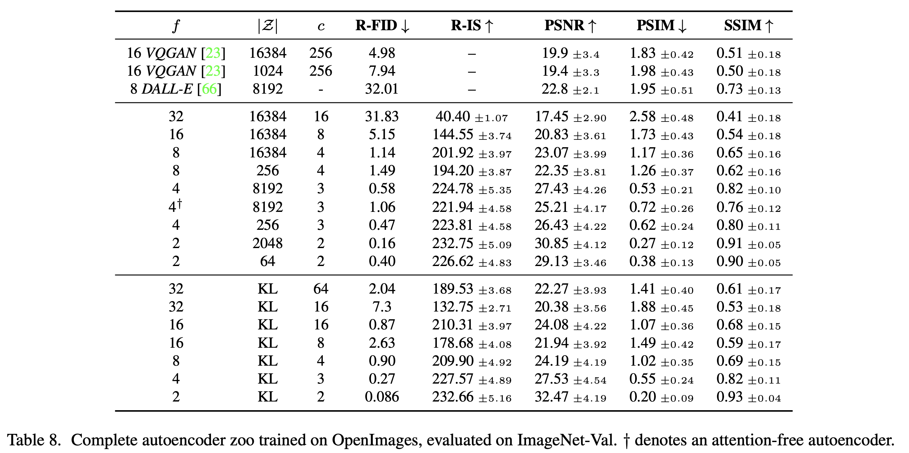

paper : [High-Resolution Image Synthesis with Latent Diffusion Models](https://arxiv.org/pdf/2112.10752)

Code : [latent-diffusion](https://github.com/CompVis/latent-diffusion)

## Overview

Stable Diffusion은 확산 모델을 기반으로 한다. 하지만 한 가지 큰 차이점은 잠재 공간(Latent Space)에서 이 모든 작업을 수행한다는 것이다. 그래서 Latent Diffusion Model(LDM)이라고 부른다. 크게 두 개의 부분으로 보면, 순방향 확산에서는 깨끗한 이미지에 노이즈를 점진적으로 추가하여 완전한 무작위 노이즈로 만든다. 역방향 확산에서 이 완전한 노이즈를 모델이 각 단계에서 추가되었던 노이즈를 예측하고 제거해 나간다. 이 노이즈 제거 과정을 수십 번 반복하면 노이즈가 점차 사라지고 원래의 이미지를 찾게 된다.

그렇다면 잠재 공간에서 작동하는 이유는 무엇일까? 기존의 확산 모델은 원본 이미지의 픽셀 공간에서 직접 노이즈를 제거했다. 이는 엄청난 계산량을 필요로 한다. Stable Diffusion 은 이미지를 VAE라는 모델을 사용해 훨씬 작은 잠재 공간으로 압축하게 되고, 압축된 데이터는 원본 이미지의 핵심 의미만 담게 된다. 이 벡터를 가지고 노이즈 추가와 제거를 수행하기에 훨씬 적은 계산 자원과 메모리로도 빠르고 고품질의 이미지를 생성할 수 있게 되었다.

### Perceptual Image Compression

VAE의 인코더가 이미지를 잠재 공간 $z$ 로 압축할 때, 이 $z$ 가 높은 분산을 갖지 않도록 regularization 을 해야 한다. $z$ 가 높은 분사을 갖게 되면 나중에 Diffusion Model이 이 공간을 학습하기 어려워진다. 논문에서는 regularization 을 위해서 두 가지 방법을 실험했다.

1.   **KL-reg(VAE 방식)**

     잠재 공간 $z$ 가 VAE처럼 부드러운 표준 정규 분포를 따르도록 약한 KL 패널티를 부과한다.

2.   **VQ-reg(VQGAN 방식)**

     VQGAN 처럼, 잠재 공간 $z$ 를 이산적인 코드북의 값들로 강제로 양자화한다.

기존의 VQGAN 같은 모델은 이미지를 32x32 같은 2D 잠재 공간으로 압축한 뒤, 트랜스포머 모델로 학습시키기 위해  이 2D 그리드를 임의의 1D 시퀀스로 강제로 펼쳤다. 이는 본질적인 2D 공간 구조 정보를 무시하게 된다. 반면에 LDM 의 U-Net은 픽셀 이미지처럼 64x64 같은 2D 공간 구조를 가진 잠재 공간 $z$ 를 입력받아 처리하도록 설계되었다. $z$ 가 2D 구조를 유지하기 때문에, 비교적 약한 압축률(mild compression rates)만 사용해도 되고, 약한 압축률($f=4,8$)을 사용한 VAE가 디테일 보존(R-FID)이 훨씬 더 잘 되었다. $\vert \mathcal Z\vert$ 는 코드북 크기이고, $\vert\mathcal Z\vert$ 가 16384 라는 것은 VAE가 이미지를 압축할 때 미리 정해진 16384개의 대표 벡터 중 하나를 골라서 표현한다는 의미이다. KL 은 KL-reg를 사용한다는 의미이다. $c$ 는 압축된 잠재 공간의 채널 수 이다.

### LDM

확산 모델은 이미지에 노이즈를 추가하는 과정의 역방향 과정, 즉 노이즈를 점진적으로 제거하는(denoising) 방법을 학습함으로써 이미지를 생성하는 방법을 배운다. UNet 은 원본 $x$ 에 $t$ 시점만큼의 노이즈가 낀 이미지 $x_t$ 와 $t$ 를 입력받아 노이즈가 제거된 이미지를 예측하도록 한다. 하지만 DDPM 논문 등에서 밝혀진 바에 따르면, 깨끗한 이미지를 직접 예측하는 것보다 이 이미지에 추가되던 노이즈가 무엇인지 예측하도록 훈련하는 것이 더 안정적이고 결과가 좋다고 한다. $\epsilon_\theta$ 는 디노이징 오토인코더이다.

$$L_{DM}=\mathbb E_{x,\epsilon\sim N(0,1), t}([\Vert\epsilon-\epsilon_\theta(x_t,t)\Vert_2^2])$$

모델은 위의 손실 함수를 최소화하도록 훈련된다. $\epsilon$ 은 이미지에 실제로 추가한 가우시안 노이즈, $\epsilon_\theta(x_t,t)$ 는 예측한 노이즈 값이다. 이 둘의 차이를 MSE 오차로 계산하여, 모델은 실제 노이즈와 예측 노이즈의 차이를 0에 가깝도록 만든다.