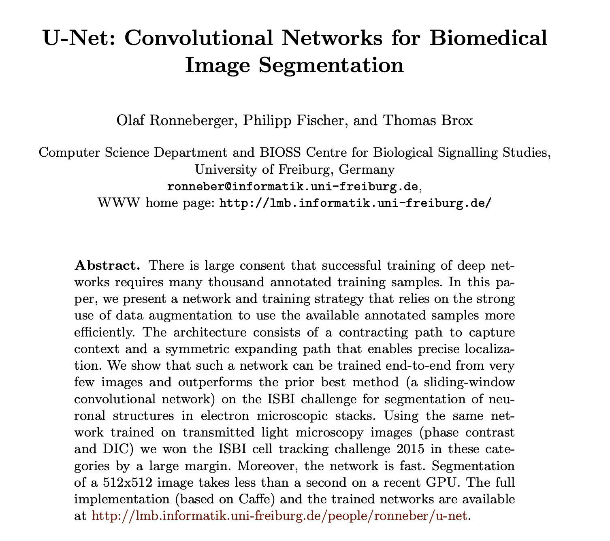
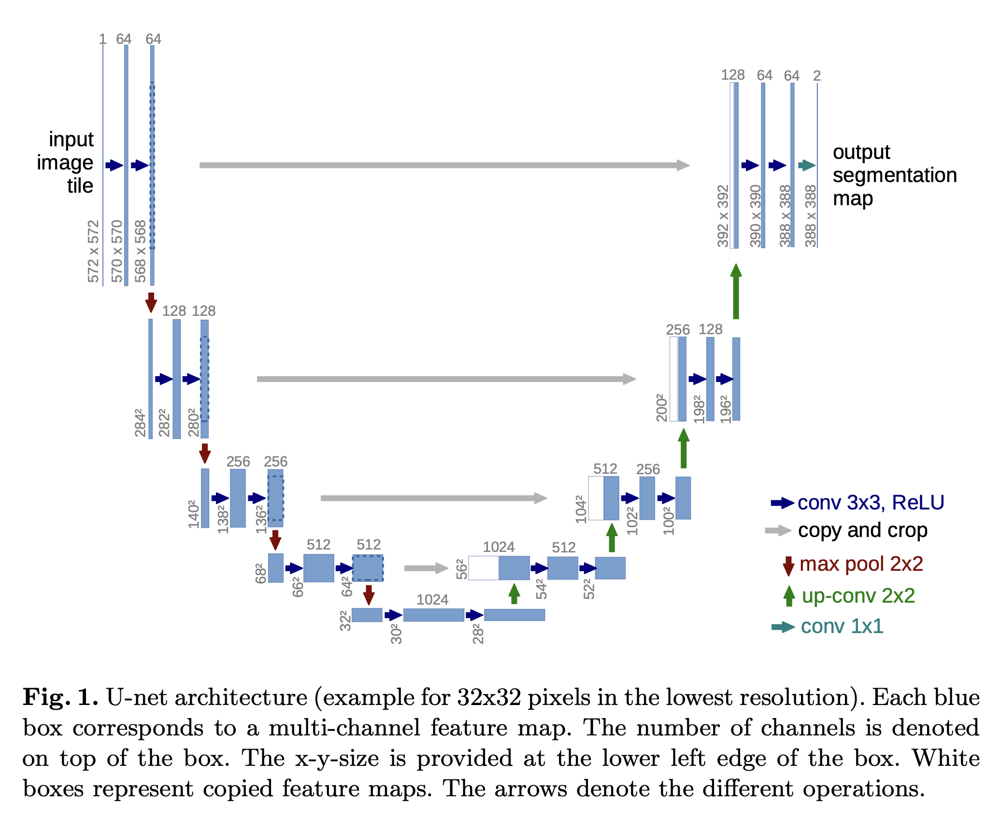
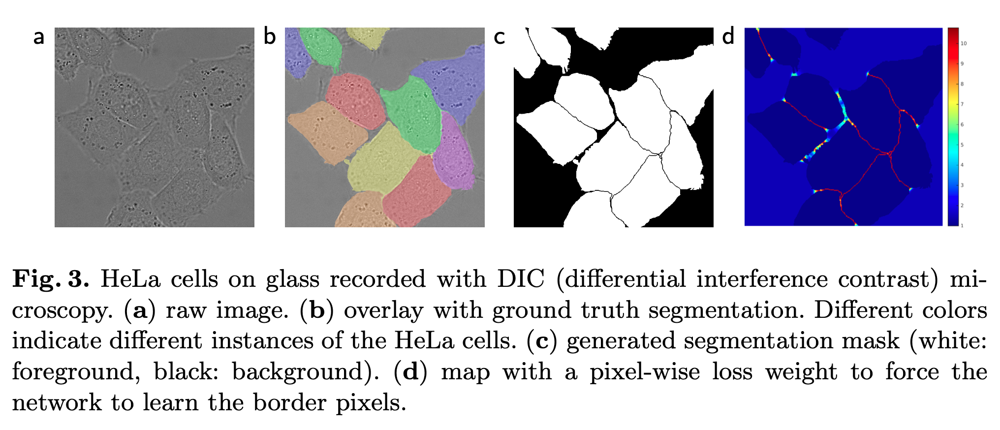

Paper: [U-Net: Convolutional Networks for Biomedical Image Segmentation](https://arxiv.org/pdf/1505.04597)

>   The u-net architecture achieves very good performance on very different biomedical segmentation applications.
>
>   U-Net 아키텍처는 매우 다양한 종류의 biomeidcal segmentation 응용 분야에서 아주 우수한 성능을 달성했다.

## Abstract

>   In this paper, we present a network and training strategy that relies on the strong use of data augmentation to use thaavailable anootated samples more efficiently.

2015년 당시 딥러닝은 대규모 데이터셋으로 학습해야 성능이 잘 나온다고 알려져 있었다. 하지만 annotation 작업이 매우 비싸고 전문 지식이 필요한 의료 이미지 분야에서는 '수천 개의 레이블링된 샘플'을 구하는 것이 거의 불가능했다. 데이터가 부족하니, 데이터 증강을 아주 적극적으로 사용해서 적은 수의 원본 이미지로 모델을 학습시켜야 했다. 이런 상황 속에서 나온 모델이 바로 UNet이다.

**UNet 구조**

-   **Contracting path(Encoder)**: 이미지를 압축(Down-sampling)하면서 전체적인 특징을 파악한다.
-   **Expanding path(Decoder)**: 이미지를 확대(Up-sampling)하면서 픽셀 단위로 위치를 복원한다.
-   **Symmetric(대칭)**: 인코더와 디코더가 U자 모양으로 대칭을 이룬다.

## Problem

기존의 CNN 구조는 이미지 전체에 대한 단일 클래스 레이블을 예측하는 분류 작업에 주로 사용되었다. 의료 분야에서는 픽셀 단위 정확환 클래스 분류가 요구되기에 CNN 구조만으로는 이를 해결하기 어렵다. 슬라이딩 윈도우 방식은 전체 이미지 대신 각 픽셀 주변의 영역을 입력으로 넣음으로 각 픽셀의 클래스를 분류할 수 있었다. 또한 패치로 쪼개진 이미지를 사용하기에 데이터 부족 문제를 일부 완화할 수 있었다. 그러나 각 패치마다 네트워크를 개별적으로 실행해야 하므로 처리 속도가 매우 느렸고, 패치들이 서로 중첩되기 때문에 동일한 영역의 정보가 여러 번 처리되어 계산상 비효율적이었다. 또한 패치의 크기를 키우면 더 많은 context 정보를 활용할 수 있지만, 이는 더 많은 Max Pooling 레이어를 필요로 하여 픽셀 단위의 위치 파악 정확도를 떨어뜨린다. 반대로 패치 크기를 줄이면 context 정보가 부족해진다.

## UNet

여기서는 UNet 의 구조와 학습 방법에 대해서 정리하였다.

### Network Architecture

UNet 의 전체 구조는 Fig. 1과 같이 구성된다. 그림의 왼쪽 부분은 축소 경로(contracting path)라 하고, 오른쪽 부분은 확장 경로(expansive path)라고 한다. 축소 경로에서는 이미지를 압축하고 확장 경로에서 이미지를 다시 복원한다.

1.   **Encoder - contracting path**

     축소 경로는 일반적인 CNN 구조를 따른다. 먼저 `Conv 3x3 + ReLU` 로 구성된 블록이 있다. 이 블록은 패딩이 없어서 이미지 크기가 테두리부터 조금씩 줄어든다. 다음으로 `Max Pooling 2x2` 로 구성된 블록은 이미지의 가로, 세로 크기를 절반으로 줄인다. 각 다운샘플링 단계마다, 우리는 피처 채널의 수를 두 배로 늘린다. 이는 공간 정보는 줄이고, 의미 정보를 늘리는 CNN 의 표준 전략이다.

2.   **Decoder - expansive path**

     확장 경로는 피처 맵을 업샘플링하고 축소 경로로부터 가져운 피처 맵과 결합한다. `Up-convolution (Transposed Conv)` 블록에서 압축된 특징 맵의 가로, 세로 크기를 두 배로 키우고, 채널 수는 절반으로 줄인다. 이 결과물을 인코더에서 같은 크기의 특징 맵을 채널 방향으로 합친다. 다만 패딩이 없는 컨볼루션을 사용했기에, 특징 맵의 크기가 컨볼루션을 지날 때마다 조금씩 작아진다. 마지막으로 2번의 `Conv 3x3 + ReLU` 를 통과한다.

마지막 레이어에서는 1x1 컨볼루션을 사용하여 64개 채널의 특징 벡터를 우리가 원하는 클래스 수로 매핑한다. 레이어의 크기가 홀수가 되는 것을 방지하기 위해 입력의 크기가 항상 짝수가 되도록 처음 입력 이미지의 크기를 572x572 로 설정하였다. UNet 은 패딩이 없는 컨볼루션을 사용하여 최종 출력 크기가 입력 크기보다 작아진다.

### Training

UNet 은 Overlap-tile 전략을 위해 가능한 한 큰 타일을 입력으로 받아야 한다. 하지만 큰 이미지는 GPU 메모리에 엄청나게 차지한다. 그래서 이미지 크기를 최대로 키우는 대신, 배치 사이지를 1로 고정하여 학습을 하게 된다. 이런 경우 한 장의 이미지에만 의존해서 가중치를 업데이트하기 때문에, 그 이미지가 노이즈가 많으면 모델이 잘못된 방향으로 학습할 수 있다. 즉, 학습이 매우 불안정해진다. 이를 높은 모멘텀(0.99)으로 찍어 눌러, 안정적인 학습이 가능하게 만들었다. 모멘텀 값이 0.99라는 것은, 현재 가중치 업데이트 방향을 결정할 때 99%는 지금까지 업데이트해 온 평균적인 방향(관성)을 따르고 단 1%만 현재 이미지의 정보를 반영한다는 것이다.

모델의 출력이 결정되면 모든 픽셀 각각에 대해 소프트 맥스를 적용하여 클래스 확률을 계산한다. 이 확률 값을 실제 정답과 모든 픽셀에 걸쳐 비교하여, 모델이 얼마나 틀렸는지를 계산한다. 소프트 맥스는 아래와 같이 계산된다.

$$p_k(x)=\exp(a_k(x))/(\sum_{k'=1}^K\exp(a_{k'}(x)))$$

$p_k(x)$ 는 픽셀 $x$ 가 클래스 $k$ 일 확률을 나타낸다. $a_k(x)$ 는 각 클래스 별 원시 점수(logit)이다. 이렇게 계산된 확률 값들을 이용하여 Cross-Entropy 를 적용해서 손실 함수를 계산한다.

$$E=\sum_{x\in\Omega}w(x)\log(p_{l(x)}(x))$$

$\sum_{x\in\Omega}$ 는 이미지의 모든 픽셀에 대해 합산하라는 의미이다. $\log(p_{l(x)}(x))$ 는 표준적인 크로스 엔트로피이다. 모델이 정답 클래스 $l(x)$ 에 대해 예측한 확률 값이다. 이 확률이 1에 가까울수록 Loss 는 0 이 되고, 0 에 가까울수록 Loss 는 무한대로 커진다. $w(x)$ 는 가중치 맵이다. 가중치 맵의 역할은 모델이 더 중요하게 봐야 할 픽셀을 알려준다. UNet 은 이 $w$ 값을 서로 붙어있는 세포들의 경계선에서 매우 높게 설정했다. 즉 모델이 배경을 100개 틀리는 것보다, 이 중요한 경계선 1개를 틀렸을 때 훨씬 더 큰 패널티를 받게 된다. 따라서 모델은 강제로 붙어있는 세포를 분리할 수 있도록 학습하게 된다.

Fig. 3 는 가중치 손실을 시각적으로 설명해준다. 어떻게 서로 뭉쳐있거나 붙어있는 세포들을 분리할 수 있을까? (a) 원본 이미지는 현미경으로 촬영한 입력 이미지이다. 세포들이 서로 경계가 불분명하게 뭉쳐있고 붙어있다. (b) 는 우리가 원하는 최종 정답으로 모델이 세포들을 각 인스턴스별로 분리하여 예측하기를 바란다. (c) 는 실제로 학습할 정답 레이블이고, 붙어 있는 세포와 세포 사이에는 배경으로 경계가 쳐져있다. (d) 는 위에서 설명한 $w(x)$ 가중치 맵이다. 파란색 영역은 낮은 가중치로 일반적인 배경이나 세포의 중심부이고, 이 영역은 모델이 틀려도 패널티가 적다. 빨간색 영역은 높은 가중치를 가지고 세포와 세포 사이의 경계선 영역이다. 즉 모델은 가중치 맵을 통해서 세포를 인스턴스별로 분리해낼 수 있게 된다.

이러한 가중치 맵을 모든 정답 라벨에 대해 미리 계산해 놓게 되고, 그 목적은 학습 데이터셋에서 특정 클래스 픽셀의 서로 다른 빈도수를 보정하고, 네트워크가 붙어있는 세포 사이에 작은 분리 경계를 학습하도록 강제하기 위함이다. 가중치 맵은 아래와 같이 계산된다. 

$$w(x)=w_c(x)+w_0\cdot\exp(-{(d_1(x)+d_2(x))^2\over2\sigma^2})$$

$w_c(x)$ 는 클래스 별 가중치, $w_0\exp(...)$ 는 세포 분리 가중치이다. $w_0$ 는 패널티 상수, $d_1(x)$ 는 픽셀 $x$ 에서 가장 가까운 세포의 경계선까지의 거리, $d_2(x)$ 는 픽셀 $x$ 에서 두 번째로 가까운 세포의 경계선까지의 거리이다. 픽셀 $x$ 가 두 세포 사이의 경계선에 있을 때, $d_1$, $d_2$ 모두 작다. 이 경우 $\exp$ 값은 1 에 가까워져 최종 가중치는 클래스 별 가중치에 패널티가 추가된다. 픽셀 $x$ 가 세포 한가운데 있거나 배경 한가운데 있을 경우, $d_1,\ d_2$ 모두 커서 $\exp$ 값은 0 에 가까워진다. 즉 최종 가중치는 클래스 별 가중치만 사용한다. 추가적으로 $\sigma\approx5$ 픽셀을 사용하였는데, 이는 얼마의 영역을 경계선으로 칠 지를 결정하는 표준편차의 역할을 한다. $\sigma$ 가 너무 작으면(1픽셀) 모델이 경계선을 정확히 맞추도록 학습하는 것은 매우 어렵고 불안정하다. $\sigma$ 가 반대로 크면(20픽셀) 경계선 영역이 너무 넓어져서 실제 세포의 내부까지 경계선 영역에 들어갈 수 있다. $\sigma\approx5$ 는 적당한 두께를 가진 경계를 형성한다.

딥러닝 모델에서는 가중치 초기화가 중요하다. 초기화를 잘못하면 모델의 어떤 부분은 과도한 활성화값을 출력하고, 다른 부분은 아예 학습에 기여조차 못하게 될 수 있다. 이상적으로, 초기 가중치는 모델의 모든 특징 맵이 대략 1의 분산을 갖도록 설정되어야 한다. UNet 에서는 ReLU를 쓸 때, 표준 편차를 $\sqrt{2/N}$ 으로 설정하는 He 초기화를 사용하였다. 여기서 $N$ 은 뉴런 하나로 들어오는 입력 노드의 수 이다.

### Data Augmentation

의료 이미지는 학습 데이터가 매우 부족한 문제가 있다. 이에 적은 데이터만으로도 네트워크가 불변성(invariance)과 강인성(Robustness)을 배우도록 하는 것이 중요하다. 불변성이란 이미지가 이동하거나 회전해도 같은 세포임을 인식하는 능력이고 강인성은 이미지가 찌그러지거나 명암이 변해도 흔들리지 않고 정답을 맞히는 능력이다.

논문에서는 매우 적은 이미지로 네트워크를 학습시키는 핵심 비결로 탄성 변형(elastic deformations)을 꼽았다. 실제 현미경으로 보는 생물 조직은 딱딱한 물체가 아니라, 고무처럼 부드럽게 휘어있거나 찌그러진 경우가 많다. 탄성 변형은 바로 이러한 실제 환셩의 변화를 가장 현실적으로 모방하는 방법이다. 이미지 위에 3x3 그리드를 만들어, 이 격자의 조종점들을 무작위 방향으로 잡아당기고, 보간법을 사용해 이 격자의 움직임을 따라 이미지 전체가 고무처럼 부드럽게 휘어지도록 최종 이미지를 생성하는 방법이다.