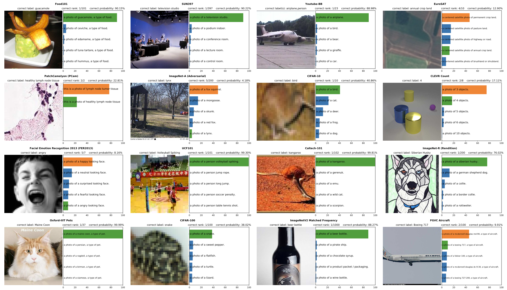
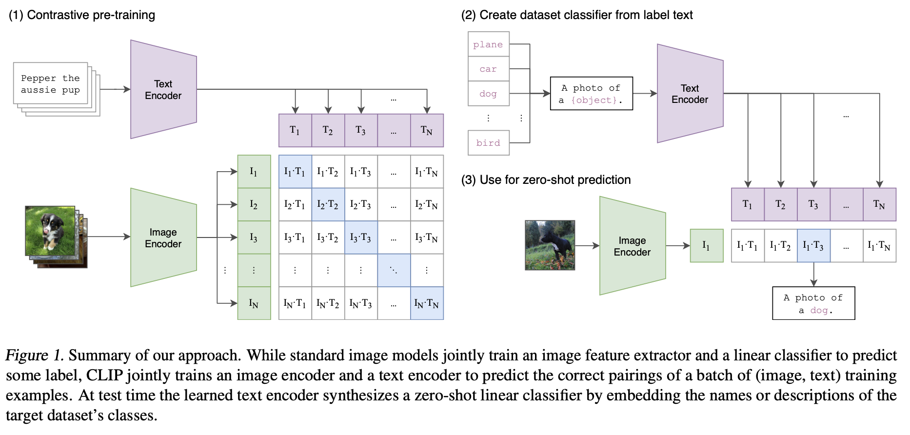
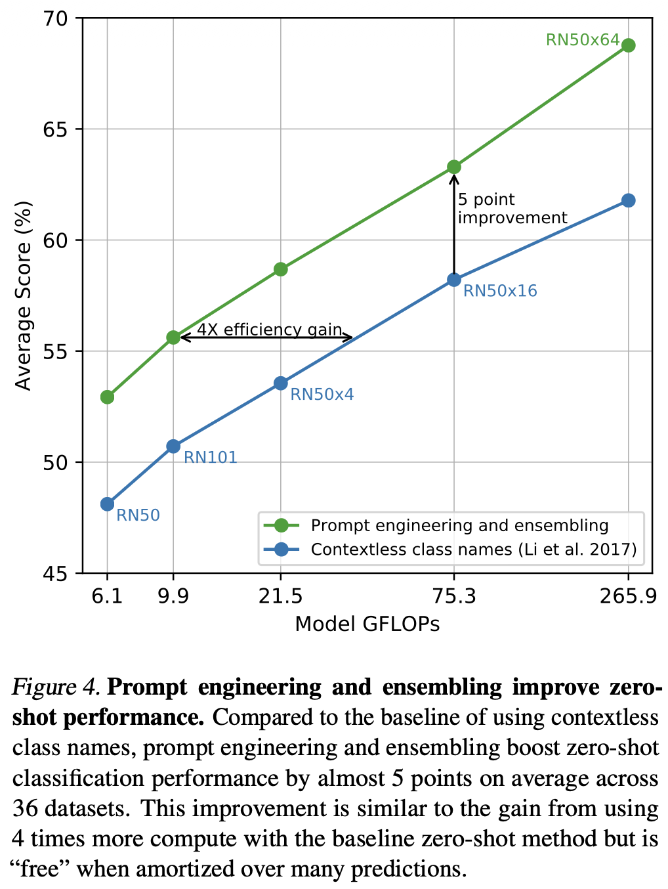
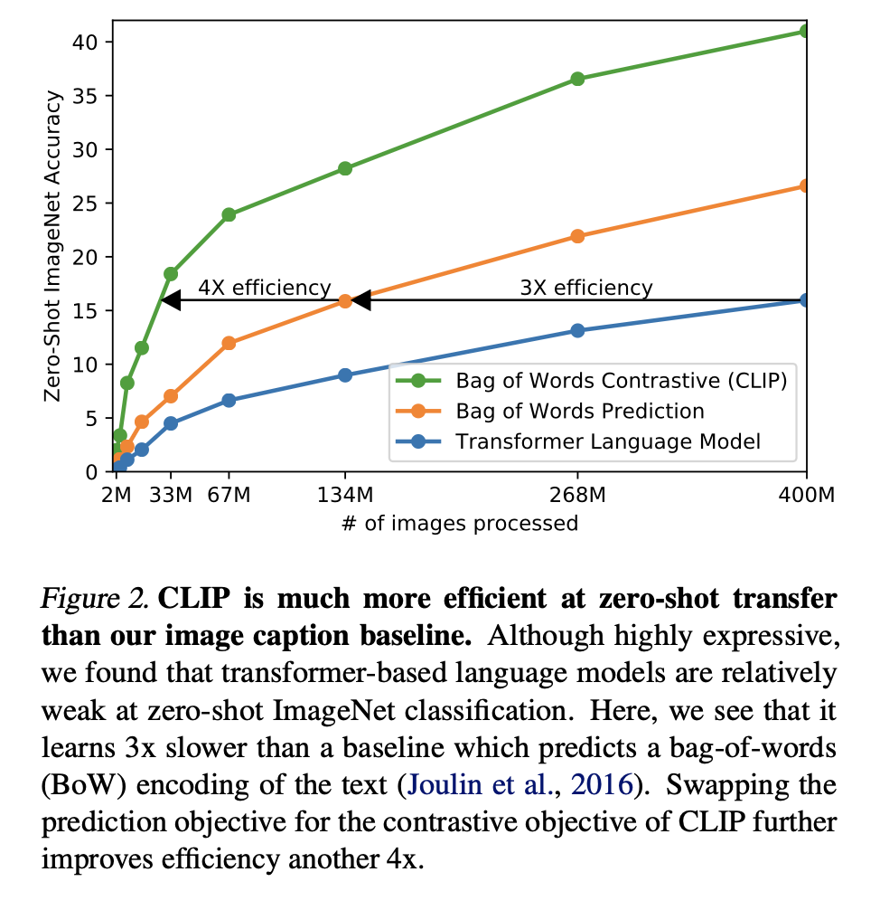
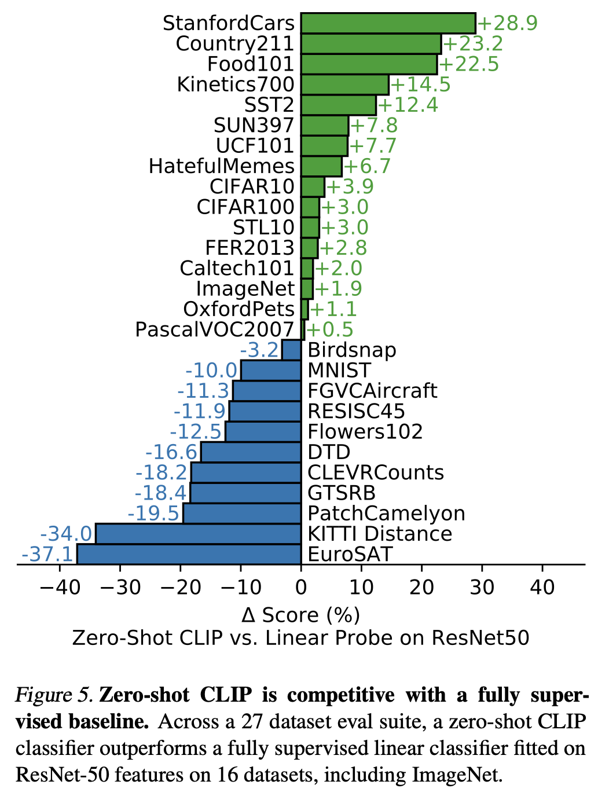
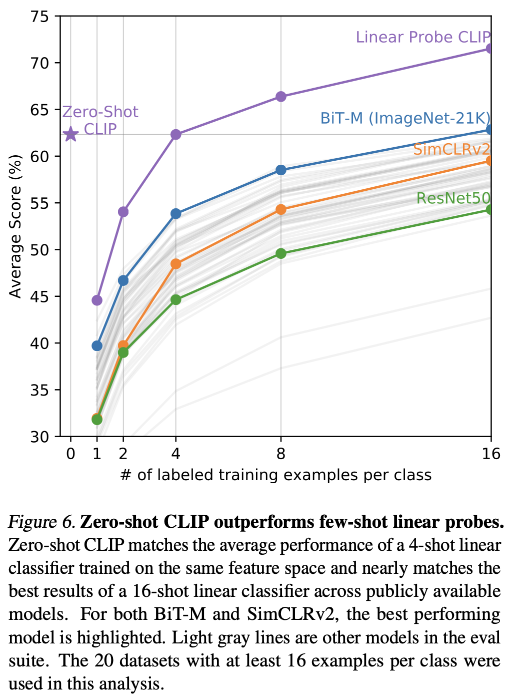
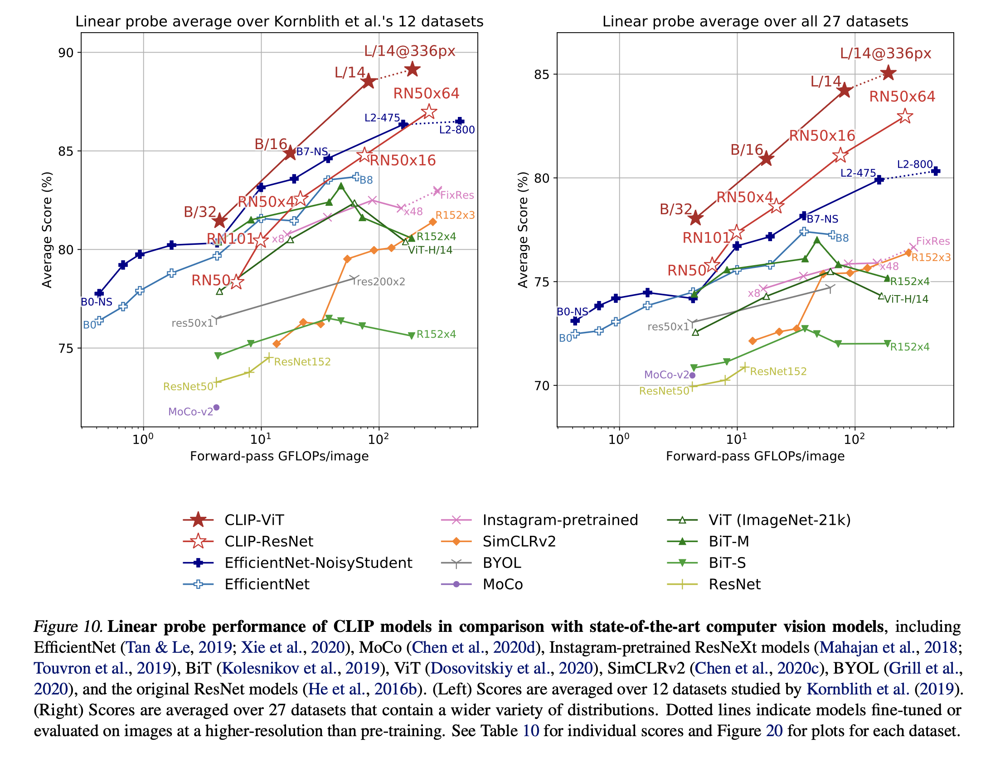

Paper: [Learning Transferable Visual Models From Natural Language Supervision](https://arxiv.org/pdf/2103.00020)

Code: [CLIP](https://github.com/OpenAI/CLIP)

Video: [DSBA 연구실 유튜브 논문 리뷰](https://www.youtube.com/watch?v=ZXrU79CUej8)

## Overview

CLIP(Contrastive Language Image Pre-training)은 인터넷의 방대한 텍스트를 활용해 이미지를 학습한 모델이다. (이미지, 텍스트) 쌍으로 이루어진 데이터로 미리 사전 학습한 모델로 데이터 쌍들의 올바른 짝을 찾는 것을 목표로 학습되었다. 올바른 짝은 코사인 유사도를 높이고, 틀린 짝은 코사인 유사도를 낮추는 방향으로 학습하여, 최종적으로 모델은 실제 이미지의 시각적 특징과 어울리는 텍스트의 의미를 파악하게 된다.

이렇게 사전 학습된 CLIP은 한 번도 본 적 없는 데이터에 대해서도 이미지 분류를 할 수 있게 되는데, 이를 Zero-Shot 분류라고 한다. 사전 학습이 이미지 분류가 아닌 유사도를 비교하는 방식으로 학습되었기에 이미지와 텍스트 사이의 관계성을 학습하게 되고, 이런 관계성을 바탕으로 새롭게 들어오는 데이터와 텍스트들의 유사도를 비교하기에 제로샷 분류가 가능하게 된다.



위 그림은 CLIP 이 제로샷 분류를 한 결과의 일부이다. 각 데이터셋에 맞는 프롬프트를 사용하여 분류를 진행했고, 초록색은 정답을 맞춘 경우, 주황색은 정답을 틀린 경우이다. 


## CLIP

### Model

CLIP의 작동 원리는 (1) 사전 학습, (2) 프롬프트 생성, (3) 제로샷의 단계로 볼 수 있다.



### Contrastive pre-training(대조 학습)

인터넷에서 수집한 수억 개의 (이미지, 텍스트) 쌍으로 모델이 학습된다. 입력으로는 배치 크기의 텍스트와 이미지가 각각의 인코더로 들어가게 된다. 두 인코더는 각각의 입력 데이터를 벡터로 변환한다. 이 벡터들을 가지고 유사도 행렬을 만들게 되고, 배치 크기가 N일 때 NxN 크기의 행렬이 생성된다. 이 행렬에서 대각 성분(파란색 대각선)들은 올바른 짝으로 1번 이미지와 1번 텍스트, 2번 이미지와 2번 텍스트, ... 모델은 이 대각 성분의 N개의 유사도 점수가 최대한 높아지도록 학습한다. 나머지 칸은 틀린 짝으로 1번 이미지와 2번 텍스트, 2번 이미지와 3번 텍스트 처럼 모델은 이 칸들의 유사도 점수가 최대한 낮아지도록 학습한다. 이렇게 대조 학습을 통해 Image Encoder는 어떤 이미지가 Text Encoder의 어떤 텍스트 의미와 같다는 것을 알게 된다. 즉, 시각 정보와 언어 정보가 같은 의미 공간(벡터)으로 연결된다.

#### Image Encoder

이미지 인코더의 역할은 이미지를 하나의 특징 벡터로 압축하는 것이다. CLIP 논문에서는 특정 모델 하나만 고집하지 않고, 두 가지 종류의 강력한 이미지 모델을 실험하고 사용한다. 저자들의 코드를 보면 `vision_layers` 라는 설정값에 따라 `ModifiedResNet` 또는 `VisionTransformer` 둘 중 하나를 생성해서 `self.visual` 이라는 변수에 저장한다.

```python
class CLIP(nn.Module):
    def __init__(self,
                 ...
                 vision_layers: Union[Tuple[int, int, int, int], int],
                 ...
                 ):
        super().__init__()

        # ... (생략) ...

        if isinstance(vision_layers, (tuple, list)):
            # vision_layers가 (3, 4, 6, 3) 같은 튜플이면 ResNet을 사용
            vision_heads = vision_width * 32 // 64
            self.visual = ModifiedResNet(
                layers=vision_layers,
                ...
            )
        else:
            # vision_layers가 12 같은 정수(int)이면 ViT를 사용
            vision_heads = vision_width // 64
            self.visual = VisionTransformer(
                layers=vision_layers,
                ...
            )
        
        # ... (텍스트 인코더 초기화) ...

    def encode_image(self, image):
        # 어떤 인코더가 선택되었든, self.visual을 호출해 이미지를 벡터로 만듭니다.
        return self.visual(image.type(self.dtype))

    # ... (forward 함수 생략) ...
```

**ResNet**

`Bottleneck` 클래스는 ResNet을 구성하는 기본 블록이다. `AttentionPool2d` 클래스는 ViT의 CLS 토큰과 유사한 아이디어를 CNN에 적용한 것이다. 특징 맵의 모든 위치를 'Key', 'Value'로 보고, 이미지 전체를 대표하는 하나의 'Query' 벡터가 어텐션을 수행하여 정보를 요약한다.

```python
def forward(self, x):
    # 1. 초기 3개 CNN 레이어 통과 (stem)
    x = x.type(self.conv1.weight.dtype)
    x = stem(x) # (stem은 conv1, 2, 3을 순서대로 실행)

    # 2. 4개의 거대한 ResNet 레이어(Bottleneck 묶음)를 차례로 통과
    #    이 과정에서 이미지는 점점 '압축'되고 '고차원' 특징이 됨
    x = self.layer1(x)
    x = self.layer2(x)
    x = self.layer3(x)
    x = self.layer4(x)

    # 3. [핵심] 마지막 특징 맵(Feature Map)을 AttentionPool2d로 압축
    #    (예: [Batch, 2048, 7, 7] 크기의 맵을 [Batch, 512] 벡터로 압축)
    x = self.attnpool(x)

    return x # 최종 이미지 벡터
```


**ViT(Vision Transformer)**

이미지를 패치로 자르고 CLS 토큰을 붙인 뒤 트랜스포머를 통과시켜 CLS 토큰의 최종 출력만을 가져와 이미지 전체의 벡터로 사용한다.

```python
def forward(self, x: torch.Tensor):
    # 1. 이미지를 패치로 만들고 임베딩 (self.conv1 사용)
    x = self.conv1(x)  # [Batch, Width, Grid, Grid]
    # 2. 패치들을 시퀀스(순서)로 펼침
    x = x.reshape(x.shape[0], x.shape[1], -1)  # [Batch, Width, NumPatches]
    x = x.permute(0, 2, 1)  # [Batch, NumPatches, Width]

    # 3. [CLS] 토큰(self.class_embedding)을 패치 시퀀스 맨 앞에 추가
    x = torch.cat([self.class_embedding.to(x.dtype) + torch.zeros(...), x], dim=1)

    # 4. 위치 정보(self.positional_embedding)를 더함
    x = x + self.positional_embedding.to(x.dtype)
    x = self.ln_pre(x)

    # 5. 트랜스포머 인코더 통과
    x = x.permute(1, 0, 2)  # (NLD -> LND) L: sequence_len, N:batchsize, D:dimension
    x = self.transformer(x)
    x = x.permute(1, 0, 2)  # (LND -> NLD)

    # 6. [핵심] 트랜스포머를 통과한 모든 토큰 중,
    #    오직 맨 앞의 [CLS] 토큰(x[:, 0, :])만 가져옴
    x = self.ln_post(x[:, 0, :])

    # 7. 최종 출력 차원으로 변환 (Projection)
    if self.proj is not None:
        x = x @ self.proj

    return x # 최종 이미지 벡터
```

#### Text Encoder

입력으로 들어온 토큰화된 프롬프트는 토큰 임베딩을 거치면서 각각의 고유한 벡터로 바뀐다. 트랜스포머는 순서를 모르기 때문에 위치 정보를 벡터로 만들어 더해준다. 이러면 각 토큰 벡터는 단어의 의미와 문장에서의 위치 정보를 모두 갖게 된다. 이 토큰 벡터들이 트랜스포머의 입력으로 들어가서 학습을 하게 되고, 출력 결과에서 End of Text 토큰만을 가지고 온다. 이 토큰은 문장 전체의 요약본으로 ViT의 CLS 토큰과 비슷한 개념이다. EOT 토큰 벡터는 이미지 벡터와 차원이 다르므로 같은 차원으로 맞춰주는 최종 작업을 거쳐 텍스트를 대표하는 의미 벡터가 된다.

```python
def encode_text(self, text):
    # 1. 토큰 임베딩
    x = self.token_embedding(text).type(self.dtype)  # [batch_size, n_ctx, d_model]

    # 2. 위치 임베딩 더하기
    x = x + self.positional_embedding.type(self.dtype)

    # 3. 트랜스포머 입력 형식으로 변경 (NLD -> LND)
    x = x.permute(1, 0, 2)  

    # 4. 메인 트랜스포머 통과
    x = self.transformer(x)

    # 5. 원래 형식으로 복구 (LND -> NLD)
    x = x.permute(1, 0, 2)  

    # 6. 후처리 정규화
    x = self.ln_final(x).type(self.dtype)

    # 7. [핵심] EOT 토큰의 벡터만 추출
    x = x[torch.arange(x.shape[0]), text.argmax(dim=-1)] @ self.text_projection

    return x
```

 

#### Loss function

이미지 &rarr; 텍스트 손실

$i$ 번째 이미지가 $N$ 개의 텍스트 중에서 자신의 짝인 $i$ 번째 텍스트를 맞추는 문제의 손실이다. 배치 내의 모든 이미지에 대해 이 손실을 계산하고 평균낸다.

$$L_\text{i2t}=-{1\over N}\sum_{i=1}^N\log({\exp(\text{sim}(I_i,T_i)/\tau)\over\sum_{j=1}^N\exp(\text{sim}(I_i,T_j)/\tau)})$$

텍스트 &rarr; 이미지 손실

$i$ 번째 텍스트가 $N$ 개의 이미지 중에서 자신의 짝인 $i$ 번째 이미지를 맞추는 문제의 손실이다. 배치 내의 모든 텍스트에 대해 이 손실을 계산하고 평균낸다.

$$L_\text{t2i}=-{1\over N}\sum_{i=1}^N\log({\exp(\text{sim}(I_i,T_i)/\tau)\over\sum_{j=1}^N\exp(\text{sim}(I_j,T_i)/\tau)})$$

위를 바탕으로 최종 CLIP 손실은 $L_\text{CLIP}={L_\text{i2t}+L_\text{t2i}\over2}$ 이다. 수식에서 $\exp/\sum\exp$ 은 소프트맥스 함수이고, 코사인 유사도라는 유사도 점수를 0과 1사이의 확률로 바꿔준다. $\log$ 에 $-$ 가 붙으면 크로스 엔트로피 손실이 된다. 크로스 엔트로피는 모델이 정답을 맞히면 벌점을 0에 가깝게 주고, 틀리면 엄청난 벌점을 부과하여 모델이 올바른 방향으로 학습하도록 유도한다.

$$p_\text{정답}\approx1\rightarrow L=-\log(1)=0$$

$$p_\text{정답}\approx0\rightarrow L=-\log(0)=\infty$$

### Create dataset classifier from label text(분류기 만들기)

사전 학습된 CLIP을 실제 제로샷 분류 문제에 사용하기 위해서는 준비가 필요하다. "plane", "car", ... 클래스를 가진 데이터셋을 분류하고 싶을 때 단순히 클래스 라벨만을 사용하는 대신, "**a photo of a [object]**"처럼 구체적인 프롬프트를 만든다. 논문에서는 이 방식이 성능이 더 좋다고 나온다. 이 프롬프트들을 사전 학습 때 사용해던 Text Encoder 에 넣고, 각 프롬프트를 벡터로 바꾸어 분류를 준비한다.



Figure 4. 는 동일한 ResNet 계열을 사용한 CLIP 모델들이 제로샷 분류를 할 때 사용하는 텍스트 프롬프트 방식에 따른 성능 차이른 보여준다.

1.   🟦 : Contextless class names

     분류할 클래스 이름을 그대로 텍스트 인코더에 넣는 방식이다.

2.   🟩 : Prompt engineering and ensembling

     위의 예시처럼 문맥을 만들어주는 프롬프트를 사용하는 방식이고, 앙상블은 하나의 프롬프트가 아닌 여러 프롬프트를 만들어 결과를 평균 내는 기법을 말한다.

그래프를 통해 동일한 모델을 사용해도 프롬프트를 생성하여 분류를 하는 것이 약 5점 더 높은 성능을 얻었다. 또한 동일한 성능을 내기 위해 훨씬 작은 모델로도 프롬프트만 사용하면 충분하다는 점을 보여준다.


### Use for zero-shot prediction(제로샷 예측)

제로샷 분류는 사전 학습 때 본 적 없는 새로운 이미지를 분류하는 것이다. 새로운 이미지를 Image Encoder 에 넣고 생성된 벡터를 프롬프트를 기반으로 생성된 벡터와 비교한다. 이 과정에서 가장 유사도 점수가 높은 프롬프트 벡터를 가지고 정답 클래스를 예측하게 된다.

#### Zero-shot vs BoW vs transformer



위 그래프는 "**CLIP의 대조 학습 방식이 다른 방식들보다 훨씬 적은 데이터로도 더 높은 제로샷 성능을 달성한다**" 즉, **데이터 효율성이 매우 뛰어나다**는 것을 보여준다. Y축은 "Zero-Shot ImageNet Accuracy"로 모델이 학습 과정에서 본 적 없는 ImageNet 데이터셋을 얼마나 정확하게 분류하는지 나타내는 성능 점수, X축은 "# of images processed"로 모델을 학습시키는데 사용된 (이미지, 텍스트) 쌍의 데이터 양을 의미한다.

1.   🟩 : Bag of Words Contrastive(CLIP)

     (이미지, 텍스트) 짝을 주고, 올바른 짝은 가깝게, 틀린 짝은 멀게 만드는 Contrastive 을 사용한다.

2.   🟧 : Bag of Words Prediction

     이미지를 보고 연관된 텍스트(Bag of Words)를 예측하도록 학습한다.

3.   🟦 : Transformer Language Model

     이미지를 보고 캡션을 생성하도록 학습하는 기존의 트랜스포머 모델이다.

Figure 2.를 보면 같은 정확도 달성을 위해 기존 트랜스포머 방식은 BoW 방식보다 3배 더 많은 데이터를 필요로 한다. 또한 CLIP 은 BoW 보다 4배 더 효율적인 것을 보여준다. 즉, 적은 데이터로도 같은 성능을 달성할 수 있음을 보여주는 그래프이다.

#### 분류기(Linear Probe)

Linear Probe 란 이미 훈련된 모델이 학습한 가중치가 얼마나 좋은지를 확인할 수 있는 방법이다. CLIP 이나 ResNet 같은 모델은 이미지를 고차원의 특징 벡터로 압축하기에 뒤에 분류기를 추가하여 퓨샷 러닝이 가능하도록 한다. 퓨샷 러닝을 할 모델의 모든 가중치를 얼리고(freeze), 이 가중치들은 모델이 다시 학습할 때 업데이트 되지 않는다. 모델 뒷단에 선형 분류기를 추가하여 새로운 데이터셋을 가지고 학습하게 된다. 오직 새로 추가된 선형 분류기 하나만 가중치가 고정된 인코더를 거쳐서 나온 특징 벡터를 가지고 학습하는 것이기에 모델 학습에 드는 비용도 적고, 간단하게 새로운 데이터셋에 대한 추론을 할 수 있다.

#### CLIP vs ResNet50



Figure 5. 는 CLIP의 제로샷 능력이 얼마나 대단한지를 보여준다. 제로샷을 한 CLIP이 훈련 데이터를 다 보고 추론한 ResNet50을 27개의 데이터셋 중 16개에서 우위를 차지한다. ResNet50은 이미지넷으로 사전 학습된 모델에 분류기를 학습시킨 결과를 바탕으로 비교하였다.

#### Zero-shot vs Few-shot



Figure 6. 는 CLIP의 제로샷 능력이 퓨샷과 비교하여 어떻게 다른지를 보여준다. 훈련 데이터를 0개 본 제로샷 CLIP이, 다른 최고 성능의 모델들이 기본적으로 16개를 본 퓨샷 결과와 비슷하다. 퓨샷 결과와 비교했을 때는 제로샷이 4개의 훈련 데이터로 학습시킨 결과와 비슷하며, 그 이하로는 성능 우위에 있고, 그 이상으로는 퓨샷이 더 강력하다. 이를 통해 분류기를 학습시키기 위해서는 어느 정도의 데이터가 필요하다는 것을 알 수 있다.

#### Result



Figure 10. 은 CLIP의 이미지 인코더가 다른 모든 SOTA 모델들과 비교했을 때 어떤지를 보여준다. 
