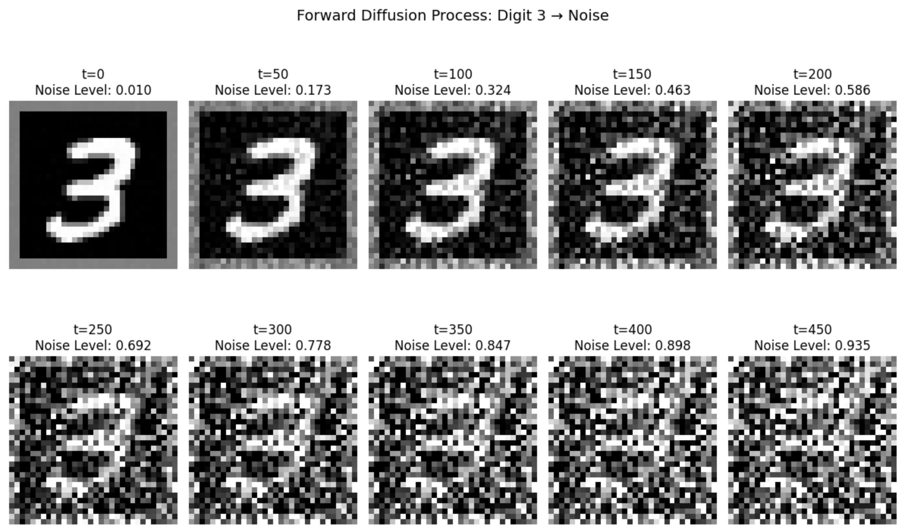
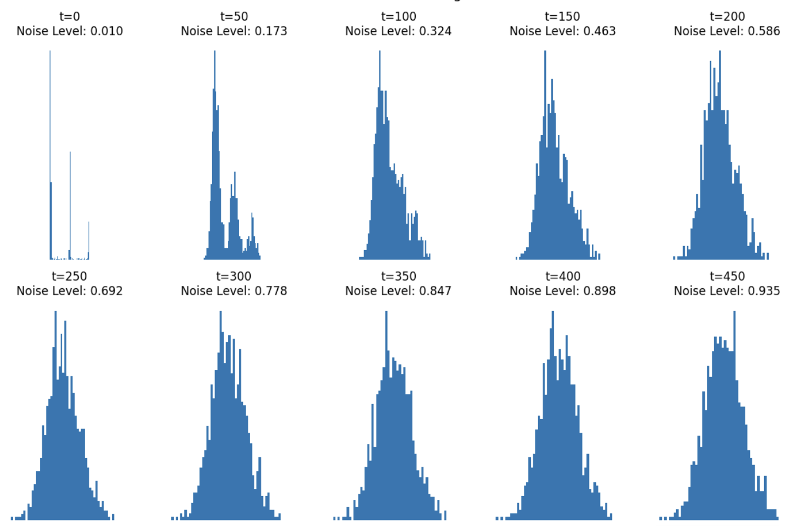

## 이미지에 노이즈를 추가하는 과정

Diffusion 모델은 이미지에 노이즈를 추가하는 과정을 거치고, 역연산을 진행해 노이즈를 제거하면서 이미지를 생성하는 모델이다. 그렇다면 이미지에 노이즈를 어떻게 추가해주는 것일까? 오늘은 해당 내용의 대한 정리를 해보았다.

데이터가 어떤 분포를 따른다고 하자. 이 데이터에 계속해서 정규분포를 계속해서 더해주면, 원래의 분포 형태가 점차 무너지고 결국에는 넓게 퍼진 정규 분포와 구분이 안되는 상태가 된다. 이러한 현상이 발생되는 이유가 무엇일까?

우리는 이미지 생성이 목적이므로 여기서 데이터란 이미지이다. 원래 이미지의 분포를 $p(x)$ 라고 하고, 더해주는 노이즈 $z$ 는 표준 정규 분포를 따른다고 하자. $x$ 에 $z$ 를 계속해서 더해주게 되면, 원본 이미지는 노이즈에 오염된다. 이때 더해주는 $z$ 의 값들은 샘플링 된 값이기에 서로 다르다.

$$y = x + z_1 + z_2 + \cdots + z_n$$

$n$ 이 커질수록, 즉 추가되는 노이즈 횟수가 증가할수록, $y$ 는 원본 이미지에 대한 정보를 잃게 된다. 여기서 중요한 개념이 등장하는데, 바로 중심극한정리(Central Limit Theorem)이다.

**"어떤 형태의 분포든, 독립적인 확률 변수를 많이 더하면 그 합의 분포는 정규 분포에 가까워진다."**

원래 데이터 $x$ 가 어떤 이미지든간에, 어떤 분포를 갖고 있어도, 이미지에 노이즈를 계속 더해서 합치면, 그 결과물 $y$ 의 분포 형태는 정규 분포를 따르게 된다. 다만, 독립적인 변수들을 더할 때, 평균과 분산은 서로 더해진다. 즉, 현재 상태에서 $y$ 는 평균은 $x$ 의 평균을 갖고, 분산은 $x$ 의 분산에 $n$ 만큼 더해진 값을 가진다. 

$$\mathbf E[y]=\mathbf E[x+z]=\mathbf E[x]+\mathbf E[z]$$

$$\mathbf{Var}(y)=\mathbf{Var}(x)+\mathbf{Var}(z)+\cdots$$

$$y\sim\mathcal N(\mathbf E[x],\infty)$$

우리의 목표는 $y$ 가 표준 정규 분포를 따르도록 하는것이다. 그래서 노이즈를 더할 때, 원래 이미지를 조금씩 축소시키는 과정이 필요하다.

$$x_t=\sqrt{1-\beta_t}\cdot x_{t-1}+\sqrt\beta_t\cdot Z_t,\quad Z_t\sim\mathcal N(0, I)$$

이렇게 하면 분산이 발산하지 않고 일정하게 유지되면서, 원래 이미지의 정보는 0으로 수렴하고 순수한 노이즈만 남게 된다. 즉, 완벽한 표준 정규 분포로 변하게 된다.

## 유도 과정

지금부터는 위의 내용을 유도해서 위의 내용을 증명해보겠다. 

$$x_t=\sqrt{1-\beta_t}\cdot x_{t-1}+\sqrt\beta_t\cdot Z_t,\quad Z_t\sim\mathcal N(0, I)$$

여기서 $\alpha_t = 1-\beta_t$ 라고 정의하면, $x_t=\sqrt{\alpha_t}\cdot x_{t-1}+\sqrt{1-\alpha_t}\cdot Z_t$ 이다.

$t=1$ 일 때, $x_1=\sqrt\alpha_1\cdot x_0+\sqrt{1-\alpha_1}\cdot z_1$ 이다. $t=2$ 일 때, $x_2=\sqrt\alpha_2\cdot x_1+\sqrt{1-\alpha_2}\cdot z_2$ 이다. 두 식을 합치면 아래와 같이 나오는데,

$$x_2=\sqrt\alpha_2\cdot(\sqrt\alpha_1\cdot x_0+\sqrt{1-\alpha_1}\cdot z_1) +\sqrt{1-\alpha_2}\cdot z_2$$

$$x_2=\sqrt{\alpha_2\cdot\alpha_1}\cdot x_0+\sqrt{\alpha_2\cdot(1-\alpha_1)}\cdot z_1+\sqrt{1-\alpha_2}\cdot z_2$$

이를 $t$ 시점에 대해서 표준화하면

$$x_t=\sqrt{\alpha_t\cdot\alpha_{t-1}\cdots\alpha_1}\cdot x_0+\text{noise}$$

여기서 $\text{noise}$ 항을 자세히 살펴보겠다. $x_2$ 에서 $\text{noise}$ 는 $\sqrt{\alpha_2\cdot(1-\alpha_1)}\cdot z_1+\sqrt{1-\alpha_2}\cdot z_2$ 였다. 이를 하나의 노이즈로 만드는 작업을 진행하겠다.

두 노이즈를 합친 합성 노이즈의 평균은 0이다. 두 노이즈의 기대값이 0이기 때문이다.

$$\mathbf E[N_1+N_2]=0$$

분산은 독립이므로 합쳐지는데, 기존의 두 노이즈의 분산이 1이므로,

$$\mathbf{Var}(N_1+N_2)=\mathbf{Var}(N_1)+\mathbf{Var}(N_2)=\alpha_2(1−\alpha_1)\mathbf{Var}(z_1)+(1−\alpha_2)\mathbf{Var}(z_2)$$

$$=\alpha_2(1−\alpha_1)⋅1+(1−\alpha_2)⋅1\\=\alpha_2−\alpha_2\alpha_1+1−\alpha_2\\=1−\alpha_2\alpha_1$$

합성 노이즈의 평균에 대해서 자세히 보면 $\mathbf E[N_t]=\mathbf E[\sum_ic_iz_i]$ 이다. $N_t=\sum_ic_iz_i$ 이기 때문이다. 기대값(평균)은 선형성을 가지므로, 합의 기대값은 기대값의 합과 같다. 즉, $\mathbf E[N_t]=\sum_i\mathbf E[c_iz_i]$ 이다. $c_i$ 는 상수이므로 기대값 밖으로 꺼내면, $\sum_ic_i\mathbf E[z_i]$ 가 되고, $\mathbf E[z_i]=0$ 이므로 $\mathbf E[N_t]=0$ 이다. 노이즈의 평균이 0이므로, 아무리 많이 더해도 최종 평균은 0이다.

분산은 편차($z-\mathbf E[z]$)의 제곱의 평균이므로, 상수 $c_i$ 는 제곱되어 밖으로 나온다. $\mathbf{Var}(c_iz_i)=c_i^2\cdot\mathbf{Var}(z_i)$. $\mathbf{Var}(z_i)=1$ 이므로 $Var(c_iz_i)$ 는 $c_i^2$ 이 된다. 따라서 합성 노이즈의 분산 $\mathbf{Var}(N_1+N_2)=c_1^2+c_2^2$ 이 된다. $t$ 가 2인 시점에서는 이 값이 $1-\alpha_2\alpha_1$ 이다.

최종적으로, $\text{noise}\sim\mathcal N(0,1-\alpha_2\alpha_1)$ 이므로, $\text{noise}$ 를 표준 정규 분포의 형태로 나타내면 $\sqrt{1-\alpha_2\alpha_1}\cdot\epsilon$ 이 된다. 정규 분포를 표준 정규 분포로 바꾸는 표준화 방법은 간단하다. $\tilde z\sim\mathcal N(0,1)$ 일 때, $\tilde z={\text{noise}-\mu\over\sigma}$ 이다. $\mu$ 는 0, $\sigma$ 는 $\sqrt{1-\alpha_2\alpha_1}$ 이므로, $\tilde z={\text{noise}\over{1-\alpha_2\alpha_1}}$ 이다. 이를 $\text{noise}$ 에 대해서 다시 정리하면, $\sqrt{1-\alpha_2\alpha_1}\cdot\tilde z$ 이다. 

지금까지 한 내용을 $t$ 시점에 대해 다시 구하게 되면,

$$x_t=\sqrt{\tilde\alpha_t}x_0+\sqrt{1-\tilde\alpha_t}\epsilon$$

이다. $\sqrt{\tilde\alpha_t}$ 는 원본 이미지 $x_0$ 의 영향력을 나타내고, $\sqrt{1-\tilde\alpha_t}$ 는 노이즈 $\epsilon$ 의 영향력을 나타낸다. 여기서 $\tilde\alpha_t$ 는 $\alpha_t\cdot\alpha_{t-1}\cdots\alpha_1$ 이다. 시간 $t$ 가 계속해서 커지면 $\sqrt{\tilde\alpha_t}$ 는 0으로 가고, $\sqrt{1-\tilde\alpha_t}$ 는 1로 가게 된다. 즉, 원본 이미지의 형태는 완전히 사라지고, 순수한 $\epsilon$ 만 남게 된다.

$$x_t\approx0\cdot x_0+1\cdot\epsilon,\quad \epsilon\sim\mathcal N(0,\mathbf I)$$

$\epsilon$ 은 단일 변수 처럼 보이지만, 확산 과정의 모든 단계에서 투입된 개별 노이즈 $z_1,z_2,...,z_t$ 들의 가중 평균으로 분해된다.

$$\epsilon={1\over\sqrt{1-\tilde\alpha_t}}\sum_{i=1}^t\text{Weighted}(z_i),\quad \text{Weighted}(z_i)=c_iz_i$$

$\epsilon$ 은 개별 노이즈들의 복잡한 조합이지만, 정규 분포들의 합은 언제나 정규 분포를 따르기 때문에, $\epsilon$ 은 평균 0, 분산 $\mathbf I$ 로 볼 수 있다.

최종적으로 Diffusion Process 는 복잡한 이미지 $x_0$ 를 수학적 스케일링을 통해 평균 0, 분산 1인 표준 정규 분포를 따르는 노이즈 $\epsilon$ 으로 변환하는 과정이다.

---

**정규 분포를 표준 정규 분포로 바꾸는 표준화**

$$z={x-\mu\over\sigma},\quad z\sim\mathcal N(0,1),\quad x\sim\mathcal N(\mu,\sigma)$$

평균 변환($\mathbf E[z]=0$)

기대값의 선형성($\mathbf E[aX+b]=a\mathbf E[X]+b$)을 이용하면, $\mathbf E[z]=\mathbf E[{x-\mu\over\sigma}]={1\over\sigma}(\mathbf E[x]-\mu)={1\over\sigma}(\mu-\mu)=0$ 이다.

분산 변환($\mathbf{Var}(z)=1$)

분산의 성질($\mathbf{Var}[aX+b]=a^2\mathbf{Var}[X]$)을 이용하면, $\mathbf{Var}[z]=\mathbf{Var}[{x-\mu\over\sigma}]={1\over\sigma^2}\mathbf{Var}[x]={1\over\sigma^2}\sigma^2=1$ 이다.

