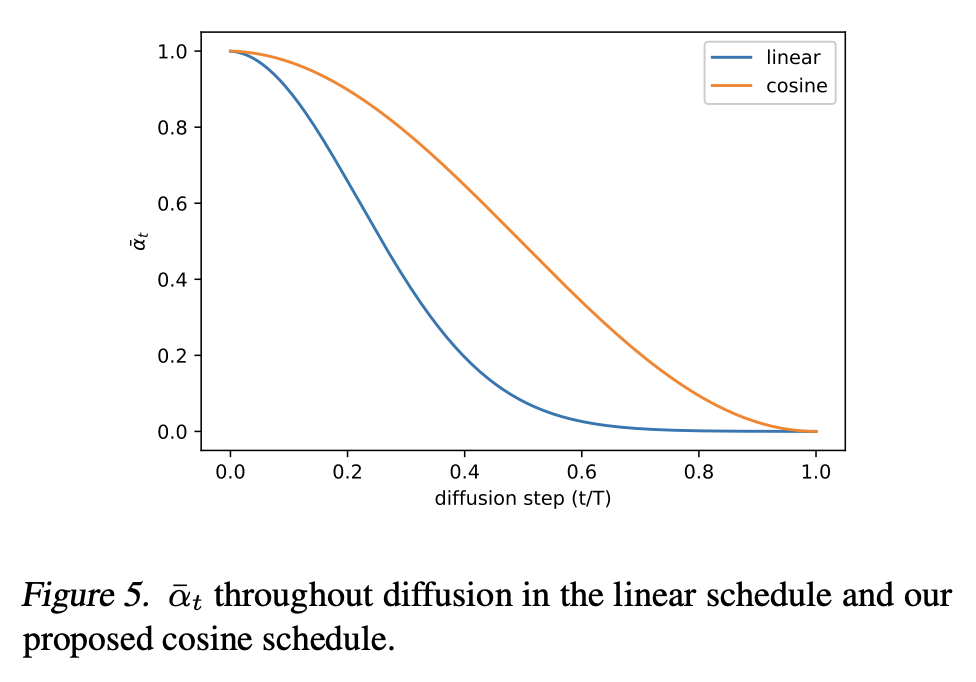

paper: [Improved Denoising Diffusion Probabilistic Models](https://arxiv.org/pdf/2102.09672)

해당 논문 전체를 보고 공부한 것이 아니기에, 부족한 내용은 논문에서 참고하면 된다.

## Cosine Noise Scheduler

기존의 Linear Schedule 은 위의 이미지에서 나온 것처럼 초반에 노이즈가 너무 급격하게 끼어서, 후반부 단계(t가 큰 구간)가 사실상 의미 없어지는 문제가 있다. 이를 해결하기 위해 Cosine Schedule 이 도입되었다. 이는 $\tilde{\alpha}_t$ 가 천천히 떨어지도록 코사인 제곱 함수를 사용하는 방법이다.

$$\tilde{\alpha}_t={f(t)\over f(0)}, \quad f(t)=\cos^2({t/T+s\over 1+s}\cdot{\pi\over 2})$$

$s$ 는 작은 오프셋(0.008)로, 이게 없으면 $t$ 가 0일 때 $\beta_t$ 가 너무 작아져서, 모델이 초반 노이즈를 예측하는 데 어려움이 있다. 위 식에서 구한 $\tilde{\alpha_t}$ 를 바탕으로 $\beta_t=1-{\tilde{\alpha}_t\over\tilde{\alpha}_{t-1}}$를 계산한다. 우리는 기본적으로 $T$ 는 1000으로 설정하고, $f(0)$ 는 1에 근접한 값(0.9998)을 갖는다. 코사인 함수를 제곱해서 쓰는 이유는 그냥 코사인을 쓰면 감소 속도가 빠르다. 제곱을 하면 0과 1 근처에서 기울기가 더 평평해져서 변화가 부드러워진다. $\pi\over2$ 를 쓰는 이유는 코사인 함수가 1에서 0으로 떨어지는 구간이 0과 $\pi\over2$ 사이이기 때문에, 입력값(t)을 이 범위로 매핑해준다. 

아주 간단한 방법이지만 기존의 스케줄러 대신해서 쓰면 원본 이미지의 영향을 좀 더 가질 수 있다.