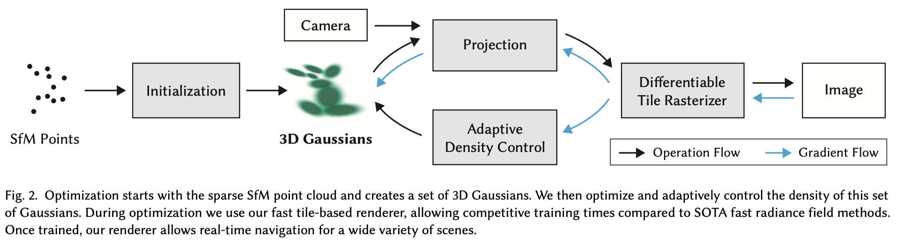
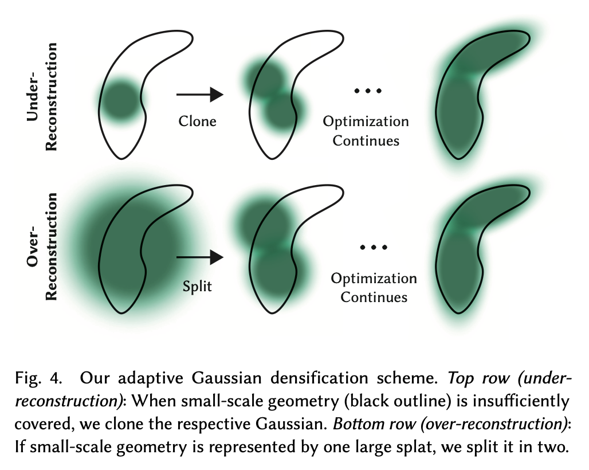

Paper: [3D Gaussian Splatting for Real-Time Radiance Field Rendering](https://arxiv.org/pdf/2308.04079)

논문에서는 장면을 anisotropic 3D Gaussian의 집합으로 표현하고 rasterization 기반 splatting 렌더링을 사용하여, NeRF와 비슷한 품질을 유지하면서도 훨씬 빠른 실시간 novel view synthesis를 가능하게 하는 방법을 제안한다.

기존 neural rendering 방법의 대표적인 예는 NeRF다. NeRF는 장면을 하나의 함수로 표현하는 continuous radiance field 방식이다. 픽셀마다 ray를 쏘고 ray 위에서 여러 위치를 샘플링하여 density와 color를 계산한 뒤 이를 누적해 이미지를 만든다. 이 방법은 품질은 높지만 volumetric ray-marching을 사용하기 때문에 계산량이 매우 크다. 픽셀마다 많은 샘플을 계산해야 하므로 렌더링 속도가 느리고 실시간 처리가 어렵다.

반면 전통적인 point-based rendering은 장면을 점들의 집합으로 표현하고 화면에 rasterization하는 방식이다. 이 방식은 매우 빠르지만 점 사이에 구멍이 생기거나 표면이 불연속적으로 보이는 문제가 있다. 이후 연구에서는 점을 작은 원이나 타원 형태로 퍼뜨리는 splatting을 사용하여 이런 문제를 줄였다. 최근에는 point에 neural feature를 붙이거나 CNN으로 렌더링하는 방법도 등장했지만, 여전히 MVS geometry에 의존하거나 ray-marching을 사용해 속도가 느린 문제가 있었다.

이 논문의 핵심 아이디어는 장면을 3D Gaussian primitives의 집합으로 표현하는 것이다. Gaussian 하나는 위치와 모양을 가지는 3D 타원체라고 볼 수 있다. 각 Gaussian은 다음 파라미터로 정의된다.

-   중심 위치 $\mu$
-   anisotropic covariance(공분산) 행렬 $\Sigma$
-   opacity $\alpha$
-   방향 의존 색을 위한 SH coefficient(계수)


## Method

3D Gaussian Splatting이란 SfM으로 얻은 sparse point cloud를 기반으로 3D Gaussian들을 생성하고, position, covariance, opacity, color 파라미터를 최적화하여 radiance field를 학습하며, tile-based rasterization과 $\alpha$-blending을 이용해 매우 빠르게 장면을 렌더링한다. 최적화 과정에서는 파라미터를 업데이트하면서 동시에 Gaussian density를 적응하면서 조절한다.



### 3D Gaussian Splatting

3D Gaussian은 미분 가능하면서 2D splat으로 쉽게 투영될 수 있어 렌더링 시 빠른 $\alpha$ blending이 가능하다. SfM으로 부터 생성된 Gaussian은 point $\mu$ 를 중심으로 하고 3차원 공분산 행렬 $\Sigma$ 에 의해 정의된다.


$$G(x)=e^{-{1\over2}(x)^T\Sigma^{-1}(X)}$$


가장 기본적인 Gaussian(정규분포)은 1차원에서 $f(x)=e^{-{(x-\mu)^2\over2\sigma^2}}$ 이다. 이 식은 $x=\mu$ 일 때 값이 최대이고, 중심에서 멀어질수록 값이 지수적으로 감소한다. $x$ 가 하나의 숫자가 아니라 벡터라면

$$x = \begin{bmatrix} x_1 \\ x_2 \\ x_3 \end{bmatrix}$$

단순히 확장하면 $(x_1-\mu_1)^2+(x_2-\mu_2)^2+(x_3-\mu_3)^2$ 의 형태가 된다. 거리의 제곱이다. 이는 $\Vert x-\mu\Vert^2$ 과 같다. 그래서 3D Gaussian은 $e^{-\frac{\Vert x-\mu\Vert^2}{2\sigma^2}}$ 가 된다. 이 경우 Gaussian 모양은 구(sphere)가 된다. 실제 데이터는 모든 방향으로 동일하게 퍼지지 않는다. $x$ 방향으로 길고 $y$ 방향으로 짧을 수 있다. 이걸 표현하기 위해 $\Sigma$ 공분산 행렬을 사용한다.


$$(x-\mu)^T\Sigma^{-1}(x-\mu)$$


이 Gaussian들은 $\alpha$ blending을 통해 픽셀 색을 결정하는데 사용된다. $\alpha$ blending이란 여러 개의 반투명 객체가 겹칠 때 색을 섞어서 최종 픽셀 색을 계산하는 방법이다. opacity $\alpha$ 란 투명도를 의미하는데, 0일때 완전히 투명하고, 1일때 불투명하다. 렌더링에서 어떤 두 픽셀이 겹친다고 가정했을 때, 앞에 있는 객체의 색이 $C_f$, opacity $\alpha_f$ 이고 뒤에 있는 객체의 색이 $C_b$ 이면 최종 픽셀 색은 다음처럼 계산된다.


$$C=\alpha_f C_f+(1-\alpha_f)C_b$$


앞 객체가 $\alpha_f$ 만큼 색을 차지하고 나머지는 뒤 객체가 보이는 것이다. 3D Gaussian Splatting에서는 한 픽셀에 여러 Gaussian이 겹친다. 그래서 depth 순서로 Gaussian을 정렬한 뒤 다음 식으로 색을 계산된다.

$$C=\sum_iT_i\alpha_ic_i,\quad T_i=\prod_{j<i}(1-\alpha_j)$$

 $c_i$ 는 Gaussian 색, $\alpha_i$ 는 Gaussian opacity, $T_i$ 는 앞 Gaussian들이 가린 정도이다. 3D Gaussian Splatting에서 Gaussian은 volumetric density를 나타내기 때문에 여러 Gaussian이 동시에 한 픽셀에 영향을 준다. $\alpha$ blending을 통해 이 영향들을 자연스럽게 합치는 것이다. 이 식은 NeRF의 volumetric rendering 식과 거의 동일한 형태이다.

---

3D Gaussian의 등밀도면은 ellipsoid(타원체)이므로 렌더링(3D 장면 정보를 이용해서 2D 이미지를 계산하는 과정)을 하려면 2D Gaussian splat으로 변환해야 한다.

1.   **Viewing transformation**

     먼저 3차원 위치 정보를 카메라 공간으로 변환하는 선형 변환이 필요하다. 확률 변수 $x$ 가 Gaussian이라고 할 때 $x\sim N(\mu,\Sigma)$, 선형변환 $x_c=Wx$ 를 적용하면 새로운 공분산은 $\Sigma_c=W\Sigma W^T$가 된다.

2.   **Affine approximation**

     다음으로 카메라 projection이 진행되야 한다. 이는 $u={x\over z},\ v={y\over z}$ 와 같이 비선형 변환이지만 Gaussian은 작은 영역을 차지하므로 이 변환을 선형으로 근사할 수 있다. 이때 자코비안 행렬 $J$ 을 사용한다. 즉, $(u,v)\approx Jx_c$ 이다. 따라서 카메라 공간에서 화면으로 투영되면 $\Sigma'=J\Sigma_cJ^T$ 을 얻는다.

3D Gaussian의 공분산을 위의 카메라 변환과 투영 변환을 거쳐 2D Gaussian splat의 공분산으로 바꾸면 다음과 같다.


$$\Sigma' = J W \Sigma W^T J^T$$

---

만약 3D Gaussian을 gradient descent로 업데이트하면 아래와 같이 업데이트 될 수 있다.


$$\Sigma = \begin{bmatrix} 3 & 0 & 0 \\ 0 & 1 & 0 \\ 0 & 0 & 4\end{bmatrix} \rightarrow \begin{bmatrix} 2 & 9 & -7 \\ 0 & -1 & 3 \\ 0 & -4 & 1\end{bmatrix}$$


이는 대칭도 아니고, PSD(positive semi definite)도 아니므로 invalid한 공분산 행렬이다. Gaussian Splatting 에서는 공분산 행렬이 Gaussian의 모양을 결정하므로 PSD조건을 지키는 것이 중요하다. 따라서 3D Gaussian은 공분산을 직접 학습하지 않고,

$$\Sigma = R S S^T R^T$$

같이 표현한다. $R$ 은 회전 행렬, $S$ 는 scale 행렬이다. 축에 정렬된 타원체를 먼저 만들고, 회전시키는 방법이다. 먼저 $S$ 만 생각했을때,

$$S= \begin{bmatrix} s_x & 0 & 0\\ 0 & s_y & 0\\ 0 & 0 & s_z \end{bmatrix}$$

이면, 아직 회전하지 않은 Gaussian은 $x,\ y,\ z$ 축에 정렬된 타원체 모양을 갖는다. 이때 축별 퍼짐은 $s_x,\ s_y,\ s_z$ 로 정해지고, 공분산 역할을 하는 축정렬 행렬은 $SS^T$ 가 된다. $S$ 가 대각행렬이면 사실 $SS^T$는 $\text{diag}(s_x^2,s_y^z,s_z^2)$ 와 같아서, 각 축 방향 분산을 담는 형태가 된다.

그 다음 $R$ 을 곱하는 이유는 실제 Gaussian이 꼭 좌표축에 맞춰져 있지 않기 때문이다. 장면의 벽, 기둥, 경사면 같은 구조는 임의 방향을 가지므로, 축정렬 타원체를 공간에서 회전시켜야 한다. 따라서 $R$ 로 선형변환한 $SS^T$ 는 $\Sigma=RSS^TR^T$ 가 된다. 


### Spherical harmonics(SH)

같은 point라 하더라도 보는 방향에 따라서 색이 다른데, SH를 사용하면 방향에 따라 값이 어떻게 변하는지를 표현할 수 있다.

$$f(\theta,\phi) = \sum_i c_i Y_i(\theta,\phi)$$

$Y_i$ 는 spherical harmonic basis, $c_i$ 는 coefficient로 모델이 학습을 통해 얻는 계수이다. 

이를 통해 Gaussian의 directional appearance component를 알


### Adaptive Density Control

SfM의 희소한 점들로부터 시작하지만, 학습 중 Gaussian의 개수와 밀도를 적응적으로 조절하여 장면을 더 정확하게 표현하도록 학습이 이뤄진다. 최적화 초기 단계 이후에는 매 100번의 iteration마다 Gaussian을 증가시키고, 거의 투명한 Gaussian은 제거한다. 또한 SfM point는 매우 희소하기 때문에 장면의 많은 영역이 비어 있는 상태이므로 해당 영역에 더 많은 Gaussian을 생성한다. 



1.   **Under Reconstruction**

     SfM point가 거의 없는 곳이거나 surface가 제대로 복원되지 않은 곳은 Gaussian density가 부족하기 때문에 새로운 Gaussian을 추가해준다. 이때 기존의 Gaussian을 복제하여 같은 크기의 복사본을 위치 gradient 방향으로 이동시킨다.

2.   **Over Reconstruction**

     너무 큰 Gaussian 하나가 넓은 영역을 덮고 있다. 이는 복잡한 geometry와 작은 구조를 정확하게 표현하지 못하므로 Gaussian을 분할해서 여러 개의 작은 Gaussian으로 바꾼다. 기존의 Gaussian을 실험적으로 정한 계수 $\phi$ 로 두 개의 새로운 Gaussian으로 대체하고, 위치는 원래의 3D Gaussian을 PDF(원래의 분포에서 두 개의 샘플을 뽑은 위치)를 사용하여 초기화한다.

geometry가 부족하거나 Gaussian이 너무 큰 영역에서는 이미지 오차가 크기 때문에 Gaussian 위치에 대한 gradient가 크게 나타나기에 clone과 split이 진행되는 것이다. 이는 이런 영역들이 아직 잘 복원되지 않은 부분에 해당하기 때문이며, 최적화 과정이 이를 수정하기 위해 Gaussian들을 이동시키려 하는 것이다.

Gaussian 위치에 대한 gradient $\frac{\partial L}{\partial \mu}$  는 Gaussian의 위치를 조금 움직였을 때 loss가 얼마나 변하는지를 의미한다. 논문에서는 이 gradient를 view-space(카메라 좌표계)에서 계산하고, 그 크기를 사용한다. 즉, $\Vert \nabla_{\mu_{view}} L\Vert$ 이다. 그리고 여러 픽셀에서 영향을 받은 gradient들을 평균내어 average magnitude를 계산한다. 이 값이 특정 임계값($\tau_{pos}=0.0002$) 보다 크면 그 Gaussian을 복제하거나 분할한다.

Gaussian의 개수가 계속해서 증가하는 것을 방지하기 위해 특정 iteration 마다 $\alpha$ 값을 0에 가깝게 설정한다. Gaussian들은 크기가 줄어들거나 커질 수 있으며 다른 Gaussian들과 상당히 많이 겹칠 수도 있지만, 매우 큰 Gaussian들은 주기적으로 제거해주기에, 전체 Gaussian 개수를 전반적으로 잘 제어할 수 있다. 마지막으로 Gaussian들은 실제 3D 공간에 직접 존재하는 기본 기하 요소이며, 다른 방법들처럼 공간을 변형하거나 압축할 필요가 없다.


### Rasterizer

Gaussian splatting을 GPU에서 매우 빠르게 렌더링하면서도 gradient를 정확하게 계산할 수 있는 rasterizer를 설계하는 것이다. 이 rasterizer의 목표는 세가지이다.

1.   빠른 렌더링
2.   $\alpha$ blending을 위한 빠른 depth sorting
3.   gradient를 받을 Gaussian 수에 제한이 없는 differentiable rendering

기존 differentiable rasterizer는 보통 tok-K primitive만 gradient로 전달하고, per-pixel sorting 같은 제한이 있었다. 논문은 이런 제한 없이 모든 Gaussian이 gradient를 받을 수 있도록 설계한다.

렌더링을 빠르게 하기 위해 화면을 16x16 의 타일로 분할한다. 이를 Tile-based rasterization이라고 한다. 이 방식은 기존의 per-pixel 방식이 pixel마다 depth sorting을 진행하면 생기는 연산량을 크게 줄일 수 있다.

렌더링 전에는 불필요한 Gaussian을 제거한다. 2가지 기준으로 진행한다.

1.   View frustum culling: Gaussian의 99% confidence region이 view frustum과 겹치는 경우만 유지한다.
2.   Guard band: near plane에 너무 가깝거나 화면 밖으로 크게 벗어난 Gaussian은 제거한다.

각 Gaussian이 영향을 주는 tile 개수만큼 instance를 만드는데 각 instance에는 key(tile ID, view-space depth)가 붙는다. 이 키로 GPU radix sort를 수행하면 같은 tile Gaussian이 모이고, tile 내부에서 depth가 정렬된다.

```
                                    ┌────┬────┬────┐
                                    │ T1 │ T2 │ T3 │
                                    ├────┼────┼────┤
                                    │ T4 │ T5 │ T6 │
                                    └────┴────┴────┘
```

Gaussian 하나는 화면에 투영되면 보통 여러 픽셀, 그리고 경우에 따라 여러 tile에도 걸친다. 따라서 Gaussian이 어느 tile에 속하는지 먼저 정리하고, tile 안에서 depth 순으로 정렬한다. Gaussian $G$ 가 tile 3개를 덮는다면, 각각의 tile에 대해 $G_1, G_2, G_3$ 을 만든다. Instance $G_1$ 의 key는 tile 1에 속하고 depth 가 2라고 저장할 수 있다. 이 key를 기준을 정렬하면 같은 tile에 속한 Gaussian들이 한 군데로 모이고 그 안에서 depth 순으로 정렬된다.

$$\text{Tile 1: G3, G8, G1, ...}$$

이제 실제 렌더링을 하면 각 tile마다 1 thread block을 진행한다. block 은 Gaussian을 shared memory로 협력적으로 로드 후, 각 픽셀에 대해 Gaussian을 front-to-back 순서로 순회한다. 이후 $\alpha$ blending을 수행한다. $\alpha$ blending 중 $\alpha$ 가 1이 되면 해당 픽셀은 더 이상 뒤 Gaussian 영향을 받지 않는다. 즉 thread는 종료된다. 그리고 tile의 모든 픽셀이 saturation되면 tile processing을 종료한다. 이것이 렌더링 속도를 크게 높인다. 픽셀마다 정렬을 하지 않기 때문에 $\alpha$ blending 은 근사가 될 수 있는데 splat크기가 pixel 크기에 가까워지면 오차는 거의 사라진다. 그래서 성능은 크게 좋아지고 시각적 artifact는 발생하지 않는다.

픽셀마다 blended Gaussian 리스트를 모두 저당하면 메모리가 메우 커지므로 정렬된 Gaussian 배열 + tile 범위를 그대로 재상용한다.

Gradient 계산에는 각 단계의 accumulated opacity가 필요하지만 intermediate opacity를 모두 저장하지 않는다. 대신 forward pass에서 final accumulated opacity만 저장하여 backward pass에서 back-to-front를 순회하면서 intermediate opacity를 복원한다. 그래서 메모리 사용량이 매우 작다.


## Appendix

### Covariance matrix

공분산 행렬은 다음처럼 정의된다.

$$\Sigma = \mathbf E[(x-\mu)(x-\mu)^T]$$

여기서 $x$ 는 확률 변수 $\mu$ 는 평균이다. 어떤 벡터 $v$ 에 대해 $v^T \Sigma v = \mathbf E[(v^T(x-\mu))^2]$ 이 된다. 여기서 중요한 점은 $(v^T(x-\mu))^2$ 은 제곱값이므로 항상 0 이상이다. 따라서 기대값도 $\mathbf E[(v^T(x-\mu))^2] \ge 0$ 이다. 즉 $v^T \Sigma v \ge 0$ 이 된다. 이 조건이 바로 positive semi-definite 조건이다. 즉, 공분산은 정의상 항상 PSD여야 한다.


공분산 행렬의 대각 성분은 분산이다.


$$\Sigma = \begin{bmatrix} Var(x) & Cov(x,y) & Cov(x,z) \\ Cov(y,x) & Var(y) & Cov(y,z) \\ Cov(z,x) & Cov(z,y) & Var(z) \end{bmatrix}$$


여기서 $Var(x) = \mathbf E[(x-\mu)^2]$ 이므로 항상 $Var(x) \ge 0$ 이다. 만약 PSD가 아니면 어떤 방향에서는 $v^T \Sigma v < 0$ 가 된다. 이건 그 방향의 분산이 음수라는 의미가 된다. 하지만 분산이 음수라는 것은 물리적으로 의미가 없다.

Gradient descent는 $\Sigma = \Sigma - \eta \nabla_\Sigma L$ 처럼 행렬 원소를 업데이트한다. 그러면

-   PSD 조건이 깨질 수 있고
-   Gaussian이 잘못된 형태가 된다.

그래서 논문에서는 $\Sigma = RSS^TR^T$ 로 표현한다. 이렇게 하면 항상 $v^T \Sigma v = \Vert S^T R^T v\Vert ^2 \ge 0$ 이 되므로 자동으로 PSD가 보장된다.


### Jacobian

Jacobian은 “함수가 입력을 어떻게 늘이거나 기울이는지”를 나타내는 행렬이다. 예를 들어 함수가 $y = f(x)$ 이면 Jacobian은 $\frac{dy}{dx}$ 같은 역할을 한다. 하지만 입력과 출력이 여러 차원이면 $f(x,y,z) \rightarrow (u,v)$ 이렇게 되고 Jacobian은


$$J = \begin{bmatrix} \frac{\partial u}{\partial x} & \frac{\partial u}{\partial y} & \frac{\partial u}{\partial z} \\ \frac{\partial v}{\partial x} & \frac{\partial v}{\partial y} & \frac{\partial v}{\partial z} \end{bmatrix}$$


이 된다. 즉 공간 변환이 작은 영역을 어떻게 늘리고 회전시키는지 알려주는 행렬이다.


### Ellipsoid

$(x-\mu)^T \Sigma^{-1} (x-\mu)=c$ 가 타원체가 되는 이유를 살펴보자 2차원 벡터 

$$x= \begin{bmatrix} x_1\\ x_2 \end{bmatrix}, \quad \mu= \begin{bmatrix} \mu_1\\ \mu_2 \end{bmatrix}$$ 

가 있고, 공분산 행렬 

$$\Sigma= \begin{bmatrix} \sigma_x^2 & 0\\ 0 & \sigma_y^2 \end{bmatrix}$$

이라고 하면,

$$\Sigma^{-1}= \begin{bmatrix} 1/\sigma_x^2 & 0\\ 0 & 1/\sigma_y^2 \end{bmatrix}$$

 이다.

$$x-\mu= \begin{bmatrix} x_1-\mu_1\\ x_2-\mu_2 \end{bmatrix},\quad (x-\mu)^T= \begin{bmatrix} x_1-\mu_1 & x_2-\mu_2 \end{bmatrix}$$

이므로

$$(x-\mu)^T \Sigma^{-1} (x-\mu) = \frac{(x_1-\mu_1)^2}{\sigma_x^2} + \frac{(x_2-\mu_2)^2}{\sigma_y^2}$$

이 되는데 이걸 상수 $c$ 로 두면

$$\frac{(x_1-\mu_1)^2}{\sigma_x^2} + \frac{(x_2-\mu_2)^2}{\sigma_y^2} = c$$

이다. 이 식은 타원의 방정식이고, 2차원이 아닌 3차원에서는

$$(x-\mu)^T \Sigma^{-1} (x-\mu) = \frac{(x_1-\mu_1)^2}{\sigma_x^2} + \frac{(x_2-\mu_2)^2}{\sigma_y^2} + \frac{(x_3-\mu_3)^2}{\sigma_z^2}$$

이 되므로 타원체(ellipsoid)가 된다. 지금 이 상태는 공분산이 축에 정렬된 경우이므로, 즉 회전이 없는 상태이다. 타원체의 회전이 추가되면 공분산은 항상 $\Sigma = R \Lambda R^T$ 로 분해된다. $R$ 은 회전 행렬, $\Lambda$ 는 고유값 대각행렬 이다. 좌표를 $y = R^T(x-\mu)$로 바꾸면 식이 $y^T \Lambda^{-1} y = c$ 가 된다.

$$\frac{y_1^2}{\lambda_1} + \frac{y_2^2}{\lambda_2} + \frac{y_3^2}{\lambda_3} = c$$

이것 역시 타원체이므로, $(x-\mu)^T \Sigma^{-1} (x-\mu)=c$ 는 항상 타원체를 만든다. $\Sigma$ 대신 $\Sigma^{-1}$이 쓰이는 이유는 특정 축 방향 분산이 크면, 그 축 방향 거리는 덜 중요하기 떄문에 역행렬을 사용하여 반비례 관계를 만드는 것이다. 

$$\Sigma= \begin{bmatrix} \sigma_x^2 & 0 & 0\\ 0 & \sigma_y^2 & 0\\ 0 & 0 & \sigma_z^2 \end{bmatrix},\quad \Sigma^{-1}= \begin{bmatrix} 1/\sigma_x^2 & 0 & 0\\ 0 & 1/\sigma_y^2 & 0\\ 0 & 0 & 1/\sigma_z^2 \end{bmatrix}$$

$(x-\mu)^T \Sigma^{-1}(x-\mu)$ 은 $\text{distance}^2$ 을 구하는 것이므로, ${(x-\mu_x)^2\over \sigma_x^2} + {(y-\mu_y)^2\over \sigma_y^2} + {(z-\mu_z)^2\over \sigma_z^2}$ 식에서 특정 축 방향 분산이 커질수록, 축 방향 거리의 영향이 덜 중요해진다. $\sigma_x^2$ 이 커질수록 $x$ 의 어떤 값이 들어오든 전체 식의 영향도가 떨어진다.


### Rotation matrix

회전행렬은 orthogonal matrix $R^T R = I$ 특징을 가진다. 예를 들어 2D 회전행렬은

$$R = \begin{bmatrix} \cos\theta & -\sin\theta \\ \sin\theta & \cos\theta \end{bmatrix},\quad R^T = \begin{bmatrix} \cos\theta & \sin\theta \\ -\sin\theta & \cos\theta \end{bmatrix}$$

이다. 이걸 서로 곱하면

$$R^T R = \begin{bmatrix} 1 & 0 \\ 0 & 1 \end{bmatrix}$$

이 된다. 따라서 $R^{-1}=R^T$ 가 된다.

벡터 $x$ 의 길이는 $\Vert x\Vert^2=x^Tx$ 이다. 회전 후 벡터 $x=Rx$ 의 길이는

$$||x'||^2 = x'^T x' = (Rx)^T(Rx) = x^T R^T R x = x^T x$$

이다. 그래서 $\Vert Rx\Vert = \Vert x\Vert$ 이므로 길이가 변하지 않는다.

두 벡터 $x, y$ 의 내적은 $x^Ty$ 이다. 회전 후

$$(Rx)^T(Ry) = x^T R^T R y = x^T y$$

이다. 내적이 보존되므로 각도, 길이는 모두 보존된다.
