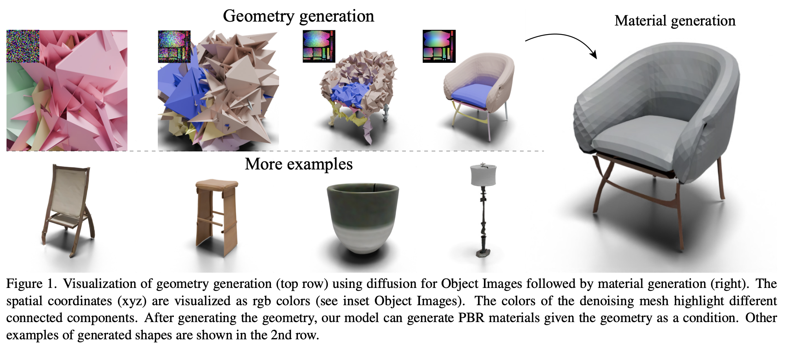
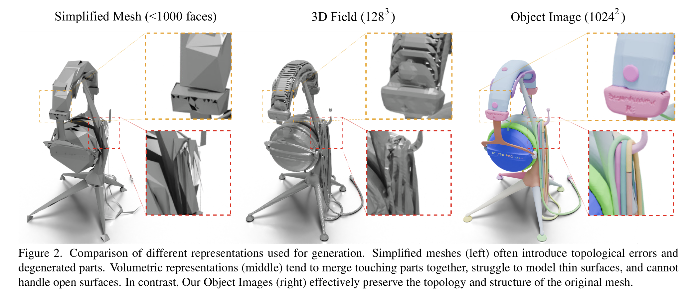

3D object를 64×64 이미지로 표현하고, diffusion 모델로 그 이미지를 생성하여 3D object를 생성하는 방법을 제안한다.

>   We introduce a new approach for generating  realistic 3D models with UV maps through a representation termed "Object Images."

논문에서는 목표는 현실적인 3D 모델을 생성하는 Object Image방법을 제안했다. 생성되는 3D 모델은 UV map[^1]을 포함한 형태로 만들어진다. 이 방법의 핵심은 3D 객체를 64x64 픽셀의 이미지로 표현하는 것이다. 이 이미지 안에는 다음과 같은 정보가 함께 포함된다.

1.   surface geometry(표면의 기하 구조)
2.   appearance(외형 정보)
3.   patch structure(표면 패치 구조)

즉 하나의 64x64 이미지가 3D 객체의 구조와 외형 정보를 동시에 표현한다. 이렇게 표현하면 복잡한 3D 형태를 다루기 쉬운 2D 형식으로 변환할 수 있다. 그 결과 기존의 polygon mesh[^2]에 존재하는 문제인 기하학적 및 의미적 불규칙성을 완화할 수 있다. 이 표현 방식의 중요한 장점은 이미지 생성 모델을 그대로 사용할 수 있다는 점이다. 예를 들어 Diffusion Transformer 같은 diffusion 모델을 이용해 직접 3D 형태를 생성할 수 있다. 실험 결과를 보면, ABO 데이터셋에서 생성된 3D 형태는 최근의 3D 생성 모델들과 비슷한 수준의 point cloud FID 성능을 보였으며, 동시에 PBR 생성도 자연스럽게 지원한다.

## Intro

이미지 생성 모델이 2D 콘텐츠 제작자의 생산성을 크게 향상시킨 것에서 영감을 받아, 3D 생성 모델을 개발하려고 하고 있다. 하지만 3D 생성 모델을 만드는 데에는 두 가지 어려움이 존재한다.

1.   Geometric irregularity(기하학적 불규칙성)
2.   Sementic irregularity(의미적 불규칙성)

3D 메쉬는 2D 이미지처럼 규칙적인 grid 구조를 가지지 않는다. Vertex 수, 연결 구조, 밀도, 배열이 모델마다 모두 다르며, 심지어 hole이나 여러 connected component 같은 복잡한 topology도 존재한다. 이 때문에 대부분 regular tensor 데이터를 가정하는 신경망 모델에서 처리하기 어렵다. 3D 모형은 보통 part, patch, segmentation 같은 의미적 구조를 가지고 있다. 하지만 객체마다 이러한 구조의 수와 형태가 크게 달라 생성 모델을 설계하기 어렵게 만든다.

기존 연구들은 보통 이 두 문제 중 하나만 해결하려고 했다. 많은 방법들은 point cloud, implicit field, multi-view image 같은 더 규칙적인 표현으로 변환하여 기하학적 불규칙성을 우회한다. 하지만 이러한 변환 과정에서는 기하학적 구조와 의미적 구조 정보가 손실된다. Fig. 2에서처럼 implicit 표현으로 변환하는 과정에서 모든 케이블들이 하나로 합쳐진다.

또 다른 접근은 메쉬의 불규칙성을 직접 모델링하는 방법이지만, 이 경우 face 수가 적은 단순한 메쉬로 제한되는 경우가 많다. 논문은 이 문제를 해결하기 위해 3D 형태를 Multi-Chart Geometry Image(MCGIM)로 표현하는 방법을 제안한다. Geometry image는 3D 표면을 여러 개의 2D 패치로 분해하고 이를 하나의 규칙적인 이미지에 배치하는 방식으로 메쉬의 기하학적 불규칙성을 해결한다. 또한 불규칙한 2D 패치 패킹을 통해 서로 다른 개수의 패치를 가진 객체들도 하나의 고정된 크기 이미지에 저장할 수 있어 의미적 불규칙성도 처리할 수 있다. 논문의 핵심 관찰은 많은 사람이 제작한 3D 모델이 이미 UV chart 형태로 의미적으로 잘 분해된 패치 구조를 가지고 있다는 점이다. 기존에는 이 구조가 texturing 용도로만 사용되었지만, 이 논문에서는 이를 3D 생성 표현으로 활용한다. 이를 기반으로 연구자들은 mesh geometry, texture, material 정보를 함께 raterize하여 12채널 이미지로 표현하는 새로운 표현 방식을 제안한다. 이 표현을 Object Image(omage)라고 부른다. 이 표현 방식의 장점은 다음과 같다.

1.   표현이 단순하고 규칙적인 이미지 구조이기 때문에 신경망이 처리하기 쉽다.
2.   기하학적 구조와 의미적 패치 구조, 그리고 PBR 재질 정보까지 함께 보존할 수 있다.
3.   이미지 기반 생성 모델을 그대로 사용하여 텍스처가 포함된 3D 메쉬를 생성할 수 있다.

실험에서는 ABO 데이터셋의 triangle mesh를 1024 해상도의 omage로 변환한 뒤 이를 64 해상도로 다운샘플링하고 Diffusion Transformer로 학습하였다. 그 결과 생성된 3D 모델은 patch 구조를 유지하면서도 최신 3D 생성 모델과 비슷한 수준의 기하학적 품질을 달성했으며, 동시에 PBR 재질 생성도 자연스럽게 지원한다.

## Related Work

기저가 되는 3D 표현 방식에 따라 분류된 대표적인 접근 방법들을 정리하여 소개하며, 특히 생성 모델링에 초점을 맞춘다.

### Polygonal meshes.

Mesh는 가장 널리 사용되는 3D 표현 방식이다. 특히 사람이 직접 모델링한 mesh는 효율적이고 유연하며 실제 산업에서도 널리 사용된다. 그러나 mesh는 vertex와 연결 구조가 불규칙하기 떄문에 신경망으로 처리하기 어렵다. 이 문제 때문에 많은 연구가 mesh 데이터를 처리하기 위한 CNN 기반 방법을 개발했지만, 이들은 주로 shape classification 같은 형태 이해 문제에 집중되어 었다.

Mesh를 생성하는 문제는 더 어렵다. 그 이유 중 하나는 mesh에서 unpooling 같은 연산을 정의하기 어렵기 때문이다. 즉, 신경망에서 해상도를 늘리거나 구조를 확장하는 연산을 mesh 구조에 일반적으로 적용하기가 쉽지 않다.

이 문제를 해결하기 위해 많은 연구들이 mesh를 직접 다루지 않고 다른 표현으로 변환하는 방법을 사용했다. 예를 들어 surface patches, predicted meshes, deformed cuboids, binary space partitions 와 같은 surrogate representation이 사용되었다. 이러한 방법은 학습을 쉽게 만들지만, 대신 원래 mesh가 가지고 있던 세부 구조와 의미 정보가 손실되는 단점이 있다.

이와 달리 PolyGen은 mesh를 변환하지 않고 원래 mesh 구조 자체를 직접 모델링하려는 접근을 제안했다. PolyGen은 두 개의 autoregressive transformer를 사용하며, 먼저 vertex를 생성하고, 그 다음 face를 생성하는 방식으로 mesh를 만든다. 하지만 이 방식은 두 단계 파이프라인이라 구조가 복잡하고, 이후 연구인 MeshGPT에서는 추론 단계에서 안정성이 제한적이라는 문제가 지적되었다. MeshGPT는 이를 해결하기 위해 mesh를 graph neural network로 인코딩한 face token 시퀀스로 변환한 뒤 하나의 autoregressive transformer로 처리하는 방식을 제안했다. MeshAnything은 MeshGPT를 확장하여 encoder와 decoder를 개선하고, reference point cloud가 주어졌을 때 조건부로 mesh를 생성할 수 있도록 만들었다. 

이러한 연구들은 중요한 발전을 이루었지만 여전히 한계가 존재한다. 현재 방법들은 최대 약 800개의 triangel face정도의 mesh 생성에 제한되는 경우가 많다. 그러나 실제 사람이 만든 고품질 mesh는 훨씬 더 많은 face를 가진다. 예를 들어 ABO 데이터셋에서는 70% 이상의 객체가 10,000개 이상의 triangle을 가진다. 따라서 기존 방법들은 먼저 mesh를 800 face 이하로 단순화해야 하는데, 이 과정에서 topology 오류가 발생할 수 있다. 또한 실제 mesh는 PBR material이나 patch structure 같은 추가 정보를 포함하는 경우가 많지만, polygon mesh 표현 자체는 이러한 정보를 직접적으로 표현하지 못한다.

논문에서 제안한 omage 표현은 이러한 문제를 피한다. Omage는 face 수에 제한되지 않으며, 동시에 PBR material와 패치 구조를 자연스럽게 포함할 수 있다.

### Multi-chart representations.

논문의 Multi-chart representations 부분을 직접 확인해서 정리하면, 이 섹션의 핵심은 “왜 UV atlas/geometry image 계열 표현이 이 논문의 object image로 이어지는가”를 설명하는 데 있다. 저자들은 이 흐름을 기존 geometry image 계열 연구와 비교하면서 자신의 위치를 분명히 잡는다. 

먼저 배경부터 보면, 3D shape를 하나 또는 여러 개의 parametric patch(chart)로 표현하는 방식은 곡면이 많은 부드러운 형상을 다룰 때 널리 쓰여 왔다. polygon mesh를 이런 patch 기반 표면으로 바꾸는 대표적 방법이 UV mapping인데, 이것의 본질은 불규칙한 3D mesh를 규칙적인 2D 평면 위에 정렬하는 것이다. 이 정렬은 texture mapping, remeshing, editing 같은 작업의 기반이 된다. 저자들은 바로 이 “3D를 2D의 규칙적 구조로 옮기는 성질”에 주목한다. 

그 다음으로, Geometry Image와 MCGIM의 역할을 짚는다. Geometry Image는 mesh를 평면 영역으로 parameterization한 뒤 그 기하 정보를 픽셀 격자 위에 resample해서, geometry 자체를 완전히 규칙적인 이미지처럼 저장하려는 방법이다. 여기에 Multi-chart Geometry Images(MCGIM)는 여러 patch를 하나의 이미지 안에 pack하는 방식까지 도입해서, 왜곡을 줄이고 arbitrary topology를 가진 shape에도 적용 가능하게 만들었다. 즉, single-chart 방식보다 더 일반적이고 실용적인 geometry image 확장판이라고 볼 수 있다. Object Image는 바로 이 MCGIM 계열을 바탕으로, 여기에 material까지 포함하도록 확장한 표현이라고 저자들이 직접 설명한다. 

하지만 저자들은 기존 geometry-image 계열 접근에도 중요한 한계가 있었다고 본다. 딥러닝에서 geometry image의 유용성 자체는 이미 잘 알려져 있었지만, 실제 활용은 크게 두 부류로 제한되었다고 정리한다. 하나는 구면이나 토러스처럼 비교적 단순한 topology 위에서 parameterization한 geometry image에 CNN을 적용한 연구들이고, 다른 하나는 GAN을 이용해 genus-zero shape를 geometry image로 생성하는 연구들이다. 즉, “regular 2D representation으로 바꾸면 딥러닝이 쉬워진다”는 장점은 알았지만, 적용 가능한 shape class가 제한적이었다는 뜻이다. 

또 다른 흐름으로는 FoldingNet, AtlasNet, 그리고 그 후속 연구들처럼 shape를 여러 parametric patch로 근사하도록 학습하는 계열이 소개된다. 이 계열은 patch 기반 surface representation을 학습적으로 다룬다는 점에서 저자들의 문제의식과 가깝지만, 보통 patch splitting을 알고리즘적으로 하거나 근사적으로 처리한다. 그래서 결과가 topology 측면에서 제약을 받거나, patch 경계와 분할 자체가 부정확해지는 문제가 생긴다고 비판한다. 즉, “patch를 쓰는 것” 자체는 맞는 방향이지만, patch를 어떻게 정의하느냐가 여전히 약점이라는 것이다. 

여기서 이 논문의 핵심 관찰이 나온다. 저자들은 사람이 만든 UV atlas가 이미 훨씬 좋은 patch decomposition을 제공한다고 본다. 다시 말해, 기존 연구들은 patch를 새로 추정하거나 자동 분할하려 했지만, 실제 인간 디자이너가 만든 3D asset에는 이미 의미 있고 실용적인 UV chart 구조가 들어 있다. 이 UV atlas는 MCGIM으로 쉽게 변환할 수 있고, arbitrary patch topology를 지원하며, 최종적으로는 image diffusion model로 생성하기도 쉽다. 이 지점이 기존 multi-chart surface modeling과 이 논문을 가르는 가장 큰 차이다. 

저자들은 또 최근 learning-based mesh texturing 방법들에서도 UV atlas가 널리 쓰이긴 하지만, 거기서는 대체로 보조 정보(auxiliary information)로만 취급된다고 말한다. 반면 이 논문은 UV atlas를 단순한 텍스처 보조도구가 아니라, mesh를 parametric surface로 바꾸는 핵심 표현 자체로 본다. 그래서 geometry 생성과 material 생성 모두를 하나의 2D regular representation 위에서 다루려는 것이다. 이것이 Object Image의 철학이다. 

정리하면, Multi-chart representations 부분의 메시지는 다음과 같다. Geometry Image와 MCGIM은 원래부터 “불규칙한 mesh를 규칙적인 2D 표현으로 바꾸는” 매우 좋은 아이디어였고, patch 기반 surface modeling 연구들도 그 가능성을 보여줬다. 하지만 기존 방법들은 단순 topology에 묶이거나, 자동 patch splitting 때문에 semantic하게 좋은 분해를 얻기 어려웠다. 이 논문은 그 문제를 “사람이 만든 UV atlas를 그대로 활용한다”는 방향으로 해결한다. 즉, patch를 새로 추정하지 않고, 이미 존재하는 고품질 UV chart를 regular 2D representation으로 옮긴 뒤, 그것을 diffusion model이 생성하도록 만든다. 그래서 object image는 단순한 geometry image의 변형이 아니라, MCGIM에 material과 semantic patch structure를 결합해 image generation에 최적화한 표현이라고 볼 수 있다. 

한 줄로 압축하면 이 섹션은 이렇게 이해하면 된다.

기존 multi-chart 계열 연구는 “3D를 2D regular image로 바꿀 수 있다”는 가능성을 보여줬고, 이 논문은 거기에 “사람이 만든 UV atlas는 이미 semantic하게 잘 분해되어 있다”는 관찰을 더해서, 그 표현을 그대로 3D diffusion generation의 중심 표현으로 승격시켰다. 

## 3D fields and multi-view images.

### Implicit 3D field

3D shape는 공간 함수로 표현될 수 있고, 그 표면은 이 함수의 특정 값을 만족하는 지점들의 집합으로 정의된다. 이 표현의 핵심 장점은 mesh처럼 복잡한 vertex/edge connectivity를 다루지 않아도 되므로 기하학적 불규칙성 문제를 자연스럽게 우회할 수 있다는 점이다. 하지만 이 과정에서 geometry 구조와 topology 정보가 손실된다. 3D voxel grid를 직접 생성하는 방식이 있었지만 계산 비용이 크다. 그래서 최근에는 field를 neural network로 parameterize하고 이를 GAN, VAE 같은 모델로 생성한 latent vector로 압축한다. 또한 하나의 latent 가 아니라 multiple latent vectors를 사용하여 spatial reasoning을 강화하는 방향으로 확장된다. Regular representation은 얻엇지만 구조 정보는 희생되었다.

### Multi-view Image

3D를 직접 생성하는 대신 여러 시점의 2D 이미지로 표현하거나 생성한다. 이미지 생성 모델을 그대로 활용할 수 있기 때문에 학습과 생성이 상대적으로 쉽다. 하지만 multi view 간 일관성 유지가 어렵고, 최종적으로 얻는 3D는 간접적이거나 후처리가 필요한 경우가 많다. 즉, 직접적이고 구조적인 3D 표현을 얻기 어렵다.

구조 정보는 유지하면서 regular한 2D 표현으로 변환하고, 

한 줄 핵심 정리

이 단락은

“기존 방법들은 regularity와 structure를 동시에 만족시키지 못했다”는 것을 보여주고,

그 해결책으로 **omage(2D이지만 구조를 보존하는 표현)**의 필요성을 정당화한다.

## Method

Object Image(omage) 표현의 수학적 정의 그리고 이미지 기반 생성 모델(Diffusion Transformer)를 사용해 이러한 omage를 생성하는 방법을 설명한다. 또한 3D asset으로부터 omage를 얻는 방법을 설명한다.

### Object Images

[^1]: <small>UV map은 3D 모델의 표면을 2D 이미지와 연결하는 좌표 시스템이다.</small>
[^2]: vertex / edge / face로 구성된 3D 구조

