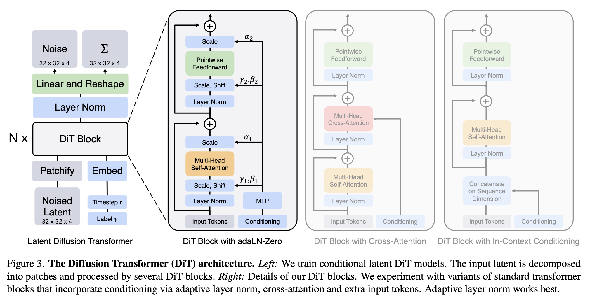
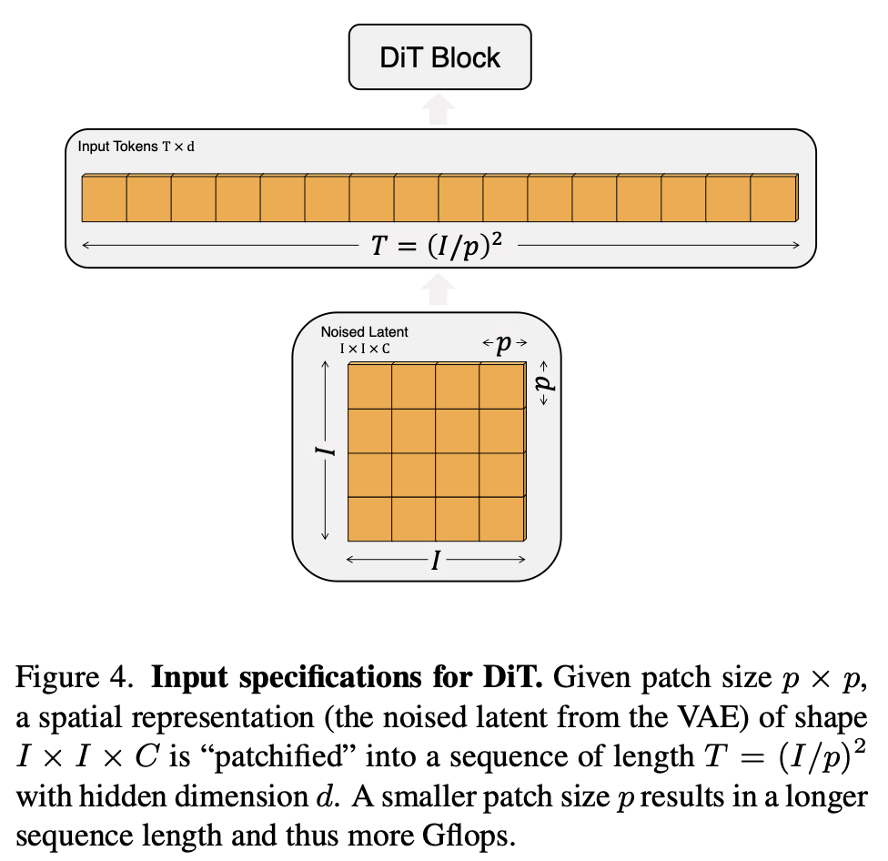

기존 Diffusion 모델이 U-Net을 backbone으로 사용해서 노이즈를 예측했다면 Diffusion Transformer(DiTs)는 ViT를 이용해서 노이즈를 예측하는 모델이다.

## Introduction

>   With this work, we aim to demystify the significance of architectural choices in diffusion models  and offer empirical baselines for future generative modeling research.

Transformer 모델이 여러 도메인에서 사용되고 있음에 따라, convolutional U-Net 구조를 backbone으로 사용하는 diffusion model 에서의 transformer 적용을 시도한다. DiT 이전에도 Transformer는 diffusion에 사용되었지만, 항상 보조 역할이었고, DiT가 처음으로 diffusion의 backbone을 Transformer로 완전히 대체했다. 이는 LDM이 입력 차원을 줄여서 self-attention 비용을 크게 낮췄기에 Transformer를 diffusion backbone으로 사용하는 것이 현실적으로 가능해졌다.

>   We show that the U-Net inductive bias is not crucial to the performance of diffusion models,  and they can be readily replaced with standard designs such as transformers.

또한 U-Net의 inductive bias가 diffusion 모델의 성능에 필수적이지 않으며, 이를 transformer와 같은 표준적인 구조로 쉽게 대체할 수 있음을 보여준다. U-Net의 inductive bias는 이미지의 지역성, 계층 구조, 디테일 보존을 가정하는 설계적 편향이고, DiT는 이걸 제거해도 성능이 유지된다는 걸 보여준 것이다.

## Diffusion Transformers

### DDPM

Diffusion 모델은 원본 데이터 $x_0$ 에 점진적으로 노이즈를 가하는 forward noising process를 가정한다. 이는 $x_0$ 를 한 번에 망가뜨리는 것이 아니라, 시간 단계 $t$ 에 따라 조금씩 노이즈를 섞어서 $x_t$ 를 만드는 과정이다. 

$$q(x_t \mid x_0)=\mathcal{N}(x_t;\sqrt{\bar{\alpha}_t}x_0,(1-\bar{\alpha}_t)\mathbf{I})$$

$q(x_t \mid x_0)$ 는 원본 $x_0$ 에서 $t$ 번째 noisy 상태 $x_t$ 가 만들어질 조건부 분포이고, $\mathcal{N}(\cdot; \mu, \Sigma)$ 는 평균이 $\mu=\sqrt{\bar{\alpha}_t}x_0$, 공분산이 $\Sigma=(1-\bar{\alpha}_t)\mathbf{I}$ 인 gaussian 분포이다. 즉, $x_t$ 는 원본 이미지의 노이즈가 주입된 버전 $\sqrt{\bar\alpha_t}x_0$ 를 중심으로 하고, 그 주변에 분산 $(1-\bar\alpha_t)$ 만큼의 gaussian 노이즈가 퍼져 있는 형태다. 다음으로 $\tilde\alpha_t$ 는 시간 $t$에서 원본 데이터가  얼마나 남아 있는지를 조절하는 하이퍼파라미터이다. 0과 1사이의 값이며, $t$ 가 커질수록 점점 작아진다. $t$ 가 커질수록 $\sqrt{\bar\alpha_t}$  는 작아져 원본 데이터의 비중이 줄고, $\sqrt{1-\bar\alpha_t}$ 는 커져 노이즈의 비중이 커진다. 첫 번째 수식에서 재매개변수화 기법(reparameterization trick)을 적용하면, 아래의 식을 얻는다.

$$x_t=\sqrt{\bar{\alpha}_t}x_0+\sqrt{1-\bar{\alpha}_t}\,\epsilon_t,\quad \epsilon_t \sim \mathcal{N}(0,\mathbf{I})$$

Gaussian 분포에서 실제 샘플을 뽑는 방법이다. gaussian 분포 $z \sim \mathcal{N}(\mu,\Sigma)$ 는 표준정규분포 $ \epsilon \sim \mathcal{N}(0,I)$ 를 이용하면 $z=\mu + A\epsilon$ 형태로 쓸 수 있다. $AA^\top=\Sigma$ 이어야 한다. 현재 상황에서는 공분산이 $\Sigma=(1-\bar{\alpha}_t)I$ 이므로, $A=\sqrt{1-\bar{\alpha}_t}\,I$ 이다.

$\bar\alpha_t$ 는 한 단계의 노이즈 비율이 아니라, 0단계부터 $t$ 단계까지 누적된 노이즈이다. DDPM에서는 각 step마다 $\beta_t$ 라는 작은 노이즈 스케줄을 정하고, $\alpha_t = 1-\beta_t$ 라고 놓은 뒤, $\bar\alpha_t = \prod_{s=1}^{t}\alpha_s$ 로 정의한다. 즉, $\bar\alpha_t$ 는 여러 step을 거치며 원본 신호가 얼마나 살아남았는지를 나타내는 누적 보존율이다. 그래서 한 번에 $x_0\rightarrow x_t$ 를 샘플링할 수 있다.

>   Diffusion models are trained to learn the reverse process that inverts forward process corruptions: $p_\theta(x_{t-1} \mid x_t) = \mathcal{N}(\mu_\theta(x_t), \Sigma_\theta(x_t))$, where neural networks are used to predict the statistics of $p_\theta$.

Diffusion 모델은 forward 과정에서 생긴 노이즈를 되돌리는 reverse 과정을 학습한다. Reverse 과정은 평균 $\mu_\theta(x_t)$, 공분산 $\Sigma_\theta(x_t)$ 인 gaussian 분포로 모델링된다.

>   both $q^*$ and $p_\theta$ are Gaussian, so $D_{KL}$ can be evaluated with the mean and covariance.

$$\mathcal{L}(\theta) = -\log p(x_0 \mid x_1) + \sum_t D_{KL}(q^*(x_{t-1} \mid x_t, x_0) \parallel p_\theta(x_{t-1} \mid x_t))$$

Negative ELBO 수식으로 Loss가 정의되고, 학습에 영향을 주지 않는 상수 항은 제거됐다.

1.   $-\log p(x_0 \mid x_1)$ 는 Reconstruction term
2.   $D_{KL}(q^* \parallel p_\theta)$ 는 KL term

평균을 직접 예측하지 않고 노이즈 $\epsilon$ 를 예측하는 형태로 바꾸면 $\mathcal L_{\text{simple}} = \Vert\epsilon_\theta(x_t) - \epsilon_t\Vert^2$, 학습은 단순한 MSE 문제로 바뀐다. 공분산까지 학습하려면 단순 MSE가 아니라 전체 KL loss를 써야한다.

-   $\epsilon_\theta$ 는 $\mathcal L_\text{Simple}$ MSE로 학습
-   $\Sigma_\theta$ 는 full $\mathcal L$ 로 학습

학습 후에는 노이즈에서 시작해서 reverse 과정을 반복하며 이미지 생성

### Classifier-free guidance

Classifier-free guidance는 conditional diffusion 모델에서 별도의 classifier 없이도 원하는 조건을 더 강하게 반영하도록 샘플링을 조정하는 방법이다. 기본적인 conditional diffusion 모델은 클래스 라벨이나 텍스트와 같은 조건 $c$ 를 입력으로 받아 $p_\theta(x_{t-1}\mid x_t, c)$ 를 모델링한다. 즉, reverse 과정 자체가 조건에 의존하도록 구성된다. 이때 모델은 노이즈 예측 형태로 $\epsilon_\theta(x_t,c)$를 출력하며, 이는 조건 $c$ 를 만족하는 방향으로의 score, 즉 $\nabla_x\log p(x\mid c)$를 비례하는 값을 나타낸다.

Sampling 과정에서는 단순히 "좋은 샘플"이 아니라, 조건 $c$를 잘 만족하는 샘플을 생성하는 것이 목표이다. 이를 위해 "현재 샘플 $x$가 조건 $c$를 얼마나 잘 만족하는가"를 나타내는 $p(c\vert x)$를 고려하게 된다. 즉, $p(c\vert x)$가 높은 방향으로 샘플을 이동시키는 것이 핵심이다.

베이즈 정리를 적용하면 다음과 같이 표현할 수 있다.

$$\log p(c \mid x) = \log p(x \mid c) - \log p(x) + \log p(c)$$

여기서 $\log p(c)$ 는 $x$ 에 대해 상수이므로 gradient를 취할 때 사라진다. 따라서 샘플링을 유도하는 방향은 다음과 같이 정리된다.

$$\nabla_{x_t}\log p(c\vert x_t)=\nabla_{x_t} \log p(x_t \mid c) - \nabla_{x_t} \log p(x_t)$$ 

이 식은 "조건을 만족하는 방향"에서 "자연스러운 데이터 분포 방향"을 뺸 것으로, 결과적으로 조건을 더 강하게 만족하도록 샘플을 이동시키는 방향을 의미한다.

Diffusion 모델에서는 $\epsilon_\theta(x_t, c)$가 $\nabla_x \log p(x \mid c)$, 그리고 $\epsilon_\theta(x_t, \emptyset)$가 $\nabla_x\log p(x)$에 각각 비례한다고 볼 수 있다. 여기서 $\emptyset$ 는 조건을 제거한 경우, 즉 unconditional 모델을 의미한다. 따라서 두 출력을 이용하면 조건 방향을 다음과 같이 구성할 수 있다.

$$\nabla_{x_t} \log p(c|x_t) \propto \epsilon_\theta(x_t,c) - \epsilon_\theta(x_t,\emptyset)$$

이를 실제 샘플링에 적용하면 다음과 같은 형태의 guided noise 예측식을 얻는다.
$$
\begin{aligned}
\hat{\epsilon}_\theta(x_t, c) &= \epsilon_\theta(x_t, \emptyset) + s \cdot (\epsilon_\theta(x_t, c) - \epsilon_\theta(x_t, \emptyset))\\
&=(1-s)\epsilon_\theta(x_t,\emptyset)+s\epsilon_\theta(x_t,c)
\end{aligned}
$$

이 식은 기본적인 방향에 조건 방향의 차이를 $s$배로 더해주는 형태이며, $s>1$ 일수록 조건을 더 강하게 반영하게 된다. $s=1$ 이면 일반적인 conditional diffusion과 동일하고, $s=0$ 이면 unconditional 모델이 된다.

Classifier-free guidance의 중요한 특징은 별도의 classifier를 필요로 하지 않는다는 점이다. 대신 하나의 diffusion 모델을 학습할 때, 일정 확률로 조건 $c$ 를 제거하고 이를 "null embedding" $\emptyset$ 으로 대체하여 학습한다. 이 방식으로 모델은 동시에 $p(x\mid c)$와 $p(x)$를 모두 학습하게 된다. 결과적으로 두 경우의 출력을 이용해 위와 같은 guidance를 구성할 수 있으며, 추가적인 모델 없이도 조건을 강화할 수 있다.

왜 diffusion 모델에서 노이즈 예측 $\epsilon_\theta$가 score 함수에 대응한다고 볼 수 있을까? 이는 diffusion 모델의 학습 방식이 denosing score matching과 밀접하게 연결되어 있기 때문이다. Diffusion의 forward 과정에서는 원본 데이터 $x_0$에 점진적으로 가우시안 노이즈를 추가하여 $x_t$를 생성한다. $x_t$는 원본 데이터와 노이즈의 선형 결합이다. 이때 모델은 주어진 $x_t$로부터 원래 추가된 노이즈 $\epsilon$를 맞추도록 학습된다.
$$\mathcal{L}_{\text{simple}} = \|\epsilon - \epsilon_\theta(x_t, t)\|^2$$

이 식만 보면 단순한 회귀 문제처럼 보이지만, 실제로는 score matching 문제와 동치가 된다. 

$$\nabla_{x_t} \log p(x_t) \;\propto\; -\frac{1}{\sqrt{1-\bar\alpha_t}}\,\epsilon$$

노이즈 $\epsilon$는 현재 상태 $x_t$에서의 score, 즉 $\nabla_{x_t}\log p(x_t)$와 비례 관계에 있다. 따라서 모델이 $\epsilon_\theta(x_t, t)$를 정확하게 예측한다는 것은, 결국 해당 시점에서의 score를 학습하는 것과 동일하다. 이를 통해 diffusion 모델은 명시적으로 확률 밀도 $p(x)$를 모델링하지 않더라도, 그 gradient인 score를 학습할 수 있게 된다. 그리고 샘플링 과정은 이 score를 따라 데이터를 점진적으로 업데이트하는 과정으로 해석할 수 있다.

### Latent diffusion models

Latent Diffusion Models(LDMs)의 아이디어는 고해상도 이미지 공간에서 직접 diffusion을 수행하는 대신, 먼저 이미지를 더 작은 latent 표현으로 압축한 뒤 그 공간에서 diffusion을 수행하는 것이다. 일반적인 diffusion 모델은 입력이 픽셀 공간 $x\in\mathbb R^{H\times W\times3}$ 에 있기 때문에 해상도가 높아질수록 연산량과 메모리 사용량이 급격히 증가한다. 이는 특히 학습과 샘플링 모두에서 큰 병목으로 작용한다.

LDM은 이를 해결하기 위해 두 단계 구조를 사용한다. 첫 번째 단계에서는 autoencoder를 학습하여 이미지 $x$ 를 더 작은 표현 $z=E(x)$ 로 압축한다. 여기서 인코더는 공간 해상도를 크게 줄이면서도 이미지의 중요한 semantic 정보를 유지하도록 학습된다. 두 번째 단계에서는 원본 이미지가 아니라 이 latent 표현 $z$를 대상으로 diffusion 모델을 학습한다. 이때 인코더는 고정된 상태로 유지되며, diffusion 모델은 오직 latent 공간에서의 확률 분포를 학습한다.

생성 과정에서는 먼저 latent 공간에서 noise로부터 시작한다. 즉, $z_T\sim\mathcal N(0,I)$ 에서 시작하여 reverse 과정을 통해 점진적으로 $z_0$ 를 복원한다. 이후 이 latent를 디코더 $D$ 에 통과시켜 최종 이미지 $x=D(z_0)$ 를 얻는다. 따라서 전체 생성 파이프라인은 "노이즈 &rarr; 잠재공간 latent &rarr; 이미지"의 구조를 갖는다.

이 방식의 가장 큰 장점은 계산 효율성이다. Latent 공간은 픽셀 공간보다 훨씬 낮은 차원을 가지기 때문에, diffusion 과정에서 필요한 연산량이 크게 감소한다. 동시에, 단순히 정보를 버리는 압축이 아니라 의미정보를 유지하는 표현을 사용하기 때문에 생성 품질은 크게 손상되지 않는다. 오히려 latent 공간에서는 저수준 픽셀 노이즈가 줄어들고 구조적인 정보가 강조되기 때문에 diffusion 모델이 더 안정적으로 학습되는 경향이 있다.

이러한 latent diffusion 구조 위에 transformer 적용한다. 기존 diffusion 모델들이 주로 U-Net 기반 convolution 구조를 사용했던 것과 달리, 이 논문은 transformer 기반 구조를 latent 공간에 적용한다. 결과적으로 전체 시스템은 convolutional VAE와 transformer 기반 diffusion 모델이 결합된 hybrid 구조를 갖는다.

### Architecture

### Patchify

DiT에서 입력으로 사용되는 것은 이미지 자체가 아니라 VAE를 통해 압축된 latent 표현 $z$ 이다. 예를 들어 256x256 크기의 이미지는 32x32x4 형태의 latent로 변환된다. DiT의 첫 번째 단계는 이러한 spatial 형태의 입력을 transformer가 처리할 수 있도록 sequence 형태로 변환하는 patchify 과정이다.

Patchify는 입력을 $p\times p$ 크기의 패치로 나눈 뒤, 각 패치를 벡터로 펼치고 이를 하나의 token으로 변환하는 과정이다. 이로써 전체 입력은 $T$개의 토큰으로 이루어진 시퀀스로 변환되며, 각 토큰은 동일한 차원 $d$ 를 갖는다. 이후 transformer에서 위치 정보를 활용할 수 있도록 sine-cosine 기반의 위치 임베딩이 모든 토큰에 추가된다.

이때 생성되는 토큰의 개수 $T$ 는 patch 크기 $p$ 에 의해 결정된다, 입력 해상도가 고정된 상황에서 $p$ 가 작아질수록 더 많은 패치가 생성되며, 결과적으로 토큰 수 $T$ 는 $1\over p^2$ 에 비례하여 증가한다. 예를 들어, $p$ 를 절반으로 줄이면 토큰 수는 4배로 증가한다. Transformer의 계산량은 토큰 수에 크게 의존하기 때문에, 이러한 변화는 전체 연산량 Gflops를 최소 4배 이상 증가시키는 결과를 낳는다. 흥미로운 점은 patch 크기 $p$ 는 계산량에는 큰 영향을 주지만 모델의 파라미터 수에는 거의 영향을 주지 않는다는 것이다. 

### DiT block design

DiT에서 조건을 Transformer에 주입하는 방법은 크게 세 가지로 나눌 수 있다. in-context conditioning, cross-attention 기반 conditioning, 그리고 Adaptive Layer Normalization(adaLN)이다. 이들은 모두 timestep $t$와 조건 $c$를 모델에 전달한다는 공통 목적을 가지지만, 이를 주입하는 방식에서 차이를 보인다.

먼저 in-context conditioning은 조건 정보를 별도의 구조 없이 입력 시퀀스에 직접 포함시키는 방식이다. Diffusion timestep $t$와 조건 $c$를 각각 embedding으로 만든 뒤, 이를 두 개의 토큰으로 변환하여 기존 이미지 토큰 시퀀스 앞에 붙인다. 즉, patchify된 이미지 토큰이 $[x_1, x_2, \dots, x_T]$라면 최종 입력은 $[t, c, x_1, x_2, \dots, x_T]$가 된다. Transformer는 모든 토큰 간 self-attention을 수행하므로, 이미지 토큰은 자연스럽게 timestep과 조건 토큰을 참조하게 된다. 이 방식은 구조를 전혀 수정하지 않고도 conditioning이 가능하며, 추가되는 토큰 수가 매우 적기 때문에 계산량 증가도 거의 없다. 마지막 출력에서는 조건 토큰이 필요 없으므로, 중간 계산에서만 활용되고 제거된다.

반면 cross-attention 방식은 조건을 별도의 시퀀스로 분리하고, 이를 Transformer 내부에서 명시적으로 참조하도록 만든다. 이 경우 입력은 두 개로 나뉘며, 이미지 토큰 $[x_1, \dots, x_T]$와 조건 토큰 $[t, c]$를 각각 구성한다. 이후 Transformer block 내부에서 self-attention 뒤에 cross-attention layer를 추가하여, 이미지 토큰이 query로, 조건 토큰이 key와 value로 사용된다. 즉, 이미지가 조건을 직접 “조회”하는 구조가 된다. 이 방식은 조건 정보를 보다 강하게 반영할 수 있다는 장점이 있으며, Stable Diffusion과 같은 LDM 계열 모델에서도 사용된다. 그러나 Transformer 구조를 변경해야 하고 추가적인 attention 연산이 필요하기 때문에 계산량이 증가하며(약 10~15%), 구현 복잡도 또한 높아진다.

이와 달리 adaLN은 토큰을 추가하거나 attention 구조를 변경하지 않고, 정규화 과정 자체를 조건에 따라 조정하는 방식이다. 일반적인 LayerNorm은 입력을 정규화한 뒤 학습된 파라미터 $\gamma$와 $\beta$를 이용해 scale과 shift를 적용하며, 이 값들은 모든 입력에 대해 고정되어 있다. 반면 adaLN에서는 $\gamma$와 $\beta$를 고정된 파라미터로 두지 않고, timestep $t$와 조건 $c$의 embedding을 이용해 동적으로 생성한다. 즉, $t$와 $c$를 embedding한 뒤 이를 결합하여 하나의 벡터를 만들고, 이를 통해 scale과 shift를 예측함으로써 조건에 따라 feature 분포를 조정한다.

이 방식의 핵심은 조건 정보를 토큰 간 상호작용으로 전달하는 것이 아니라, feature 자체를 재조정하는 방식으로 주입한다는 점이다. 따라서 attention과 같은 추가 연산이 필요 없고 구조 변경도 최소화되기 때문에 계산량 증가가 매우 적다. 실제로 논문에서도 세 가지 conditioning 방식 중 adaLN이 가장 적은 Gflops를 요구한다고 언급한다. 다만 생성된 $\gamma$와 $\beta$가 모든 토큰에 동일하게 적용되기 때문에, 각 토큰마다 다른 방식으로 조건을 반영하는 것은 불가능하다. 즉, 조건이 전체 feature 분포를 전역적으로 조정하는 형태로 작용한다는 한계를 가진다.

이러한 adaLN을 더욱 안정적으로 만든 변형이 adaLN-Zero이다. 이 구조는 ResNet에서의 중요한 관찰을 기반으로 한다. ResNet에서는 각 residual block이 처음부터 강하게 작동하기보다, 초기에는 identity 함수처럼 동작하는 것이 학습에 더 유리하다는 것이 알려져 있다. 실제로 batch normalization의 scale 파라미터 $\gamma$를 0으로 초기화하면 학습 안정성과 수렴 속도가 개선된다는 결과가 있으며, diffusion U-Net에서도 residual branch의 마지막 layer를 0으로 초기화하는 유사한 전략이 사용된다.

DiT에서는 이 아이디어를 adaLN에 적용하여, 기존의 $\gamma, \beta$뿐 아니라 residual connection 직전에 적용되는 scaling 파라미터 $\alpha$를 추가로 예측한다. 이 $\alpha$는 residual branch의 출력을 얼마나 반영할지를 조절하는 역할을 하며, 초기에는 0에 가깝게 설정된다. 따라서 residual connection은 다음과 같이 동작한다:

$$x + \alpha \cdot F(x) \approx x$$

즉, 학습 초기에는 $F(x)$의 영향이 거의 없어 블록 전체가 identity처럼 동작하고, 학습이 진행되면서 $\alpha$가 점차 커지면서 점진적으로 복잡한 변환을 학습하게 된다. 이 방식은 깊은 네트워크에서 발생할 수 있는 불안정성을 줄이고, gradient 흐름을 안정적으로 유지하는 데 중요한 역할을 한다.

결과적으로 DiT는 conditioning을 세 가지 방식으로 비교한 뒤, 구조를 단순하게 유지하면서도 계산 효율과 학습 안정성을 확보할 수 있는 adaLN-Zero를 최종적으로 선택한다. 이는 조건 정보를 attention 구조에 의존하지 않고 feature modulation 방식으로 주입하는 동시에, residual 초기화를 통해 안정적인 학습을 가능하게 한다는 점에서 효과적인 설계라고 볼 수 있다.

DiT는 Transformer 구조를 기반으로 하기 때문에, 모델의 크기 역시 Vision Transformer(ViT)에서 사용되는 방식과 동일하게 확장된다. 전체 모델은 hidden dimension $d$에서 동작하는 $N$개의 DiT block을 쌓는 구조로 이루어지며, 모델의 표현력은 block의 개수 $N$, hidden dimension $d$, 그리고 attention head 수를 함께 증가시키는 방식으로 확장된다. 논문에서는 이러한 scaling 전략을 기반으로 DiT-S, DiT-B, DiT-L, DiT-XL과 같은 다양한 크기의 모델을 구성하고, 약 0.3에서 118.6 GFlops에 이르는 넓은 범위에서 성능을 비교한다. 이는 Transformer 기반 diffusion 모델이 기존 모델들과 마찬가지로 scaling에 따라 성능이 어떻게 변화하는지를 분석하기 위함이다.

Transformer를 통과한 출력은 여전히 token sequence 형태이기 때문에, 이를 다시 이미지 형태의 출력으로 변환하는 과정이 필요하다. 이를 위해 DiT는 간단한 linear decoder를 사용한다. 먼저 마지막 DiT block을 통과한 각 토큰에 대해 layer normalization(adaLN을 사용하는 경우 adaptive normalization)을 적용한 뒤, 이를 선형 변환하여 $p \times p \times 2C $형태의 텐서로 변환한다. 여기서 $C$는 입력 latent의 채널 수이며, $2C$는 각각 noise prediction과 variance(대각 공분산) 예측을 의미한다.

이후 각 토큰에서 생성된 $p \times p$ 패치들을 원래의 spatial 위치에 맞게 재배열하여 전체 $I \times I \times 2C$ 형태의 출력으로 복원한다. 이 과정을 통해 Transformer가 생성한 sequence 표현은 다시 공간 구조를 갖는 이미지 형태로 변환되며, 최종적으로 diffusion 모델에서 필요한 noise와 covariance를 예측하게 된다.

정리하면, DiT는 patchify를 통해 이미지를 token sequence로 변환한 뒤 Transformer로 처리하고, 마지막에는 다시 이를 spatial 구조로 복원하는 과정을 거친다. 또한 모델 설계에서 중요한 요소는 patch size, Transformer block 구조, 그리고 모델 크기이며, 논문은 이 세 가지 축을 중심으로 DiT의 design space를 구성하고 성능을 분석한다.

## Appendix

### ELBO

Diffusion 모델에서 

1.   Forward: $q(x_{1:T}\mid x_0) = \prod_{t=1}^{T} q(x_t\mid x_{t-1})$

     원본 $x_0$에서 시작해서 매 단계 노이즈를 더하는 과정

     

2.   Reverse: $p_\theta(x_{0:T}) = p(x_T)\prod_{t=1}^{T} p_\theta(x_{t-1}\mid x_t)$

     Gaussian prior $x_T$ 에서 시작하고, 그다음 reverse transition을 반복해서 $x_0$까지 생성하는 과정

     

이고, 모델의 목표는 $\max_\theta \log p_\theta(x_0)$이다. 여기서 $x_0$는 실제 데이터, 원본 이미지다. 그런데 diffusion 모델은 중간 변수 $x_1, x_2, \dots, x_T$를 거치는 latent variable model이다. 그래서 $x_0$의 확률은 중간 변수들을 적분해서 얻어야 한다.

$$
\begin{aligned}
p_\theta(x_0) &= \int p_\theta(x_{0:T})\,dx_{1:T} \\
&= \int q(x_{1:T}\mid x_0)\frac{p_\theta(x_{0:T})}{q(x_{1:T}\mid x_0)}\,dx_{1:T} \\
&= \mathbb E_{q(x_{1:T}\mid x_0)} \left[ \frac{p_\theta(x_{0:T})}{q(x_{1:T}\mid x_0)} \right]
\end{aligned}
$$

$\log p_\theta(x_0)=\log \int p_\theta(x_{0:T})\,dx_{1:T}$ 를 직접 최적화하기 어렵다. 로그 안에 적분이 있기 때문이다. 중간 단계 전체를 합쳐서 계산해야 해서 다루기 불편하다. 그래서 보조분포 $q(x_{1:T}\mid x_0)$를 도입한다. 양변에 $\log$를 씌워주면, $\log$는 concave 함수이므로 $\log \mathbb E_q[Z] \ge \mathbb E_q[\log Z]$ 성립한다.

$$
\begin{aligned}
\log p_\theta(x_0) &= \log \mathbb E_q \left[ \frac{p_\theta(x_{0:T})}{q(x_{1:T}\mid x_0)} \right] \\
&\ge\mathbb E_q\left[\log \frac{p_\theta(x_{0:T})}{q(x_{1:T}\mid x_0)}\right]={\mathcal L_\text{ELBO}}
\end{aligned}
$$

우리는 사실 $\log p_\theta(x_0)$를 키우고 싶다. 그런데 직접 다루기 어려우니, 그보다 작거나 같은 값인 $\mathcal L_{\mathrm{ELBO}}$를 대신 키우는 것이다.

$$\boxed{ \mathcal L_{\mathrm{ELBO}} = \mathbb E_{q(x_{1:T}\mid x_0)} \left[ \log p_\theta(x_{0:T})-\log q(x_{1:T}\mid x_0) \right] }$$

$\mathcal L_\text{ELBO}$ 에 위에서 정의한 forward와 reverse 과정을 결합분포 형태로 나타내고, forward 과정은 Markov chain이므로,

$$q(x_{1:T}\mid x_0) = q(x_T\mid x_0)\,q(x_{T-1}\mid x_T,x_0)\cdots q(x_1\mid x_{2:T},x_0)$$

$$q(x_{t-1}\mid x_t,x_{t+1:T},x_0)=q(x_{t-1}\mid x_t,x_0)$$

$x_0$가 주어졌을 때 각 단계의 posterior $q(x_{t-1}\mid x_t,x_0)$를 계산할 수 있다. 이 분포는 학습 시점에서는 $x_0$를 알고 있으므로 정답 역할을 한다. 이걸 이용하면 $\mathcal L_\text{ELBO}$를 다음처럼 재구성할 수 있다.

$$
\begin{aligned}
\mathcal L_{\mathrm{ELBO}} &= \mathbb E_q \left[ \log p(x_T) +\sum_{t=1}^{T}\log p_\theta(x_{t-1}\mid x_t) - \sum_{t=1}^{T}\log q(x_t\mid x_{t-1}) \right] \\
&=\mathbb E_q\left[ \log p(x_T)+\{\log p_\theta(x_0\mid x_1) +\sum_{t=2}^{T}\log p_\theta(x_{t-1}\mid x_t)\} - \{\log q(x_T\mid x_0) +\sum_{t=2}^{T}\log q(x_{t-1}\mid x_t,x_0)\} \right] \\
&=\mathbb E_q\left[ \log p(x_T)+ \log p_\theta(x_0\mid x_1)- \log q(x_T\mid x_0)  +\sum_{t=2}^{T}\log p_\theta(x_{t-1}\mid x_t) -\sum_{t=2}^{T}\log q(x_{t-1}\mid x_t,x_0) \right] \\
&=\mathbb E_q\left[\log p_\theta(x_0\mid x_1) + \log {p(x_T)\over q(x_T\mid x_0)} +\sum_{t=2}^{T}\log {p_\theta(x_{t-1}\mid x_t) \over q(x_{t-1}\mid x_t,x_0)} \right] \\
&=\mathbb E_q\left[\log p_\theta(x_0\mid x_1) - \log {q(x_T\mid x_0)\over p(x_T)} -\sum_{t=2}^{T}\log {q(x_{t-1}\mid x_t,x_0) \over p_\theta(x_{t-1}\mid x_t)} \right] \\
&=\mathbb E_q\left[\log p_\theta(x_0\mid x_1) - D_{KL}(q(x_T\mid x_0)\|p(x_T)) -\sum_{t=2}^T D_{KL}(q(x_{t-1}\mid x_t,x_0)\|p_\theta(x_{t-1}\mid x_t)) \right] \\
\end{aligned}
$$

그리고 loss로 최소화하고 싶으면 양변에 마이너스를 붙이고, $D_{KL}(q(x_T\mid x_0)\|p(x_T))$는 보통 $\theta$와 무관하거나 상수 취급되어 생략되는 경우가 많다.

$$-\mathcal L_{\text{ELBO}} = \mathbb E_q \Big[ -\log p_\theta(x_0\mid x_1) + D_{KL}(q(x_T\mid x_0)\|p(x_T)) + \sum_{t=2}^T D_{KL}(q(x_{t-1}\mid x_t,x_0)\|p_\theta(x_{t-1}\mid x_t)) \Big]$$

위 식의 각 항은 아래와 같다.

1.   $\log p_\theta(x_0\mid x_1)$

     마지막 단계 복원 항이다. $x_1$에서 원본 $x_0$를 얼마나 잘 복원하는지를 본다.

2.   $D_{KL}(q(x_T\mid x_0)\|p(x_T))$​

     forward가 만든 최종 노이즈 분포가 prior와 얼마나 다른지 측정한다. 보통 $\theta$와 무관해서 상수 취급되는 경우가 많다.

3.   $\sum_{t=2}^T D_{KL}(\cdots)$

     각 timestep에서 모델의 reverse 분포 $p_\theta(x_{t-1}\mid x_t)$ 가 정답 posterior $q(x_{t-1}\mid x_t,x_0)$를 얼마나 잘 따라가는지 측정한다.

### Reparameterization Trick

DDPM forward의 한 스탭은 보통 $q(x_t\mid x_{t-1})=\mathcal N\!\left(\sqrt{\alpha_t}x_{t-1},\,\beta_t I\right),\alpha_t = 1-\beta_t$이다. 이걸 여러 스탭 합치면 closed form이 나온다.

$$q(x_t\mid x_0)=\mathcal N\!\left(\sqrt{\bar\alpha_t}x_0,\,(1-\bar\alpha_t)I\right)$$

$\bar\alpha_t=\prod_{s=1}^t \alpha_s$ 이고, 이 분포에서 샘플링하면

$$x_t=\sqrt{\bar\alpha_t}\,x_0+\sqrt{1-\bar\alpha_t}\,\epsilon,\qquad \epsilon\sim\mathcal N(0,I)$$

$x_t$ 는 원본 $x_0$ 와 표준gaussian 노이즈 $\epsilon$ 의 선형결합이다.

DDPM에서 real posterior는 $q(x_{t-1}\mid x_t,x_0)$ 이다. 이 분포도 gaussian이고, 평균과 분산이 closed form으로 나온다.

$q(x_{t-1}\mid x_t,x_0)=\mathcal N\left(x_{t-1};\tilde\mu_t(x_t,x_0),\,\tilde\beta_t I\right)$

여기서 $\tilde\mu_t(x_t,x_0) = \frac{\sqrt{\bar\alpha_{t-1}}\beta_t}{1-\bar\alpha_t}x_0 + \frac{\sqrt{\alpha_t}(1-\bar\alpha_{t-1})}{1-\bar\alpha_t}x_t$, 그리고 $\tilde\beta_t = \frac{1-\bar\alpha_{t-1}}{1-\bar\alpha_t}\beta_t$ 이다.

현재 이 수식은 $\tilde\mu_t(x_t,x_0) = A_t x_0 + B_t x_t$의 형태이다. $$A_t=\frac{\sqrt{\bar\alpha_{t-1}}\beta_t}{1-\bar\alpha_t},B_t=\frac{\sqrt{\alpha_t}(1-\bar\alpha_{t-1})}{1-\bar\alpha_t}$$

그런데 생성 시점에는 $x_0$를 모른다. $x_t$만 안다. 그래서 $x_0$를 직접 넣을 수 없다.

하지만 forward 식

$$x_t=\sqrt{\bar\alpha_t}x_0+\sqrt{1-\bar\alpha_t}\epsilon$$

에서 $x_0$를 풀면

$$x_0=\frac{1}{\sqrt{\bar\alpha_t}} \left(x_t-\sqrt{1-\bar\alpha_t}\,\epsilon\right)$$

이 된다. 즉, $x_0$를 알기 어렵다면 대신 $\epsilon$를 예측해서 $x_0$를 복원할 수 있다.

$$
\begin{aligned}
\tilde\mu_t(x_t,x_0) &= \frac{\sqrt{\bar\alpha_{t-1}}\beta_t}{1-\bar\alpha_t}x_0 + \frac{\sqrt{\alpha_t}(1-\bar\alpha_{t-1})}{1-\bar\alpha_t}x_t\\
&=\frac{\sqrt{\bar\alpha_{t-1}}\beta_t}{1-\bar\alpha_t} \cdot \frac{1}{\sqrt{\bar\alpha_t}} \left(x_t-\sqrt{1-\bar\alpha_t}\epsilon\right) + \frac{\sqrt{\alpha_t}(1-\bar\alpha_{t-1})}{1-\bar\alpha_t}x_t
\end{aligned}
$$

$\bar\alpha_t=\bar\alpha_{t-1}\alpha_t$이므로 $\frac{\sqrt{\bar\alpha_{t-1}}}{\sqrt{\bar\alpha_t}} = \frac{1}{\sqrt{\alpha_t}}$ 이다. 따라서 첫 항은 $\frac{\beta_t}{\sqrt{\alpha_t}(1-\bar\alpha_t)} \left(x_t-\sqrt{1-\bar\alpha_t}\epsilon\right)$ 가 된다.

$$
\begin{aligned}
\tilde\mu_t(x_t,\epsilon) &=\frac{\beta_t}{\sqrt{\alpha_t}(1-\bar\alpha_t)}x_t-\frac{\beta_t}{\sqrt{\alpha_t}\sqrt{1-\bar\alpha_t}}\epsilon+\frac{\sqrt{\alpha_t}(1-\bar\alpha_{t-1})}{1-\bar\alpha_t}x_t
\\&=\left[ \frac{\beta_t}{\sqrt{\alpha_t}(1-\bar\alpha_t)} + \frac{\sqrt{\alpha_t}(1-\bar\alpha_{t-1})}{1-\bar\alpha_t} \right]x_t - \frac{\beta_t}{\sqrt{\alpha_t}\sqrt{1-\bar\alpha_t}}\epsilon
\\&=\frac{1}{\sqrt{\alpha_t}} \left( x_t-\frac{\beta_t}{\sqrt{1-\bar\alpha_t}}\epsilon \right)
\end{aligned}
$$

$$\mu_\theta(x_t,t) = \frac{1}{\sqrt{\alpha_t}} \left( x_t-\frac{\beta_t}{\sqrt{1-\bar\alpha_t}}\epsilon_\theta(x_t,t) \right)$$

### Score

Score는 확률밀도의 로그를 $x$에 대해 미분한 것이다.

$$s(x) = \nabla_x \log p(x)$$

$\log p(x)$ 는 이 위치가 얼마나 그럴듯한가를 나타내고, $\nabla_x \log p(x)$ 는 어느 방향으로 움직이면 더 그럴듯해지는가를 나타낸다. 즉, score는 확률이 커지는 방향 벡터다. Diffusion의 reverse 과정은 노이즈가 낀 샘플을 조금씩 더 그럴듯한 데이터 쪽으로 움직이는 과정이다. 이를 위해서는 "어느 방향으로 가면 데이터 분포 쪽으로 가까워지나?"를 알아야 하고, 이것이 바로 score이다.

DDPM의 forward closed form은 $x_t = \sqrt{\bar\alpha_t}x_0 + \sqrt{1-\bar\alpha_t}\,\epsilon,\epsilon \sim \mathcal N(0,I)$ 으로 $x_t$안에는 데이터와 노이즈 정보가 섞여 있다. 모델은 여기서 "섞여 들어간 노이즈가 뭐였는지"를 맞추는 식으로 학습된다.

$$\mathcal L_{\text{simple}} = \|\epsilon - \epsilon_\theta(x_t,t)\|^2$$

그런데 이게 왜 score 학습과 같아질까? 확률분포가 $p(x) = \mathcal N(x;\mu,\sigma^2 I)$라고 하자. 그러면 로그밀도는 상수항을 무시하면

$$\log p(x) = -\frac{1}{2\sigma^2}\|x-\mu\|^2 + \text{const}$$

이다. 이걸 $x$에 대해 미분하면 $\nabla_x \log p(x) = -\frac{1}{\sigma^2}(x-\mu)$이고, $\nabla_x \log p(x) \propto -(x-\mu)$이다. 가우시안의 score는 평균으로 향하는 벡터인 것이다.

$x_t$는 평균 $\mu_t = \sqrt{\bar\alpha_t}x_0$, 분산 $\sigma_t^2 = 1-\bar\alpha_t$ 인 가우시안이다. 그러면 방금 본 가우시안 score 공식에 의해 $\nabla_{x_t}\log q(x_t\mid x_0) = -\frac{1}{1-\bar\alpha_t}\left(x_t-\sqrt{\bar\alpha_t}x_0\right)$이다. 그런데 forward 식에서 $x_t-\sqrt{\bar\alpha_t}x_0 = \sqrt{1-\bar\alpha_t}\,\epsilon$ 이므로 대입하면 $\nabla_{x_t}\log q(x_t\mid x_0) = -\frac{1}{1-\bar\alpha_t}\sqrt{1-\bar\alpha_t}\,\epsilon$, 즉 $\nabla_{x_t}\log q(x_t\mid x_0) = -\frac{1}{\sqrt{1-\bar\alpha_t}}\epsilon$가 된다. 여기서 바로 노이즈 $\epsilon$과 score가 비례한다는 것이 나온다. 정확히는 $ \epsilon = -\sqrt{1-\bar\alpha_t}\,\nabla_{x_t}\log q(x_t\mid x_0)$로 노이즈는 score에 상수배를 곱한 것이다. 

$$\epsilon \propto -\nabla_{x_t}\log q(x_t\mid x_0)$$

위에서 직접 구한 것은 조근부 score $\nabla_{x_t}\log q(x_t\mid x_0)$ 이다. 하지만 실제 우리가 원하는 건 noisy marginal 분포 $q(x_t)=\int q(x_t\mid x_0)p_{\text{data}}(x_0)\,dx_0$ 의 score, 즉, $\nabla_{x_t}\log q(x_t)$ 이다. 둘은 같지 않다. 그런데 denosing score matching의 결과에 따르면, 모델이 노이즈 예측을 잘하도록 학습하면 결국 이 marginal score를 학습하는 것과 동치가 된다.

Denoising score mattching의 핵심은 노이즈가 낀 샘플 $\tilde x$에 대해, 모델이 ${x-\tilde x\over\sigma^2}$를 맞추도록 학습하면, 그 모델은 $\nabla_{\tilde x}\log q_\sigma(\tilde x)$를 학습하게 된다. Diffusion에서는 $\tilde x$가 $x_t$이고, ${x-\tilde x\over\sigma^2}$가 결국 $-\epsilon$의 상수배가 된다. 그래서 $\epsilon_\theta(x_t,t)$를 맞추는 것이 noisy 분포의 score를 맞추는 것과 연결된다.

