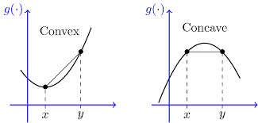

Jensen’s Inequality는 기대값과 함수 적용의 순서가 어떻게 달라지는지를 정량적으로 보여주는 부등식이다.

## Jensen's Ineqaulity

미분 관점에서 $f''(x) \ge 0$ 이면 convex 함수, $f''(x) \le 0$​ 이면 concave 함수이다.  확률변수 $X$와 convex 함수 $f$ 에 대해 $f(\mathbb{E}[X]) \le \mathbb{E}[f(X)]$, concave 함수 $g$ 에 대해 $f(\mathbb{E}[X]) \ge \mathbb{E}[f(X)]$ 이 성립한다.
