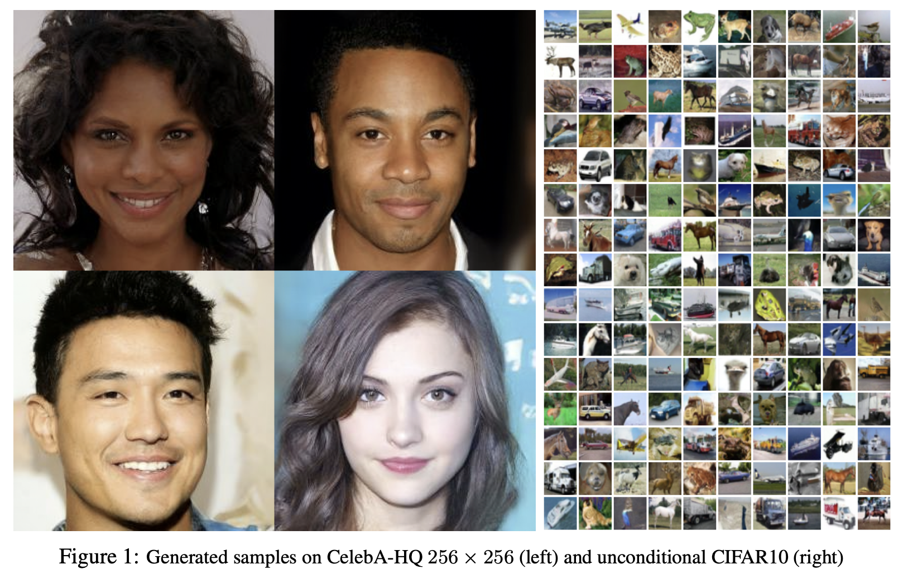
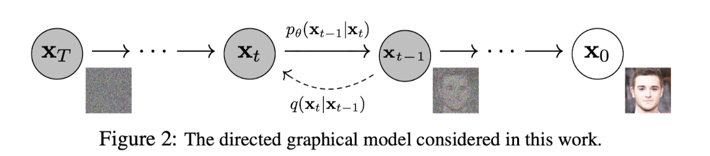
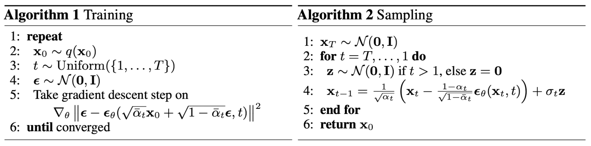
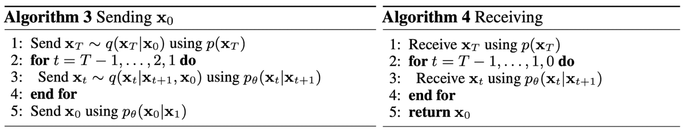

데이터를 점점 노이즈로 만들고, 그걸 되돌리는 과정을 학습하면 강력한 생성 모델이 된다. 이 과정은 score matching + Langevin dynamics와 수학적으로 동일하다.

## Abstract

>   A diffusion probabilistic model is a parameterized Markov chain  trained using variational inference to produce samples matching the data after finite time.

Diffusion 모델은 유한한 시간 후에 데이터 분포를 따르는 샘플을 생성하도록 variational inference로 학습된, 파라미터화된 Markov chain이다. 이 체인의 전이는 diffusion 과정의 reverse process를 학습하는데, diffusion 과정이란 샘플링의 반대 방향으로 데이터를 점점 노이즈화하여 결국 원본 신호를 제거하는 것이다.

## Background

Diffusion 모델은 $p_\theta(x_0)=\int p_\theta({x}_{0:T})dx _{1:T} $ 형태를 가지는 latent variable 모델이며, $x_1, \dots,x_T$ 는 데이터 $x_0$ $\sim q(x_0)$ 와 동일한 차원을 갖는 잠재변수들이다. 

Reverse process라 불리는 joint distribution $p_\theta(x_{0:T})$ 는 $p_\theta(x_T)=\mathcal N(0,I)$ 에서 시작하는 가우시안 전이를 가진 Markov chain으로 정의된다. Noise에서 시작해서 단계적으로 $x_{t-1}$로 내려오는 chain이며, 각 단계는 가우시안 분포로 모델링된다.

$$p_\theta(x_{0:T}) := p(x_T) \prod_{t=1}^T p_\theta(x_{t-1} | x_t), \quad p_\theta(x_{t-1} | x_t) := \mathcal{N}(x_{t-1}; \mu_\theta(x_t, t), \Sigma_\theta(x_t, t))$$

Diffusion 모델의 특징은 approximate posterior $q(x_{1:T}\vert x_0)$,  즉 forward process가 $\beta_1,\dots,\beta_T$ 스케줄에 따라 점점 가우시안 noise를 추가하는 Markov chain으로 고정되어 있다는 점이다. Forward procss 는 각 단계에서 평균 $\sqrt{1-\beta_t} x_{t-1}$, 분산 $\beta_t I$ 인 가우시안으로 노이즈를 점진적으로 추가한다.

$$q(x_{1:T}|x_0) := \prod_{t=1}^T q(x_t | x_{t-1}), \quad q(x_t | x_{t-1}) := \mathcal{N}(x_t; \sqrt{1-\beta_t}x_{t-1}, \beta_t I)$$

학습은 negative log likelihood에 대한 variational bound(ELBO)를 최적화하는 방식으로 수행된다. log-likelihood의 upper bound를 forward $q$ 와 reverse $p_\theta$의 차이로 분해해서 학습한다.

$$\mathbb{E}[-\log p_\theta(x_0)] \le \mathbb{E}_q\left[-\log \frac{p_\theta(x_{0:T})}{q(x_{1:T}|x_0)}\right] = \mathbb{E}_q\left[-\log p(x_T) - \sum_{t\ge1} \log \frac{p_\theta(x_{t-1}|x_t)}{q(x_t|x_{t-1})}\right] := L$$

Forward의 분산 $\beta_t$는 학습할 수도 있고, 고정 hyperparameter로 둘 수도 있다. 또한 reverse process의 표현력은 가우시안 conditional을 사용함으로써 확보되며, 특히 $\beta_t$가 작을 때 두 과정의 형태가 유사해진다. Forward process의 중요한 성질은 임의의 시점 $t$에서 $x_t$를 closed-form으로 샘플링할 수 있다는 것이다. 

$$q(x_t|x_0)=\mathcal{N}(x_t;\sqrt{\bar{\alpha}_t}x_0,(1-\bar{\alpha}_t)I),\quad \alpha_t:=1-\beta_t \text{ and }\bar\alpha_t:=\prod_{s=1}^t\alpha_s$$

$x_0 $에서 바로 $x_t$를 샘플링 가능하며, 이때 평균은 $\sqrt{\bar{\alpha}_t} x_0$, 분산은 $(1-\bar{\alpha}_t) I$ 이다.

위에서 정의한 neg-ELBO를 재정의하면 아래와 같다. 모든 학습은 결국 $D_{KL}(q\Vert p_θ)$ 최소화 문제로 귀결된다.

$$\mathbb{E}_q \Big[ \underbrace{D_{KL}(q(x_T|x_0)\|p(x_T))}_\text{prior matching term} + \sum_{t>1} \underbrace{D_{KL}(q(x_{t-1}|x_t,x_0)\|p_\theta(x_{t-1}|x_t))}_\text{denoising matching term} - \underbrace{\log p_\theta(x_0|x_1)}_\text{Reconstruction term} \Big]$$

1.   Prior matching term

     Forward 끝 상태 $x_t$ 는 거의 순수한 가우시안 noise이다. 우리가 설정한 $p(x_t)=\mathcal N(0,I)$ 로 맞춰야 한다. 즉, forward가 완전한 noise로 간다는 것을 강제한다.

2.   Denoising matching term

     왼쪽항은 real posterior 로 정답 분포, 오른쪽 항은 모델이 만든 reverse 분포이다. Noise 상태 $x_t$ 에서 이전 상태 $x_{t-1}$을 얼마나 정확히 복원하느냐를 결정한다.

3.   Reconstruction term

     가장 깨끗한 상태 $x_1$에서 $x_0$를 복원하도록 한다. 최종 이미지 품질에 관여하는 likelihood term이다.

KL을 계산하려면 $q(x_{t-1}\vert x_t,x_0)$가 필요하다. 

$$q(x_{t-1}\vert x_t,x_0) = \mathcal{N}(x_{t-1}; \tilde{\mu}_t(x_t,x_0), \tilde{\beta}_t I),\quad \tilde{\mu}_t(x_t,x_0) = \frac{\sqrt{\bar{\alpha}_{t-1}}\beta_t}{1-\bar{\alpha}_t} x_0 + \frac{\sqrt{\alpha_t}(1-\bar{\alpha}_{t-1})}{1-\bar{\alpha}_t} x_t,\quad \tilde{\beta}_t = \frac{1-\bar{\alpha}_{t-1}}{1-\bar{\alpha}_t}\beta_t$$

평균은  $x_0$와 $x_t$의 가중합, 분산은 forward noise에서 유도된 값으로, $x_0$를 알면 $x_{t-1}$의 정확한 분포를 계산할 수 있다. 모든 KL이 가우시안 vs 가우시안 비교가 된다. $D_{KL}(q\vert p_\theta)$ 를 closed form으로 계산 가능하고, variance가 낮아져 Monte Carlo 추정이 필요없게 된다.

 기존의 샘플링 방식은 $\mathbb{E}_q[f(x)]$ 으로, 계산하려면 아래와 같이 샘플링을 통해 평균을 내야했다. Monte Carlo로 추정은 특히 샘플 수가 적으면 estimate가 high variance를 가지는 문제가 있다.

 $$\frac{1}{N}\sum_{i=1}^N f(x^{(i)}), \quad x^{(i)} \sim q$$

## Diffusion

### Forward Process

$\beta_t$를 학습 가능한 값으로 두는 대신, 이를 상수로 고정하여, approximate posterior $q$에 학습 가능한 파라미터가 없고, $L_T$는 상수이므로 학습에서 무시할 수 있다.

### Reverse Process

Forward 과정이 가우시안이기에 reverse도 가우시안으로 둔다. 가우시안이 적용된 forward는 매 스텝마다 가우시안 noise를 추가해주는 과정이다.

$$q(x_t \mid x_{t-1}) = \mathcal{N}(\sqrt{1-\beta_t}x_{t-1}, \beta_t I)$$

이 과정이 반복되면 결국 원본 신호가 가우시안 분포로 변한다. 우리는 $p_\theta(x_{t-1} \vert x_t)$ 를 학습하여 $p_\theta(x_0)$, 이미지를 생성하는게 목표이다. 모델의 분포를 임의로 두면 KL 계산이 어렵고, 학습이 불안정할 수 있지만, 가우시안으로 두면 $D_{KL}(q\Vert p)$ 을 닫힌 형태로 두면서 gradient 계산을 안정적으로 할 수 있다.  Reverse 과정이 가우시안 이므로 이제 평균을 예측해야 한다. Diffusion 모델에서 우리가 학습하는 $p_\theta$ 는 $\mathcal{N}(x_{t-1}; \mu_\theta(x_t,t), \sigma_t^2 I)$ 을 따른다. 분산을 고정하여, 모델이 단순히 평균만 학습하도록 한다. 즉, 다음 상태 $x_{t-1}$ 를 예측하기 위해 $\mu_\theta$ 를 알아야하는 것이다. 노이즈가 섞인 상태 $x_t$에서 덜 noisy한 상태 $x_{t-1}$로 이동하는 과정에서 가능한 값은 여러 개지만, 그 분포의 중심이 되는 가장 그럴듯한 방향이 평균이다. 그래서 평균을 맞춘다는 것은 결국 "노이즈를 제거하는 올바른 방향으로 이동하는 것"을 배우는 것과 같다.

ELBO 관점에서도 같은 결론이 나온다. Loss를 전개하면 $D_{KL}\big(q(x_{t-1}\vert x_t,x_0)\Vert p_\theta(x_{t-1}\vert x_t)\big)$ 가 나오는데, 이 KL은 두 가우시안 사이의 거리다. 이걸 최소화하려면 결국 모델의 평균 $\mu_\theta$가 실제 posterior의 평균 $\tilde\mu_t$와 같아지도록 만드는 것이 최적이다. 그래서 학습 문제가 자연스럽게 “평균 맞추기” 문제로 바뀐다. 

$$\text{denoising} = \mathbb{E}_q \left[ \frac{1}{2\sigma_t^2} \| \tilde{\mu}_t(x_t,x_0) - \mu_\theta(x_t,t) \|^2 \right] + \text{const}$$

그런데 실제로는 이 평균을 직접 예측하지 않는다. 왜냐하면 $\tilde\mu_t$는 $x_0$를 포함하는데, 우리는 추론 과정에서 $x_0$를 모르기 때문이다. 대신 $x_t = \sqrt{\bar\alpha_t}x_0 + \sqrt{1-\bar\alpha_t}\epsilon$ 로 다시 쓰면, 평균을 예측하는 문제를 노이즈 $\epsilon$를 예측하는 문제로 바꿀 수 있다. 그래서 최종적으로는 $\epsilon_\theta(x_t,t)$ 를 학습하게 된다.

$x_t(x_0,\epsilon)=\sqrt{\bar\alpha_t}x_0 + \sqrt{1-\bar\alpha_t}\epsilon$, $x_0=\frac{1}{\sqrt{\bar\alpha_t}}\left(x_t-\sqrt{1-\bar\alpha_t}\,\epsilon\right)$ 이므로 재매개변수화하면,

$$
\begin{aligned}
\text{denoising}-C&=\mathbb E_{x_0,\epsilon}\Big[\frac{1}{2\sigma_t^2} \| \tilde{\mu}_t\Big(x_t(x_0,\epsilon),{1\over\sqrt{\bar\alpha_t}}(x_t(x_0,\epsilon) - \sqrt{1-\bar\alpha_t}\epsilon\Big) - \mu_\theta(x_t(x_0,\epsilon), t) \|^2\Big]
\\&=\mathbb E_{x_0,\epsilon}\Big[{1\over2\sigma_t^2}\Vert{1\over\sqrt{\alpha_t}}\Big(x_t(x_0,\epsilon)-{\beta_t\over\sqrt{1-\bar\alpha_t}}\epsilon\Big) - \mu_\theta(x_t(x_0,\epsilon), t) \|^2\Big]

\end{aligned}
$$

위에서 정의한 식은 $x_t$ 가 주어졌을 때 $\mu_\theta$ 가 ${1\over\sqrt\alpha_t}(x_t-{\beta_t\over\sqrt1-\bar\alpha_t}\epsilon)$ 을 예측하도록 한다. $x_t$가 입력으로 주어지므로, 다음과 같은 파라미터화를 선택할 수 있다.

$$\mu_\theta(x_t,t) = \tilde\mu_t\Big(x_t, {1\over\sqrt{\bar\alpha_t}}\big(x_t-\sqrt{1-\bar\alpha_t}\epsilon_\theta(x_t, t)\big)\Big) = \frac{1}{\sqrt{\alpha_t}} \left( x_t - \frac{\beta_t}{\sqrt{1-\bar{\alpha}_t}}\epsilon_\theta(x_t,t) \right)$$

평균을 직접 예측하지 않고 noise $\epsilon$으로 표현, $\epsilon_\theta$는 $x_t$로부터 noise $\epsilon$을 예측하는 모델이다.

$$\mathbb E_{x_0,\epsilon}\Big[{\beta_t^2\over2\sigma_t^2\alpha_t(1-\bar\alpha_t)}\Vert\epsilon-\epsilon_\theta(\sqrt{\bar\alpha_t}x_0+\sqrt{1-\bar\alpha_t}\epsilon,t)\Vert^2\Big]$$

이제 각 항의 의미를 정리하면 이렇다. $\epsilon$은 실제로 forward 과정에서 추가된 “진짜 노이즈”다. $\epsilon_\theta(x_t,t)$는 모델이 예측한 노이즈다. $x_t$는 원본과 노이즈가 섞인 입력이다. 따라서 이 loss는 “$x_t$를 보고 거기에 섞인 노이즈를 정확히 복원할 수 있는가”를 측정한다. 앞에 붙은 계수 $\frac{\beta_t^2}{2\sigma_t^2 \alpha_t (1-\bar\alpha_t)}$는 timestep마다 loss의 중요도를 조절하는 weight 역할을 한다.

$$\|\epsilon - \epsilon_\theta(x_t,t)\|^2$$

결국 이 유도의 핵심 흐름은 다음과 같다. 원래는 KL divergence를 최소화하는 문제였고, 그것이 가우시안 구조 때문에 mean matching으로 바뀌었고, 다시 reparameterization을 통해 noise prediction 문제로 변환되었다. 이 과정 덕분에 복잡한 확률 모델 학습이 단순한 MSE 회귀 문제로 바뀌고, 동시에 이론적으로는 score matching과 동일한 구조를 가지게 된다.

알고리즘 1과 2는 각각 학습 과정과 샘플 생성 과정을 나타낸다.

1.   Training

     데이터에서 하나의 샘플 $x_0$를 뽑고, timestep t를 랜덤으로 고른다. 그 다음 가우시안 노이즈 $\epsilon$ 을 하나 샘플링해서, $x_t = \sqrt{\bar\alpha_t}x_0 + \sqrt{1-\bar\alpha_t}\epsilon$를 만든다. 이 $x_t$는 노이즈가 섞인 데이터다. 이제 모델에 $x_t$와 $t$ 를 넣으면 $\epsilon_\theta(x_t,t)$를 출력하는데, 이 값이 실제로 우리가 섞었던 노이즈 $\epsilon$ 과 같아지도록 학습한다. 즉, loss는 $\vert\epsilon-\epsilon_\theta(x_t,t)\vert^2$ 형태의 MSE다. 이 과정을 반복하면 모델은 "노이즈가 얼마나 들어있는지"를 점점 정확하게 맞추게 된다. 중요한 점은, 모델이 이미지를 직접 생성하는 법을 배우는 게 아니라, 노이즈를 제거하는 방향을 배우고 있다는 것이다.

2.   Sampling

     $x_T \sim \mathcal{N}(0,I)$ 를 따르는 완전한 노이즈에서 시작한다. 그리고 $t=T$부터 1까지 내려오면서 반복적으로 $x_{t-1}$를 만든다. 각 step에서 모델은 현재 상태 $x_t$를 보고 그 안에 포함된 노이즈 $\epsilon_\theta(x_t,t)$를 예측한다. 그 다음 이 노이즈를 제거하는 방향으로 값을 업데이트한다. 여기에 약간의 가우시안 noise $\mathbf z$를 다시 더해주는데, 이건 샘플의 다양성을 유지하기 위한 것이다. 마지막 단계 $t=1$ 에서는 더 이상 노이즈를 추가하지 않고, 최종적으로 $x_0$을 얻는다. 이게 생성된 이미지다.

     

3.   Sending $x_0$

     데이터 $x_0$가 이미 주어져 있다고 가정한다. 이 데이터를 바로 보내는 대신, 먼저 forward process를 이용해 $x_T \sim q(x_T \mid x_0)$를 샘플링한다. 즉, 데이터를 점점 노이즈화해서 거의 Gaussian에 가까운 상태까지 올린다. 그 다음 $t = T-1$부터 $1$ 까지 내려오면서, 각 단계에서 $q(x_t \mid x_{t+1}, x_0)$를 이용해 $x_t$들을 순차적으로 생성해서 보낸다. 마지막으로 $x_0$까지 포함해서 전체 chain을 전달한다. 이 과정은 데이터를 한 번에 보내는 대신, 노이즈가 많은 표현부터 점점 디테일한 표현으로 분해해서 보내는 것이다.

4.   Reciving

     먼저 $x_T$를 받는다. 이 값은 거의 Gaussian noise에 가까운 상태다. 그 다음 $t = T-1$부터 $0$ 까지 내려오면서, 모델이 학습한 reverse process $p_\theta(x_t \mid x_{t+1})$를 사용해 $x_t$를 하나씩 복원한다. 즉, 노이즈 상태에서 시작해서 점점 구조와 디테일을 복원해 나간다. 이 과정을 반복하면 최종적으로 $x_0$을 얻게 된다. 이때 중요한 점은, forward 과정은 실제 posterior $q$를 사용하고, 복원은 모델 $p_\theta$를 사용한다는 것이다.

>   diffusion은 단순 생성 모델이 아니라 progressive decoding (점진적 복원) 구조다

### Data scaling

이미지 데이터는 원래 $\{0,\dots,255\}$ 같은 이산 값인데, 이를 $[-1,1]$ 구간으로 선형 스케일링한다. 이건 단순한 전처리지만 중요한 이유가 있다. Diffusion은 처음에 $x_T \sim \mathcal N(0,I)$에서 시작하는데, 데이터도 같은 스케일 범위에 있어야 모델이 안정적으로 작동한다. 즉, 노이즈 분포와 데이터 분포의 스케일을 맞추기 위한 것이다.

Diffusion의 reverse process는 보통 $p_\theta(x_{t-1} \mid x_t) = \mathcal N(\mu_\theta, \sigma_t^2 I)$ 인 가우시안인데, 마지막 단계 $t=1$에서는 문제가 생긴다. 왜냐하면 모델은 연속 Gaussian을 출력하지만 실제 $x_0$는 이산 값(픽셀)이다. 그래서 그냥 가우시안 likelihood를 쓰면 안 맞는다.

Gaussian 분포를 “구간 적분”해서 이산 확률로 바꾼다.

$$p_\theta(x_0 \mid x_1) = \prod_{i=1}^D \int_{\delta_-(x_0^i)}^{\delta_+(x_0^i)} \mathcal N(x;\mu_\theta^i(x_1,1), \sigma_1^2)\,dx$$

이걸 풀어서 보면, 각 픽셀 $x_0^i$에 대해 가우시안의 확률을 특정 구간에서 적분 한다는 뜻이다. 예를 들어 픽셀이 0~255 중 하나라고 하면, “픽셀 값이 128일 확률”은 “가우시안이 127.5 ~ 128.5 구간에 있을 확률”이라고 해석하는 것이다. 즉, 연속 분포 → 구간 확률로 바꿔서 이산 확률처럼 사용한다.

여기서 $\delta_+(x), \delta_-(x)$는 그 구간 경계다:

-   $\delta_+(x) = x + \frac{1}{255}$
-   $\delta_-(x) = x - \frac{1}{255}$

단, 경계값에서는 $\pm \infty$ 처리해서 잘리도록 만든다.

>   “variational bound is a lossless codelength of discrete data”

우리가 ELBO를 최대화하면 그게 실제 discrete 데이터의 log-likelihood와 정확히 대응된다. 즉, 이산 데이터를 위해 따로 noise 추가하거나 Jacobian 보정할 필요 없다.

>   “At the end of sampling, we display $\mu_\theta(x_1,1)$ noiselessly”

실제 생성할 때는 마지막 step에서 noise를 추가하지 않고, mean만 사용한다. 즉, 마지막 복원은 deterministic하게 한다

## More

Diffusion 모델을 제대로 이해하려면 개별 수식이나 알고리즘 단위가 아니라, 하나의 확률모형으로 전체 구조를 연결해서 보는 것이 필요하다. 이 모델은 기본적으로 latent variable model인데, 기존 VAE처럼 하나의 latent를 두는 대신 $x_1, \dots, x_T$라는 긴 Markov chain을 latent로 둔다. 우리가 궁극적으로 구하고 싶은 것은 데이터 분포 $p_\theta(x_0)$인데, 이걸 직접 모델링하지 않고 $x_T \sim \mathcal N(0,I)$에서 시작해서 점진적으로 $x_0$로 복원하는 reverse process를 학습하는 방식으로 접근한다. 이때 forward process $q(x_{1:T}\mid x_0)$는 고정된 분포로 두고, reverse process $p_\theta(x_{0:T})$만 학습한다. 이 구조 때문에 marginal likelihood $\log p_\theta(x_0)$를 직접 계산할 수 없어서 variational inference를 사용하게 되고, 그 결과 ELBO가 등장한다.

Forward process의 역할은 단순히 “노이즈를 추가하는 과정”이 아니라, 데이터 분포를 점점 단순한 가우시안으로 보내는 것이다. 각 단계는 $q(x_t \mid x_{t-1}) = \mathcal N(\sqrt{1-\beta_t}x_{t-1}, \beta_t I)$ 형태를 가지며, 이를 반복하면 결국 $x_T$는 거의 표준정규분포가 된다. 중요한 점은 이 과정이 closed form으로 정리된다는 것이다. 즉,

$$x_t = \sqrt{\bar\alpha_t} x_0 + \sqrt{1-\bar\alpha_t}\epsilon$$

로 표현할 수 있어서, 중간 단계 $x_t$를 직접 샘플링할 수 있다. 이 식은 단순한 공식이 아니라, 임의의 timestep에서의 noisy distribution을 직접 생성할 수 있게 해주는 핵심 구조이며, 이후 reparameterization과 학습 안정성에 직접 연결된다.

Reverse process는 이 forward process를 뒤집는 역할을 한다. forward에서는 점점 노이즈가 커지면서 정보가 사라지는데, reverse에서는 노이즈를 제거하면서 데이터를 복원해야 한다. 여기서 중요한 연결이 등장한다. reverse 과정은 단순한 복원이 아니라, 각 단계에서 현재 상태 $x_t$의 분포 $p(x_t)$의 gradient, 즉 $\nabla_x \log p(x_t)$를 따라 이동하는 과정과 동일한 형태를 갖는다. 이 gradient를 score라고 부르며, diffusion 모델은 실제로 이 score를 직접 배우는 것이 아니라 노이즈 $\epsilon$을 예측하는 방식으로 우회해서 학습한다. Gaussian 가정 하에서는 score가 노이즈와 선형적으로 연결되기 때문에, 노이즈를 맞추는 것이 곧 score를 맞추는 것과 동일해진다.

이 구조는 Langevin dynamics와 정확히 연결된다. Langevin dynamics는 확률분포에서 샘플을 뽑기 위해 gradient 방향으로 이동하면서 동시에 노이즈를 추가하는 방법인데, diffusion의 sampling 과정은 timestep에 따라 변하는 분포에 대해 이 Langevin update를 수행하는 것과 같다. 즉 diffusion은 단순한 생성 모델이 아니라, score-based sampling을 time-discretized 형태로 구현한 것이다.

이제 학습 관점에서 보면, ELBO는 KL divergence들의 합으로 구성된다. 특히 핵심 항은

$$D_{KL}(q(x_{t-1}\mid x_t,x_0)\,\|\,p_\theta(x_{t-1}\mid x_t))$$

인데, 두 분포가 모두 Gaussian이기 때문에 KL divergence는 결국 평균 차이에 대한 quadratic form으로 정리된다. 이로 인해 학습 문제는

$$\|\tilde\mu_t - \mu_\theta\|^2$$

형태의 MSE로 바뀐다. 그리고$\mu_\theta$를 $\epsilon_\theta$로 재파라미터화하면, 최종적으로

$$\|\epsilon - \epsilon_\theta(x_t,t)\|^2$$

라는 단순한 노이즈 예측 문제가 된다. 즉, 복잡한 확률모형 학습이 결국 회귀 문제로 환원된다. 이것이 diffusion 모델이 안정적으로 학습되는 가장 중요한 이유다.

여기서 중요한 선택이 parameterization이다. 이론적으로는 평균 $\mu_\theta$를 직접 예측할 수도 있고, posterior mean $\tilde\mu_t$를 예측할 수도 있지만, 실제로는 노이즈 $\epsilon$을 예측하는 방식이 가장 잘 작동한다. 그 이유는 노이즈가 항상 표준정규분포를 따르기 때문에 스케일이 일정하고, score와 직접 연결되며, gradient가 안정적으로 흐르기 때문이다. 이 선택은 단순한 구현상의 편의가 아니라 모델의 성능과 직결되는 중요한 설계 요소다.

또 하나 중요한 부분은 timestep에 따른 loss weighting이다. 원래 ELBO는 각 timestep마다 서로 다른 weight를 갖는 KL term들의 합인데, 논문에서는 이를 단순화하여 모든 timestep에 대해 동일한 MSE를 사용한다. 이 단순화는 단순히 계산을 줄이는 것이 아니라, 학습의 focus를 바꾸는 역할을 한다. 작은 t에서는 노이즈가 거의 없어서 쉬운 복원 문제이고, 큰 t에서는 노이즈가 많아서 어려운 문제인데, 단순한 objective는 상대적으로 어려운 문제에 더 집중하게 만든다. 이것이 샘플 품질을 개선하는 중요한 요인이다.

마지막으로 sampling 과정은 단순히 “노이즈를 제거하는 반복”이 아니다. 각 단계는 평균 방향으로 이동하는 deterministic 업데이트와, 분산에 따른 stochastic noise 추가가 결합된 형태다. 이 두 요소의 균형을 통해 모델은 분포 전체를 탐색하면서도 점점 데이터 분포로 수렴하게 된다. 특히 마지막 단계에서는 노이즈를 제거하고 평균만 사용하는데, 이는 최종 샘플의 품질을 안정시키기 위한 선택이다.

전체를 하나로 묶으면, diffusion 모델은 forward process로 데이터를 Gaussian으로 보내고, reverse process를 학습하여 이를 되돌리는 latent variable model이며, 그 학습은 ELBO에서 출발하지만 Gaussian 구조 덕분에 MSE 형태의 노이즈 예측 문제로 단순화된다. 그리고 이 노이즈 예측은 score matching과 동일하며, sampling 과정은 Langevin dynamics의 변형으로 이해할 수 있다. 이 세 가지—variational inference, score matching, Langevin sampling—이 하나로 결합된 것이 diffusion 모델의 본질이다.

## Appendix

### Neg-ELBO

조건

1.   Reverse process: $p_\theta(x_{0:T}) = p(x_T)\prod_{t=1}^T p_\theta(x_{t-1}\vert x_t), \quad p_\theta(x_{t-1}\vert x_t) = \mathcal{N}(x_{t-1}; \mu_\theta(x_t,t), \Sigma_\theta(x_t,t))$

2.   Forward process: $q(x_{1:T}\vert x_0) = \prod_{t=1}^T q(x_t\vert x_{t-1}),\quad q(x_t\vert x_{t-1}) = \mathcal{N}(x_t; \sqrt{1-\beta_t}x_{t-1}, \beta_t I)$

목표: log likelihood

$$p_\theta(x_0) = \int p_\theta(x_{0:T}) dx_{1:T}\quad\rightarrow\quad\log p_\theta(x_0) = \log \int p_\theta(x_{0:T}) dx_{1:T}$$

$$
\begin{aligned}
\log p_\theta(x_0)&= \log \int q(x_{1:T}|x_0)\frac{p_\theta(x_{0:T})}{q(x_{1:T}|x_0)} dx_{1:T}\\
&=\log \mathbb{E}_{q(x_{1:T}|x_0)} \left[ \frac{p_\theta(x_{0:T})}{q(x_{1:T}|x_0)} \right]\\
&\geq\mathbb{E}_q \left[ \log \frac{p_\theta(x_{0:T})}{q(x_{1:T}|x_0)} \right]
\end{aligned}
$$

Log 함수는 concave 함수이므로, jensen ineqaulity에 따라 $\log\mathbb E[x]\geq\mathbb E[\log x]$ 가 성립한다.

위에서 정의한 마지막 항은 ELBO이고, 우리는 Loss를 Neg-ELBO의 형태로 사용할 것이다.

$$
\begin{aligned}
L &=\mathbb{E}_q[- \log \frac{p_\theta(x_{0:T})}{q(x_{1:T}|x_0)}]\\
&=\mathbb{E}_q[- \log p_\theta(x_{0:T}) +\log q(x_{1:T}\vert x_0)]\\
&=\mathbb{E}_q[- \log p(x_T)\prod_{t=1}^T p_\theta(x_{t-1}\vert x_t) +\log \prod_{t=1}^T q(x_t\vert x_{t-1})]\\
&=\mathbb{E}_q[- \log p(x_T)- \sum_{t=1}^T \log p_\theta(x_{t-1}|x_t)+ \sum_{t=1}^T \log q(x_t|x_{t-1})]\\
&=\mathbb{E}_q[- \log p(x_T)- \sum_{t=1}^T \log {p_\theta(x_{t-1}|x_t)\over q(x_t|x_{t-1})}]\\
&=\mathbb{E}_q[- \log p(x_T)- \sum_{t>1}^T \log {p_\theta(x_{t-1}|x_t)\over q(x_t|x_{t-1})}-\log{p_\theta(x_0\vert x_1)\over q(x_1\vert x_0)}]\\
&=\mathbb{E}_q[- \log p(x_T)- \sum_{t>1}^T \log {p_\theta(x_{t-1}|x_t)\over q(x_{t-1}|x_{t},x_0)}\cdot{q(x_{t-1}\vert x_0)\over q(x_t\vert x_0)}-\log{p_\theta(x_0\vert x_1)\over q(x_1\vert x_0)}]\\
&=\mathbb{E}_q[- \log p(x_T)- \sum_{t>1}^T \log {p_\theta(x_{t-1}|x_t)\over q(x_{t-1}|x_{t},x_0)}-\sum_{t>1}^T\log{q(x_{t-1}\vert x_0)\over q(x_t\vert x_0)}-\log{p_\theta(x_0\vert x_1)\over q(x_1\vert x_0)}]\\
&=\mathbb{E}_q[- \log p(x_T)-\log {1\over q(x_T\vert x_0)}- \sum_{t>1}^T \log {p_\theta(x_{t-1}|x_t)\over q(x_{t-1}|x_{t},x_0)}-\log q(x_1\vert x_0)-\log{p_\theta(x_0\vert x_1)\over q(x_1\vert x_0)}]\\
&=\mathbb{E}_q[- \log {p(x_T)\over q(x_T\vert x_0)}- \sum_{t>1}^T \log {p_\theta(x_{t-1}|x_t)\over q(x_{t-1}|x_{t},x_0)}-\log p_\theta(x_0\vert x_1)]\\
&=\mathbb{E}_q [D_{KL}(q(x_T|x_0)\|p(x_T))+\sum_{t>1}^T D_{KL}(q(x_{t-1}|x_t,x_0)\|p_\theta(x_{t-1}|x_t))-\log p_\theta(x_0|x_1)]
\end{aligned}
$$

$$\text{Chain Rule}:\sum_{t>1}^T\log{q(x_{t-1}\vert x_0)\over q(x_t\vert x_0)}=\log{q(x_{T-1}\vert x_0)\over q(x_T\vert x_0)}\cdot{q(x_{T-2}\vert x_0)\over q(x_{T-1}\vert x_0)}\cdots{q(x_1\vert x_0)\over q(x_2\vert x_0)}$$

$$\text{Conditional joint distribution}:{1\over q(x_t\vert x_{t-1})}={1\over q(x_{t-1}\vert x_t,x_0)}\cdot{q({x_{t-1}\vert x_0)}\over q({x_t\vert x_0)}}$$

### Denoising matching term

ELBO의 denoising matching term 을 $p_\theta(x_{t-1}\vert x_t) = \mathcal{N}(x_{t-1}; \mu_\theta(x_t,t), \sigma_t^2 I)$ 상황에서 아래와 같이 바꿔 쓸 수 있다.

$$\text{denoising} = \mathbb{E}_q \left[ \frac{1}{2\sigma_t^2} \| \tilde{\mu}_t(x_t,x_0) - \mu_\theta(x_t,t) \|^2 \right] + \text{const}$$

이건 두 가우시안 사이 KL을 전개하면 나오는 결과다. 즉, $q(x_{t-1}\mid x_t,x_0)$와 $p_\theta(x_{t-1}\mid x_t)$ 둘 다 가우시안이기 때문에 KL이 평균 차이의 제곱(MSE) 형태로 떨어진다. 여기서 $\tilde\mu_t$는 forward에서 유도된 “진짜 posterior 평균”이고, $\mu_\theta$는 모델이 예측하는 평균이다. 따라서 이 loss는 본질적으로 “모델이 진짜 posterior mean을 얼마나 잘 맞추는가”를 의미한다.

$q(x_{t-1}\mid x_t,x_0)\sim\mathcal N(\tilde\mu_t,\tilde\beta_t I)$ 와 $p_\theta(x_{t-1}\mid x_t)\sim\mathcal N(\mu_\theta,\sigma_t^2 I)$ 를 둘 다 다변량 가우시안이라고 하자. 다변량 가우시안의 로그 밀도는 다음과 같다.

$$\log \mathcal N(x;\mu,\Sigma) = -\frac d2\log(2\pi)-\frac12\log|\Sigma|-\frac12(x-\mu)^T\Sigma^{-1}(x-\mu)$$

이는 다변량 정규분포의 확률밀도함수(pdf)에서 로그를 취한 결과다. 다변량 가우시안의 밀도는 원래

$$\mathcal N(x;\mu,\Sigma) = \frac{1}{(2\pi)^{d/2}|\Sigma|^{1/2}} \exp\!\left( -\frac12(x-\mu)^T\Sigma^{-1}(x-\mu) \right)$$

로 정의된다. 여기서 $x\in\mathbb R^d$, $\mu\in\mathbb R^d$, $\Sigma\in\mathbb R^{d\times d}$이고, $\Sigma$는 공분산행렬이다. 이 식의 의미를 보면 앞의 $\frac{1}{(2\pi)^{d/2}\vert\Sigma\vert^{1/2}}$ 는 전체 면적이 1이 되도록 맞추는 정규화 상수이고, 뒤의 $\exp\left( -\frac12(x-\mu)^T\Sigma^{-1}(x-\mu) \right)$ 는 $x$가 평균 $\mu$에서 얼마나 떨어져 있는지에 따라 확률이 얼마나 빠르게 줄어드는지를 결정한다.

왜 지수 안에 저 이차형이 들어가냐면, 1차원 가우시안부터 생각하면 $\mathcal N(x;\mu,\sigma^2) = \frac{1}{\sqrt{2\pi\sigma^2}} \exp\left(-\frac{(x-\mu)^2}{2\sigma^2}\right)$ 이다. 이다. 다변량에서는 $(x-\mu)^2/\sigma^2$의 역할을 하는 것이 $(x-\mu)^T\Sigma^{-1}(x-\mu)$ 이다. 즉, 단순한 유클리드 거리 대신 공분산 구조를 반영한 거리를 사용한다. 어떤 방향은 분산이 크고 어떤 방향은 분산이 작을 수 있으니, 각 방향의 스케일을 반영해야 한다. 그래서 $\Sigma^{-1}$이 들어간다. 그 결과 평균에서 같은 거리만큼 떨어져 있어도, 분산이 큰 방향으로 벗어난 것은 덜 이상하고, 분산이 작은 방향으로 벗어난 것은 더 이상하게 본다. 이게 Mahalanobis distance다. 그리고 로그를 취하면 지수와 정규화 상수가 풀리면서

$$\log \mathcal N(x;\mu,\Sigma) = \log\frac{1}{(2\pi)^{d/2}|\Sigma|^{1/2}} + \log \exp\!\left( -\frac12(x-\mu)^T\Sigma^{-1}(x-\mu) \right)$$

이고, 각각 정리하면

$$-\frac d2\log(2\pi)-\frac12\log|\Sigma|-\frac12(x-\mu)^T\Sigma^{-1}(x-\mu)$$

가 된다. 그러니까 이 식은 가우시안 pdf에 로그를 취한 것이다.

우리가 구하는 denosing 항은 $D_{KL}(q\Vert p)=\mathbb E_{x\sim q}\left[\log\frac{q(x)}{p(x)}\right]$ 이다. 여기서 “$q$에 대한 기대값”이라는 것은, $x$를 $q$ 분포에서 뽑았다고 생각하고 그때의 값을 평균낸다는 뜻이다. 더 풀어 말하면, $q$가 실제라고 보고 $x$가 어떤 값들을 자주 내놓는지에 따라 가중 평균을 하는 것이다. 연속형이면 $\mathbb E_q[f(x)] = \int q(x) f(x)\,dx$ 이고, 여기서는 $f(x)=\log\frac{q(x)}{p(x)}$ 이다.  즉, $D_{KL}$은 “$q$가 자주 내놓는 $x$”에 대해 $q(x)$와 $p(x)$의 로그비를 평균낸 값이다. 왜 이런 방법을 쓰느냐면, 우리가 비교하고 싶은 기준이 $q$이기 때문이다. 다시 말해, 실제로 관측되는 쪽이 $q$라면, 그 $q$가 중요하게 여기는 영역에서 $p$가 얼마나 잘 맞는지를 보겠다는 뜻이다. 그래서 $q$ 아래에서 평균을 취한다. 이 때문에 $D_{KL}$은 비대칭이고, $D_{KL}(q\Vert p)$와 $D_{KL}(p\Vert q)$는 다르다. “어느 분포를 기준으로 평균을 내느냐”가 다르기 때문이다.

이제 $q$ 와 $p$를 $D_{KL}(q\Vert p) = \mathbb E_q[\log q(x)-\log p(x)]$ 에 대입하면 

$$
\begin{aligned}
\log q(x)=-\frac d2\log(2\pi)-\frac12\log|\Sigma_q|-\frac12(x-\mu_q)^T\Sigma_q^{-1}(x-\mu_q)
\\
\log p(x)=-\frac d2\log(2\pi)-\frac12\log|\Sigma_p|-\frac12(x-\mu_p)^T\Sigma_p^{-1}(x-\mu_p)
\end{aligned}
$$

이고, 이 둘을 빼면 $-\frac d2\log(2\pi)$는 서로 없어져서

$$\log q(x)-\log p(x) = -\frac12\log|\Sigma_q|+\frac12\log|\Sigma_p| -\frac12(x-\mu_q)^T\Sigma_q^{-1}(x-\mu_q) +\frac12(x-\mu_p)^T\Sigma_p^{-1}(x-\mu_p)$$

이고, 이제 $q$에 대한 기댓값을 취하면

$$KL(q\Vert p) = \frac12\left[ \log\frac{|\Sigma_p|}{|\Sigma_q|} -\mathbb E_q\!\left[(x-\mu_q)^T\Sigma_q^{-1}(x-\mu_q)\right] +\mathbb E_q\!\left[(x-\mu_p)^T\Sigma_p^{-1}(x-\mu_p)\right] \right]$$

이다. 여기서 두 개의 기대값을 계산하면 된다. 먼저 $\mathbb E_q\left[(x-\mu_q)^T\Sigma_q^{-1}(x-\mu_q)\right]$ 는 는 $q$ 자신의 Mahalanobis distance의 기대값이다. $x\sim \mathcal N(\mu_q,\Sigma_q)$일 때 이 값의 기대값은 $d$가 된다.

$(x-\mu_q)^T\Sigma_q^{-1}(x-\mu_q)$ 는 분포 $q$의 평균 $\mu_q$로부터 $x$가 얼마나 떨어져 있는지를 재는 거리인데, 그냥 유클리드 거리가 아니라 공분산으로 정규화된 거리다. 이걸 Mahalanobis distance의 제곱이라고 부른다. 1차원에서는 $\frac{(x-\mu)^2}{\sigma^2}$ 와 같은 역할이다. 분산이 큰 방향으로의 차이는 덜 중요하게, 분산이 작은 방향으로의 차이는 더 중요하게 본다. 그러니까 이 값은 “그 분포 입장에서 이 샘플이 얼마나 비정상적으로 멀리 떨어져 있는가”를 측정하는 양이다. 왜 이것이 $q$ 자신의 Mahalanobis distance냐면, 평균도 $\mu_q$, 공분산도 $\Sigma_q$를 쓰고 있기 때문이다. 즉, 자기 자신의 기준으로 자기 자신 안에서 얼마나 떨어져 있는지를 보는 값이다. 그리고 그 기대값이 왜 $d$가 되느냐를 보자. $x\sim \mathcal N(\mu_q,\Sigma_q)$일 때, $z=\Sigma_q^{-1/2}(x-\mu_q)$ 라고 놓으면, $z\sim \mathcal N(0,I)$가 된다. 그러면 $(x-\mu_q)^T\Sigma_q^{-1}(x-\mu_q) = z^T z = \sum_{i=1}^d z_i^2$ 이다. 그런데 $z_i\sim \mathcal N(0,1)$  독립이므로 $\mathbb E[z_i^2]=1$ 이고 따라서 $\mathbb E\left[\sum_{i=1}^d z_i^2\right]=d$ 이다. 즉, 기대값은 $d$다. 이게 가장 직관적이다. 공분산을 제거하고 보면 표준정규 $d$차원에서 각 좌표의 제곱 기대값이 1이니까 전부 합치면 $d$가 된다. 

행렬식으로도 같은 결과가 나온다. 일반적으로 $\mathbb E[(x-\mu)^T A (x-\mu)] = \mathrm{tr}(A\Sigma)$ 가 성립하므로 $A=\Sigma_q^{-1}, \Sigma=\Sigma_q$를 넣으면

$$\mathbb E_q[(x-\mu_q)^T\Sigma_q^{-1}(x-\mu_q)] = \mathrm{tr}(\Sigma_q^{-1}\Sigma_q) = \mathrm{tr}(I) = d$$

가 된다. 여기서 $\mathrm{tr}(I)=d$인 이유는 $d\times d$ 항등행렬의 대각합이 1이 $d$개이기 때문이다.

다음으로 두 번째 항 $\mathbb E_q[(x-\mu_p)^T\Sigma_p^{-1}(x-\mu_p)]$ 이다. $x-\mu_p$ 를 $x-\mu_p = (x-\mu_q)+(\mu_q-\mu_p)$ 로 다시 쓰고, $a:=x-\mu_q, b:=\mu_q-\mu_p$ 라고 하면 $x-\mu_p = a+b$ 이고, 따라서 

$$(x-\mu_p)^T\Sigma_p^{-1}(x-\mu_p) = (a+b)^T\Sigma_p^{-1}(a+b)$$

이다. 이걸 전개하면 $a^T\Sigma_p^{-1}a + a^T\Sigma_p^{-1}b + b^T\Sigma_p^{-1}a + b^T\Sigma_p^{-1}b$ 이고, $q$에 대한 기대값을 취하면 $a=x-\mu_q$는 평균이 0이므로 $\mathbb E_q[a]=0$ 이다. 따라서 가운데 두 교차항의 기대값은 0이 된다. 그래서

$$\mathbb E_q[(x-\mu_p)^T\Sigma_p^{-1}(x-\mu_p)] = \mathbb E_q[a^T\Sigma_p^{-1}a]+b^T\Sigma_p^{-1}b$$

이고, 첫 항은 $\mathbb E_q[a^T\Sigma_p^{-1}a] = \mathrm{tr}(\Sigma_p^{-1}\Sigma_q)$ 이 되고, 둘째 항은 상수이므로 $b^T\Sigma_p^{-1}b = (\mu_q-\mu_p)^T\Sigma_p^{-1}(\mu_q-\mu_p)$ 이다. 보통 이건 $(\mu_p-\mu_q)^T\Sigma_p^{-1}(\mu_p-\mu_q)$ 로 써도 같다. 왜냐하면 벡터 부호가 양쪽에 둘 다 붙어서 제곱형이기 때문이다. 그래서 최종적으로

$$\mathbb E_q[(x-\mu_p)^T\Sigma_p^{-1}(x-\mu_p)] = \mathrm{tr}(\Sigma_p^{-1}\Sigma_q) + (\mu_p-\mu_q)^T\Sigma_p^{-1}(\mu_p-\mu_q)$$

가 된다. 이걸 $D_{KL}$ 식에 다시 넣으면

$$D_{KL}(q\Vert p) = \frac12\left[ \log\frac{\vert\Sigma_p\vert}{\vert\Sigma_q\vert} -d +\mathrm{tr}(\Sigma_p^{-1}\Sigma_q) +(\mu_p-\mu_q)^T\Sigma_p^{-1}(\mu_p-\mu_q) \right]$$

를 얻는다. 이게 가우시안 KL 표준 공식이다.

다음으로

 $$(\mu_p-\mu_q)^T \Sigma_p^{-1} (\mu_p-\mu_q) = \frac{1}{\sigma_t^2}\|\mu_p-\mu_q\|^2$$ 

 $p$의 공분산이 $\Sigma_p = \sigma_t^2 I$ 처럼 등방성(isotropic) 가우시안이다. 그러면 역행렬은 $\Sigma_p^{-1} = (\sigma_t^2 I)^{-1} = \frac{1}{\sigma_t^2}I$ 가 된다. 왜냐하면 $(\sigma_t^2 I)\left(\frac{1}{\sigma_t^2}I\right)=I$ 이기 때문이다. 이제 $v:=\mu_p-\mu_q$라고 두면 원래 식은 $v^T\Sigma_p^{-1}v = v^T\left(\frac{1}{\sigma_t^2}I\right)v$ 가 된다. 스칼라 $\frac{1}{\sigma_t^2}$는 밖으로 뺄 수 있으므로 $\frac{1}{\sigma_t^2}v^T I v$. 그런데 $Iv=v$이므로 $\frac{1}{\sigma_t^2}v^Tv$ 이다. 그리고 $v^Tv$는 유클리드 norm의 제곱 정의에 따라 $v^Tv=\Vert v\Vert ^2$ 이다. 따라서

$$(\mu_p-\mu_q)^T \Sigma_p^{-1} (\mu_p-\mu_q) = \frac{1}{\sigma_t^2}\|\mu_p-\mu_q\|^2$$

이다. 따라서 최종적으로 $D_{KL}$ 은 다음과 같다.

$$
\begin{aligned}
D_{KL}&=\mathbb{E}_q \left[ \frac{1}{2\sigma_t^2} \Vert \mu_p - \mu_q \Vert^2 \right] + \text{const}\\
&=\mathbb{E}_q \left[ \frac{1}{2\sigma_t^2} \Vert \tilde\mu_t - \mu_\theta \Vert^2 \right] + \text{const}
\end{aligned}
$$

### Reparameterization

$$\text{denosing} = \mathbb E_q\left[ \frac{1}{2\sigma_t^2} \left\| \tilde\mu_t(x_t,x_0)-\mu_\theta(x_t,t) \right\|^2 \right] + C.$$

여기서 $\tilde\mu_t(x_t,x_0)$는 forward posterior의 진짜 평균이고, $\mu_\theta(x_t,t)$는 모델이 예측하는 평균이다. 즉 처음에는 정말로 “평균을 맞추는 문제”다. 이제 forward 재매개변수화를 쓴다:

$$x_t=\sqrt{\bar\alpha_t}x_0+\sqrt{1-\bar\alpha_t}\,\epsilon,\qquad \epsilon\sim\mathcal N(0,I).$$

이 식은 $x_t$가 원본 $x_0$와 노이즈 $\epsilon$의 선형결합이라는 뜻이다. 이걸 이용하면 $x_0$를 $\epsilon$로 바꿔 쓸 수 있다. 식을 $x_0$에 대해 풀면 $x_0=\frac{1}{\sqrt{\bar\alpha_t}}\left(x_t-\sqrt{1-\bar\alpha_t}\,\epsilon\right)$ 이제 posterior mean의 원래 식

$$\tilde\mu_t(x_t,x_0)= \frac{\sqrt{\bar\alpha_{t-1}}\beta_t}{1-\bar\alpha_t}x_0+ \frac{\sqrt{\alpha_t}(1-\bar\alpha_{t-1})}{1-\bar\alpha_t}x_t$$

에 방금 구한 $x_0$를 대입한다. 그러면

$$\tilde\mu_t(x_t,x_0) = \frac{\sqrt{\bar\alpha_{t-1}}\beta_t}{1-\bar\alpha_t} \cdot \frac{1}{\sqrt{\bar\alpha_t}} \left(x_t-\sqrt{1-\bar\alpha_t}\,\epsilon\right) + \frac{\sqrt{\alpha_t}(1-\bar\alpha_{t-1})}{1-\bar\alpha_t}x_t$$

여기서 $\bar\alpha_t=\alpha_t\bar\alpha_{t-1}$이므로 $\frac{\sqrt{\bar\alpha_{t-1}}}{\sqrt{\bar\alpha_t}} = \frac{1}{\sqrt{\alpha_t}}$ 를 써서 정리하면

$$\tilde\mu_t(x_t,x_0) = \frac{\beta_t}{(1-\bar\alpha_t)\sqrt{\alpha_t}} \left(x_t-\sqrt{1-\bar\alpha_t}\,\epsilon\right) + \frac{\sqrt{\alpha_t}(1-\bar\alpha_{t-1})}{1-\bar\alpha_t}x_t$$

이제 $x_t$ 항끼리 묶고, 수식을 정리하면 다음과 같다.

$$
\begin{aligned}
\tilde\mu_t(x_t,x_0) &= \left[ \frac{\beta_t}{(1-\bar\alpha_t)\sqrt{\alpha_t}} + \frac{\sqrt{\alpha_t}(1-\bar\alpha_{t-1})}{1-\bar\alpha_t} \right]x_t - \frac{\beta_t}{\sqrt{\alpha_t}\sqrt{1-\bar\alpha_t}}\epsilon\\
&=\left[ \frac{\beta_t+\alpha_t(1-\bar\alpha_{t-1})}{(1-\bar\alpha_t)\sqrt{\alpha_t}} \right]x_t - \frac{\beta_t}{\sqrt{\alpha_t}\sqrt{1-\bar\alpha_t}}\epsilon\\
&=\left[ \frac{1-\alpha_t+\alpha_t-\alpha_t\bar\alpha_{t-1})}{(1-\bar\alpha_t)\sqrt{\alpha_t}} \right]x_t - \frac{\beta_t}{\sqrt{\alpha_t}\sqrt{1-\bar\alpha_t}}\epsilon\\
&=\left[ \frac{1-\bar\alpha_{t}}{(1-\bar\alpha_t)\sqrt{\alpha_t}} \right]x_t - \frac{\beta_t}{\sqrt{\alpha_t}\sqrt{1-\bar\alpha_t}}\epsilon\\
&=\frac{1}{\sqrt{\alpha_t}}x_t - \frac{\beta_t}{\sqrt{\alpha_t}\sqrt{1-\bar\alpha_t}}\epsilon\\
&=\frac{1}{\sqrt{\alpha_t}}(x_t - \frac{\beta_t}{\sqrt{1-\bar\alpha_t}}\epsilon)\\
\end{aligned}
$$

이제 핵심이 보인다. 진짜 posterior mean $\tilde\mu_t$는 사실상 $x_t$와 $\epsilon$만 알면 결정된다. 즉 평균을 맞추는 문제는 노이즈 $\epsilon$을 맞추는 문제와 동치가 된다. 그래서 모델 평균을 직접 예측하지 말고, 모델이 $\epsilon$을 예측한다고 두고 다음처럼 parameterize한다:

$$\mu_\theta(x_t,t) = \frac{1}{\sqrt{\alpha_t}} \left( x_t-\frac{\beta_t}{\sqrt{1-\bar\alpha_t}}\epsilon_\theta(x_t,t) \right)$$

이걸 원래 loss에 대입하면

$$
\begin{aligned}
\text{denoising}-C &= \mathbb E \left[ \frac{1}{2\sigma_t^2} \left\| \frac{1}{\sqrt{\alpha_t}} \left( x_t-\frac{\beta_t}{\sqrt{1-\bar\alpha_t}}\epsilon \right) - \frac{1}{\sqrt{\alpha_t}} \left( x_t-\frac{\beta_t}{\sqrt{1-\bar\alpha_t}}\epsilon_\theta(x_t,t) \right) \right\|^2 \right]\\
&= \mathbb E \left[ \frac{1}{2\sigma_t^2} \left\| \frac{\beta_t}{\sqrt{\alpha_t}\sqrt{1-\bar\alpha_t}} \left(\epsilon_\theta(x_t,t)-\epsilon\right) \right\|^2 \right]
\\&=\mathbb E \left[ \frac{\beta_t^2}{2\sigma_t^2\alpha_t(1-\bar\alpha_t)} \left\| \epsilon-\epsilon_\theta(x_t,t) \right\|^2 \right]
\end{aligned}
$$

즉 최종적으로 $\text{denoising} = \mathbb E\left[ w_t \|\epsilon-\epsilon_\theta(x_t,t)\|^2 \right]+C$ 꼴이 된다. 여기서 $w_t=\frac{\beta_t^2}{2\sigma_t^2\alpha_t(1-\bar\alpha_t)}$는 timestep별 가중치다. 원래는 $D_{KL}$ 때문에 평균 $\tilde\mu_t$를 맞추는 문제였는데, $\tilde\mu_t$가 $\epsilon$로 완전히 표현되므로 모델 평균도 $\epsilon_\theta$를 통해 표현할 수 있다. 그러면 평균 차이의 MSE가 정확히 노이즈 차이의 MSE로 변한다. 즉 “평균 맞추기”와 “노이즈 맞추기”는 같은 문제를 다른 좌표계에서 본 것뿐이다.