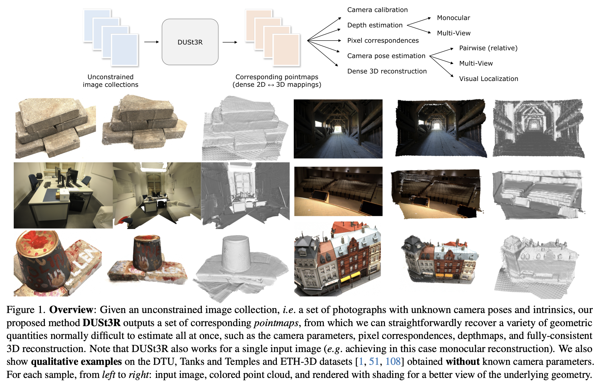

카메라 파라미터나 SfM없이도, 두 이미지 사이의 dense 3D correspondence를 직접 예측해서 3D를 재구성하는 모델이다.

## Abstract

기존의 multi-view stereo reconstruction(MVS)은 3D 재구성을 수행하기 위해 먼저 카메라의 intrinsic 및 extrinsic 파라미터를 추정해야 한다. 그러나 이러한 파라미터를 얻는 과정은 번거롭고 복잡하며, 그럼에도 불구하고 3D 공간에서 대응 픽셀을 triangulation(삼각측량)하기 위해 반드시 필요하다. 이러한 triangulation 과정은 기존 MVS 알고리즘의 핵심을 이루고 있다.

이 논문에서는 이러한 기존 접근과는 반대로, 카메라 보정 정보나 시점에 대한 사전 지식 없이도 동작할 수 있는 새로운 3D 재구성 방법인 DUSt3R를 제안한다. DUSt3R는 pairwise reconstruction 문제를 pointmap을 예측하는 회귀 문제로 재정의함으로써, 기존의 projective camera model이 가지던 강한 제약을 완화한다.

이러한 formulation은 단일 이미지 기반(monocular)과 다중 이미지 기반(binocular) 재구성을 하나의 통합된 방식으로 처리할 수 있게 하며, 두 장 이상의 이미지가 주어질 경우에는 모든 pairwise pointmap을 하나의 공통 좌표계로 정렬하는 간단하면서도 효과적인 global alignment 전략을 추가로 제안한다. 모델 구조는 Transformer 기반 encoder-decoder를 사용하여, 기존에 학습된 강력한 pretrained 모델을 활용할 수 있도록 설계되었다.

또한 이 방법은 장면의 3D 구조와 depth 정보를 직접적으로 예측할 뿐만 아니라, 이를 기반으로 픽셀 대응 관계, 상대 및 절대 카메라 파라미터까지 자연스럽게 복원할 수 있다. 다양한 실험 결과를 통해 DUSt3R는 여러 3D 비전 문제를 하나의 프레임워크로 통합할 수 있으며, 단일 이미지 및 다중 이미지 기반 depth 추정과 상대 pose 추정에서 최신 성능을 달성함을 보인다.

결론적으로, DUSt3R는 기존의 복잡한 기하 기반 파이프라인을 단순화하고, 다양한 3D 비전 문제를 보다 쉽게 해결할 수 있도록 만드는 새로운 접근 방식이다.

## Introduction

기존의 SfM과 MVS 기반 방법은 여러 단계의 하위 문제들을 순차적으로 해결하는 구조로 이루어져 있으며, 각 단계에서 발생하는 오류가 다음 단계로 전파되면서 전체 시스템의 복잡성과 불안정성을 증가시킨다. 특히 카메라 파라미터를 추정하는 과정은 필수적이지만, 실제 환경에서는 자주 실패하며 전체 성능을 크게 제한한다.

이러한 문제를 해결하기 위해, 논문에서는 기존 파이프라인과는 완전히 다른 접근 방식인 DUSt3R를 제안한다. DUSt3R는 카메라 calibration이나 pose 정보 없이도 두 장의 이미지로부터 직접 dense한 3D 장면을 예측할 수 있는 신경망 기반 모델이다. 이 모델은 pointmap이라는 표현을 사용하여, 장면의 3D 구조뿐만 아니라 픽셀과 3D 포인트 간의 대응 관계, 그리고 두 시점 간의 관계까지 동시에 표현한다. 이로 인해 별도의 카메라 추정 과정 없이도 장면에 대한 다양한 정보를 직접 추출할 수 있다.

또한 이 모델은 여러 문제를 분리하여 해결하는 대신, 하나의 통합된 네트워크 내에서 동시에 학습하도록 설계되어, 기존 파이프라인에서 부족했던 단계 간 협업을 가능하게 한다. Transformer 기반 구조를 사용하여 데이터 중심적으로 학습하며, 강한 기하학적 prior를 내재적으로 학습한다.

다중 이미지의 경우, 기존의 bundle adjustment를 대체하는 global alignment 방식을 통해 pointmap들을 하나의 공통 좌표계로 정렬하며, 재투영 오차가 아닌 3D 공간에서 직접 정렬을 수행한다. 실험 결과, 이러한 접근은 실제 환경에서도 정확하고 일관된 재구성을 가능하게 하며, 다양한 3D 비전 작업을 하나의 통합된 프레임워크로 해결할 수 있음을 보여준다.

결론적으로, DUSt3R는 기존의 복잡한 기하 기반 파이프라인을 단순화하고, 3D reconstruction 문제를 end-to-end 학습 문제로 전환함으로써, 보다 안정적이고 일반적인 해결 방식을 제시한다.

SfM(Structure-from-Motion)

이미지 여러 장으로부터 카메라 위치와 sparse 3D 구조를 추정하는 방법이다. 주어진 여러 장의 이미지 ${I_i}$ 로 카메라 파라미터 $(R_i, t_i, K_i)$ 와 3D 포인트 $X_j$ 를 구한다.

$$x_{ij}\sim K_i(R_iX_j+t_i)$$

3D 점이 카메라를 통해 2D로 투영된 결과가 이미지 픽셀이다. SfM은 다음 5단계로 구성된다:

1.   Feature detection: 이미지에서 repeatable 한 keypoint를 찾는다.(SIFT, ORB)

2.   Feature matching: 이미지 간 같은 물체의 점 대응을 찾는다.(descriptor distance(L2, Hamming), ratio test)

     $$(x_i,x_j)\leftrightarrow \text{same 3D point}$$

3.   Epipolar geometry estimation

     두 이미지 관계 $x_2^TFx_1=0$ 또는 $x_2^TEx_1=0$ ($F$: Fundamental matrix, $E$: Essential Matrix). 한 이미지의 점은 다른 이미지에서 epipolar line 위에 있어야 한다.

4.   Camera Pose Recovery

     Essential matrix 분해: $E=[t]_\times R$

5.   Triangulation

     두 카메라에서 관측된 점으로부터 3D 위치 복원. 기하적으로 두 ray 위의 교차점은 3D point

     $$X=\text{argmin}\sum_i\Vert x_i-P_iX\Vert^2$$

6.   Bundle Adjustment

     전체 최적화: $\min_{R_i,t_i,X_j}\sum_{i,j}\Vert x_{ij}-\pi(R_iX_j+t_i)\Vert^2$

     카메라와 3D 포인트를 동시에 최적화, reprojeciton error 최소화

MVS(Multi-View Stereo)

SfM 결과를 바탕으로 dense 3D 구조를 복원하는 방법이다.