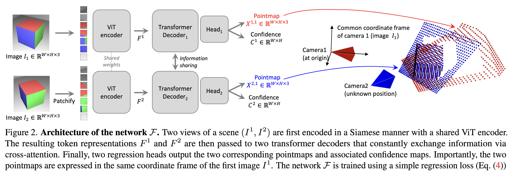
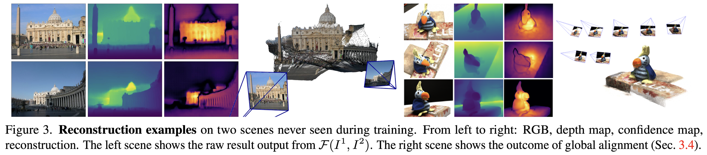

카메라 파라미터나 SfM없이도, 두 이미지 사이의 dense 3D correspondence를 직접 예측해서 3D를 재구성하는 모델이다.

## Abstract

기존의 multi-view stereo reconstruction(MVS)은 3D 재구성을 수행하기 위해 먼저 카메라의 intrinsic 및 extrinsic 파라미터를 추정해야 한다. 그러나 이러한 파라미터를 얻는 과정은 번거롭고 복잡하며, 그럼에도 불구하고 3D 공간에서 대응 픽셀을 triangulation(삼각측량)하기 위해 반드시 필요하다. 이러한 triangulation 과정은 기존 MVS 알고리즘의 핵심을 이루고 있다.

이 논문에서는 이러한 기존 접근과는 반대로, 카메라 보정 정보나 시점에 대한 사전 지식 없이도 동작할 수 있는 새로운 3D 재구성 방법인 DUSt3R를 제안한다. DUSt3R는 pairwise reconstruction 문제를 pointmap을 예측하는 회귀 문제로 재정의함으로써, 기존의 projective camera model이 가지던 강한 제약을 완화한다.

이러한 formulation은 단일 이미지 기반(monocular)과 다중 이미지 기반(binocular) 재구성을 하나의 통합된 방식으로 처리할 수 있게 하며, 두 장 이상의 이미지가 주어질 경우에는 모든 pairwise pointmap을 하나의 공통 좌표계로 정렬하는 간단하면서도 효과적인 global alignment 전략을 추가로 제안한다. 모델 구조는 Transformer 기반 encoder-decoder를 사용하여, 기존에 학습된 강력한 pretrained 모델을 활용할 수 있도록 설계되었다.

또한 이 방법은 장면의 3D 구조와 depth 정보를 직접적으로 예측할 뿐만 아니라, 이를 기반으로 픽셀 대응 관계, 상대 및 절대 카메라 파라미터까지 자연스럽게 복원할 수 있다. 다양한 실험 결과를 통해 DUSt3R는 여러 3D 비전 문제를 하나의 프레임워크로 통합할 수 있으며, 단일 이미지 및 다중 이미지 기반 depth 추정과 상대 pose 추정에서 최신 성능을 달성함을 보인다.

결론적으로, DUSt3R는 기존의 복잡한 기하 기반 파이프라인을 단순화하고, 다양한 3D 비전 문제를 보다 쉽게 해결할 수 있도록 만드는 새로운 접근 방식이다.

## Introduction

기존의 SfM과 MVS 기반 방법은 여러 단계의 하위 문제들을 순차적으로 해결하는 구조로 이루어져 있으며, 각 단계에서 발생하는 오류가 다음 단계로 전파되면서 전체 시스템의 복잡성과 불안정성을 증가시킨다. 특히 카메라 파라미터를 추정하는 과정은 필수적이지만, 실제 환경에서는 자주 실패하며 전체 성능을 크게 제한한다.

이러한 문제를 해결하기 위해, 논문에서는 기존 파이프라인과는 완전히 다른 접근 방식인 DUSt3R를 제안한다. DUSt3R는 카메라 calibration이나 pose 정보 없이도 두 장의 이미지로부터 직접 dense한 3D 장면을 예측할 수 있는 신경망 기반 모델이다. 이 모델은 pointmap이라는 표현을 사용하여, 장면의 3D 구조뿐만 아니라 픽셀과 3D 포인트 간의 대응 관계, 그리고 두 시점 간의 관계까지 동시에 표현한다. 이로 인해 별도의 카메라 추정 과정 없이도 장면에 대한 다양한 정보를 직접 추출할 수 있다.

또한 이 모델은 여러 문제를 분리하여 해결하는 대신, 하나의 통합된 네트워크 내에서 동시에 학습하도록 설계되어, 기존 파이프라인에서 부족했던 단계 간 협업을 가능하게 한다. Transformer 기반 구조를 사용하여 데이터 중심적으로 학습하며, 강한 기하학적 prior를 내재적으로 학습한다.

다중 이미지의 경우, 기존의 bundle adjustment를 대체하는 global alignment 방식을 통해 pointmap들을 하나의 공통 좌표계로 정렬하며, 재투영 오차가 아닌 3D 공간에서 직접 정렬을 수행한다. 실험 결과, 이러한 접근은 실제 환경에서도 정확하고 일관된 재구성을 가능하게 하며, 다양한 3D 비전 작업을 하나의 통합된 프레임워크로 해결할 수 있음을 보여준다.

결론적으로, DUSt3R는 기존의 복잡한 기하 기반 파이프라인을 단순화하고, 3D reconstruction 문제를 end-to-end 학습 문제로 전환함으로써, 보다 안정적이고 일반적인 해결 방식을 제시한다.

MVS(Multi-View Stereo)

MVS는 여러 장의 이미지와 그에 대응하는 카메라 파라미터가 주어졌을 때, 장면의 모든 표면을 가능한 한 촘촘하게 복원하는 문제다. SfM이 카메라 위치와 소수의 3D 포인트만을 추정하는 단계라면, MVS는 그 결과를 기반으로 장면의 전체 형태를 채워 넣는 역할을 한다. 즉, SfM이 “구조의 뼈대”를 만든다면, MVS는 그 위에 실제 표면을 복원하는 단계라고 볼 수 있다.

MVS의 핵심 가정은 매우 단순하다. 하나의 3D 점은 여러 이미지에서 관측될 때, 동일한 위치에 투영되었을 경우 비슷한 색이나 패턴을 가져야 한다는 것이다. 이를 photometric consistency라고 한다. 다시 말해, 어떤 픽셀의 깊이가 올바르게 추정되었다면, 그 픽셀을 다른 시점으로 투영했을 때 주변 이미지 패치와 잘 일치해야 한다. 반대로 깊이가 틀리면 서로 다른 위치를 가리키게 되어 색이나 구조가 맞지 않게 된다. MVS는 이 원리를 기반으로 각 픽셀의 depth를 찾는다.

구체적으로 보면, 먼저 하나의 기준 이미지(reference image)를 선택한다. 그리고 이 이미지의 각 픽셀에 대해 가능한 여러 depth 후보를 가정한다. 각 depth 후보는 해당 픽셀이 3D 공간에서 어느 위치에 있을지를 의미한다. 이때 카메라 내부 파라미터와 외부 파라미터를 이용하면, 픽셀을 3D 공간의 점으로 변환할 수 있고, 다시 다른 카메라로 투영하여 해당 점이 다른 이미지에서는 어디에 나타나는지를 계산할 수 있다. 이 과정을 통해 하나의 depth 가설에 대해 여러 시점에서의 대응 픽셀 위치를 얻을 수 있다.

이후 각 depth 후보에 대해 photometric consistency를 계산한다. 가장 단순한 방식은 두 이미지 간 픽셀 값 차이를 직접 비교하는 것이고, 좀 더 안정적인 방법으로는 normalized cross correlation 같은 유사도 측정을 사용한다. 중요한 점은 여러 이미지에서 동일한 3D 점이 잘 맞는지를 평가하는 것이므로, 하나의 view가 아니라 여러 view를 동시에 고려하여 비용을 계산한다는 것이다. 이렇게 하면 노이즈나 일부 가려진 영역의 영향을 줄일 수 있다.

각 픽셀에 대해 여러 depth 후보 중에서 photometric consistency가 가장 좋은 값을 선택하면, 해당 픽셀의 depth가 결정된다. 하지만 이 과정만으로는 결과가 매우 noisy하게 나온다. 따라서 공간적으로 인접한 픽셀들은 비슷한 depth를 가져야 한다는 smoothness constraint를 추가하여 결과를 정제한다. 이는 MRF나 variational optimization 같은 방법으로 구현되기도 한다.

이렇게 얻어진 depth map은 하나의 이미지 기준이기 때문에, 여러 이미지에서 각각 depth를 계산한 후 이를 하나의 3D 공간으로 통합하는 과정이 필요하다. 이 과정을 depth fusion이라고 하며, 최종적으로 dense point cloud나 mesh 형태의 3D 모델을 생성하게 된다.

MVS는 매우 강력한 방법이지만 몇 가지 근본적인 한계를 가진다. 가장 큰 문제는 texture에 대한 의존성이다. 표면에 특징적인 패턴이 없으면 서로 다른 이미지 간 대응을 정확히 찾기 어렵기 때문에 depth 추정이 불안정해진다. 또한 반사나 투명한 물체의 경우 photometric consistency 가정이 깨지므로 잘 동작하지 않는다. 가려짐(occlusion) 역시 큰 문제인데, 한 이미지에서는 보이지만 다른 이미지에서는 보이지 않는 영역이 존재하면 잘못된 depth가 추정될 수 있다. 마지막으로 계산 비용이 매우 크다는 점도 중요한 한계다. 각 픽셀마다 여러 depth 후보를 평가해야 하기 때문에 전체 연산량이 크게 증가한다.

이러한 이유로 MVS는 반드시 정확한 카메라 파라미터에 의존하며, 일반적으로 SfM 결과가 좋지 않으면 MVS 결과도 함께 무너진다. 이처럼 단계 간 의존성과 오류 전파 문제가 존재하기 때문에, 최근에는 DUSt3R와 같이 이러한 파이프라인 자체를 제거하고 end-to-end로 3D를 직접 예측하는 접근이 등장하게 된 것이다.

정리하면, MVS는 여러 시점에서 동일한 3D 점이 비슷하게 보인다는 가정을 이용해 각 픽셀의 depth를 추정하고 이를 결합하여 dense 3D 구조를 복원하는 방법이며, SfM과 결합되어 전통적인 3D reconstruction 파이프라인을 구성하는 핵심 요소다.

## Related Work

SfM은 여러 이미지로부터 카메라 파라미터와 sparse한 3D 구조를 동시에 추정하는 방법으로, keypoint matching을 통해 대응점을 찾고, 이를 기반으로 기하 관계를 추정한 뒤 bundle adustment를 통해 전체를 최적화하는 파이프라인을 따른다. 최근에는 feature descriptor, matching, 그리고 neural bundle adjustment 등 다양한 개선이 이루어졌지만, 여전히 **순차적인 구조를 유지하고 있어 각 단계에서 발생한 오류가 다음 단계로 전파되는 문제를 해결하지 못하고 있다.**

이후 Multi-View Stereo(MVS)는 SfM에서 얻은 카메라 파라미터를 기반으로 장면의 dense한 3D구조를 복원하는 단계로, 여러 시점 간 triangulation을 통해 표면을 재구성한다. 기존 MVS 방법들은 handcrafted 방식, 최적화 기반 방식, 그리고 learning 기반 방식 등으로 발전해왔지만, 공통적으로 정확한 카메라 파라미터를 입력으로 필요로 한다. 따라서 실제 환경에서 카메라 보정이 부정확하거나 노이즈가 존재할 경우, 전체 재구성 성능이 크게 저하되는 문제가 있다.

최근에는 단일 RGB 이미지로부터 직접 3D를 예측하는 접근들도 등장하였다. 이러한 방법들은 본직적으로 ill-posed한 문제를 해결하기 위해 대규모 데이터로부터 학습된 3D prior를 활용한다. 이들은 크게 두 가지로 나눌 수 있는데, 하나는 특정 객체 범주에 특화된 object-level prior를 사용하는 방식이고, 다른 하나는 일반적인 장면을 대상으로 monocular depth estimation(MDE)을 활용하는 방식이다. 후자의 경우 depth map을 예측한 뒤 카메라 파라미터를 이용해 3D 구조를 복원하는 흐름을 따르며, 경우에 따라 카메라 intrinsics를 추정하거나 video의 temporal consistency를 활용하기도 한다. 그러나 이러한 방법들은 depth 품질에 크게 의존하며, 특히 단일 이미지 기반 depth 추정의 근본적인 불확실성으로 인해 한계를 가진다.

한편, multi-view 입력을 활용하는 learning 기반 방법들도 제안되었는데, 이들은 기존 SfM 파이프라인을 differentiable하게 구성하여 end-to-end로 학습하는 형태를 가진다. 하지만 이 경우에도 여전히 카메라 intrinsics가 필요하며, 출력 역시 depth map이나 상대 pose에 머무르는 경우가 많다. 즉, 구조적으로는 기존 파이프라인을 학습 기반으로 재구성한 것에 가깝다.

또한 pointmap과 유사하게 view 기반으로 3D를 표현하는 접근은 기존에도 존재해왔다. 이러한 방법들은 주로 Visual Localization이나 view synthesis 분야에서 활용되며, 3D 구조를 여러 개의 canonical view로 나누어 이미지 공간에서 처리하는 방식을 취한다. 그러나 이들 역시 대부분 명시적인 camera geometry와 rendering 과정에 의존하여 동작한다.

결국 기존 방법들은 모두 카메라 파라미터 추정이나 depth 추정과 같은 중간 표현에 의존하고 있으며, 이로 인해 구조적 복잡성과 오류 전파 문제를 안고 있다. 이러한 한계를 바탕으로, 본 논문에서는 카메라 정보나 depth를 명시적으로 사용하지 않고, 이미지로부터 직접 pointmap을 예측하는 새로운 접근을 제안하며, 이를 통해 보다 단순하고 일관된 3D 재구성 프레임워크를 구축하고자 한다.

## Method

### Pointmap

$X\in\mathbb R^{W\times H\times 3}$ 인 pointmap의 각각의 point는 해상도 $W\times H$ 인 RGB 이미지 $I$ 의 픽셀에 일대일 대응된다.  각 카메라 광선이 하나의 3D 점에만 닿는다고 가정하기에 $I_{i,j} \leftrightarrow X_{i,j}$ 이다.

### Cameras and scene

카메라 내부 파라미터 $K$ 가 주어지면, ground-truth depth map $D$로부터 $X_{i,j} = K^{-1} \begin{bmatrix} i D_{i,j} \\ j D_{i,j} \\ D_{i,j} \end{bmatrix}$ 의 형태로 장면의 pointmap을 얻을 수 있다. $X$는 카메라 좌표계에서 표현된다. 카메라 $n$에서 얻은 pointmap $X^n$을 카메라 $m$ 좌표계에서 표현한 것을 $X^{n,m}$으로 표기한다.

$$X^{n,m} = P_m P_n^{-1} h(X^n)$$

$X^n \xrightarrow{P_n^{-1}} \text{world} \xrightarrow{P_m} \text{camera m}$ 의 순서로 좌표계 방향을 바꾼다. $P_n^{-1}$은 camera $n$ → world,  $P_m$: world → camera $m$ 이다. 그리고 $h$는 $(x,y,z)$를 $(x,y,z,1)$로 변환하는 homogeneous mapping이다.

---

두 이미지 $I_1,I_2$ 를 입력으로 받아, 같은 좌표계(1번 카메라 좌표계)에서 정렬된 3D pointmap을 직접 예측한다. 출력으로 pointmap $X^{1,1},X^{2,1}$ 과 confidence map $C^{1,1},C^{2,1}$ 을 얻는다. 두 pointmap이 같은 좌표계인 것이 DUSt3R의 핵심이다. 왜냐하면 기존에는 각 view마다 좌표계가 달랐고 카메라 파라미터가 필요했다. 그래서 2D 대응을 이용해 triangulation으로 3D를 계산하지만, DUSt3R는 두 이미지를 입력으로 받아 같은 좌표계에서 pointmap을 직접 예측함으로써 triangulation을 제거하고, 대신 confidence map을 통해 예측의 신뢰도를 모델링한다.

### Network Architecture

본 모델의 네트워크 구조는 transformer 기반 아키텍처로 설계되었다. 전체 구조는 두 개의 동일한 브랜치로 이루어져 각 브랜치는 하나의 이미지를 처리한다. 각 브랜치는 image encoder, decoder, 그리고 regression head로 구성된다. 입력으로 주어지는 두 개의 이미지 $I^1, I^2$는 동일한 가중치를 공유하는 ViT encoder를 통해 각각 인코딩되어 토큰 표현 $F^1, F^2$로 변환된다. 이후 이 두 feature는 decoder 단계에서 함께 처리되며, 이 과정에서 두 이미지 간의 상호작용이 본격적으로 이루어진다. Decoder는 transformer 구조를 기반으로 하며, 각 블록은 self-attention, cross-attention, 그리고 MLP를 순차적으로 수행한다. 먼저 self-attention을 통해 각 이미지 내부의 정보를 통합하고, 이어서 cross-attention을 통해 다른 이미지의 정보를 참고한다. 이 과정에서 두 브랜치는 서로의 정보를 지속적으로 교환하며, 이는 두 이미지 간의 기하학적 관계를 학습하는 데 핵심적인 역할을 한다. 특히 각 decoder 블록에서는 한 브랜치의 토큰이 다른 브랜치의 토큰을 참조하여 업데이트되며, 이러한 과정이 여러 층에 걸쳐 반복된다. 이처럼 반복적인 정보 교환을 통해 두 이미지의 표현은 점차 정렬되며, 결국 동일한 좌표계에서 일관된 3D 구조를 형성하게 된다. 마지막으로 각 브랜치의 regression head는 decoder에서 생성된 토큰을 입력으로 받아 pointmap과 confidence map을 출력한다. 이때 두 pointmap은 동일한 좌표계에서 표현되도록 학습되며, 이는 기존 방식과 달리 별도의 카메라 파라미터 추정 없이도 두 이미지 간의 3D 정렬을 가능하게 한다. 결과적으로 이 아키텍처는 두 이미지 간의 관계를 explicit한 기하 계산 없이, cross-attention 기반의 학습을 통해 내재적으로 추론하며, 이를 통해 정렬된 3D pointmap을 직접 생성하는 end-to-end 구조를 형성한다.

### 3D regression loss

DUSt3R의 학습 목표는 3D 좌표를 직접 맞추는 regression 문제로 정의한다. 각 valid pixel $i$ 에 대해 

$$\ell_{\text{regr}}(v,i) = \left\| \frac{1}{z} X_i^{v,1} - \frac{1}{\bar{z}} \bar{X}_i^{v,1} \right\|$$

예측 3D 좌표 $X$ 와 GT 3D 좌표 $\bar X$ 를 L2 distance로 비교한다. 그냥 비교하지 않고, scale을 맞춘 뒤 비교한다. 3D reconstrucion에는 본직적인 문제가 절대 크기를 알 수 없는 것이다. 그래서 $X \rightarrow \frac{X}{z}, \quad \bar{X} \rightarrow \frac{\bar{X}}{\bar{z}}$ 를 하고, scale factor $z = \text{norm}(X^{1,1}, X^{2,1})$은 모든 점들의 평균 거리로 정규화한다. 아래에서 $D^v$는 view $v$에서 valid pixel 집합이고, $X_i^v$는 해당 pixel의 3D point, $\Vert X_i^v\Vert$는 원점으로부터 거리이다.

$$\mathrm{norm}(X^1, X^2) = \frac{1}{|D^1| + |D^2|} \sum_{v \in \{1,2\}} \sum_{i \in D^v} \| X_i^v \|$$

즉, DUSt3R는 pointmap을 직접 회귀하고, scale normalization을 통해 절대 크기를 제거한 뒤 3D 구조(형태)만 맞추도록 학습한다.

### Confidence-aware loss

현실에서는 모든 픽셀이 잘 정의된 3D를 가지지 않는다. 하늘(depth가 없다), 투명 물체, 반사 영역, texture 없는 영역 등 어떤 픽셀은 예측이 불가능하거나 매우 어렵다. 이에 각 픽셀마다 confidence를 같이 예측한다. 

$$\mathcal{L}_{\text{conf}} = \sum_{v \in \{1,2\}} \sum_{i \in D^v} C_i^{v,1} \, \ell_{\text{regr}}(v,i) - \alpha \log C_i^{v,1}$$

첫 번째 항 $C_i \cdot \ell_{\text{regr}}$ 은 confidence가 높으면 loss를 크게 반영하고, 낮으면 작게 반영한다. 두 번째 항 $- \alpha \log C_i$ 은 confidence를 너무 작게 만드는 걸 막는 규제이다. 두 번재 항이 없으면 모델은 어려운 픽셀의 confidence를 0으로 만들어 loss를 무시한다. $C_i$가 작아질수록 $\log C_i$도 작아지고, 따라서 $-\log C_i$는 커지는 방향으로 loss에 불리하게 작용하기 때문이다. 그래서 $C_i$ 가 너무 작아지면 penalty가 발생하도록 한다. Confidence는 다음과 같의 정의된다.

$$C_i = 1+\exp(\tilde{C}_i)$$

여기서 $\tilde{C}_i$  는 네트워크가 직접 출력하는 raw 값이고, $C_i$ 는 그 raw 값을 변환해서 얻은 실제 confidence다. 위와 같이 confidence를 정의하는 이유는 exp로 0 이상으로 만들고 1을 더해주면 confidence는 항상 1 이상이다. 이는 $\log$에 들어가면 항상 0 이상이 되는데 만약 1을 안 더해준다면 $C_i$ 가 아주 0에 가깝게 내려갈 수 있다. 그러면 모델이 어려운 영역에서 confidence를 사실상 0처럼 보내서 그 픽셀의 loss를 거의 완전히 무시해버릴 수 있다.

최종적으로 모델은 두 가지를 동시에 만족해야 한다.

1.  오차가 큰 픽셀에서는 $C_i$를 낮추고 싶다.
2.  하지만 너무 낮추면 $-\alpha \log C_i$ 때문에 손해를 본다.

예시로 한 픽셀만 떼어서 생각해보자. 그 픽셀의 loss를

$$L_i(C_i)= C_i\,\ell_i - \alpha \log C_i,\quad\ell_i = \ell_{\text{regr}}(v,i)$$

라고 두자. 이제 $C_i$에 대해 미분하면 $\frac{dL_i}{dC_i} = \ell_i - \frac{\alpha}{C_i}$ 이 된다. 최적점에서는 $\ell_i - \frac{\alpha}{C_i}=0$ 이므로 $C_i = \frac{\alpha}{\ell_i}$ 가 된다.

이 식이 의미하는 것은:

$$C_i \propto \frac{1}{\ell_i}$$

즉,

-   오차 $\ell_i$가 작으면 $C_i$는 커진다.
-   오차 $\ell_i$가 크면 $C_i$는 작아진다.

따라서 이 loss는 자연스럽게 쉬운 픽셀에는 높은 confidence, 어려운 픽셀에는 낮은 confidence를 부여하도록 유도한다. 이게 바로 confidence map이 별도 GT 없이도 학습되는 이유다.

### Point matching

pointmap이 이미 geometry를 포함하고 있기 때문에, matching은 그냥 거리 비교로 해결된다. DUSt3R은 3D 공간에서 neareset neighbor search를 통해 픽셀 대응을 구한다.

$$\text{NN}^{n,m}(i) = \arg\min_j \| X_j^{n,k} - X_i^{m,k} \|$$

Image m의 pixel i를 n에서 가장 가까운 3D 포인트를 찾는것이다.

$$\mathcal{M}_{1,2} = \{(i,j) \mid i = \text{NN}^{1,2}(j), \; j = \text{NN}^{2,1}(i)\}$$

Mutual 매칭으로 서로가 서로를 선택해야 대응점이 된다. 단순 NN은 one-to-many 매칭이 발생하고 노이즈가 많기에 더 정확한 대응을 위함이다.

### Recovering intrinsics

Pointmap $X^{1,1}$는 image 1의 카메라 좌표계에서 표현되기에, 각 픽셀 $(i,j)$ 에 대해 3D 좌표 $(X, Y, Z)$ 가 있다. 따라서 camera intrinsics를 추정할 수 있다. Projection 관계를 거꾸로 푸는 과정이다.

$$f_1^* = \arg\min_{f_1} \sum_{i,j} C_{i,j}^{1,1} \left\| (i', j') - f_1 \frac{(X_{i,j,0}^{1,1}, X_{i,j,1}^{1,1})}{X_{i,j,2}^{1,1}} \right\|$$

$(i', j')$ 는 center 기준 pixel 위치이다.

$$i' = i - W/2,\quad j' = j - H/2$$

$f_1 \cdot \frac{(X,Y)}{Z}$ 는 pinhole camera projection이다.

$f_1^*$은 3D &rarr; 2D projection이 실제 pixel과 맞도록하는 $f$를 찾는 것이다. $C_{i,j}^{1,1}$이 들어가는 이유는 신뢰도 높은 픽셀은 더 중요하게 반영하여 noisy 영역 영향을 줄이기 위함이다.

### Relative pose estimation

$$R^*, t^* = \arg\min_{\sigma, R, t} \sum_i C_i^{1,1} C_i^{1,2} \left\| \sigma (R X_i^{1,1} + t) - X_i^{1,2} \right\|^2$$

기존에는 두 이미지에서 같은 점 찾기 (2D matching), 그걸로 epipolar constraint 계산, triangulation 해서 3D 복원, 거기서 camera pose 추정을 했다. DUSt3R은 각 픽셀마다 3D 좌표를 바로 예측해서 두 이미지 모두에서 3D pointmap을 얻는다. 두 pointmap은 같은 좌표계이지만 서로 다른 회전, 위치, 크기를 갖는다. 그래서 한쪽을 회전, 이동, 크기를 맞춰서 두 점 집합을 최대한 겹치게 만든다. 다만 이 방식 또한 noise, outlier에 약해 RANSAC, PnP 같은 robust 방법을 같이 사용한다.ㄷ

### Absolute pose estimation

예를 들어, 어떤 장소를 여러 장 찍어서 3D로 복원해 놓은 상태이고, 새로운 사진 한 장이 들어온다. 이 사진이 그 3D 공간 어디에서 찍혔는지를 알아내는 것이 absolute pose estimation이다. 기존에는 새로운 이미지와 기준 이미지를 비교해서, 두 이미지에서 같은 픽셀을 찾는다. 그리고 그 픽셀이 3D  공간에서 어디에 해당하는지 연결하면 "2D-3D 대응"이 만들어진다. 그 다음 PnP라는 알고리즘을 쓰면 카메라 위치와 방향을 구할 수 있다.

DUSt3R에서는 이미지를 넣으면 각 픽셀의 3D 위치를 바로 만들어 주기에, 새로운 이미지도 3D로 바뀌고, 기준 이미지도 3D이다. 그래서 relative pose 에서 두 개의 3D 점 집합을 겹치게 하기위해 회전과 이동을 했다. 그렇지만 모델은 절대 크기를 정확히 알지 못한다. 그래서 두 3D는 모양은 맞지만 크기는 다를 수 있다. 기준 이미지(world 기준을 알고 있는 쪽)의 scale을 이용해서 새 이미지의 3D를 그에 맞게 크기를 조정한다.

### Pairwise graph

DUSt3R는 기본적으로 이미지 두 장을 입력받아, 그 두 장 사이에서 정렬된 pointmap을 예측하는 모델이었다. 그런데 실제 3D reconstruction에서는 보통 이미지가 두 장이 아니라 수십 장, 많게는 수백 장이 들어온다. 그러면 각 이미지 쌍마다 나온 pairwise 3D 결과를 따로따로 두는 것이 아니라, 이것들을 하나의 공통 3D 공간 안으로 합쳐야 한다. 

먼저 여러 장의 이미지가 주어졌을 때, 모든 이미지를 무조건 한꺼번에 처리하는 것이 아니라, 서로 겹치는 이미지들끼리 연결해서 관계를 만든 뒤, 그 관계를 이용해 전체를 하나의 장면으로 정렬한다. 이때 논문은 이미지 집합 $\{I^1, I^2, \dots, I^N\}$을 그래프 형태로 본다. 각 이미지는 하나의 노드가 되고, 두 이미지가 같은 장면 일부를 공유하면 그 둘 사이에 edge를 만든다. 즉, 이 그래프는 “어떤 이미지들이 서로 겹치는가”를 표현하는 구조다.

왜 이런 그래프가 필요하냐면, 여러 장 이미지 중에는 실제로 서로 거의 겹치지 않는 것들도 있기 때문이다. 예를 들어 어떤 장면을 찍은 사진 20장이 있다고 해도, 1번 이미지와 2번 이미지는 많이 겹칠 수 있지만, 1번과 20번은 아예 다른 방향을 보고 있을 수 있다. 이런 경우 1번과 20번을 직접 정렬하려고 하면 잘못된 matching이나 이상한 3D 정렬이 생길 수 있다. 그래서 먼저 서로 시각적으로 겹치는 이미지들만 연결해야 한다. 이게 graph를 만드는 이유다.

논문에서는 이런 겹침 여부를 판단하는 방법도 제안한다. 하나는 기존의 image retrieval 기법을 사용하는 것이다. 즉, 시각적으로 비슷한 이미지들을 먼저 찾아서 edge 후보로 삼는 방식이다. 다른 하나는 더 직접적인 방법인데, 여러 이미지 쌍을 실제로 DUSt3R에 넣어 본 뒤 그 결과의 confidence를 보고 겹침 정도를 판단하는 것이다. DUSt3R는 각 pair에 대해 pointmap뿐 아니라 confidence map도 출력하므로, 두 이미지가 정말 같은 장면을 잘 공유하고 있다면 평균 confidence가 높게 나올 가능성이 크다. 반대로 서로 거의 겹치지 않거나 정렬이 불안정하면 confidence가 낮게 나온다. 그래서 논문은 pair별 평균 confidence를 overlap의 지표로 사용하고, confidence가 낮은 pair는 graph에서 제거한다. 즉, 신뢰도 낮은 이미지 쌍은 아예 전체 장면 정렬에 쓰지 않는다.

여기서 중요한 점은, DUSt3R가 출력하는 pointmap이 단순히 깊이맵만 주는 것이 아니라는 것이다. 각 pair에서 모델은 사실상 두 가지 중요한 정보를 제공한다. 하나는 정렬된 두 개의 point cloud, 다른 하나는 각 픽셀이 어떤 3D 점과 대응되는지에 대한 pixel-to-3D mapping이다. 이 정보가 있기 때문에 단순히 depth를 합치는 수준이 아니라, 각 이미지 쌍에서 얻은 3D 구조들을 서로 비교하고, 전체 장면 안에서 일관되게 맞추는 것이 가능해진다.

그러면 global alignment는 실제로 무엇을 하느냐. 각 pairwise 결과는 자기 나름의 좌표계와 스케일을 가질 수 있다. 예를 들어 이미지 1–2 쌍에서 나온 3D와 이미지 2–3 쌍에서 나온 3D는 둘 다 올바른 구조를 담고 있어도, 서로의 위치나 회전, scale이 완전히 맞아 있지는 않을 수 있다. 그래서 전체 optimization의 목표는 이런 pairwise pointmap들을 하나의 공통 좌표계 안으로 옮겨와서, 모든 쌍에서 예측된 3D가 서로 최대한 일관되게 되도록 만드는 것이다. 쉽게 말하면, 여러 장 사진마다 조금씩 따로 그려진 3D 조각들을 하나의 큰 퍼즐처럼 맞추는 과정이다.

이 과정이 가능한 이유는 각 pairwise 결과가 단순히 “이 이미지에는 깊이가 이렇다” 수준의 정보만 주는 것이 아니라, 이미 서로 정렬된 두 point cloud와 대응 관계를 함께 제공하기 때문이다. 그래서 전통적인 SfM처럼 먼저 sparse feature matching을 만들고, 그다음 카메라를 추정하고, 다시 triangulation하고, 마지막에 dense reconstruction으로 가는 복잡한 단계를 거치지 않아도 된다. DUSt3R에서는 pairwise 3D가 이미 준비되어 있으므로, global alignment는 본질적으로 여러 pairwise 3D 결과를 공통 좌표계로 정렬하는 후처리 optimization 문제가 된다.

정리하면, 이 섹션이 말하려는 것은 다음과 같다. DUSt3R 자체는 원래 두 장 이미지 입력만 처리할 수 있지만, 실제 장면 전체를 복원하려면 여러 쌍의 예측 결과를 하나로 합쳐야 한다. 이를 위해 먼저 이미지들을 겹침 정도에 따라 graph로 연결하고, confidence가 낮은 pair는 제거한다. 그런 다음 남은 신뢰도 높은 pairwise pointmap들을 하나의 3D 공간으로 정렬하는 global optimization을 수행한다. 이 과정을 통해 pairwise 모델인 DUSt3R를 multi-view scene reconstruction으로 확장할 수 있다.

### Global optimization

각 이미지 쌍은 자기 나름의 3D 결과를 낸다. 하지만 그 결과들은 서로 좌표계가 다르고, 크기(scale)도 다를 수 있다. 그래서 이 pairwise 3D 결과들을 적절히 회전시키고, 이동시키고, 크기를 조정해서 하나의 공통 좌표계 안에 넣어야 한다. 이 과정을 모든 이미지 쌍에 대해 동시에 수행해서, 최종적으로 장면 전체를 설명하는 하나의 global 3D를 만드는 것이 목적이다.

먼저 논문은 최종적으로 얻고 싶은 것을 $\{\chi^n\}$로 둔다. 여기서 $\chi^n \in \mathbb{R}^{W \times H \times 3}$는 이미지 $n$에 대한 globally aligned pointmap이다. 즉, 이제까지 pairwise 결과에서 얻었던 pointmap이 아니라, 장면 전체의 공통 좌표계에서 표현된 pointmap이다. 쉽게 말하면, 각 이미지에 대해 “이 픽셀은 세계 좌표계에서 어디에 해당하는가”를 나타내는 최종 3D 지도라고 보면 된다.

그 다음 논문은 connectivity graph $G$를 사용한다고 말한다. 앞에서 이미 설명했듯이, 그래프의 각 노드는 이미지 하나를 의미하고, edge $e=(n,m)$는 이미지 $I^n$과 $I^m$가 서로 겹치는 장면을 어느 정도 공유한다는 뜻이다. 즉, 모든 이미지 쌍을 무조건 쓰는 것이 아니라, 실제로 같은 장면 부분을 보고 있는 이미지 쌍만 골라서 관계를 만든다. 이 그래프는 전통적인 SfM에서 feature matching graph를 만드는 것과 비슷한 역할을 하지만, 여기서는 feature가 아니라 pointmap과 confidence를 기반으로 전체 구조를 세운다.

각 edge $e=(n,m)$에 대해 DUSt3R는 pairwise 결과를 예측한다. 구체적으로는 $X^{n,n}$과 $X^{m,n}$, 그리고 그에 대응하는 confidence map $C^{n,n}, C^{m,n}$을 얻는다. 여기서 아주 중요한 점은, 이 두 pointmap이 같은 좌표계 안에 있다는 것이다. $X^{n,n}$은 이미지 $n$ 기준의 pointmap이고, $X^{m,n}$은 이미지 $m$에서 본 장면을 역시 이미지 $n$의 좌표계로 표현한 pointmap이다. 즉, 이 pair 안에서는 두 결과가 이미 서로 정렬되어 있다. 논문은 표기를 단순하게 하려고 $X^{n,e}:=X^{n,n}, X^{m,e}:=X^{m,n}$처럼 쓴다. 즉, “pair $e$ 안에서 이미지 $n$의 pointmap”과 “pair $e$ 안에서 이미지 $m$의 pointmap”이라는 뜻이다.

이제 문제는 명확하다. 각 pair $e$는 pair 내부에서는 잘 정렬되어 있지만, 서로 다른 pair끼리는 여전히 global 기준이 없다. 예를 들어, (1,2) 쌍에서 나온 3D와 (2,3) 쌍에서 나온 3D는 같은 장면 일부를 담고 있을 수 있어도, 각각의 회전, 이동, scale이 다를 수 있다. 따라서 pairwise prediction 전체를 하나의 세계 좌표계로 옮기는 변환이 필요하다.

그래서 논문은 각 pair $e$에 대해 두 가지 변수를 둔다. 하나는 $P_e \in \mathbb{R}^{3\times 4}$이고, 다른 하나는 $\sigma_e > 0$이다. 여기서 $P_e$는 rigid transformation, 즉 회전과 이동을 포함하는 pose 역할을 하고, $\sigma_e$는 scale 보정을 위한 스칼라다. 쉽게 말하면, pair $e$에서 나온 pointmap 전체를 global 좌표계에 맞추려면 “얼마나 돌리고 옮길지”를 정하는 $P_e$와, “얼마나 크기를 늘리거나 줄일지”를 정하는 $\sigma_e$가 필요하다는 뜻이다.

그 다음 논문은 다음 optimization 문제를 세운다.

$$\chi^* = \arg\min_{\chi, P, \sigma} \sum_{e\in\mathcal{E}} \sum_{v\in e} \sum_{i=1}^{HW} C_i^{v,e}\,\|\chi_i^v - \sigma_e P_e X_i^{v,e}\|$$

먼저 $\chi_i^v$는 이미지 $v$의 $i$번째 픽셀에 대한 global 좌표계의 3D 점이다. 즉, 최종적으로 우리가 얻고 싶은 값이다. 반면 $X_i^{v,e}$는 pair $e$에서 예측된 $i$번째 픽셀의 local 좌표계 3D 점이다. 그리고 여기에 $\sigma_e P_e$를 곱하면, pair $e$에서 얻은 local 3D를 global 좌표계 쪽으로 옮긴 값이 된다. 따라서 $\Vert\chi_i^v - \sigma_e P_e X_i^{v,e}\Vert$는 “최종 global 3D”와 “pairwise 결과를 global로 옮긴 값” 사이의 차이를 의미한다. 이 차이를 모든 pair, 모든 이미지, 모든 픽셀에 대해 더한 것이 전체 objective다.

여기서 confidence $C_i^{v,e}$가 곱해진다는 점도 중요하다. 이는 앞에서 본 confidence-aware loss와 연결된다. 신뢰도가 높은 픽셀은 alignment에서 더 크게 반영하고, 신뢰도가 낮은 픽셀은 덜 반영하겠다는 뜻이다. 즉, 모든 점을 똑같이 믿는 것이 아니라, 네트워크가 스스로 “이 점은 믿을 만하다”고 평가한 점일수록 global optimization에서도 더 큰 역할을 하게 만든다. 이것은 실제로 매우 중요하다. 하늘, 반사면, 투명체, 가려진 영역처럼 예측이 불안정한 부분은 global alignment를 깨뜨릴 수 있기 때문이다.

이 최적화 문제에서 아주 핵심적인 아이디어는, 한 pair $e$ 안에 있는 두 pointmap $X^{n,e}$와 $X^{m,e}$에는 같은 변환 $P_e$를 써야 한다는 것이다. 왜냐하면 이 둘은 애초에 동일한 pair 좌표계 안에 표현되어 있기 때문이다. 즉, 이 pair 내부에서는 두 pointmap이 이미 서로 정렬되어 있으므로, global 좌표계로 옮길 때도 둘 다 동일한 rigid transformation을 받아야 한다. 이 점이 global alignment의 핵심 제약이다. 한 pair 안의 두 결과를 따로따로 다른 방향으로 돌려버리면, pairwise prediction이 원래 갖고 있던 일관성이 깨져버린다.

scale $\sigma_e$가 들어가는 이유도 중요하다. DUSt3R는 본질적으로 absolute scale을 정확히 알지 못한다. 앞에서 regression loss를 scale-normalized form으로 정의한 것도 바로 이 때문이다. 따라서 각 pairwise prediction은 shape는 맞아도 크기가 다를 수 있다. 어떤 pair는 전체 pointmap이 조금 크게 예측될 수 있고, 어떤 pair는 작게 예측될 수 있다. 이런 차이를 global 좌표계에서 맞추기 위해 $\sigma_e$를 도입한다. 즉, 각 pair별로 스케일을 조정하면서 전체 장면 안에서 일관되게 맞추는 것이다.

그런데 scale을 자유롭게 두면 문제가 생긴다. 논문에서도 말하듯이, trivial optimum이 생긴다. 예를 들어 모든 $\sigma_e = 0$으로 두면, 모든 transformed point가 원점에 모여버리므로 식의 차이가 인위적으로 작아질 수 있다. 물론 이런 해는 물리적으로 아무 의미가 없다. 그래서 논문은 이를 막기 위해 $\prod_e \sigma_e = 1$이라는 제약을 둔다. 이 제약은 전체 scale이 완전히 붕괴되는 것을 막아주는 역할을 한다. 쉽게 말하면, 개별 pair의 크기는 조정할 수 있지만 전체적으로는 scale이 무한히 줄어들거나 커지지 않도록 균형을 유지시키는 장치다.

직관적으로 보면, 이 optimization은 퍼즐 맞추기와 매우 비슷하다. 각 이미지 쌍으로부터 얻은 pointmap은 장면의 일부를 담고 있는 퍼즐 조각이다. 그런데 이 조각들은 각자 자기 기준으로 만들어져 있어서 바로 이어 붙일 수 없다. 그래서 각 조각을 적절히 회전시키고, 옮기고, 크기를 조절해서 하나의 커다란 그림에 맞춰 넣는 것이다. 여기서 $\chi$가 완성된 그림이고, $P_e$와 $\sigma_e$는 각 조각을 어디에, 어떤 크기로 배치할지 결정하는 변수다. 그리고 confidence는 “이 조각의 어느 부분을 더 믿을 수 있는가”를 알려주는 가중치다.

이 과정을 전통적인 SfM/BA와 비교하면 더 잘 이해된다. SfM에서는 먼저 sparse feature matching을 하고, camera pose를 추정하고, triangulation을 하고, 마지막에 bundle adjustment로 전체를 정제한다. 반면 DUSt3R에서는 pairwise 3D가 이미 예측되어 있으므로, 전통적인 camera-centric optimization 대신 pointmap-centric optimization을 하게 된다. 즉, 카메라와 sparse point를 동시에 최적화하는 대신, pairwise로 얻은 dense pointmap들을 하나의 world 좌표계에 맞추는 방식으로 전체 장면을 복원한다. 그래서 이 global optimization은 일종의 “pointmap version of bundle adjustment”라고 볼 수 있다.

정리하면, 이 섹션이 말하려는 것은 다음과 같다. 여러 이미지 쌍에서 얻은 pairwise pointmap들은 각각 내부적으로는 정렬되어 있지만, pair들끼리는 아직 공통 좌표계가 없다. 그래서 각 pair마다 rigid transformation과 scale을 두고, 이를 통해 pairwise 결과를 공통 world 좌표계에 맞춘다. 그리고 confidence-weighted error를 최소화하는 방향으로 최적화하여, 모든 이미지에 대한 globally aligned pointmap $\chi^n$을 구한다. 이 과정 덕분에 pairwise 모델인 DUSt3R를 실제 multi-view scene reconstruction으로 확장할 수 있게 된다.

