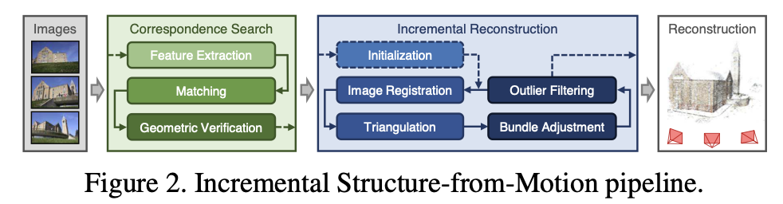
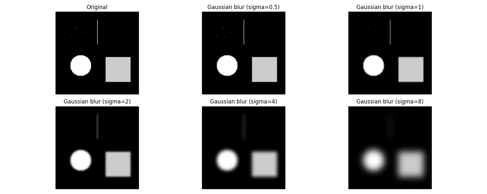
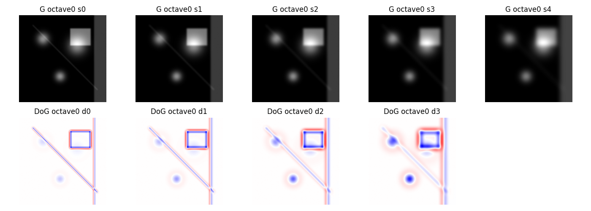
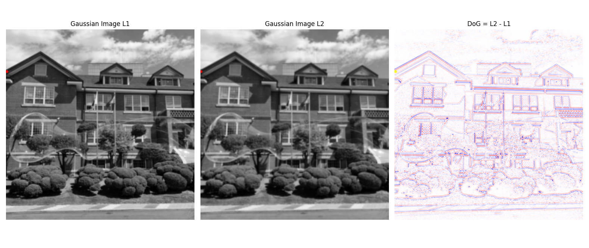
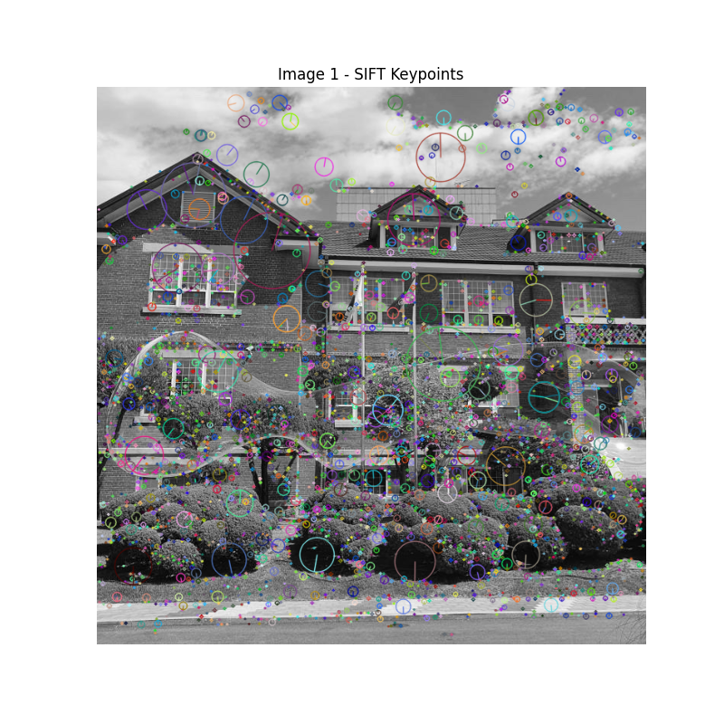
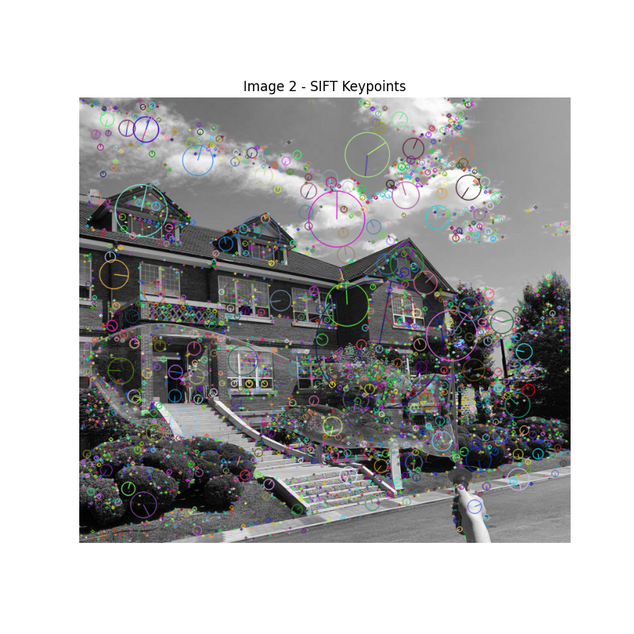
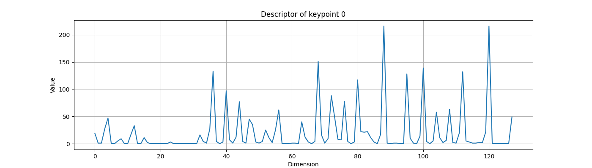
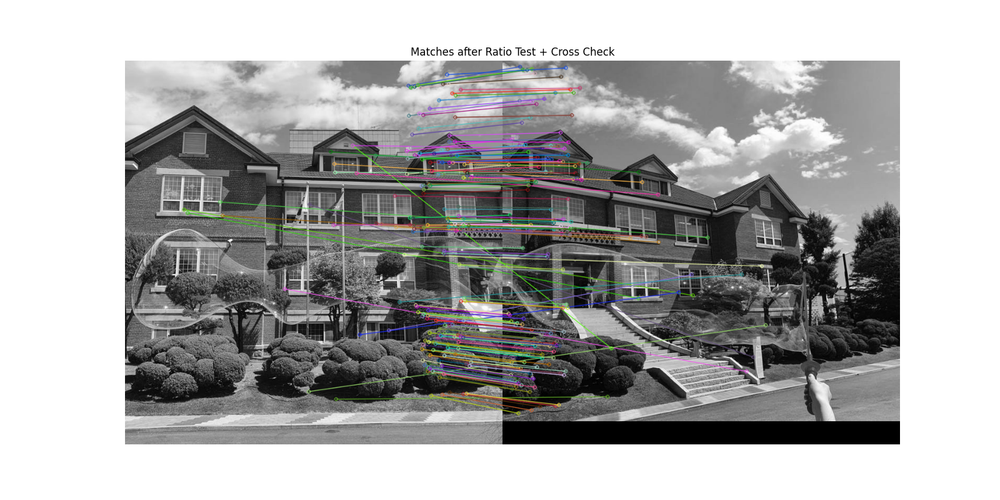
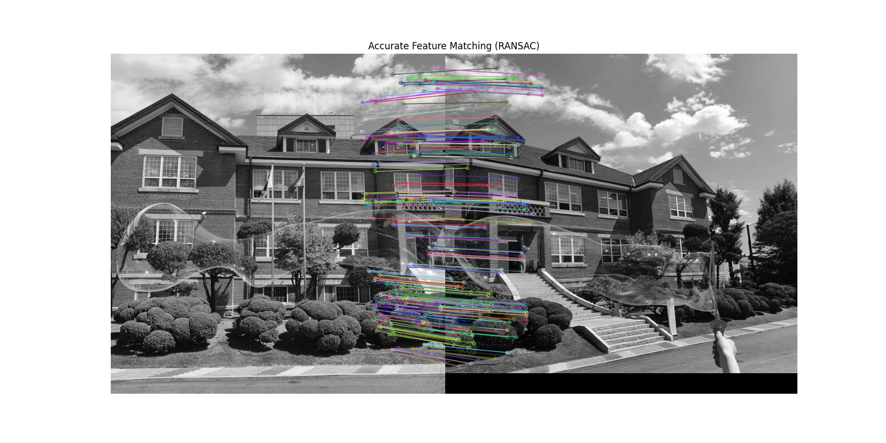
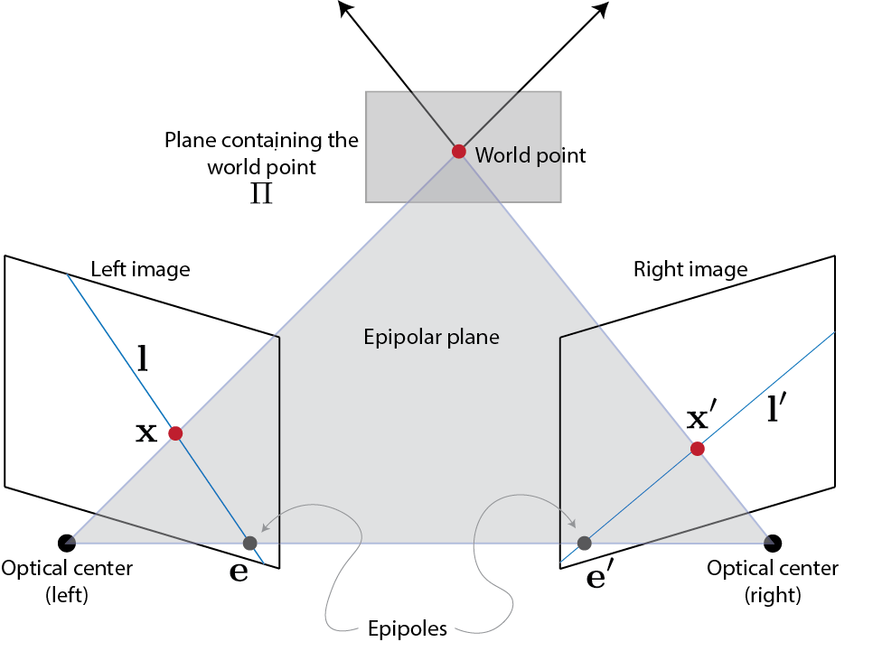

SfM(Structure-from-Motion)은 여러 장의 이미지로부터 카메라 위치와 3D 구조를 동시에 복원하는 문제이다.

## Pipeline

### Feature extraction

각 이미지 $I_i$ 에서 지역 특징점들을 뽑는다. 이미지마다 $F_i={(x_j, f_j)}$ 형태의 특징 집합을 만든다. 여기서 $x_j$ 는 이미지 좌표이고, $f_j$ 는 그 점의 descriptor다. 목적은 다른 시점, 조명 변화, 약간의 스케일 변화가 있어도 "이 점이 저 이미지의 저 점과 같은 물체 표면이다"라고 비교할 수 있게 만드는 것이다.

여러 알고리즘이 있지만 논문에서 설명하고 있는 SIFT를 기준으로 정리했다.

SIFT 기반 특징 추출은 다음 4단계로 구성된다.

1.   scale-space 생성

     

     같은 물체라도 이미지마다 크기가 다르다. 어떤 이미지에서는 작은 코너, 어떤 이미지에서는 큰 코너로 보인다.그래서 단일 해상도에서 특징을 뽑으면 대응이 안 된다. 이를 해결하기 위해 이미지를 여러 스케일로 만든다.

     $$L(x,y\sigma)=G(x,y,\sigma)*I(x,y)$$

     $G$: Gaussian blur ${1\over2\pi\sigma^2}\exp(-{x^2+y^2\over2\sigma^2})$

     $\sigma$: scale

     $L$: scale-space image

     blur를 점점 강하게 적용하면 작은 것부터 순서대로 구조가 사라진다. 각 구조마다 적절한 $\sigma$ 가 존재한다. 

     

2.   Difference of Gaussian(DoG)로 keypoint 후보 탐색

     

     

     왜 DoG로 scale을 찾을 수 있는가

     이미지를 Gaussian blur로 점점 흐리게 만든다는 것은, 단순히 이미지를 흐리게 하는 것이 아니라 이미지를 서로 다른 “크기(scale)”에서 관찰하는 것과 같다. blur가 약할 때는 작은 구조까지 보이지만, blur가 강해질수록 작은 구조는 사라지고 큰 구조만 남는다.

     이때 중요한 점은, 각 구조마다 “가장 잘 보이는 blur 정도(= scale)”가 존재한다는 것이다. 예를 들어 작은 blob은 blur가 조금만 커져도 쉽게 퍼져서 사라지지만, 큰 blob은 더 강한 blur에서도 형태를 유지한다. 즉, 구조의 크기에 따라 그 구조가 가장 뚜렷하게 드러나는 $\sigma$ 값이 다르다.

     

     하지만 단순히 blur된 이미지 $L(x,y,\sigma)$만 가지고는 “언제가 가장 잘 보이는 순간인지”를 직접 판단하기 어렵다. 그래서 SIFT에서는 두 scale 사이의 차이를 이용한다. 이것이 Difference of Gaussian(DoG)이다.

     

     $$D(x,y,\sigma) = L(x,y,k\sigma) - L(x,y,\sigma)$$

     

     이 연산은 “$\sigma$에서 $k\sigma$로 scale이 변할 때, 해당 위치의 값이 얼마나 변하는가”를 의미한다. 즉, DoG는 scale이 바뀔 때의 변화량을 측정하는 역할을 한다.

     

     이제 한 구조를 생각해보면 다음과 같은 일이 일어난다.

     1.   $\sigma$가 너무 작을 때는 blur가 거의 없기 때문에 구조가 아직 충분히 퍼지지 않아 변화가 크지 않다.

     2.   $\sigma$가 적절한 값에 도달하면, 그 구조가 blur에 의해 가장 크게 영향을 받으면서 값의 변화가 커진다.

     3.   $\sigma$가 너무 커지면 구조가 이미 충분히 퍼져서 더 이상 크게 변하지 않는다.

     

     

     결과적으로, DoG 값은 $\sigma$ 에 대해 증가했다가 다시 감소하는 형태를 가지게 되고, 특정 $\sigma$에서 최대값(또는 최소값)을 갖는다. 이 지점이 바로 해당 구조가 가장 강하게 반응하는 scale이다.

     

     SIFT에서는 이 값을 단순히 $(x, y)$ 평면에서만 보는 것이 아니라, $(x, y, \sigma)$의 3차원 공간에서 본다. 그리고 주변 scale과 공간 이웃들과 비교하여 극값(local extrema)을 찾는다. 이 극값이 바로 “이 위치에서, 이 scale에서 가장 특징적인 지점”을 의미한다.

     

     따라서 DoG는 단순히 특징점을 찾는 것이 아니라, 각 특징점이 어떤 크기의 구조인지까지 함께 결정해주는 역할을 한다. 이것이 SIFT가 scale 변화에 강건한 이유이다.

     앞에서 설명한 것처럼 DoG를 이용하면 특정 위치에서 구조가 가장 잘 드러나는 scale을 찾을 수 있다. 그런데 실제 이미지에는 매우 작은 구조부터 매우 큰 구조까지 다양한 크기의 패턴이 존재한다. 단순히 하나의 해상도에서 σ만 증가시키는 방식으로는 이러한 넓은 범위를 효율적으로 다루기 어렵다.

     

     $\sigma$를 계속 크게 만들수록 Gaussian kernel의 크기도 함께 커지기 때문에 연산 비용이 증가하고, 수치적으로도 비효율적이다. 또한 blur만으로 큰 구조를 표현하려고 하면 작은 구조와의 구분이 점점 어려워진다.

     

     이를 해결하기 위해 SIFT에서는 octave라는 개념을 도입한다.

     

     하나의 octave는 같은 해상도에서 여러 $\sigma$ 값을 가지는 Gaussian 이미지들의 묶음이다. 즉, 하나의 octave 안에서는 이미지 크기는 고정되어 있고, blur 정도만 달라진다.

     

     한 octave에서 충분히 blur를 적용하면, 작은 구조들은 대부분 사라지고 비교적 큰 구조만 남게 된다. 이 상태에서 이미지를 절반 크기로 downsampling하면, 이전보다 더 큰 구조를 효율적으로 관찰할 수 있는 새로운 해상도의 이미지가 된다. 이 과정을 반복하여 다음 octave를 구성한다.

     

     예를 들어, 첫 번째 octave에서는 원본 이미지에서 $\sigma, k\sigma, k^2\sigma, \dots$ 와 같이 여러 scale의 Gaussian 이미지를 만든다. 이후 일정 수준 이상의 blur가 적용된 이미지를 기준으로 해상도를 절반으로 줄여 다음 octave를 생성하고, 다시 같은 방식으로 scale-space를 구성한다.

     

     이렇게 하면 octave 내부에서는 blur를 통해 세밀한 scale 변화를 관찰하고, octave 간에서는 이미지 해상도를 줄이면서 더 큰 구조를 효율적으로 탐색할 수 있다

     

     결과적으로 SIFT는 blur만 사용하는 것이 아니라, blur($\sigma$)와 해상도(octave)를 함께 사용하여 매우 넓은 scale 범위를 안정적으로 커버한다.

     

     DoG는 각 octave 내부에서 scale에 따른 변화량을 측정하고, 그 중에서 극값을 찾음으로써 해당 구조에 적절한 scale을 결정한다. 그리고 octave를 따라가면서 서로 다른 크기의 구조들까지 모두 탐지할 수 있게 된다.

3.   Keypoint refinement

     

     DoG를 통해 scale-space에서의 극값을 찾으면, 각 위치와 scale에서 강하게 반응하는 지점들을 얻을 수 있다. 그러나 이 단계에서 얻은 점들은 아직 최종적인 특징점이 아니라, 단순한 후보들에 불과하다. 실제로는 노이즈나 불안정한 구조에서도 극값이 발생할 수 있기 때문에, 신뢰할 수 있는 특징점만 남기기 위한 정제 과정이 필요하다.

     

     먼저, low contrast 제거를 수행한다. DoG 값이 매우 작은 경우는 scale이 변해도 값의 변화가 거의 없는 영역으로, 구조적으로 의미 있는 특징이라기보다 노이즈일 가능성이 크다. 이러한 점들은 다른 이미지에서 다시 검출되기 어렵기 때문에 일정 threshold 이하의 DoG 값을 가지는 후보들은 제거한다. 이 과정을 통해 반응이 충분히 강한 특징점만 남기게 된다. $\Vert D(x,y,\sigma)\Vert<\epsilon$ 인 DoG 값을 제거한다.

     다음으로, edge response 제거를 수행한다. DoG는 blob뿐만 아니라 edge에서도 큰 값을 만들 수 있다. 하지만 edge 위의 점은 특징점으로 사용하기에 적합하지 않다. edge는 한 방향으로만 변화가 크고, 그와 수직인 방향으로는 변화가 거의 없기 때문에 위치가 불안정하다. 즉, 동일한 edge 위에서는 약간의 위치 변화만으로도 유사한 패턴이 계속 나타나기 때문에 정확한 대응점을 찾기 어렵다.

     

     이를 구분하기 위해 SIFT에서는 Hessian matrix를 사용하여 해당 점 주변의 curvature를 분석한다. 두 방향 모두에서 변화가 큰 경우는 blob이나 코너와 같은 안정적인 구조로 판단하고 유지하지만, 한 방향으로만 변화가 큰 경우는 edge로 간주하여 제거한다. 이러한 기준을 통해 위치적으로 안정적인 특징점만 선택된다.

     $$H = \begin{bmatrix} D_{xx} & D_{xy} \\ D_{xy} & D_{yy} \end{bmatrix}$$

     $D_{xx}$: $x$ 방향으로 얼마나 휘는가, $D_{yy}$: $y$ 방향으로 얼마나 휘는가, $D_{xy}$: 두 방향이 같이 섞인 변화를 나타낸다. 이 Hessian의 eigenvalue를 $\lambda_1,\lambda_2$라고 하자. 이 둘은 각 방향에서의 curvate 크기라고 생각하면 된다. 이제 경우를 나눠보자. $\lambda_1,\lambda_2$ 가 둘 다 크면, 두 방향 모두에서 변화가 크다는 뜻이다. 반대로 한쪽만 크고 다른 쪽은 매우 작으면, 한 방향으로만 변화가 크다는 뜻이다. SIFT는 eigenvalue를 직접 계산하지 않고, trace와 determinant를 이용해서 같은 조건을 더 효율적으로 검사한다.

     $$\frac{(\mathrm{Tr}(H))^2}{\det(H)} < \frac{(r+1)^2}{r},\quad\mathrm{Tr}(H)=D_{xx}+D_{yy},\det(H)=D_{xx}D_{yy}-D_{xy}^2$$

     위 식에서 왼쪽 값이 크다는 것은 두 eigenvalue의 차이가 크다는 뜻이고, 즉 한 방향만 강하다. 그래서 edge로 보고 제거한다.

     

     이 과정을 거치면 최종적으로 남는 점들은 단순히 변화가 큰 지점이 아니라, 서로 다른 이미지에서도 반복적으로 검출될 수 있는 안정적인 특징점이 된다.

     

     

4.   Orientation assignment

     

       

       

     

     Keypoint refinement까지 완료되면 각 특징점은 위치와 scale이 안정적으로 결정된 상태가 된다. 그러나 이 상태만으로는 아직 회전에 대해 불변하지 않다. 이미지가 회전하면 특징점 주변의 gradient 방향 또한 함께 회전하기 때문에, 동일한 물체의 같은 위치라 하더라도 서로 다른 방향 정보를 가지게 된다. 이를 해결하기 위해 SIFT에서는 각 keypoint에 대표 방향을 할당하는 orientation assignment 단계를 수행한다.

     

     이 과정은 특징점 주변에서 나타나는 gradient의 분포를 기반으로 이루어진다. 먼저, keypoint가 검출된 scale에 해당하는 Gaussian 이미지 $L(x,y,\sigma)$를 사용한다. 이후 keypoint를 중심으로 일정 반경(보통 $3\sigma$)의 주변 영역을 선택하고, 해당 영역 내의 모든 픽셀에 대해 gradient를 계산한다. gradient는 $x, y$ 방향의 밝기 변화로부터 구해지며, 각 픽셀마다 변화의 크기와 방향을 동시에 얻을 수 있다. 이때 gradient의 크기는 해당 방향이 얼마나 강하게 나타나는지를 의미하고, 방향은 밝기 변화가 일어나는 방향을 의미한다.

     

     이렇게 계산된 gradient들은 그대로 사용되지 않고, keypoint 중심에 가까운 정보에 더 큰 중요도를 부여하기 위해 Gaussian weighting이 적용된다. 즉, 중심에서 멀어질수록 가중치는 감소하고, 중심에 가까운 픽셀일수록 더 큰 영향을 미치게 된다. 이후 각 픽셀의 gradient 방향을 일정한 간격으로 나눈 histogram에 누적한다. 일반적으로 360도를 36개의 bin으로 나누며, 각 픽셀은 자신의 방향에 해당하는 bin에 gradient 크기와 가중치를 곱한 값을 더한다.

     

     이 과정을 통해 “주변에서 어떤 방향의 변화가 얼마나 많이 존재하는지”를 나타내는 방향 분포가 만들어진다. 이 histogram에서 가장 큰 값을 가지는 방향이 바로 해당 keypoint의 dominant orientation이 된다. 이는 해당 특징점 주변에서 가장 강하게 나타나는 구조의 방향을 의미한다. 경우에 따라 두 번째로 큰 값이 충분히 크다면, 추가적인 orientation을 부여하여 하나의 keypoint에서 여러 개의 특징을 생성하기도 한다.

     

     결과적으로, 각 keypoint는 위치와 scale뿐만 아니라 하나의 기준 방향을 가지게 된다. 이후 descriptor를 생성할 때 이 방향을 기준으로 주변 영역을 회전 정렬함으로써, 이미지가 회전되더라도 동일한 구조는 동일한 기준에서 표현될 수 있게 된다. 이로 인해 SIFT는 회전에 대해 안정적인 특징 표현을 얻을 수 있다.

     

5.   Descriptor 생성

     앞 단계까지 수행하면 각 특징점은 위치 $(x, y)$, scale $\sigma$, 그리고 orientation $\theta$를 가지게 된다. 이제 이 특징점을 다른 이미지의 특징점과 비교하기 위해, 해당 점 주변의 구조를 하나의 벡터로 표현하는 descriptor를 생성한다.

     

     먼저, 각 keypoint를 중심으로 주변의 일정 영역을 선택한다. 이 영역은 특징점 주변의 국소적인 구조를 담고 있으며, 일반적으로 keypoint의 scale에 비례하는 크기로 설정된다. 이는 작은 특징점과 큰 특징점이 각각 적절한 범위의 정보를 반영하도록 하기 위함이다.

     

     이때 선택된 영역은 그대로 사용되지 않고, keypoint에서 계산된 orientation $\theta$를 기준으로 회전 정렬된다. 즉, 패치 내의 모든 gradient 방향은 $\theta$를 기준으로 재정의된다. 이를 통해 이미지가 회전하더라도 동일한 특징점은 동일한 기준 좌표계에서 표현될 수 있으며, 결과적으로 회전에 대해 안정적인 descriptor를 얻을 수 있다.

     

     이제 정렬된 패치 내의 각 픽셀에서 gradient를 계산한다. 픽셀이 아닌 gradient를 사용하는 이유는 밝기 자체가 아니라 변화를 봐야하기 때문이다. 장면이 달라지더라도 밝기는 변하더라도 변화는 유지되기 때문이다. 비교적 안정적이다. 구체적으로, $x$방향과 $y$방향의 미분을 이용하여 다음과 같이 gradient를 구한다.

     

     $$g_x = I(x+1,y) - I(x-1,y), \quad g_y = I(x,y+1) - I(x,y-1)$$

     

     이미지는 픽셀이기 때문에, 연속이 아니라 이산 데이터다. 그래서 미분 대신 앞뒤 픽셀을 비교한 차이로 근사한다. 이로부터 gradient의 크기와 방향은 다음과 같이 계산된다. $\text{arctan2}$는 $(g_x, g_y)$ 벡터의 실제 방향을 정확하게 구하기 위한 함수다

     

     $$|\nabla I| = \sqrt{g_x^2 + g_y^2}, \quad \phi = \arctan2(g_y, g_x)$$

     

     이때 gradient 방향 $\phi$는 keypoint의 orientation $\theta$를 기준으로 보정되어 $\phi - \theta$ 형태로 사용된다.

     

     이제 이 gradient 정보를 공간적으로 나누어 요약한다. 전체 패치는 보통 $4 \times 4$ grid로 나뉘며, 각 cell은 작은 영역을 의미한다. 각 cell 내에서 모든 픽셀을 다 계산하는 것은 비효율적이기에 gradient 방향을 여러 개의 방향 bin(보통 8개)으로 나누어 histogram을 구성한다. 이때 각 픽셀의 gradient 크기는 해당 방향 bin에 누적되며, 중심에 가까운 픽셀일수록 더 큰 가중치를 주기 위해 Gaussian weighting이 적용된다.

     

     즉, 각 cell에서는 다음과 같은 형태의 값이 계산된다.

     

     $$h_k = \sum_{(x,y) \in \text{cell}} w(x,y)\, |\nabla I(x,y)| \cdot \mathbf{1}(\phi(x,y) \in \text{bin}_k)$$

     

     여기서 $w(x,y)$는 Gaussian weight이며, $\mathbf{1}(\cdot)$는 해당 방향 bin에 속하는지를 나타내는 indicator 함수이다.

     

     이 과정을 통해 하나의 cell은 “각 방향으로 얼마나 강한 gradient가 존재하는지”를 나타내는 8차원 벡터로 표현된다. 전체 패치에 대해 $4 \times 4 = 16$개의 cell이 존재하므로, 이들을 순서대로 이어 붙이면 총 128차원의 벡터가 생성된다.

     

     마지막으로 이 벡터는 크기에 대한 영향을 줄이기 위해 정규화(normalization)를 수행한다. 일반적으로 L2 normalization을 적용하여 전체 벡터의 크기를 1로 맞추며, 이를 통해 조명 변화나 대비 변화에 대한 영향을 줄인다.

### Feature matching

Descriptor 생성까지 완료되면, 각 이미지는 특징점과 그에 대응하는 descriptor 집합을 가지게 된다. 이제 남은 단계는 서로 다른 이미지 간에서 동일한 물체의 같은 지점을 찾아내는 것이다. 이를 feature matching 단계라고 한다. 이 과정의 기본 아이디어는 각 특징점을 벡터로 표현한 뒤, 두 이미지 간의 벡터들을 서로 비교하는 것이다. 구체적으로, 한 이미지의 특정 특징점에 대해 다른 이미지에 존재하는 모든 특징점의 descriptor와의 거리를 계산한다. 이때 두 descriptor 간의 유사도는 보통 유클리드 거리(L2 distance)로 측정되며, 거리가 작을수록 두 특징점이 유사하다고 판단한다. 각 특징점에 대해 가장 가까운 descriptor를 가지는 점을 우선적으로 매칭 후보로 선택할 수 있지만, 이 방식만으로는 신뢰도가 충분하지 않다. 실제 이미지에서는 반복되는 패턴이나 유사한 구조가 많이 존재하기 때문에, 단순히 가장 가까운 점을 선택하면 잘못된 대응이 포함될 가능성이 높다. 이를 해결하기 위해 SIFT에서는 ratio test를 사용한다. 하나의 특징점에 대해 가장 가까운 거리 $d_1$과 두 번째로 가까운 거리 $d_2$를 비교하여, 두 값의 비율$ \frac{d_1}{d_2}$이 일정 threshold보다 작은 경우에만 해당 매칭을 유지한다. 이 조건은 가장 가까운 후보가 다른 후보들에 비해 충분히 더 유사한 경우만 선택하도록 하여, 모호한 매칭을 효과적으로 제거한다. 추가적으로, 매칭의 신뢰도를 높이기 위해 양방향 일치 검사를 수행하기도 한다. 즉, 이미지 A에서 이미지 B로의 매칭뿐만 아니라, 이미지 B에서 이미지 A로의 매칭 결과가 서로 일치하는 경우에만 최종 대응점으로 선택한다. 이를 통해 비대칭적인 잘못된 매칭을 줄일 수 있다. 이 과정을 통해 얻어진 대응점들은 두 이미지 간의 동일한 물체 위치를 나타내는 후보들이며, 이후 단계에서는 이러한 대응점들 중에서 기하적으로 일관된 것들만을 남기기 위해 추가적인 검증(RANSAC 등)이 수행된다.

### Geometric Verification

Feature matching 단계까지 수행하면, 두 이미지 사이에서 descriptor가 유사한 특징점 쌍들을 얻을 수 있다. 그러나 이 단계에서 얻어진 대응점들은 아직 “유사해 보이는 후보”일 뿐이며, 실제로 동일한 3D 점에서 온 대응점이라고 보장할 수는 없다. 특히 반복적인 패턴, 유사한 모서리 구조, 노이즈 등으로 인해 잘못된 매칭이 상당수 포함될 수 있다. 따라서 다음 단계에서는 이러한 대응점들 중에서 기하적으로 일관된 점들만 남기는 과정이 필요하며, 이를 geometric verification이라고 한다.

이 단계의 핵심 아이디어는 다음과 같다. 두 이미지가 동일한 장면을 서로 다른 시점에서 촬영한 것이라면, 같은 3D 점에서 투영된 두 이미지상의 점은 임의의 위치 관계를 가지는 것이 아니라, 반드시 두 카메라의 기하학적 관계를 만족해야 한다. 즉, 올바른 대응점들은 단순히 descriptor가 비슷한 것만으로 결정되는 것이 아니라, 두 카메라 사이의 상대적인 위치와 방향에 의해 정의되는 제약을 만족해야 한다.

두 일반적인 이미지 사이에서 이 관계는 fundamental matrix $F$로 표현된다. 이미지 1의 점 $x$와 이미지 2의 대응점 $x'$가 같은 3D 점에서 온 것이라면, 이들은 다음의 epipolar constraint를 만족해야 한다.

$$x'^T F x = 0$$

이 식은 두 이미지의 대응점이 반드시 epipolar geometry를 따라야 함을 의미한다. 구체적으로 말하면, 이미지 1의 한 점 $x$가 주어졌을 때 그 점에 대응하는 이미지 2의 점 $x'$는 이미지 전체 어디에나 존재할 수 있는 것이 아니라, fundamental matrix $F$에 의해 정의되는 특정 직선, 즉 epipolar line 위에 있어야 한다. 따라서 잘못된 대응점은 일반적으로 이 조건을 만족하지 못하게 된다.

문제는 실제 상황에서 fundamental matrix $F$를 미리 알 수 없고, feature matching 단계에서 얻어진 대응점들 중 무엇이 맞고 무엇이 틀린지도 알 수 없다는 점이다. 이 두 문제를 동시에 해결하기 위해 geometric verification에서는 일반적으로 RANSAC(Random Sample Consensus) 알고리즘을 사용한다.

RANSAC의 기본적인 절차는 다음과 같다. 먼저, 전체 매칭 집합에서 fundamental matrix를 계산하는 데 필요한 최소 개수의 대응점들을 무작위로 선택한다. 일반적으로 fundamental matrix는 최소 8개의 대응점으로 추정할 수 있으므로, 이 8개를 이용해 하나의 후보 $F$를 계산한다. 그런 다음, 이렇게 추정한 $F$가 전체 매칭들 중 얼마나 많은 점들과 일관되는지를 검사한다.

각 매칭 쌍 $(x, x')$에 대해, epipolar constraint를 얼마나 잘 만족하는지를 평가한다. 이 값이 충분히 작으면 해당 점은 현재의 기하 모델과 일치한다고 보고 inlier로 분류하고, 그렇지 않으면 outlier로 간주한다. 즉, geometric verification에서는 descriptor 유사성만으로 얻어진 대응점들을 다시 한 번 “이 점들이 실제로 하나의 카메라 기하로 설명될 수 있는가?”라는 기준으로 평가하는 것이다.

이 과정을 무작위 샘플에 대해 여러 번 반복하면, 서로 다른 후보 $F$들이 생성된다. 그중에서 가장 많은 inlier를 만들어 내는 fundamental matrix가 가장 신뢰할 수 있는 기하 모델로 선택된다. 이후 이 모델에 일치하는 대응점들만 남기고, 나머지 outlier들은 제거한다. 결과적으로 feature matching 단계에서 남아 있던 많은 잘못된 매칭들이 이 단계에서 정제된다.

이 과정을 거치고 나면, 최종적으로 남는 대응점들은 단순히 descriptor가 유사한 점들이 아니라, descriptor 유사성과 카메라 기하를 동시에 만족하는 점들이 된다. 이러한 inlier 집합은 이후 camera pose estimation, triangulation, 그리고 bundle adjustment와 같은 SfM의 핵심 단계들에 사용된다. 만약 geometric verification 없이 바로 다음 단계로 넘어간다면, 잘못된 대응점들 때문에 카메라 pose 추정이 크게 틀어지거나 3D 점들이 엉뚱한 위치에 복원될 수 있으므로, 이 단계는 전체 SfM 파이프라인에서 매우 중요한 정제 과정이라고 할 수 있다.

두 장의 이미지가 동일한 장면을 서로 다른 시점에서 촬영한 경우, 하나의 3D 점은 각 이미지에서 서로 다른 위치로 투영된다. 이미지 1에서의 점을 $x$, 이미지 2에서의 대응점을 $x'$라고 하자. 이 두 점은 단순히 “비슷해 보이는 점”이 아니라, 반드시 두 카메라의 기하학적 관계를 만족해야 한다. 이러한 관계를 수식으로 표현한 것이 epipolar constraint이며, 그 핵심이 되는 것이 fundamental matrix이다.

먼저, 두 카메라 중심을 각각 $C$, $C'$, 그리고 하나의 3D 점을 $X$라고 하자. 이 세 점은 항상 하나의 평면 위에 존재하게 되는데, 이를 epipolar plane이라고 한다. 이 평면은 각 이미지 평면과 교차하면서 직선을 만들고, 이 직선이 바로 epipolar line이다. 따라서 이미지 1의 점 $x$가 주어지면, 그에 대응하는 이미지 2의 점 $x'$는 이미지 전체 어디에나 존재할 수 있는 것이 아니라, 반드시 특정 epipolar line 위에 존재해야 한다.

이제 homogeneous coordinate에서 직선 위에 점이 존재한다는 조건은 내적을 이용해 표현할 수 있다. 즉, 이미지 2에서 epipolar line을 $l'$라고 하면, 대응점 $x'$는 다음을 만족해야 한다.

$$x'^T l' = 0$$

따라서 문제는 “이미지 1의 점 $x$로부터 이미지 2의 epipolar line $l'$를 어떻게 구할 수 있는가”로 바뀐다. 중요한 사실은, 이 epipolar line이 점 $x$에 대해 선형적으로 표현될 수 있다는 점이다. 즉, 어떤 $3 \times 3 $행렬 F가 존재하여

$$l' = F x$$

로 나타낼 수 있다. 이를 앞의 식에 대입하면

$$x'^T F x = 0$$

이 된다. 이것이 바로 fundamental matrix를 이용한 epipolar constraint이다. 이 식은 두 점 $x$와 $x'$가 동일한 3D 점에서 투영된 경우 반드시 만족해야 하는 조건이다.

이제 이 식이 왜 성립하는지를 조금 더 구체적으로 보기 위해, 카메라의 기하학적 관계를 고려한다. 내부 파라미터를 제거한 정규화 좌표계에서 생각하면, 두 카메라 사이의 관계는 회전 $R$과 이동 $t$로 표현할 수 있다. 이때 첫 번째 카메라에서 본 정규화 좌표를 $\tilde{x}$, 두 번째 카메라에서 본 정규화 좌표를 $\tilde{x}$'라고 하면, 두 좌표는 다음 관계를 가진다.

$$\lambda' \tilde{x}' = R(\lambda \tilde{x}) + t$$

여기서$ \lambda, \lambda'$는 깊이에 해당하는 스칼라 값이다. 이 식은 동일한 3D 점이 두 카메라에서 어떻게 표현되는지를 나타낸다.

이제 epipolar plane의 조건을 적용하면, 벡터 $t$, $R\tilde{x}$, $\tilde{x}'$는 모두 같은 평면 위에 존재해야 한다. 따라서 이 세 벡터의 scalar triple product는 0이 된다.

$$\tilde{x}'^{\,T} \bigl(t \times (R\tilde{x})\bigr) = 0$$

여기서 cross product는 skew-symmetric matrix $[t]_\times$를 이용하여

$$t \times v = [t]_\times v$$

로 표현할 수 있으므로, 식은 다음과 같이 바뀐다.

$$\tilde{x}'^{\,T} [t]_\times R \tilde{x} = 0$$

이때

$$E = [t]_\times R$$

로 두면

$$\tilde{x}'^{\,T} E \tilde{x} = 0$$

이 되며, 이것이 essential matrix에 의한 epipolar constraint이다.

실제 이미지에서는 정규화 좌표가 아니라 픽셀 좌표를 사용하므로, 카메라 내부 파라미터 $K, K'$를 다시 고려해야 한다. 정규화 좌표와 픽셀 좌표의 관계는

$$\tilde{x} = K^{-1} x,\quad \tilde{x}' = K'^{-1} x'$$

이므로, 이를 위 식에 대입하면

$$(K'^{-1}x')^T E (K^{-1}x) = 0$$

이 된다. 이를 정리하면

$$x'^T K'^{-T} E K^{-1} x = 0$$

이고, 여기서

$$F = K'^{-T} E K^{-1}$$

로 정의하면 최종적으로

$$x'^T F x = 0$$

를 얻는다.

### Initialization

초기 상태에서는 카메라의 위치와 방향, 그리고 장면의 3차원 구조에 대한 정보가 전혀 주어지지 않기 때문에, 이를 추정하기 위한 최소한의 기반을 먼저 구축해야 한다. 이 역할을 하는 것이 initialization이다.

이 단계에서는 먼저 여러 이미지 중에서 충분히 많은 특징점 대응이 존재하는 두 장의 이미지를 선택한다. 이 두 이미지는 동일한 장면을 서로 다른 시점에서 촬영한 것이며, 이후 모든 재구성 과정의 기준이 된다.

선택된 두 이미지로부터, 대응되는 특징점 쌍을 이용하여 두 카메라 사이의 기하 관계를 추정한다. 구체적으로는 Essential matrix를 계산하고, 이를 분해하여 카메라 간의 회전과 이동을 얻는다. 이 과정은 “두 카메라가 서로 어떤 위치 관계에 있는지”를 결정하는 단계라고 볼 수 있다.

다음으로, 이렇게 얻어진 카메라 관계를 바탕으로 대응점들을 3차원 공간으로 복원한다. 각 특징점은 두 이미지에서 각각 하나의 광선으로 해석되며, 이 두 광선이 만나는 지점을 계산함으로써 해당 점의 3D 위치를 추정할 수 있다. 이 과정을 triangulation이라고 한다.

이 과정을 통해 초기 단계에서 두 개의 카메라 pose와 일부 3D 점들이 생성되며, 이는 이후 재구성의 기반이 되는 초기 구조를 형성한다. 이후 단계에서는 새로운 이미지를 하나씩 추가하면서, 기존 구조에 맞춰 카메라 위치를 추정하고 추가적인 3D 점을 생성해 나간다.

### Image Registration

초기화 단계에서 두 카메라와 일부 3D 구조가 생성되면, 다음 단계에서는 아직 등록되지 않은 새로운 이미지들을 기존 3D 모델에 순차적으로 추가한다. 이 과정이 image registration이다.

이 단계의 핵심 문제는 PnP(Perspective-n-Point)이다. 기존에 복원된 3D 점들과, 새 이미지에서 관측된 2D feature 사이의 대응을 이용하여, 해당 이미지의 카메라 위치와 방향을 추정한다. 즉, 이미 알고 있는 3D 구조를 기준으로 “이 이미지는 어디에서 찍혔는가”를 역으로 계산하는 과정이다.

실제 구현에서는 잘못된 대응을 제거하기 위해 RANSAC과 minimal solver를 함께 사용한다. 이 과정을 통해 얻는 결과는 새 이미지의 카메라 pose이며, 이 pose는 이후 모든 단계의 기준이 된다.

중요한 점은 이 단계가 매우 민감하다는 것이다. 2D-3D 대응이 잘못되면 카메라 pose가 틀어지고, 그 결과 이후 triangulation으로 생성되는 3D 점들도 잘못된다. 따라서 registration 단계는 incremental SfM에서 전체 품질을 좌우하는 핵심 단계 중 하나다.

### Triangulation

새로운 이미지의 pose가 추정되면, 해당 이미지를 활용하여 새로운 3D 점들을 생성할 수 있다. 이 과정이 triangulation이다.

기존에 등록된 이미지들과 새 이미지 사이에서 공통으로 관측되는 feature를 찾으면, 동일한 3D 점을 서로 다른 시점에서 본 것이 된다. 이때 각 이미지에서의 관측은 하나의 광선으로 해석되며, 서로 다른 카메라에서 나온 광선들의 교차를 통해 3D 위치를 계산할 수 있다.

이 단계는 단순히 점의 개수를 늘리는 것 이상의 의미를 가진다. 더 많은 3D 점이 생성되면, 이후 새로운 이미지를 등록할 때 사용할 수 있는 2D-3D 대응이 증가하여 pose 추정이 더 안정적으로 이루어진다.

즉, image registration이 “카메라를 맞추는 과정”이라면, triangulation은 “장면 자체를 확장하는 과정”이며, 이 둘은 서로를 보완하며 반복적으로 성능을 향상시킨다.

### Outlier Filtering

incremental SfM에서는 각 단계마다 다양한 형태의 오류가 발생할 수 있다. 잘못된 feature matching, 부정확한 pose 추정, 잘못된 triangulation 등은 모두 reconstruction 품질을 저하시킨다. 이를 방지하기 위해 중간 과정에서 outlier filtering을 수행한다.

이 단계에서는 reprojection error가 큰 관측이나, 기하적으로 일관되지 않은 3D 점, 혹은 잘못 등록된 대응 관계 등을 제거한다. 이러한 이상치를 제거하지 않으면, 이후 bundle adjustment 단계에서 이 오차까지 함께 설명하려고 하면서 전체 모델이 왜곡될 수 있다.

따라서 outlier filtering은 현재 모델을 정리하고 안정성을 유지하는 역할을 한다. 이는 단순한 후처리가 아니라, 전체 SfM 파이프라인의 수렴과 정확도를 유지하기 위한 필수적인 과정이다.

### Bundle Adjustment

Bundle Adjustment는 SfM의 핵심 최적화 단계로, 지금까지 추정된 모든 카메라 파라미터와 3D 점을 동시에 최적화하는 과정이다.

image registration과 triangulation은 각각 국소적인 추정이기 때문에, 단계가 진행될수록 오차가 누적될 수 있다. BA는 이러한 누적 오차를 줄이기 위해 모든 관측을 동시에 고려하여, 각 3D 점이 모든 이미지에서 가능한 한 정확한 위치로 재투영되도록 조정한다.

직관적으로 보면, BA는 “모든 카메라와 모든 3D 점을 동시에 조금씩 움직여서 전체적으로 가장 일관된 구조를 만드는 과정”이다. 이 과정에서는 reprojection error를 최소화하는 것이 목표이며, outlier의 영향을 줄이기 위해 robust loss를 사용하는 경우도 많다.

계산적으로는 매우 큰 비선형 최적화 문제이지만, Levenberg–Marquardt와 Schur complement 같은 기법을 활용하여 효율적으로 해결한다.

### Incremental Loop

Initialization 이후의 SfM은 단일 과정이 아니라 반복적인 구조를 가진다. 일반적인 흐름은 다음과 같다.

1.  다음으로 등록할 이미지를 선택한다
2.  해당 이미지를 기존 3D 모델에 등록한다 (PnP)
3.  새로운 3D 점을 triangulation으로 생성한다
4.  outlier를 제거한다
5.  bundle adjustment로 전체를 재최적화한다

이 과정을 반복하면서 점점 더 많은 이미지가 등록되고, 3D 구조는 점점 더 정밀하고 조밀해진다.

