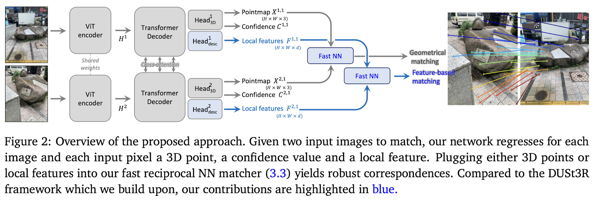
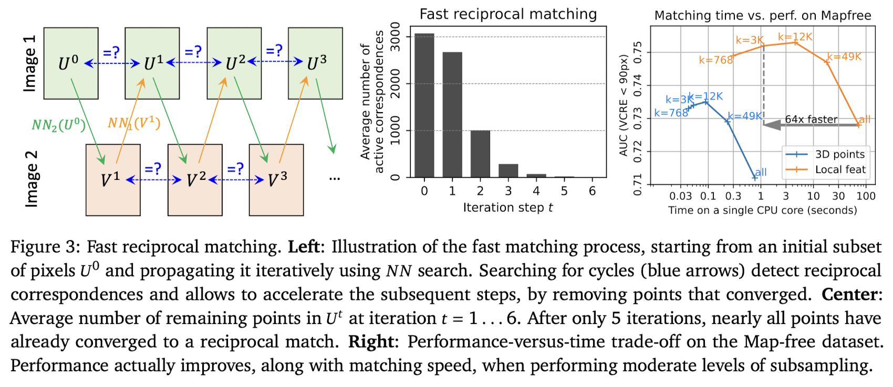

MASt3R는 기존의 2D 이미지 매칭을 3D 문제로 재정의한 DUSt3R의 강건성은 유지하면서, dense feature matching head와 효율적인 reciprocal matching을 추가해 정확도와 계산 효율을 동시에 개선한 방법이다.

## Abstract

이미지 매칭은 서로 다른 두 이미지에서 같은 3D 점이 공간상에 어떻게 투영되었는지를 찾는 문제이다. 카메라의 위치, 회전 깊이, 장면 구조가 전부 관련된다. 실제로 우리가 하는 건 픽셀 매칭이기에 2D 문제로 푸는 것 이해는 되지만, 근본적으로 잘못된 방향일 수도 있다. 저자들은 매칭을 2D 문제가 아니라 3D 문제로 다시 정의하고, 이를 DUSt3R로 해결한다. 하지만 pointmap 회귀에 기반한 DUSt3R은 시점 변화에는 강하지만, 정밀한 정확도는 부족하다. 따라서 논문에서는 **DUSt3R의 robustness는 유지하면서도 매칭 성능을 향상시키는 것을 목표한다.** DUSt3R에 픽셀 단위의 feature 매칭을 위한 헤드를 추가한다. 정확도 향상에는 도움이 되지만, 계산량이 크기에 빠른 reciprocal 매칭 방법을 제안하여 이를 해결한다. 실험 결과, MASt3R라고 이름 붙인 이 방법은 여러 매칭 작업에서 기존 최고 성능을 크게 능가했다. 

## Intro

MASt3R 논문의 출발점은 **image matching**이다. Image matching은 서로 다른 이미지들 사이에서 같은 3D 점을 관측하는 픽셀들을 찾는 문제다. 겉으로 보면 두 이미지의 2D 픽셀 좌표 사이 대응을 찾는 문제처럼 보이지만, 실제로는 카메라의 위치, 회전, 깊이, 장면의 3D 구조가 모두 관련된다. 즉, 저자들의 핵심 주장은 **matching은 본질적으로 2D 문제가 아니라 3D 문제**라는 것이다.

기존의 많은 방법들은 matching을 2D 이미지 공간의 문제로 다뤘다. 예를 들어 SIFT 같은 keypoint 기반 방식은 먼저 이미지에서 sparse하고 반복 검출 가능한 keypoint를 뽑고, 각 keypoint 주변을 descriptor로 표현한 뒤, descriptor space에서 가까운 것끼리 매칭한다. 이 방식은 빠르고, 비슷한 조명이나 시점 조건에서는 매우 정확하다. 그래서 COLMAP 같은 3D reconstruction 파이프라인에서도 오래 사용되었다. 하지만 근본적인 한계가 있다. keypoint 기반 방법은 matching을 개별 keypoint들의 local 문제로 축소하기 때문에, 이미지 전체의 global geometric context를 충분히 고려하지 못한다. 반복 패턴이나 texture가 부족한 영역에서는 local descriptor만으로는 대응을 안정적으로 결정하기 어렵다

이 한계를 보완하기 위해 SuperGlue 같은 방법은 마지막 matching 단계에서 global reasoning을 도입했다. keypoint와 descriptor를 입력받은 뒤, attention이나 learned prior를 사용해 전체 keypoint 집합의 관계를 고려한다. 하지만 이것도 완전한 해결책은 아니다. 왜냐하면 keypoint와 descriptor 자체가 이미 충분한 정보를 담고 있지 않다면, matching 단계에서 global context를 넣는 것은 너무 늦을 수 있기 때문이다. 즉, 입력 representation 자체가 local하고 빈약하면 후처리로 보완하는 데 한계가 있다.

그래서 등장한 다른 방향이 **dense matching**이다. Dense matching은 keypoint 몇 개만 다루는 것이 아니라 이미지 전체 또는 많은 픽셀 위치를 대상으로 가능한 대응 관계를 고려한다. LoFTR 같은 방법은 global attention을 이용해 이미지를 전체적으로 보고 dense correspondence를 만든다. 이 방식은 반복 패턴이나 low-texture 영역에서 keypoint 방식보다 강하고, 어려운 benchmark에서 좋은 성능을 냈다. 하지만 dense matching에도 문제가 있다. 계산량이 크고, 더 중요한 것은 여전히 matching을 **2D 이미지 공간의 문제**로 다룬다는 점이다. 그래서 visual localization이나 camera pose estimation 같은 3D 문제가 강하게 얽힌 task에서는 한계가 남는다.

논문은 이 지점에서 DUSt3R를 중요한 근거로 든다. DUSt3R는 원래 matching 방법이 아니라, 두 이미지로부터 3D reconstruction을 수행하는 모델이다. 즉, pointmap을 예측해서 각 픽셀이 3D 공간에서 어디에 대응되는지를 회귀한다. 그런데 흥미롭게도 DUSt3R의 3D 출력에서 단순히 얻은 correspondence가 기존 keypoint 기반 또는 matching 기반 방법들을 Map-free benchmark에서 능가한다. 저자들은 이것을 “matching은 본질적으로 3D 문제다”라는 주장의 실험적 증거로 사용한다. 다시 말해, matching을 직접 2D에서 잘하려고 하기보다, 3D 구조를 먼저 이해하면 correspondence가 더 잘 나온다는 것이다.

하지만 DUSt3R도 완벽하지 않다. DUSt3R는 시점 변화에는 매우 강건하다. 즉, 극단적인 viewpoint change에서도 어느 정도 대응을 찾을 수 있다. 그러나 pixel-level precision, 즉 정밀한 매칭 정확도는 부족하다. 그래서 MASt3R의 목표는 DUSt3R의 장점인 **robustness**는 유지하면서, matching accuracy를 높이는 것이다.

이를 위해 MASt3R는 DUSt3R 네트워크에 두 번째 head를 추가한다. 이 head는 dense local feature map을 회귀한다. 기존 DUSt3R가 pointmap을 예측해 3D 구조를 얻는 데 초점을 맞췄다면, MASt3R는 거기에 matching에 직접 사용할 수 있는 local feature를 추가로 출력하게 만든다. 그리고 이 feature를 pairwise matching에 적합하도록 InfoNCE loss로 학습한다. 즉, MASt3R는 DUSt3R의 3D-aware representation을 유지하면서, matching을 명시적으로 잘하도록 feature learning을 추가한 구조다.

여기서 중요한 점은 MASt3R가 단순히 “DUSt3R를 여러 이미지에 적용한 것”이 아니라는 점이다. 앞에서 이야기했듯이 DUSt3R와 MASt3R의 차이는 단순히 이미지 개수 차이만이 아니다. DUSt3R는 기본적으로 두 이미지 사이의 3D reconstruction, 즉 pairwise pointmap regression을 수행하는 모델이다. 반면 MASt3R는 DUSt3R 기반의 3D-aware representation에 matching head와 matching loss를 추가하여, image matching 자체를 더 정확하게 수행하도록 만든 방법이다. 특히 논문 초록에서 말하는 MASt3R는 “Matching And Stereo 3D Reconstruction”이라는 이름처럼, 3D reconstruction과 matching을 결합한 구조다.

또 하나의 핵심은 **reciprocal matching**이다. A 이미지의 어떤 위치가 B 이미지의 어떤 위치를 가장 잘 매칭하고, 반대로 B의 그 위치도 A의 원래 위치를 가장 잘 매칭할 때, 그 대응을 reciprocal match로 본다. 이것은 매칭의 신뢰도를 높이는 일반적인 방식이다. MASt3R의 기여는 dense feature map에서 reciprocal matches를 **빠르게 찾는 알고리즘**을 제안했다는 데 있다.

왜 이것이 중요하냐면 dense matching은 가능한 픽셀 쌍을 많이 비교해야 하므로 계산량이 크기 때문이다. 모든 픽셀 간 feature similarity를 비교하면 보통 quadratic complexity, 즉 대략 $O(N²)$ 문제가 생긴다. 논문은 실제로 dense feature map을 계산하는 것보다, 그 feature map에서 reciprocal match를 추출하는 과정이 더 시간이 많이 들 수 있다고 지적한다. 그래서 MASt3R는 coarse-to-fine matching scheme과 빠른 reciprocal matching algorithm을 제안한다. Coarse-to-fine은 먼저 낮은 해상도나 거친 스케일에서 후보를 찾고, 점점 더 정밀한 스케일에서 refinement하는 방식이다. 이를 통해 pixel-accurate matches를 얻으면서도 계산량을 줄인다.

**Camera pose estimation**

여러 pose estimation 기법이 존재하지만 속도, 정확도, robust trade-off를 고려할 때 가장 성공적인 전략들은 여전히 pixel matching에 크게 의존한다고 설명했다. Matching 방법이 발전하면서 Aachen Day-Night, InLoc, CO3D, Map-free 같은 더 어려운 benchmark들이 등장했다. 특히 Map-free는 단 하나의 reference image만 제공되고 map은 제공되지 않으며, viewpoint change가 최대 180도까지 발생하는 매우 어려운 localization benchmark다. 이런 조건에서는 기존 2D-based matching이 명확한 한계를 보이기 때문에, matching을 3D에 기반시키는 것이 필수적이 된다.

또한 3D geometric prior를 활용하려는 기존 연구들도 있었다. 일부 연구는 epipolar constraint를 semi-supervised learning에 사용했고, 어떤 연구는 monocular depth predictor를 이용해 이미지를 rectification하여 keypoint descriptor를 개선했다. 최근에는 pose나 ray를 위한 diffusion 방식도 3D geometric constraint를 pose estimation formulation에 포함하면서 좋은 성능을 보였다. 하지만 MASt3R 논문은 DUSt3R의 방향이 특히 중요하다고 본다. DUSt3R는 보정되지 않은 이미지들로부터 3D reconstruction이라는 더 어려운 문제를 풀고, 그 결과로 correspondence를 회복할 수 있음을 보여주었다. MASt3R는 이 아이디어를 이어받아, local feature를 회귀하고 이를 pairwise matching을 위해 명시적으로 학습한다.

## Method

### DUSt3R

DUSt3R의 핵심은 image matching을 직접 풀지 않고, 각 픽셀을 3D 공간으로 보내서 문제를 재구성하는 것이다. 입력으로 두 이미지 $I^1$, $I^2$가 주어지면, 모델은 각각의 픽셀 $(u,v)$에 대해 3D 좌표를 예측하는 pointmap을 출력한다:

$$X^{1,1}, \; X^{2,1}, \quad X^{a,b} \in \mathbb{R}^{H \times W \times 3}$$

여기서 각 픽셀은 $X^{a,b}(u,v) \in \mathbb{R}^3$ 로 표현되며, 이는 해당 픽셀이 3D 공간에서 어디에 위치하는지를 의미한다. 중요한 점은 두 이미지의 pointmap이 같은 좌표계에서 표현된다는 것이다. 예를 들어 $X^{1,1}$과 $X^{2,1}$은 모두 카메라 $C^1$ 좌표계 기준이다.

이 구조 덕분에 correspondence는 다음과 같이 정의된다:

$$(i, j) \text{ is a match } \Longleftrightarrow X^{1,1}_i \approx X^{2,1}_j$$

즉, 같은 3D 위치를 가지는 픽셀들이 대응된다. 실제 구현에서는 완전히 같지 않기 때문에 reciprocal 조건을 추가한 nearest neighbor 기반으로 찾는다:

$$j = \arg\min_k \|X^{1,1}_i - X^{2,1}_k\|\leftrightarrow i = \arg\min_l \|X^{2,1}_j - X^{1,1}_l\|$$

이 방식은 매우 robustness하다. 시점 변화가 커도 3D 구조만 맞으면 대응이 유지되기 때문이다. 하지만 문제가 있다. pointmap은 회귀로 학습되기 때문에 다음과 같은 형태를 가진다:

$$X_i = \hat{X}_i + \epsilon_i$$

여기서 $\epsilon_i$는 noise다. 이 noise 때문에 3D 좌표가 정확히 맞지 않고, 그 결과 matching에서 오차가 발생한다. 게다가 DUSt3R의 학습 목표는 다음과 같다:

$$\ell_{regr}(v,i) = \left\|\frac{1}{z}X^{v,1}_i - \frac{1}{\hat{z}}\hat{X}^{v,1}_i\right\|,\quad z=\mathrm{norm}(X^1, X^2) = \frac{1}{|D^1| + |D^2|} \sum_{v \in \{1,2\}} \sum_{i \in D^v} \| X_i^v \|$$

$\frac{X}{z} \approx \frac{\hat{X}}{\hat{z}}$ 를 목표로 한다. 이는 어떤 스케일 $s$ 라도 상관없다(Scale ambiguity). 하지만 저자들은 scale invariance가 항상 바람직한 것은 아니라고 지적한다. Map-free visual localization과 같은 일부 응용에서는 절대 스케일 예측이 필요하기 떄문이다. 따라서 gt pointmap이 metric scale을 갖는 경우에는, predicted pointmap에 대해 normalization을 적용하지 않도록 regression loss를 수정한다. $z:=\hat{z}$ 로 두어 $\ell_{regr}(v,i)=\Vert X^{v,1}_i-\hat{X^{v,1}_i}\Vert/\hat{z}$ 가 되도록 한다. DUSt3R과 마찬가지로 최종 loss는 confidence를 고려한 형태로 정의된다.

$$\mathcal{L}_{conf}=\sum_{v\in{1,2}}\sum_{i\in\mathcal{V}^v}C^v_i\ell_{regr}(v,i)-\alpha\log C_i^v$$

### Matching prediction head and loss

DUSt3R의 pointmap 기반 reciprocal matching은 매우 강건하지만, 회귀 노이즈와 matching 학습 부재로 인해 정밀도가 떨어진다. 이러한 이유로 저자들은 두 개의 dense feature map $D^1, D^2 \in \mathbb{R}^{H \times W \times d}$을 출력하는 두 번째 head를 추가할 것을 제안한다.

$$D^1 = \text{Head}^1_{\text{desc}}([H^1, H'^1])$$

$$D^2 = \text{Head}^2_{\text{desc}}([H^2, H'^2])$$

MASt3R는 DUSt3R의 3D 기반 구조 위에 dense feature descriptor를 추가하여, matching을 직접 학습 가능하게 만든다. MASt3R는 InfoNCE 기반의 양방향 classification loss를 사용해 각 픽셀이 정확한 대응 하나만 가지도록 학습하며, 이를 3D 회귀 loss와 결합하여 robustness와 precision을 동시에 달성한다. 이를 위해 동일한 3D 점을 나타내는 gt 대응 집합 $\hat{\mathcal M}$ 위에서 InfoNCE loss를 적용한다.

$$\hat{\mathcal{M}} = \{(i,j) \mid \hat{X}^{1,1}_i = \hat{X}^{2,1}_j\}$$

$$\mathcal{L}_{match}
=
-
\sum_{(i,j)\in \hat{\mathcal{M}}}
\left[
\log
\frac{s_\tau(i,j)}{\sum_{k \in \mathcal{P}^1} s_\tau(k,j)}
+
\log
\frac{s_\tau(i,j)}{\sum_{k \in \mathcal{P}^2} s_\tau(i,k)}
\right]\quad\text{with}\ s_\tau(i,j) = \exp(-\tau D_i^{1\top} D_j^2)$$

$s_\tau(i,j)$는 내적 유사도와 temperature scaling 된 형태이다. $D_i^T$와 $D_j$가 비슷하면 값이  크고, 다르면 작다. 이를 모든 방향에서 계산하는데, $\log \frac{s(i,j)}{\sum_k s(k,j)}$ 는 $i\rightarrow j$ 방향 유사도, $\log \frac{s(i,j)}{\sum_k s(i,k)}$ 는 $j\rightarrow i$ 방향 유사도로 softmx classification을 하는 것과 같다. 최종적으로 $\mathcal L_{total}
=
\mathcal L_{conf}
+
\beta\mathcal L_{match}$ 를 얻는다.

### Fast reciprocal matching

두 feature map $D^1, D^2 \in \mathbb{R}^{H \times W \times d}$ 에서 매칭은 다음처럼 정의된다. 

$$(i,j) \in \mathcal{M}
\iff
j = \mathrm{NN}_2(D_i^1) \;\text{and}\; i = \mathrm{NN}_1(D_j^2)$$

모든 $i$에 대해 $j$를 비교하기에 $O(W^2H^2)$의 시간복잡도를 가진다. 이는 비효율적이므로 전체를 다 보지 말고, 일부 픽셀에서 시작해서 정답으로 수렴하는 것만 찾도록 한다. 이미지 1에서 $k$ 개의 픽셀을 $U^0 = \{U_n^0\}_{n=1}^k$  초기 샘플링을 한다.

$$U^T\mapsto[\text{NN}_2(D_u^1)]_{u\in U^t}\equiv V^T\mapsto[\text{NN}_1(D_v^2)]_{v\in V^t}\equiv U^{t+1}$$

1.   forward mapping

     $V^t = \{\mathrm{NN}_2(D_u^1) \mid u \in U^t\} : I^1\rightarrow I^2$

2.   backward mapping

     $U^{t+1} = \{\mathrm{NN}_1(D_v^2) \mid v \in V^t\} : I^2\rightarrow I^1$

3.   Iteration

     $U^t \rightarrow V^t \rightarrow U^{t+1}$

만약 어떤 픽셀이 $U_n^{t+1} = U_n^t$ 이면, 같은 위치로 돌아온다. 

$$\mathcal{M}_k^t = \{(U_n^t, V_n^t) \mid U_n^t = U_n^{t+1}\}$$

이 과정을 반복하면 잘못된 매칭은 계속 이동하고, 올바른 매칭은 고정된다. 최종 매칭은 $\mathcal{M}_k = \bigcup_t \mathcal{M}_k^t$ 이다. Fast matching의 전체 계산 복잡도는 $O(kWH)$이며, 이는 naive 방식에 비해 $WH/k$ 배 빠르다. Fast matching 알고리즘은 전체 매칭 집합 $\mathcal M$ 의 부분집합만을 추출하며, 그 크기는 $\mathcal \vert M_k\vert\le k$ 로 제한된다.

### Coarse-to-fine matching

입력 이미지 영역($W\times H$)에 대해 attention의 계산 복잡도가 제곱적으로 증가하기 때문에, MASt3R는 가장 긴 변 기준으로 512 픽셀 이하의 이미지만 처리할 수 있다. 더 큰 이미지는 학습에 훨씬 더 많은 계산 자원이 필요하며, ViT는 아직 테스트 시 더 높은 해상도에 잘 일반화되지 않는다. 따라서 고행상도 이미지는 먼저 다운스케일되어 매칭이 수행되고, 이후 결과 대응은 다시 원래 해상도로 업스케일된다. 이 과정은 성능 저하를 유발할 수 있으며, 경우에 따라 localization 정확도나 reconstruction 품질을 크게 떨어뜨릴 수 있다. 이로 인한 성능 저하를 해결하기 위해 coarse-to-fine 전략이 필요하다.

Coarse-to-fine matching은 전체 고해상도 이미지를 한번에 처리하지 않고, 먼저 저해상도에서 대략적인 대응을 찾은 뒤, 그 대응이 있는 고해상도 영역만 잘라서 다시 정밀 매칭하는 방식이다. 먼저 원본 이미지 $I^1$, $I^2$를 다운스케일한다. MASt3R는 긴 변 512 픽셀 정도의 입력만 안정적으로 처리하므로, 고해상도 이미지를 그대로 넣지 않고 작은 버전에서 먼저 매칭한다. 이때 얻는 대응 집합을 논문에서는 $\mathcal{M}_k^0$ 라고 부른다. 여기서 위첨자 0은 “초기 coarse 단계”를 의미하고, 아래첨자 $k$는 fast reciprocal matching에서 $k$개 샘플을 사용했다는 뜻이다.

즉 coarse 단계는 다음과 같다.

$$I^1_{\text{low}}, I^2_{\text{low}}
\rightarrow
\mathcal{M}_k^0$$

이 결과는 픽셀 단위로 아주 정확하지는 않지만, “어느 영역이 어느 영역과 대응되는지”를 알려준다. 그다음 원본 고해상도 이미지에서 window crop들을 만든다.

$$W^1 = \{w_1\}, \quad W^2 = \{w_2\}$$

각 window는 긴 변이 512 픽셀이고, 인접 window끼리는 50% 겹친다. overlap을 주는 이유는 대응점이 crop 경계에 걸려서 잘리는 문제를 줄이기 위해서다.

이제 가능한 모든 window pair를 생각할 수 있다.

$$(w_1, w_2) \in W^1 \times W^2$$

하지만 모든 window pair를 처리하면 다시 계산량이 커진다. 그래서 coarse correspondence $\mathcal{M}_k^0$를 이용한다. 어떤 coarse match $(i,j)$가 있을 때, $i$가 포함된 image 1의 window $w_1, j$가 포함된 image 2의 window $w_2$를 찾는다. 그러면 그 window pair는 중요한 후보가 된다. 논문은 window pair들을 greedy하게 선택해서 coarse correspondence의 90%를 cover할 때까지 추가한다. 즉, 모든 window를 쓰는 것이 아니라, 초기 coarse matching이 “여기 대응이 있을 가능성이 높다”고 알려준 영역만 선택한다. 그다음 선택된 각 window pair에 대해 MASt3R를 다시 실행한다.

$$D^{w_1}, D^{w_2}
=
\text{MASt3R}(I^1_{w_1}, I^2_{w_2})$$

여기서 $I_{w_1}^1$은 image 1에서 window $w_1$로 잘라낸 crop이고, $I^2_{w_2}$는 image 2에서 window $w_2$로 잘라낸 crop이다. 이 crop들은 고해상도 원본에서 잘라왔기 때문에, coarse 단계보다 훨씬 세밀한 정보를 담고 있다.

그 window 안에서 fast reciprocal matching을 수행한다.

$$\mathcal{M}_k^{w_1,w_2}
=
\text{fast reciprocal NN}(D^{w_1},D^{w_2})$$

이렇게 얻은 매칭은 window 내부 좌표 기준이다. 그래서 마지막에는 이를 원본 이미지 좌표계로 다시 변환한다. 예를 들어 window $w_1$의 왼쪽 위 좌표가 $(x_0,y_0)$라면, window 내부 픽셀 $(u,v)$는 원본에서는

$$(u+x_0, v+y_0)$$

가 된다.

최종적으로 모든 window pair에서 얻은 매칭을 합친다.

$$\mathcal{M}_{\text{final}}
=
\bigcup_{(w_1,w_2)}
\mathcal{M}_k^{w_1,w_2}$$

정리하면 전체 과정은 다음이다.

$$\text{high-res images}
\rightarrow
\text{downscale}
\rightarrow
\text{coarse matches } \mathcal{M}_k^0
\rightarrow
\text{select high-res window pairs}
\rightarrow
\text{fine matching per window}
\rightarrow
\text{map back and merge}$$

이 방법의 장점은 분명하다. 전체 고해상도 이미지를 한 번에 MASt3R에 넣지 않아도 된다. 대신 저해상도에서 전체 구조를 파악하고, 고해상도에서는 필요한 영역만 정밀하게 본다. 그래서 계산량은 줄이면서도, 단순 downscale 후 upscale하는 방식보다 더 정확한 full-resolution correspondence를 얻을 수 있다.

## Conclusion

MASt3R을 사용해 이미지 매칭을 3D에 기반하도록 만든 것은, 다양한 공개 벤치마크에서 카메라 포즈 추정과 Localization 작업의 성능 기준을 크게 끌어올렸다. 매칭을 통해 DUSt3R을 개선하여 robustness를 향상시키고, 기존의 픽셀 매칭만으로 가능했던 성능을 뛰어넘었다. 효율적인 처리를 위해 빠른 reciprocal matcher와 coarse-to-fine 접근 방식을 도입하여, 사용자가 정확도와 속도 사이에서 균형을 조절할 수 있도록 했다. MASt3R는 적은 수의 이미지 환경에서도 동작할 수 있으며, 이는 localization의 활용 범위를 크게 확장시킬 것으로 예상한다.

## Appendix

### Homogeneous Coordinate(동차 좌표계)

**동차 좌표계(Homogeneous Coordinates)**는 주로 컴퓨터 비전과 3D 그래픽스에서 3차원 공간을 2차원 이미지로 투영하거나, 다양한 기하학적 변환을 수학적으로 우아하고 효율적으로 처리하기 위해 도입된 개념이다. 간단히 말해, $N$ 차원의 좌표를 $N+1$ 차원으로 확장하여 표현하는 방식이다.

------

#### 1. 동차 좌표계의 기본 원리

일반적인 직교 좌표계(Cartesian Coordinates)에서 2차원 점은 $(x, y)$ 로 표현됩니다. 이를 동차 좌표계로 바꾸려면 끝에 차원 하나를 추가하여 상수 $w$ 를 덧붙인다.

-   2차원 직교 좌표: $(x, y)$
-   2차원 동차 좌표: $(x, y, w)$

동차 좌표계에서 다시 원래의 직교 좌표계로 돌아오려면, 모든 요소를 마지막 차원인 $w$로 나누어줍니다. 즉, 동차 좌표$(x, y, w)$ 는 직교 좌표의 $(x/w, y/w)$ 와 같은 점을 의미한다. 일반적으로 공간 상의 '점(Point)'을 표현할 때는 계산의 편의를 위해 $w = 1$ 을 사용합니다. 따라서 점 $(x, y)$ 는 $(x, y, 1)$ 로 표현된다.

------

#### 2. 3D 컴퓨터 비전에서 동차 좌표계가 필수적인 이유

카메라 기하학이나 3D Scene Reconstruction을 다룰 때 동차 좌표계는 선택이 아닌 필수이다. 그 이유는 크게 세 가지가 있다.

**첫째, 모든 아핀 변환(Affine Transformation)의 단일 행렬 곱셈화**

회전(Rotation)이나 크기 조절(Scale)은 직교 좌표계에서도 선형 변환이므로 행렬 곱셈으로 표현할 수 있다. 하지만 이동(Translation)은 덧셈으로만 표현된다.

-   직교 좌표계에서의 이동: $x' = x + t_x$

이동 연산이 덧셈으로 남게 되면, 카메라의 외부 파라미터(Extrinsics)인 $[R\vert t]$ 와 같은 복합적인 변환을 하나의 연산 파이프라인으로 묶기 어렵다. 동차 좌표계를 사용하면 이동 변환을 아래와 같이 행렬 곱으로 깔끔하게 처리할 수 있다.

$$\begin{bmatrix} x' \\ y' \\ 1 \end{bmatrix} = \begin{bmatrix} 1 & 0 & t_x \\ 0 & 1 & t_y \\ 0 & 0 & 1 \end{bmatrix} \begin{bmatrix} x \\ y \\ 1 \end{bmatrix}$$

이로 인해 회전, 이동, 스케일링 등 모든 변환을 단일 행렬(3D의 경우 $4 \times 4$ 행렬) 곱셈으로 통합하여 모델을 최적화할 수 있게 된다.

**둘째, 원근 투영(Perspective Projection)의 단순화**

3차원 공간의 점 $(X, Y, Z)$ 를 2차원 카메라 이미지 평면으로 투영할 때, 핀홀 카메라 모델에서는 깊이 값인 $Z$로 $X$ 와 $Y$ 를 나누는 과정이 필요하다.

직교 좌표계에서는 이 나눗셈 연산이 비선형적이지만, 동차 좌표계를 사용하면 카메라 내부 파라미터(Intrinsics) 행렬 $K$를 단순히 곱하는 선형 연산으로 바뀐다. 행렬 곱셈 후 결과 벡터의 마지막 차원이 깊이$Z$ 가 되므로, 앞서 언급한 마지막 요소로 나누는 동차 좌표계의 기본 성질을 통해 원근 투영에 필요한 나눗셈이 수식 안에서 자연스럽게 완성된다.

**셋째, 무한원점(Point at Infinity) 및 방향(Direction) 표현**

철길처럼 평행한 두 선은 3차원 현실에서는 절대 만나지 않지만, 2차원 투영 이미지 상에서는 소실점(Vanishing Point)에서 만난다. 동차 좌표계에서는 마지막 차원인 $w = 0$ 인 경우, 즉 $(x, y, 0)$ 의 형태로 무한히 먼 곳에 있는 점(무한원점)을 수학적으로 모순 없이 표현할 수 있다. 공간상에서 이 값은 특정한 '위치'가 아니라 특정 **방향(Direction)** 을 나타내는 벡터로 취급되며, 평행선을 다루거나 광선의 궤적을 계산할 때 매우 유용하게 쓰인다.

결론적으로, 동차 좌표계는 **선형 대수의 이점**을 극대화하여 복잡한 기하학적 연산을 단순한 행렬 곱셈으로 최적화해 주는 컴퓨터 비전의 핵심 수학 도구이다.

### Epipoloar constraint

**Epipolar Constraint** 은 3D 컴퓨터 비전, 특히 스테레오 비전(Stereo Vision)과 다중 시점 기하학(Multiple View Geometry)에서 두 대의 카메라가 동일한 3D 공간을 촬영할 때 발생하는 근본적인 기하학적 규칙이다. 간단히 말해, 한 이미지에서 관측된 점이 다른 이미지에서는 2D 평면 전체가 아닌 특정한 "직선" 위에 반드시 존재해야 한다는 물리적 제약이다.

#### 1. 기하학적 직관: 3가지 핵심 요소

-   **에피폴라 평면(Epipolar Plane):** 3차원 공간의 실제 점 $X$ 와 두 카메라의 렌즈 중심(광학 중심) $O_1$, $O_2$ 를 연결하면 거대한 삼각형 평면이 하나 만들어진다. 이 평면을 **에피폴라 평면** 이라고 부른다.
-   **에피폴(Epipole):** 각 카메라의 광학 중심이 상대방 카메라의 이미지 센서(평면)에 투영된 2D 점이다. 즉, 첫 번째 카메라가 두 번째 카메라의 위치를 바라본 점이다.
-   **에피폴라 선(Epipolar Line):** **에피폴라 평면** 이 각 카메라의 2D 이미지 평면과 교차하면서 만들어지는 직선이다. 이 선은 항상 해당 이미지 평면의 **에피폴** 을 지나간다.

#### 2. 왜 이런 제약이 발생할까?

첫 번째 카메라 이미지에서 어떤 특징점 $x$ 를 하나 찾았다고 가정해 보자. 이 점 $x$ 는 3차원 공간의 점 $X$ 가 투영된 결과이다. 하지만 단일 카메라의 한계로 인해 깊이(Depth) 정보를 잃어버렸기 때문에, 점 $X$가 카메라 중심 $O_1$ 에서 점 $x$ 를 지나는 3차원 공간상의 반직선(Ray) 위의 어디에 있는지 알 수 없다.

하지만 이 반직선을 두 번째 카메라의 시점에서 바라본다면 3차원 공간의 선은 2D 이미지 평면에도 '선'으로 투영된다. 이 선이 바로 두 번째 이미지에서의 **에피폴라 선**이다.

결과적으로, 첫 번째 이미지의 점 $x$ 에 대응하는 두 번째 이미지의 점 $x'$ 는 반드시 이 **에피폴라 선** 위에 존재해야 한다. 공간상의 점이 그 반직선 어딘가에 위치하기 때문이다. 이것이 **에피폴라 제약**이다.

#### 3. 수학적 표현

이러한 기하학적 관계는 행렬과 동차 좌표계를 사용해 단 하나의 방정식으로 수식화된다.

**카메라 내부 파라미터(Intrinsics)를 알 때 (정규화된 좌표계):**

두 카메라 사이의 회전 및 이동 관계를 담고 있는 **에센셜 행렬(Essential Matrix)** 인 $E$ 를 사용하여 다음과 같이 표현된다.

$$x'^T E x = 0$$

(여기서 $x$ 와 $x'$ 는 두 카메라 정규화 평면에서의 3차원 동차 좌표이다.)

**카메라 내부 파라미터를 모를 때 (픽셀 좌표계):**

이미지 픽셀 단위로 이 관계를 맵핑해 주는 **펀더멘탈 행렬(Fundamental Matrix)** 인 $F$ 를 사용하여 다음과 같이 표현된다.

$$p'^T F p = 0$$

(여기서 $p$ 와 $p'$ 는 픽셀 좌표계에서의 동차 좌표이다.)

벡터의 내적 결과가 0이 된다는 것은 직교성을 의미하며, 이는 점 $x'$ 가 점 $x$ 에 의해 생성된 에피폴라 선($Fp$ 또는 $Ex$) 위에 정확히 놓여 있음을 대수적으로 증명하는 것이다.

#### 4. 컴퓨터 비전에서의 중요성

1.  **스테레오 매칭(Stereo Matching)의 1D 탐색:** 동일한 물체를 두 이미지에서 찾을 때, 원래는 2D 픽셀 평면 전체를 뒤져야 한다. 하지만 에피폴라 제약을 이용하면 탐색 범위가 1D 직선(에피폴라 선)으로 제한되므로, 탐색 공간이 $\mathcal{O}(N^2)$ 에서 $\mathcal{O}(N)$ 으로 대폭 줄어든다.
2.  **카메라 포즈 추정 및 3D 복원:** 두 이미지 간에 매칭된 특징점 쌍이 충분하다면, 역으로 수식을 풀어 행렬 $F$ 또는 $E$ 를 계산할 수 있다. 이 행렬을 분해(SVD 등)하면 두 카메라 사이의 기하학적 변환 $[R\vert t]$를 얻어낼 수 있으며, 이는 SfM(Structure from Motion)이나 SLAM 등에서 3D 환경을 스캐닝하고 구성하는 핵심 토대가 된다.

수식적 이해

#### 1. 3D 공간의 점과 카메라 좌표계 설정

두 대의 카메라를 각각 $C_1$ 및 $C_2$ 라고 하자. 3차원 공간의 점 $P$ 가 첫 번째 카메라 $C_1$ 의 좌표계에서는 $P_1 = \begin{bmatrix} X_1 \\ Y_1 \\ Z_1 \end{bmatrix}$ 이고, 두 번째 카메라 $C_2$ 의 좌표계에서는 $P_2 = \begin{bmatrix} X_2 \\ Y_2 \\ Z_2 \end{bmatrix}$ 이다.

두 카메라 사이의 상대적인 위치 관계(강체 변환)는 회전 행렬 $R$ 과 이동 벡터 $t$ 로 정의할 수 있다. 즉, $P_1$ 을 $P_2$ 로 변환하는 수식은 다음과 같다.

$$P_2 = R P_1 + t$$

#### 2. 외적(Cross Product)을 이용한 공면 조건 유도

위 수식의 양변에 이동 벡터 $t$ 를 외적 기호 $\times$ 를 사용하여 곱해준다.

$$t \times P_2 = t \times (R P_1 + t)$$

분배 법칙을 적용하면 $t \times R P_1 + t \times t$ 가 되는데, 자기 자신과의 외적인 $t \times t$ 는 $0$ 이 되므로 수식은 다음과 같이 정리된다.

$$t \times P_2 = t \times R P_1$$

#### 3. 내적(Dot Product)을 통한 직교성 제약 완성

이제 양변에 벡터 $P_2$ 를 내적(Dot Product, $\cdot$)해 준다.

$$P_2 \cdot (t \times P_2) = P_2 \cdot (t \times R P_1)$$

여기서 좌변의 기하학적 의미를 살펴보면, $t \times P_2$ 는 벡터 $t$ 와 벡터 $P_2$ 가 이루는 평면에 수직인 '법선 벡터'이다. 이 법선 벡터에 다시 평면 위의 벡터인 $P_2$ 를 내적하면, 두 벡터는 서로 직교하므로 그 결과는 필연적으로 $0$ 이 된다. 따라서 우변 역시 $0$ 이 되어야 한다.

$$0 = P_2 \cdot (t \times R P_1)$$

이 식이 바로 세 벡터($P_2$ , $t$ , $R P_1$ ) 가 동일한 **에피폴라 평면** 위에 존재한다는 사실을 증명하는 스칼라 삼중곱(Scalar Triple Product) 방정식이다.

#### 4. 행렬 형태로 변환: 에센셜 행렬(Essential Matrix)의 탄생

벡터의 외적 연산은 반대칭 행렬(Skew-symmetric Matrix)을 이용해 행렬의 곱셈으로 변환할 수 있다. 벡터 $t = \begin{bmatrix} t_x \\ t_y \\ t_z \end{bmatrix}$ 의 외적 연산을 수행하는 행렬을 $[t]_{\times}$ 라고 하면 다음과 같다.

$$[t]_{\times} = \begin{bmatrix} 0 & -t_z & t_y \\ t_z & 0 & -t_x \\ -t_y & t_x & 0 \end{bmatrix}$$

이를 내적 식에 대입하고 전치 행렬(Transpose) 기호 $T$ 를 사용하여 일반적인 행렬 곱 형태로 바꾸면 다음과 같다.

$$P_2^T [t]_{\times} R P_1 = 0$$

여기서 카메라의 이동과 회전 정보만을 묶어 놓은 $3 \times 3$ 행렬 $[t]_{\times} R$ 을 **에센셜 행렬** $E$ 라고 정의한다.

$$E = [t]_{\times} R$$

$$P_2^T E P_1 = 0$$

실제 이미지 평면에 투영된 점은 3차원 좌표 $P_1$ 및 $P_2$ 를 각각의 깊이 $Z_1$ 및 $Z_2$ 로 나눈 정규화된 동차 좌표(Normalized Homogeneous Coordinates) $x_1$ 및 $x_2$ 로 표현된다. (즉, $x_1 = P_1 / Z_1$ 입니다). 양변을 $Z_1 Z_2$ 로 나누어도 우변은 여전히 $0$ 이므로 다음 수식이 성립한다.

$$x_2^T E x_1 = 0$$

#### 5. 픽셀 좌표계로의 확장: 펀더멘탈 행렬(Fundamental Matrix)의 탄생

위의 $E$ 행렬은 렌즈의 스펙이나 왜곡이 배제된 '정규화된 좌표계' 기준이다. 하지만 우리가 실제 데이터를 다룰 때는 픽셀 좌표계를 사용한다. 카메라 내부 파라미터 행렬(Intrinsic Matrix)을 $K_1$ 및 $K_2$ 라고 할 때, 실제 픽셀 단위의 동차 좌표 $p$ 와 정규화된 좌표 $x$ 사이에는 다음 관계가 성립한다.

$$p = K x \implies x = K^{-1} p$$

이를 앞서 구한 에센셜 행렬 식에 대입한다.

$$(K_2^{-1} p_2)^T E (K_1^{-1} p_1) = 0$$

전치 연산의 성질인 $(AB)^T = B^T A^T$ 를 적용하여 식을 전개한다.

$$p_2^T K_2^{-T} E K_1^{-1} p_1 = 0$$

여기서 카메라의 외부 파라미터($E$) 와 내부 파라미터($K$) 가 모두 결합된 가운데 행렬 $K_2^{-T} E K_1^{-1}$ 을 **펀더멘탈 행렬** $F$ 라고 부른다.

$$F = K_2^{-T} E K_1^{-1}$$

$$p_2^T F p_1 = 0$$