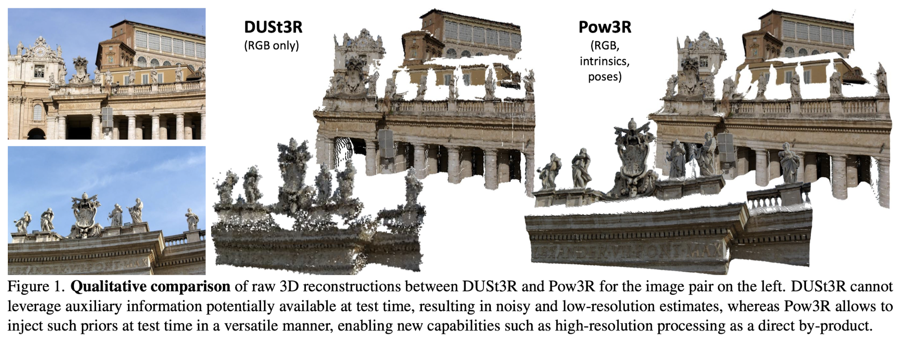
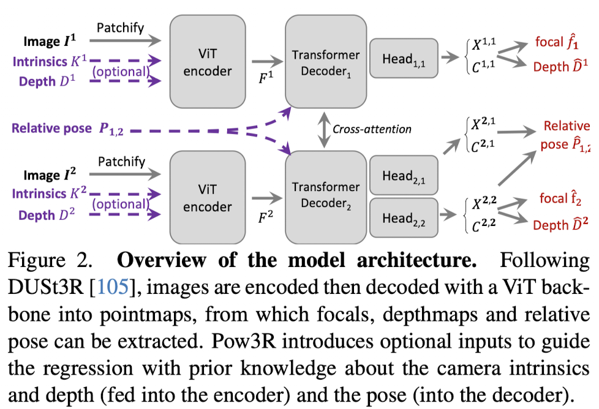

Pow3R incorporates any combination of auxiliary information such as. ntrinscis, relative pose, dense or sparse depth, alongside input images, within a single network.

논문은 기존 DUSt3R 기반 3D reconstruction의 한계를 확장하는 방향에서 출발한다. 핵심 문제는 "이미지로부터 3D를 복원할 때 사용할 수 있는 다양한 prior 정보들을 어떻게 활용할 것인가"이다. 기존 방법들은 카메라 파라미터(intrinsic), depth, pose와 같은 정보들을 활용할 수는 있지만, 대부분 입력 구조가 고정되어 있거나 특정 task에만 맞게 설계되어 있다. 즉, 어떤 상황에서는 depth만 있고, 어떤 경우에는 intrinsics만 있는 등 실제 환경의 다양한 조건을 유연하게 처리하지 못한다.

이 논문은 이러한 문제를 해결하기 위해 Pow3R라는 새로운 3D feed-forward 모델을 제안한다. Pow3R의 핵심 개념은 "guidance"이며, 이는 모델이 3D prior를 선태적으로 입력으로 받아 예측을 보조하는 것을 의미한다. 중요한 점은 단순히 prior를 사용하는 것이 아니라, 어떤 prior의 부분 집합(subset)이 들어오더라도 하나의 모델이 이를 처리할 수 있어야 한다는 점이다. 이를 위해 학습 과정에서 매 iteration마다 서로 다른 조합의 입력을 랜덤하게 사용하여, 다양한 조건에 대해 robust한 모델을 만든다. 그 결과, prior가 없는 경우에는 DUSt3R와 동일한 수준의 성능을 유지하면서도, prior가 주어지면 더 높은 성능을 달성한다.

전통적인 Structure-from-Motion(SfM)과 Multi-View Stereo(MVS)는 RGB 이미지로부터 3D 구조를 보구언하지만, keypoint matching, triangulation, bundle adjustment와 같은 복잡한 파이프라인에 의존하며 outlier나 어려운 환경에 취약한다. 이후 등장한 learning-based 방법들은 이러한 과정을 일부 대체했지만, 여전히 기존 구조를 크게 벗어나지 못했다. 특히 depth completion이나 pose estimation과 같은 문제들은 각각 별도의 task로 다뤄지며, 입력과 출력이 고정된 형태를 가진다.

이와 달리 DUSt3R는 pointmap regression이라는 새로운 패러다임을 도입하여, 각 픽셀에 대응되는 3D 좌표를 직접 예측함으로써 카메라 파라미터를 명시적으로 다루지 않고도 3D reconstruction을 수행할 수 있게 했다. 이는 기존의 geometry 기반 pipeline을 크게 단순화하는 중요한 변화였다. 그러나 DUSt3R 역시 다양한 prior 정보를 유연하게 활용하는 구조는 아니며, 입력 조건이 제한적이라는 한계를 가진다.

이러한 맥락에서 기존 연구들은 세 가지 축으로 정리된다. 첫째, SfM/MVS 계열은 여전히 최적화 기반이거나 handcrafted pipeline에 의존한다. 둘째, depth completion이나 monocular depth estimation과 같은 방법들은 일부 prior를 활용할 수 있지만, 특정 목적에 맞게 설계되어 general하지 않다. 셋째, pose estimation 분야에서는 regression, probabilistic, diffusion 기반 접근들이 존재하지만, 대부분 pose를 직접 예측하거나 간접적으로 추정하는 방식에 머문다. 또한 최근 DUSt3R 기반 후속 연구들(MASt3R, Splatt3R, Spann3R, MonST3R 등)은 feature 강화, rendering 결합, memory 추가, dynamic scene 처리 등 기능을 확장했지만, 입력 구조 자체를 일반화하지는 않았다. 

결국 이 논문은 현재까지의 learning-based 3D reconstruction 모델 중에서 sparse depth, camera intrinscis, extrinscis 등 다양한 3D prior의 임의 조합을 입력으로 받아 이를 활용할 수 있는 unified 모델은 존재하지 않기에 DUSt3R의 pointmap 기반 구조를 유지하면서도 입력을 확장하여 보다 일반적인 3D reconstruction 프레임워크인 Pow3R를 제안한다. 

## Method

Pow3R는 이미지 두 장만으로 3D를 복원하되, 추가적으로 존재할 수 있는 camera/depth prior도 함께 활용 가능한 범용 3D reconstruction model을 만드는 것이 목표다. 기존 DUSt3R는 RGB 이미지만 입력으로 받을 수 있었다. 하지만 실제 환경에서는 camera intrinsics, sparse/dense depth, relative pose 같은 정보가 존재하는 경우가 많다. Pow3R는 이 정보들을 transformer 내부에 conditioning 형태로 주입한다.

