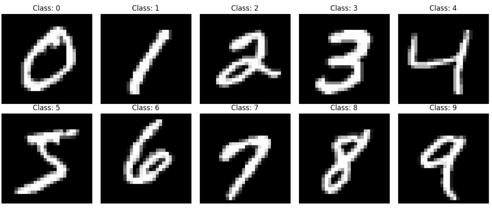
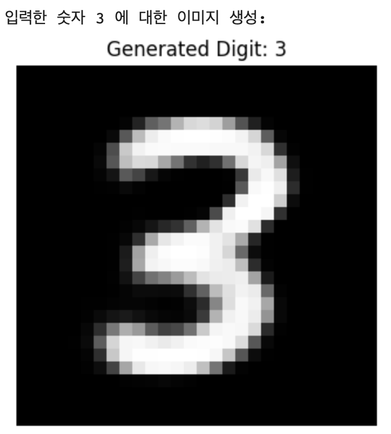
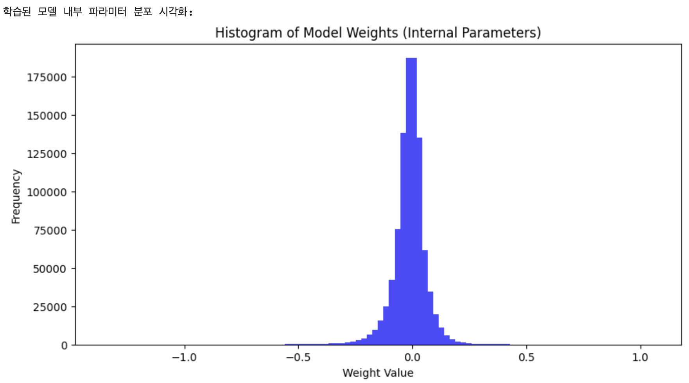

Member

고영후, 서울 스포츠사이언스학부, 

김한준, 에리카 로봇공학과, hanjun0126@hanyang.ac.kr


# 1. Proposal(Option A)

이제 우리는 생성형 인공지능을 쉽게 접할 수 있습니다. 그런데 이러한 인공지능이 어떻게 작동하는지는 잘 모르는 경우가 많습니다. 그 중 트랜스포머는 이런 인공지능의 패러다임을 크게 바꿨고, 여러 모델로 확장되었습니다. 또 VAE는 데이터를 잠재공간으로 인코딩하고 다시 디코딩하는 과정을 통해 데이터의 확률분포를 학습합니다. 저희는 이미지가 어떻게 생성되는지 알아보고자 이 주제를 선택하였습니다. 트랜스포머와 많은 데이터를 학습하는것은 환경에 제한이 있기 때문에, 간단한 데이터 셋인 채널 수도 1개이고 잠재 공간을 크게 안써도 되는 MNIST를 사용하여 숫자 이미지 생성을 하는 것을 목표로 하였습니다. 간단하지만 이번 프로젝트를 통해서 인공지능 모델이 이미지 생성을 어떻게 할 수 있는지를 알아내고, 우리는 데이터의 무엇을 학습하는지를 확인하고자 합니다. 


# 2. Dataset

프로젝트에 사용되는 MNIST 데이터셋은 아래와 같이 사용할 수 있습니다.

```python
import matplotlib.pyplot as plt
from torchvision import datasets, transforms

# 1. MNIST 데이터셋 불러오기
mnist_train = datasets.MNIST(
    root='./data', 
    train=True, 
    download=True, 
    transform=transforms.ToTensor()
)

# 2. 0부터 9까지 각 클래스별로 하나의 이미지를 저장할 딕셔너리
class_images = {}

# 데이터셋을 하나씩 확인하며 각 클래스의 첫 번째 이미지를 수집
for image, label in mnist_train:
    if label not in class_images:
        # [1, 28, 28] 텐서를 [28, 28] 넘파이 배열로 변환하여 저장
        class_images[label] = image.squeeze().numpy()
    
    # 0부터 9까지 10개의 클래스를 모두 찾았다면 탐색 종료
    if len(class_images) == 10:
        break

# 3. 수집한 이미지를 0부터 9까지 순서대로 시각화
fig, axes = plt.subplots(2, 5, figsize=(12, 5))

for i in range(10):
    row = i // 5  # 행 위치 (0 또는 1)
    col = i % 5   # 열 위치 (0부터 4)
    
    axes[row, col].imshow(class_images[i], cmap='gray')
    axes[row, col].set_title(f"Class: {i}")
    axes[row, col].axis('off')

plt.tight_layout()
plt.show()
```

데이터는 1개의 채널을 가진 가로와 세로 모두 28의 크기를 가진 0부터 9까지의 손글씨 숫자 이미지입니다. 각 클래스별로 이미지를 확인하면 아래와 같습니다. 



# 3. Methodology

### 1. 일반적인 VAE의 핵심 이론과 한계점

#### 1.1 Autoencoder 와 VAE 의 차이

일반적인 Autoencoder 와 VAE 의 가장 핵심적인 차이는 잠재 공간(Latent Space)을 다루는 방식에 있습니다. Autoencoder 는 입력 데이터를 고정된 하나의 점(Deterministic vector)으로 매핑합니다. 이 방식은 데이터의 압축과 복원에는 효과적이지만, 잠재 공간 내부에 학습되지 않은 불연속적인 공백이 많이 존재하기 때문에 새로운 데이터를 샘플링하여 생성하는 모델로 활용하기 어렵습니다.

반면 VAE 는 입력을 고정된 점이 아니라, 확률 분포의 모수인 평균 $\mu$ 와 분산 $\sigma^2$ 로 매핑합니다. 잠재 공간을 연속적인 확률 분포의 형태로 학습함으로써, 잠재 공간 내의 어떠한 지점을 샘플링하더라도 흐름이 끊기지 않고 의미 있는 출력을 얻을 수 있는 생성 모델의 기틀을 마련합니다.

#### 1.2 ELBO(Evidence Lower Bound)의 이해와 수식 분해

VAE 의 목적 함수는 데이터의 로그 우도(Log-likelihood)를 최대화하는 것이지만, 이는 수학적으로 계산이 불가능합니다. 따라서 이를 극복하기 위해 대안으로 수식 $ELBO$를 최대화하도록 모델을 학습시킵니다. 손실 함수로 사용되는 $ELBO$ 수식은 다음과 같이 두 가지 주요 항으로 분해됩니다.


$$\text{ELBO}(\theta, \phi; x) = \mathbb{E}_{q_\phi(z|x)}[\log p_\theta(x|z)] - D_{KL}(q_\phi(z|x) \parallel p(z))$$


-   Reconstruction Loss (재구성 오차): 디코더가 잠재 벡터 $z$ 로부터 원래 입력 $x$ 를 얼마나 잘 복원했는지 측정합니다. MNIST 이미지와 같은 데이터에서는 주로 Binary Cross Entropy 손실을 사용하여 픽셀 단위의 일치도를 계산합니다.
-   KL Divergence (정규화 항): 인코더가 추정한 잠재 변수의 분포 $q_\phi(z\vert x)$ 가 데이터의 사전 분포(Prior)인 표준 정규 분포 $p(z) = \mathcal{N}(0, I)$ 와 얼마나 유사한지 측정합니다. 이 항은 잠재 공간의 샘플들이 원점 주변에 예쁘게 밀집하고 연속적인 가우시안 구조를 갖도록 강제하는 규제 역할을 합니다.

#### 1.3 Reparameterization Trick 의 필요성

인코더가 출력한 $\mu$ 와 $\sigma$ 를 바탕으로 잠재 벡터 $z$를 직접 샘플링하게 되면, 샘플링 연산 자체는 미분이 불가능하므로 역전파 알고리즘을 사용할 수 없습니다. 이를 해결하기 위해 표준 정규 분포로부터 무작위 노이즈$\epsilon \sim \mathcal{N}(0, I)$을 먼저 샘플링한 뒤, 수식$z = \mu + \sigma \odot \epsilon$과 같이 선형 변환하는 Reparameterization Trick 을 사용합니다. 이 기법을 통해 샘플링 연산을 그래프 외적으로 분리하여, 네트워크가 가중치 파라미터$\mu$ 와 $\sigma$ 에 대해 정상적으로 미분 가능하게 만듭니다.


### 2. 조건부 생성 모델(Conditional VAE) 아키텍처

#### 2.1 왜 CVAE 가 필요한가?

일반적인 VAE 는 표준 정규 분포에서 무작위로 $z$ 를 추출하여 이미지를 생성하기 때문에, 디코더가 최종적으로 어떤 숫자의 이미지를 만들어낼지 제어할 수 없습니다. 원하는 숫자를 명시적으로 지정하여 타겟 이미지를 생성하기 위해서는 모델에 조건(Condition) 정보인 라벨을 함께 주입해야 하며, 이를 구현한 대표적인 아키텍처가 바로 CVAE입니다.

#### 2.2 네트워크 아키텍처의 변형과 데이터 결합(Concatenation)

CVAE는 클래스 라벨 정보(0부터 9까지를 표현하는 10차원의 One-hot 벡터)인 조건 $c$ 를 인코더와 디코더의 입력 부근에서 모두 결합(Concatenate)해 줍니다.

-   **Encoder 입력 고도화**: 원래의 이미지 벡터 $x$ 와 조건 벡터 $c$ 를 하나로 묶어 결합된 벡터 $[x, c]$ 를 인코더의 입력으로 활용합니다.
-   **Decoder 입력 고도화**: 샘플링을 통해 얻은 잠재 벡터 $z$ 와 조건 벡터 $c$ 를 결합하여 결합된 벡터 $[z, c]$를 디코더의 입력으로 전달합니다.

이러한 구조적 변화를 통해 인코더는 "특정 조건 하에서의 조건부 데이터 분포"를 안정적으로 학습하게 되고, 디코더는 잠재 공간의 무작위 스타일 정보 $z$ 에 조건 $c$ 의 구체적인 가이드를 더하여 원하는 숫자를 정확하고 선명하게 생성할 수 있게 됩니다.


# 4. Code

이런 CVAE를 통해 원하는 숫자 이미지 생성을 위한 코드를 아래에서 확인할 수 있습니다.

1.   필요한 라이브러리를 먼저 불러오고, 시드를 설정합니다.

```python
import torch
import torch.nn as nn
import torch.nn.functional as F
import torch.optim as optim
from torchvision import datasets, transforms
from torch.utils.data import DataLoader
import numpy as np
import matplotlib.pyplot as plt
```

2.   VAE를 정의하겠습니다. 

```python
#모델 정의 (Conditional VAE)
class CVAE(nn.Module):
    def __init__(self, z_dim=20, hidden_dim=400, num_classes=10):
        super(CVAE, self).__init__()
        self.z_dim = z_dim
        self.num_classes = num_classes
        
        # Encoder 
        self.enc_fc1 = nn.Linear(28*28 + num_classes, hidden_dim)
        self.enc_fc2 = nn.Linear(hidden_dim, hidden_dim)
        self.enc_mu = nn.Linear(hidden_dim, z_dim)
        self.enc_logvar = nn.Linear(hidden_dim, z_dim)
        
        # Decoder 
        self.dec_fc1 = nn.Linear(z_dim + num_classes, hidden_dim)
        self.dec_fc2 = nn.Linear(hidden_dim, hidden_dim)
        self.dec_out = nn.Linear(hidden_dim, 28*28)

    def encode(self, x, c):
        inputs = torch.cat([x, c], dim=1)
        h = F.relu(self.enc_fc1(inputs))
        h = F.relu(self.enc_fc2(h))
        return self.enc_mu(h), self.enc_logvar(h)
	
    # 재매개변수화 기법 사용
    def reparameterize(self, mu, logvar):
        std = torch.exp(0.5 * logvar)
        eps = torch.randn_like(std)
        return mu + eps * std

    def decode(self, z, c):
        inputs = torch.cat([z, c], dim=1)
        h = F.relu(self.dec_fc1(inputs))
        h = F.relu(self.dec_fc2(h))
        return torch.sigmoid(self.dec_out(h))

    def forward(self, x, c):
        mu, logvar = self.encode(x.view(-1, 28*28), c)
        z = self.reparameterize(mu, logvar)
        out = self.decode(z, c)
        return out, mu, logvar
```

3.   학습에 사용될 손실함수를 정의하겠습니다.

```python
# 손실 함수 (Loss Function) 정의
def loss_function(recon_x, x, mu, logvar):
    # BCE Loss (재구성 오차)
    BCE = F.binary_cross_entropy(recon_x, x.view(-1, 28*28), reduction='sum')
    # KL Divergence (정규화 항)
    KLD = -0.5 * torch.sum(1 + logvar - mu.pow(2) - logvar.exp())
    return BCE + KLD
```

이후 학습된 모델의 파라미터를 시각화하기 위한 함수를 만들어줍니다.

```python
# 모델 파라미터 시각화 함수
def visualize_parameters(model):
    weights = []
    for name, param in model.named_parameters():
        if 'weight' in name:
            weights.append(param.data.cpu().numpy().flatten())
    
    plt.figure(figsize=(10, 5))
    plt.hist(np.concatenate(weights), bins=100, color='blue', alpha=0.7)
    plt.title("Histogram of Model Weights (Internal Parameters)")
    plt.xlabel("Weight Value")
    plt.ylabel("Frequency")
    plt.show()
```

모델 학습을 위한 함수를 만들어줍니다.

```python
def train_cvae():
    # 하이퍼파라미터 설정
    batch_size = 128
    learning_rate = 1e-3
    num_epochs = 10 
    device = torch.device("cuda" if torch.cuda.is_available() else "cpu")

    # 데이터 로더 설정 (MNIST 다운로드)
    transform = transforms.ToTensor()
    train_dataset = datasets.MNIST(root='./data', train=True, transform=transform, download=True)
    train_loader = DataLoader(train_dataset, batch_size=batch_size, shuffle=True)

    # 모델 및 옵티마이저 초기화
    model = CVAE().to(device)
    optimizer = optim.Adam(model.parameters(), lr=learning_rate)

    print(f"--- 학습 시작 (사용 장치: {device}) ---")
    model.train()
    for epoch in range(num_epochs):
        train_loss = 0
        for batch_idx, (data, labels) in enumerate(train_loader):
            data = data.to(device)
            labels = labels.to(device) # [수정된 부분] labels 텐서를 GPU로 이동시킵니다.
            
            # 조건부 라벨을 One-hot 벡터로 변환
            c = torch.zeros(labels.size(0), 10).to(device)
            c.scatter_(1, labels.view(-1, 1), 1)
            
            optimizer.zero_grad()
            recon_batch, mu, logvar = model(data, c)
            
            # 손실 계산 및 역전파
            loss = loss_function(recon_batch, data, mu, logvar)
            loss.backward()
            train_loss += loss.item()
            optimizer.step()
            
        print(f"Epoch [{epoch+1}/{num_epochs}], Loss: {train_loss / len(train_loader.dataset):.4f}")\
        
    print("--- 학습 완료 ---\n")
    return model
```

전체 실행 코드입니다.

```python
if __name__ == "__main__":
    # 1. 학습 실행
    trained_model = train_cvae()
    
    # 2. 학습된 모델의 파라미터 시각화
    print("학습된 모델 내부 파라미터 분포 시각화:")
    visualize_parameters(trained_model)
    
    # 3. 특정 숫자 생성 테스트 (예: 3)
    input_number = 3
    print(f"입력한 숫자 {input_number} 에 대한 이미지 생성:")
    generate_digit(trained_model, input_number, device=next(trained_model.parameters()).device)
```




# 5. Discussion

#### 5.1 가중치 파라미터 시각화

딥러닝 모델의 학습 상태를 면밀히 진단하려면 내부 파라미터가 어떻게 분포되어 있고 변화하는지 추적해야 합니다. 레이어별 가중치의 분포를 히스토그램으로 시각화하는 것은 모델이 과적합 되지 않고 유의미하게 일반화되었는지, 혹은 그래디언트 소실이나 폭주 현상 없이 안정적으로 수렴했는지 검증하는 중요한 분석 기법입니다.

#### 5.2 히스토그램 분석 및 해석 방법

학습이 잘 완료된 모델의 파라미터 히스토그램 플롯을 관찰하면 다음과 같은 인사이트를 도출할 수 있습니다.

-   **정규분포 형태의 안착**: 가중치들이 0을 중심으로 완만한 가우시안 분포 곡선을 형성하고 있다면, 이는 가중치 감쇠(Weight Decay)와 같은 정규화 기법이 적절히 작동하여 파라미터들이 특정 값으로 튀지 않고 고르게 분포하며 안정적으로 최적화되었음을 뜻합니다.
-   **가중치 분산의 합리적 확장**: 완전히 균일하거나 극단적으로 좁았던 초기 분포가 학습을 거치며 적당한 폭의 종 모양 곡선으로 발달하는 것은, 네트워크가 데이터 내에 존재하는 다양한 위상학적 특징들을 효과적으로 포착하기 위해 가중치 값들을 유연하게 업데이트했음을 증명합니다.



#### 5.3 일반적인 VAE 의 한계점

VAE 는 안정적인 학습이 가능하다는 장점이 있지만 두 가지 명확한 한계점을 가집니다. 첫째, 픽셀 간의 독립성을 가정하는 복원 손실 함수의 한계로 인해 생성된 이미지가 다소 흐릿하게(Blurry) 출력되는 경향이 있습니다. 둘째, 잠재 공간의 각 차원이 서로 독립적인 의미를 보존하지 못하고 복잡하게 뒤엉키는 현상(Entanglement)이 발생하여, 사용자가 원하는 특정 스타일 특징만을 직관적으로 제어하기 어렵습니다.


# 6. Further

이번 프로젝트는 단순히 조건부 입력에 대해서만 숫자 이미지 생성을 진행했지만, 이후의 잠재 변수를 분리하여 위에서 언급한 이미지 생성의 한계를 해결할 수 있습니다.

#### 6.1 Disentanglement(잠재 변수 분리)의 정의

Disentanglement란 잠재 공간의 각 축이 현실 세계 데이터가 가지는 독립적인 핵심 속성들과 1대1로 매핑되는 청정한 정렬 상태를 의미합니다. 이번 프로젝트에서는 0번째 차원은 오직 숫자의 '기울기'만을 담당하고, 1번째 차원은 숫자의 '선의 굵기'만을 독자적으로 제어하도록 특징을 분리하는 것입니다.

#### 6.2 Latent Intervention(잠재 변수 개입) 실험 방법

모델이 잠재 변수를 얼마나 명확하게 분리하여 학습했는지 정성적으로 평가하기 위해 Latent Intervention 기법을 적용합니다.

1.  타겟 조건 벡터 $c$ 와 잠재 벡터 $z$ 의 모든 차원 값을 고정된 상수로 설정합니다.
2.  분석하고자 하는 잠재 공간의 특정 인덱스 차원의 값만을 $-3$ 에서 $+3$ 까지 일정한 간격으로 변화시킵니다.
3.  이 미세한 개입에 반응하여 디코더가 생성해내는 출력 이미지의 시각적 속성이 어떻게 연속적으로 변화하는지 관찰합니다.

#### 6.3 Advanced VAE 와의 비교 분석

일반적인 VAE 는 손실 함수 구조상 이미지 복원 자체에 치중하기 때문에 잠재 변수 분리가 깔끔하게 이루어지지 않는 한계가 있습니다. 반면, KL Divergence 항에 페널티 가중치를 높게 부여하는 $\beta$-VAE 나 잠재 변수 간의 전체 상관관계를 직접 통제하는 $\beta$-TCVAE 같은 Advanced VAE 모델들은 각 차원 간의 독립성을 강하게 보장하도록 유도됩니다.

일반 VAE에서는 특정 차원을 움직일 때 숫자의 굵기와 크기가 한꺼번에 일그러지는 뒤엉킴 현상이 관찰되는 반면, Advanced VAE 에서는 생성 이미지의 전반적인 선명도가 아주 미세하게 감소할지라도, 숫자의 기울기만 깔끔하게 기울어지거나 굵기만 자로 잰 듯이 제어되는 획기적인 분리 성능의 차이를 직접 눈으로 확인할 수 있습니다.


# 7. Reference

유튜브 링크:

VAE 내용 정리: "https://hanjun0126.github.io/2025/11/06/Auto-Encoding-Variational-Bayes.html"
