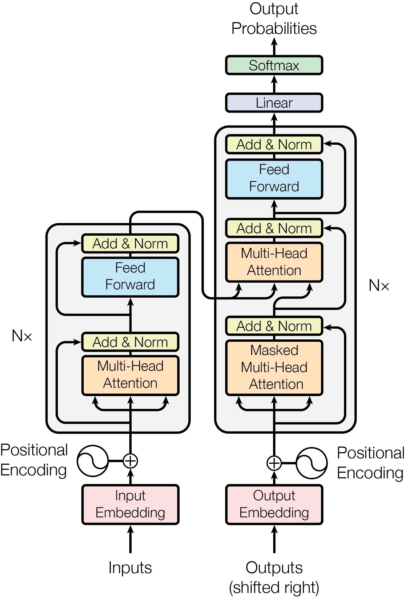
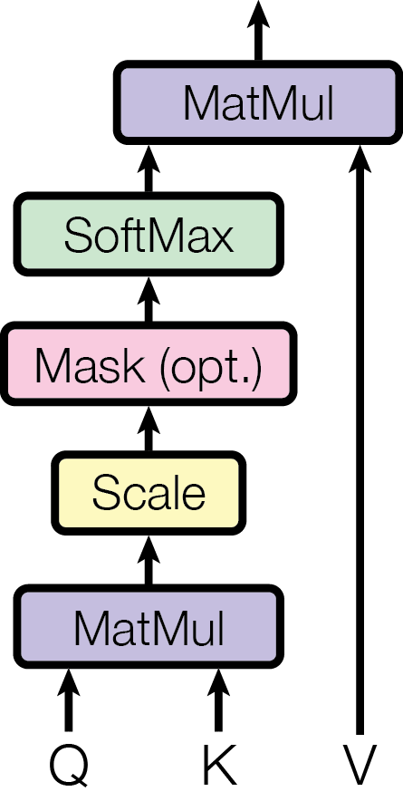
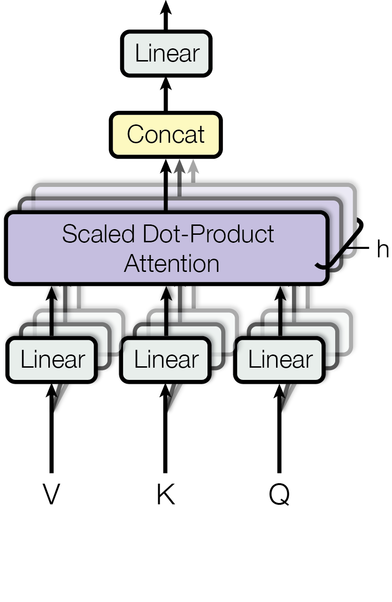

# Attention is all you need

## abstract

기존의 sequence 변환 모델들은 encoder 와 decoder를 사용하는 복잡한 recurrent 또는 cnn 을 기반으로 한다. 가장 성능이 높은 모델 또한 attention 기법으로 encoder 와 decoder 를 연결했다. 논문에서는 attention 메커니즘에만 기반한 transformer 구조를 제안한다.

*WMT  2014 English-to-German* translation task 에서는 28.4 BLEU(기존의 최고 성능보다 2 BLEU 성능 향상), *WMT 2014 English-to-French* translation task 에서는 41.8 BLEU 를 달성했다.

이 두 실험에서 transformer 구조가 성능면에서 뛰어남을 보여준다. 더 병렬화 되고 학습에 사용되는 시간은 훨씬 적다.

***

## 1. Introduction

**Recurrent** 모델[1](#footnote_1)들은 일반적으로 입력과 출력 sequence 의 위치를 따라 계산을 수행한다. 본질적으로 순차적인 계산 특성은 병렬화를 배제한다. 이는 sequence 의 길이가 길어질수록 치명적이다. &rarr; sequential computation 의 제약이 있다.

**attention** 기법은 입력과 출력 sequence 의 거리에 상관없이 종속성을 모델링할 수 있다.

새롭게 제안하는 **Transformer** 구조는 순환 신경망을 배제하고 오로지 attention 만 사용하기에 입력과 출력의 global 의존성을 도출할 수 있다.

<a name="footnote_1">1</a>: RNN, LSTM, recurrent gated neural network 

***

## 2. Background

**Self-attention** 은 sequence 의 representation 을 계산하기 위해 단일 sequencce 의 서로 다른 위치를 연관시키는 기법이다.

**End-to-end memory** 는 **Recurrent attention** 기법을 기반으로 한다.

***

## 3. Model Architecture

### 3. 1. Encoder and Decoder stacks

Encoder

N = 6 인 동일한 layer 의 stack 으로 구성된다. 각각의 layer 는 첫 번째로 multi-head self-attention 을, 두 번째로 positionwise fully connected feed-foward network 로 구성된다. residual connection 을 각 layer 의 적용시키고, layer normalization 을 한다. 각각의 Layer 는 **LayerNorm(x + Sublayer(x))** 을 출력한다. d_model = 512

Decoder

N = 6 인 동일한 layer 의 stack 으로 구성된다. 인코더의 출력으로부터 multi-head attention 을 수행하기 위해 2 개의 추가적인 sub-layer 를 가진다. 각각의 Layer 는 **LayerNorm(x + Sublayer(x))** 을 출력한다. 

position 이 뒤따르는 position 에 영향을 주는 것을 막기 위해 **masking** 을 사용한다. 이는 출력 임베딩이 하나의 position 으로 offset 된다는 사실이 position i 에 대한 예측은 보다 작은 position 의 알려진 출력에만 의존할 수 있다는 것을 보장한다.

---

### 3. 2. Attention

attention 함수는 벡터 **Q(query)**, **K(key)**, **V(value)** 로 출력 값을 나타낸다.

 
Scaled Dot-Product Attention

입력 Q, K 는 d_k, V 는 d_v 의 차원을 가지고 $Attention(Q, K, V) = softmax({QK^t\over\sqrt{d_K}})V$ 을 만족한다. 기존의 dot-product(multiplicative) attention[2 ](#footnote_2)에 scaling factor(${1\over\sqrt{d_K}}$) 가 추가된 알고리즘이고, 이를 scaled dot-product attention 이라고 부른다. 

dot-product attention 은 $QK^T$ 의 값이 커질 경우 $softmax$ 함수의 출력 확률이 0 또는 1에 근접해서 나온다. 이렇게 되면 **Gradient Vanishing(기울기 소실)** 문제가 발생한다. 이 문제는 차원($d_k$) 이 커질수록 $QK^T$ 의 원소가 많아져 내적 값이 커지므로 더 극명하게 나타난다. 이를 해결하기 위해 **scaling factor** 를 사용한다.

<a name="footnote_2">2</a>: additive attention[3](#footnote_3) 과 복잡성은 이론적으로 비슷하지만, 최적화 된 행렬 곱셈 코드를 사용하여 구현할 수 있기 때문에 더 빠르고, 공간 효율적이다. 

<a name="footnote_3">3</a>: 단일 숨겨진 계층이 있는 feed-foward netowrk 를 사용하여 호환성 함수를 계산한다.

---

Multi-Head Attention

attention 을 한 번만 사용하는 것보다 서로 다른 독립적인 형태의 attention head 들을 병렬적으로 사용하여 Q, K, V 를 서로 다르게 학습하고 모든 head 의 출력을 합치는 것이 더 풍부한 표현학습이 가능하다.

$$
$\text{MultiHead}(Q, K, V) = \text{Concat}(\text{head}_1, \text{head}_2, …, \text{head}_h) W^O$
$$

$$
\text{head}_i = \text{Attention}(QW_i^Q, KW_i^K, VW_i^V)
$$

$W_i^Q$, $W_i^K$, $W_i^V$ 는 각 Head에 적용되는 학습 가능한 가중치 행렬, $W_i^O$ 는 여러 head의 출력을 결합한 후 적용하는 최종 가중치 행렬이다. **각 attention head 마다 다른 가중치 행렬**을 적용하여 Query, Key, Value 벡터를 생성하게 된다.

하나의 head 만 사용하면 특정 패턴이나 관계만 학습할 가능성이 있는데, 여러 개의 head 를 사용하여 **각 head 가 서로 다른 정보를 학습**하여 더 풍부한 의미 표현이 가능하다. 또한 여러 head 가 서로 다른 특징을 학습하므로, 모델이 특정 패턴에 **과적합**되는 걸 방지할 수 있다. 

결국 transformer 에서 multi-head attention 은 encoder 에서는 **입력 문장의 각 단어가 다른 단어와의 관계를 학습(Self-Attention)**한다. decoder 에서는 encoder 에서 얻은 정보를 활용해 **새로운 단어를 생성(Cross-Attention)**하고, 이미 **생성된 단어와의 관계를 학습(Masked Self-Attention)**한다.

---

Attention Mechanism

Attention Mechanism 

Attention Mechanism

Attention Mechanism

---

Position-wise Feed-Forward Networks

각 layer 에서 attention 연산 후, $\text{FFN}(x) = \max(0, xW_1 + b_1) W_2 + b_2$ 을 적용하였다. $W_1$ 과 $W_2$ 는 학습 가능한 가중치 행렬이고, $b_1$, $b_2$ 는 bias 이다. ReLU 대신 GELU 를 사용할 수도 있고, 실제 구현에서는 GELU 가 성능이 더 좋았다.

FFN 의 역할

- self-attention 후 비선형 변환을 수행하여 복잡한 표현 학습한다.
- 각 위치의 단어 임베딩을 독립적으로 변환한다.
- 신경망의 비선형성을 증가시켜 모델이 더 복잡한 패턴을 학습할 수 있도록 한다.

FFN 의 특징

- 각 토큰에 독립적으로 적용된다(Position-wise 적용)
- 고차원 변환 후 다시 저차원으로 압축한다(보통 W_1이 확장된 차원 (d_ff = 2048 등) 을 만들고, W_2가 다시 원래 차원으로 축소).

---

Embeddings and Softmax

----

Positional Encoding

---

